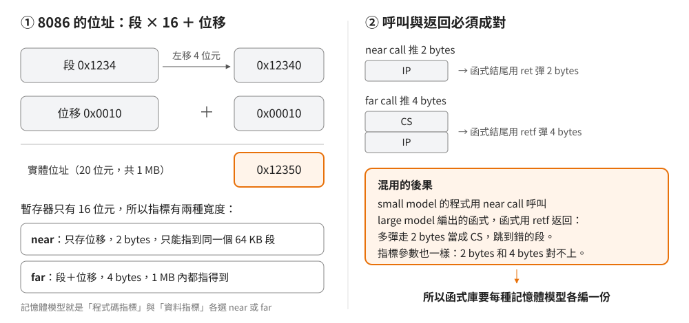
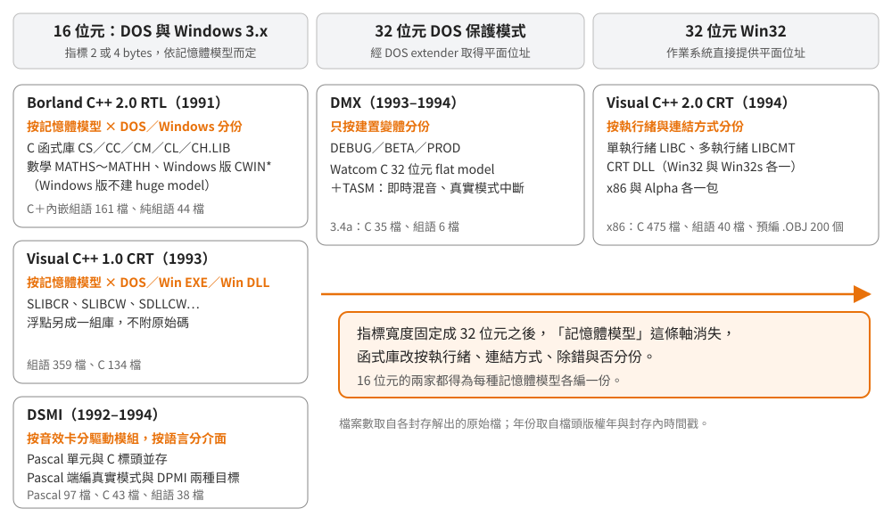

# 五份函式庫的全景：指標寬度決定了函式庫的形狀

## 結論

五份函式庫分屬三種執行環境：16 位元的 DOS 與 Windows 3.x（Borland C++ 2.0、Visual C++ 1.0、DSMI）、
32 位元 DOS 保護模式（DMX）、32 位元 Win32（Visual C++ 2.0）。

16 位元的函式庫必須為每一種記憶體模型各編一份，因為 near／far 的選擇會寫死在目的碼的呼叫指令與指標寬度裡，
混用就會在返回時跳錯地方。浮點有沒有 8087、目標是 DOS 還是 Windows，又各自再把份數乘上去。
到了 32 位元平面位址，記憶體模型這條軸消失，函式庫改按執行緒、連結方式、除錯與否分份。

反組譯時先判斷執行檔屬於哪個環境、哪種記憶體模型，才知道該拿哪一份函式庫來比對。

## 根本問題：一個指標該有多寬

8086 的暫存器只有 16 位元，能直接定址的範圍是 64 KB。為了用到 1 MB，它把位址拆成兩半：
段（segment）乘以 16 再加上位移（offset），得到 20 位元的實體位址。

這個設計讓指標有兩種寬度。near 指標只存位移，2 bytes，存取快、程式碼短，但只能指到目前這個段；
far 指標連段一起存，4 bytes，1 MB 內都指得到，代價是每次存取都要先把段值載入段暫存器，
指令更多、更慢。

這是速度與範圍的取捨。程式碼超過 64 KB 就得讓函式呼叫用 far，資料超過 64 KB 就得讓資料指標用 far；
程式會長多大、資料有多少，只有寫程式的人知道，所以編譯器把選擇交給他：程式碼指標選 near 或 far、
資料指標選 near 或 far，兩兩組合就是記憶體模型（memory model）。
Borland 的 RTL 內部用兩個開關表示這兩個選擇，`LPROG` 表示程式碼指標是 far，`LDATA` 表示資料指標是 far：

| 記憶體模型 | 程式碼指標（`LPROG`） | 資料指標（`LDATA`） |
|---|---|---|
| small | near | near |
| medium | far | near |
| compact | near | far |
| large | far | far |
| huge | far | far |

huge 與 large 的指標寬度相同，差別在靜態資料的配置方式，細節在記憶體模型專文再談。

選定之後，這個決定會寫死在目的碼裡。呼叫一個 near 函式時，`call` 只把 2 bytes 的返回位址推上堆疊，
函式結尾用 `ret` 彈回 2 bytes；far 函式則推 4 bytes（段與位移）、用 `retf` 彈 4 bytes。
如果 small model 的程式呼叫一個以 large model 編出的函式庫函式，函式結尾的 `retf` 會多彈走 2 bytes
當成段值，跳到錯的地方。指標參數也一樣：呼叫端推 2 bytes，函式卻讀 4 bytes。

函式庫是事先編好的目的碼，使用它的程式選哪種模型，要到那個程式編譯時才決定；函式庫沒辦法臨場配合，
所以 16 位元時代的函式庫只能每種記憶體模型各編一份，讓程式挑對應的那一份連結。Borland 的 `CRTL.DOC` 寫明 `CS`、`CC`、`CM`、`CL`、`CH`
五個 C 函式庫內含同一組模組，只是以不同記憶體模型編譯；數學函式庫與 Windows 版函式庫也照同樣的方式分份。

## 另外兩個約束：浮點與作業系統

**浮點。** 8087 數學輔助處理器是選購的。有 8087 就直接執行浮點指令，沒有就得用軟體模擬。
兩家都把這一塊留在原始碼範圍之外：Borland 的授權明文排除 8087 emulator，磁片裡只有初始化程式 `FPINIT.ASM`，
同一份原始碼組譯兩次，分別給模擬器與真 8087 使用；Visual C++ 1.0 的 README 把 `87.LIB`、`EM.LIB`
與各模型的浮點庫列在「無法由這份原始碼建出」的清單；Visual C++ 2.0 則說明大部分浮點例程只附預先編好的 `.OBJ`。

**作業系統。** DOS 程式透過 `int 21h`（DOS 的系統呼叫入口，把功能編號放進暫存器後觸發的軟體中斷）
取得開檔、讀寫、配置記憶體等服務；Windows 3.x 的程式跑在 Windows 底下，
有些 C 函式（例如直接操作主控台）在那裡沒有意義。Borland 為此另建一套 Windows 版函式庫（WINLIB），
沒辦法實作的函式由 `INDEP.ZIP` 裡的替身模組補上；Visual C++ 1.0 則把 MS-DOS、Windows EXE、Windows DLL
分成三組函式庫。

DLL 為什麼要另編一份，要先知道一個前提：16 位元 DOS 程式的一般配置下，資料段暫存器 DS 與堆疊段暫存器 SS
指向同一段，所以一個只存位移的 near 指標，指全域變數或指堆疊上的區域變數都對得上。
Win16 DLL 有自己的資料段，堆疊卻是呼叫它的程式的，DS 與 SS 不再相同，這個前提就不成立了。
這是目前最可能的解釋（強推論），兩家的原始檔還沒逐一查證。

這三個約束相乘，就是 16 位元函式庫份數多的來源。Visual C++ 1.0 的檔名把它們全部編了進去：
安裝程式把元件庫合併成最終檔案，名稱依序是記憶體模型字母、`LIBC`、浮點字母、環境字母。
`SLIBCER.LIB` 是 small、`E` 浮點、MS-DOS；`LLIBCEW.LIB` 是 large、`E` 浮點、Windows。

| 位置 | 字母 | 意思（依 README Part 4、Part 5 的元件清單） |
|---|---|---|
| 記憶體模型 | `S`／`M`／`C`／`L` | small／medium／compact／large |
| 浮點 | `E` | DOS 版併入模擬器浮點庫；Windows 版併入 README 所稱的 em/87 浮點庫 |
| 浮點 | `A` | 併入替代數學庫（alternate math） |
| 浮點 | `7` | 併入 8087 專用庫（只有 DOS 版） |
| 環境 | `R` | MS-DOS |
| 環境 | `W` | Windows 3.x（後面再加 `Q` 的是 QuickWin 版） |

字母的全名 README 沒有寫，上表只依它合併了哪些元件庫來解讀。

## 32 位元之後，記憶體模型這條軸消失

在 32 位元平面位址下，一個指標就能指到整個位址空間，near／far 的取捨不存在，函式庫也不必再按記憶體模型分份。

DOS 本身只懂 8086 原生的真實模式（real mode）：段值乘 16 就是位址，最多 1 MB。
80386 的保護模式（protected mode）可以用 32 位元位址直接存取數 MB 以上的記憶體，
但 DOS 與 BIOS 的服務仍然只能在真實模式下呼叫。DOS extender 就是夾在中間的執行時元件：
平時讓程式跑在保護模式，要呼叫 DOS 時切回真實模式、辦完再切回來；程式向它要記憶體、掛中斷，
走的是 DPMI（DOS Protected Mode Interface）這套標準介面。

- **DMX** 用 Watcom C 的 32 位元編譯器（makefile 裡是 `wcc386p`，`flat` model）。它的 makefile
  只區分 DEBUG、BETA、PROD 三種建置變體。組語部分由 TASM 處理，檔頭寫明用途：即時數位混音是 32 位元平面碼，
  另有一支真實模式中斷處理程式，放在 16 位元的程式段裡。可能的理由是：處理器為了呼叫 DOS 切回真實模式的那段時間，
  音效卡的中斷照樣會來，需要一段 16 位元碼在真實模式下接住它（強推論，細節待 DMX 專文）。
- **Visual C++ 2.0** 的 README 列出四個建置目標：單執行緒（`LIBC`）、多執行緒（`LIBCMT`）、Win32 DLL，
  以及 Win32s DLL（Win32s 是讓部分 Win32 程式跑在 16 位元 Windows 3.1 上的相容層）。
  封存裡有 x86 與 DEC Alpha 處理器各一包；x86 包裡 C 檔 475 個、組語檔只剩 40 個。

語言比例的變化也跟著這條軸走。Visual C++ 1.0 的 16 位元 CRT 有 359 個組語檔、134 個 C 檔，
heap 與字串函式幾乎全是組語（heap 目錄 71 檔中 64 個、string 目錄 56 檔中 49 個）；
到了 2.0 的 Win32 版，比例反過來。能想到的解釋有兩個（都屬強推論）：16 位元時代記憶體與速度都緊，
而指標寬度又隨記憶體模型改變，用組語才能精確控制每個模型下的碼；到了 32 位元，
同一份 C 還要能編給 Alpha，C 的比重自然上升。

## 同一個問題，兩家的寫法

兩家都要讓「一份原始碼編出每種記憶體模型」，做法不同：

| | Borland C++ 2.0 | Visual C++ 1.0 |
|---|---|---|
| 主要形式 | `.CAS`：C 函式外殼加內嵌組語，161 檔 | 獨立 `.ASM` 檔，359 檔 |
| 記憶體模型差異怎麼處理 | 函式的進出（prolog／epilog、參數位置）交給 C 編譯器依模型產生；內嵌組語只在指標寬度不同的地方用 `LDATA`／`LPROG` 分支 | 359 個組語檔中 317 個引入巨集套件 `CMACROS.INC`，由巨集依模型展開函式進出與參數存取 |
| 純組語檔 | 44 檔，其中 40 檔引入 `RULES.ASI` 取得同一組模型開關 | 主要形式本身就是組語，見上兩列 |
| 建置 | 批次檔逐一跑每個模型，TLIB 依回應檔收成 `.LIB` | 批次檔設定環境後，對每個元件目錄呼叫 NMAKE，並以參數指定模型 |

表中 Borland 欄對 `.CAS` 的描述來自抽讀（例如 `STRLEN.CAS`），Microsoft 欄對 `CMACROS.INC` 作用的描述來自引用關係與建置參數，
兩者都還沒逐檔盤點，屬強推論，逐檔對照是記憶體模型專文的工作。

在這個前提下，Borland 的做法讓大部分函式可以用 C 寫，只在熱點塞組語；編譯器已經知道每個模型該怎麼進出函式，
組語那一段就不必管。Microsoft 的做法把整個函式交給組語，換到的是每一個指令都由人決定，
代價是要靠一套巨集把模型差異抽象掉。

## Borland 的建置流程

Borland 的建置全部是 DOS 批次檔，外層由環境變數 `MODEL` 列出要建的模型（預設五種全建）：

1. 每種模型把全部 `.C`、`.CAS`、`.CPP`、`.ASM` 重新編一次。副檔名決定編法：`.CAS` 會加上「經組譯器編譯」的參數交給 TASM，
   `.ASM` 則以 `__<模型>__` 形式的巨集告訴組語檔現在是哪個模型。
2. 用 TLIB 依回應檔（`.RSP`）把目的檔收成該模型的 `.LIB`。C 函式庫的回應檔列了 300 個模組、iostream 191 個。
3. 另外在 large model 下，把 31 個字串與記憶體函式加上 `__FARFUNCS__` 重編一次，
   產出 f 開頭的目的檔（`_fstrlen`、`_fmemcpy` 等），再收進每一個模型的 C 函式庫，
   讓 small 這類近指標模型的程式也能處理 far 指標指向的字串；機制見[記憶體模型專文](../10-borland-crtl/memory-model-macros.md)。
4. 同一份組語編出不同變體：浮點轉整數的 `FTOL` 在數學庫的共用步驟裡組譯兩次，分成 near 呼叫與 far 呼叫兩版；
   數學庫的 `EMUVARS` 則在每個模型各組譯一次，small 與 medium 帶 `LDATA=0`，compact、large、huge 帶 `LDATA=1`。
5. Windows 版不建 huge model。

批次檔裡有兩個處理 DOS 限制的寫法，第一眼看不出用意：

- 有一個只含一個換行的檔案，被當成 `TIME` 指令的輸入。`TIME` 會印出目前時間並等使用者輸入新時間，
  餵一個換行等於直接按 Enter。結果是建置 log 的開頭與結尾各留下一個時間戳，不需要任何外部工具。
- 開工前先設一個測試用的環境變數再讀回來。DOS 的環境區大小在開機時就固定，滿了之後 `SET` 不會報錯，
  只是沒設進去，後面所有依賴環境變數的步驟就會默默跑錯。讀不回來就停下，提示使用者加大 `SHELL` 的 `/E` 參數。
  Visual C++ 1.0 的 README 也要求至少 4 KB 環境空間，是同一個限制。

主建置批次檔裡還留著建啟動碼的分支：若 `startup` 目錄下有 `C0.ASM`，就呼叫 `BUILD-C0.BAT` 組出 DOS 與 Windows 版啟動碼。
RTL 的磁片裡沒有這兩個檔案，它們隨編譯器套件的 `STARTUP.ZIP` 出貨；兩者放在一起，這個分支就接得上。

## 原廠為什麼附原始碼

Borland 的文件把使用情境寫得很具體：客戶修改某個模組，重編之後替換進函式庫。
它附了只重編單一模組、替換進所有模型函式庫的批次檔，並建議測試時把修改過的模組直接跟測試程式一起連結，
確保用到的是新版而不是函式庫裡的舊版；授權允許把修改後的函式連結進自己的執行檔發行，但不能散布原始碼。
這份原始碼當年是另外販售的產品（二手：一份 Borland C++ 3.0 套裝的產品頁提到它平常單獨售價 150 美元）。

Microsoft 的 README 說明這份原始碼經過測試、功能與出貨版相同，但重建出的 `.LIB` 不一定逐位元組相同；
要重建特定的 `.LIB` 就參考建置批次檔與檔案清單自行組合。修改過原始碼之後的技術支援只在 CompuServe 論壇提供。

## 五份函式庫一覽

| 代號 | 年代依據 | 執行環境 | 切分軸 | 主要語言（檔數） | 建置工具 | 沒附的部分 |
|---|---|---|---|---|---|---|
| `borland-crtl-2.0` | 磁片 FAT 時間戳 1991-02-13 | DOS、Windows 3.x | 記憶體模型 × DOS／Windows | C++ 216、C 174、C＋內嵌組語 161、組語 44 | BCC、TASM、TLIB，批次檔 | 8087 emulator、graphics library；啟動碼原始檔在編譯器套件 |
| `msvc-1.0-crt` | 封存內時間戳 1993-02 | MS-DOS、Windows 3.x | 記憶體模型 × 浮點方式 × DOS／Win EXE／Win DLL | 組語 359、C 134、C++ 52 | CL、ML、NMAKE，批次檔 | 浮點庫、graphics、QuickWin 等 |
| `msvc-2.0-crt` | 封存內時間戳 1994-10（x86）、1994-12（Alpha） | Win32、Win32s | 單／多執行緒 × 靜態／DLL | x86 包：C 475、組語 40，另附預編 `.OBJ` 200 個 | CL、NMAKE | 大部分浮點例程（只給 `.OBJ`） |
| `dmx` | Digital Expressions 署名檔的版權年份 1993–1994 | 32 位元 DOS 保護模式 | DEBUG／BETA／PROD | 3.4a：C 35、組語 6 | Watcom C 32 位元、TASM | 3.7 版只有 `.LIB`、標頭與一支測試程式 |
| `dsmi` | Otto Chrons 署名檔的版權年份 1992–1994 | DOS 真實模式、16 位元 DPMI | 音效卡驅動 × 語言介面 | Pascal 97、C 43、組語 38 | Borland Pascal、BCC（large model）、TASM | — |

Borland 這份 RTL 原始碼與出貨的函式庫是什麼關係，已經用原廠工具鏈實際重編驗證過：
C 函式庫與 iostream 共 491 個模組、各以五種記憶體模型編譯（2,455 次），產出的程式碼、資料、重定位與符號
與 1991-04 出貨版的 `CS`～`CH.LIB` **全部相同**；far 版字串函式 31 個、編譯器套件附的啟動碼 20 個目的檔也全部相同。
數學函式庫與 Windows 版函式庫大部分相同，少數浮點相關模組對不上，原因還在查。Borland C++ 2.0 另有一個 1991-08 的改版
（Application Frameworks 套裝），它的 C 函式庫只有 `SCROLL` 一個模組不同（程式碼變長，多參照
`puttext`／`gettext`）。所以讀這份原始碼得到的結論，可以直接套到 BC++ 2.0 編出的程式上；
要分辨是哪一版連結進去的，看 `SCROLL`。

DMX 的封存裡並排放著 3.3b、3.3d、3.3gs、3.4a 四個含原始碼的版本，檔頭留有版本控制系統的修訂紀錄，
能看出同一個函式在一年多裡怎麼改。DSMI 的 Pascal 端在 makefile 裡同時以真實模式與 DPMI 保護模式兩種目標編譯
（依 Borland Pascal 的 `-CD`／`-CP` 參數判斷，強推論），每種音效卡各有一個驅動模組（`SDI_` 開頭）。

年代欄只採封存內部的證據。下載來源標示的日期與它不一定一致：Borland 這套在 archive.org 上的條目標為
1992-02-13，磁片裡每個檔案的時間戳卻是 1991-02-13；DMX 的封存名稱帶「1992」，
但 1992 年的檔案只有範例用的 WAV 音檔，Digital Expressions 署名的程式碼版權年份是 1993–1994。
兩個音效庫都夾帶了別人的檔案，算年代時要排除：DMX 每個版本附有 FORTE 的 GF1 音效卡標頭（1991–1992），
DSMI 附有 Borland 的 CRT 單元與 Media Vision 的音效卡標頭。

## 這些函式庫出現在哪些遊戲

做 remake 時，先知道目標遊戲用了哪一份，才知道該讀哪幾篇。下表只列有來源的組合；
沒列出來不代表沒用過。

| 函式庫 | 遊戲 | 來源 | 等級 |
|---|---|---|---|
| `dmx` | Raptor: Call of the Shadows、Doom、Doom II、Heretic、Hexen、Strife | VGMPF Wiki「DMX (Driver)」條目 | 二手 |
| `dsmi` | Disney 的 The Lion King（DOS 版） | 作者 README；ModdingWiki「The Lion King」條目另行指出遊戲以 DSMI 播放音訊，背景音樂為 `.amf` | 一手自述＋二手佐證 |
| `dsmi` | Disney 的 Aladdin（PC 版） | 只有作者 README 的自述 | 待查證 |

Borland 與 Microsoft 的 runtime 會連結進所有用該編譯器建置的程式，無法逐一列舉；
判斷某個遊戲用哪一家，要看執行檔本身（下一節）。

## 在執行檔裡怎麼用這張全景

拿到一個 1990 年代的執行檔，照這個順序縮小範圍：

1. **哪個執行環境。** 看執行檔開頭的格式標記：16 位元 DOS 的 MZ、16 位元 Windows 的 NE，
   還是 32 位元的 LE（常見於 DOS extender 程式）或 PE（Win32）。這決定了要不要考慮記憶體模型。
2. **哪種記憶體模型。** 函式普遍以 `retf` 結尾、以 far call 呼叫，程式碼指標是 far（medium、large、huge）；
   指標參數普遍用 `les`／`lds`（一次從記憶體載入段＋位移的指令）取用，資料指標是 far（compact、large、huge）。
3. **哪一家的函式庫。** Borland 的版權字串與 helper 名稱、Microsoft 的組合函式庫慣例；
   具體判準排在逆向辨識專文（見 `PLAN.md`）。
4. **哪一份變體。** 前三步定下來，才知道該拿 `CL.LIB` 還是 `SLIBCER.LIB` 比對，而不是拿錯模型的版本
   白費力氣。

DSMI 的授權禁止對該套件做逆向，本知識庫對 DSMI 只記錄原始碼層級的機制，不提供辨識它的位元組特徵。

## 證據與未知

| 結論 | 出處 | 等級 |
|---|---|---|
| Borland 五個 C 函式庫是同一組模組依模型分別編譯 | Borland C++ 2.0 RTL，`CRTL.DOC` §3 | 已證實（原文） |
| `LPROG`／`LDATA` 對應程式碼與資料指標是否為 far | Borland C++ 2.0 RTL，`RULES.ASI`、`ASMRULES.H` | 已證實（原文） |
| Borland 的建置步驟、far 字串函式重編、Windows 不建 huge | Borland C++ 2.0 RTL，`BATCH.ZIP` 內各批次檔 | 已證實（原文） |
| 啟動碼 `C0.ASM` 不在 RTL 磁片內，隨編譯器套件的 `STARTUP.ZIP` 出貨 | RTL 與編譯器的磁片檔案清單、`FILELIST.DOC` | 已證實（原文） |
| far 版字串函式與啟動碼的原始碼與出貨版相同 | 原廠工具重編，far 版 31 個模組 × 兩版 × 五個庫、啟動碼 20 個目的檔 | 已證實（對拍） |
| VC 1.0 浮點庫不在原始碼範圍、合併函式庫的命名 | Visual C++ 1.0 CRT，`README.TXT` Part 4、Part 5 | 已證實（原文） |
| VC 1.0 組語檔引入 `CMACROS.INC` | Visual C++ 1.0 CRT，359 個組語檔中 317 個的引入敘述 | 已證實（原文） |
| `CMACROS.INC` 負責依模型展開函式進出與參數存取 | 引用關係與建置參數；巨集內容尚未逐一讀過 | 強推論 |
| DMX 使用 Watcom 32 位元 flat model 與三種建置變體 | DMX 3.3b／3.4a 的 `api/makefile` | 已證實（原文） |
| DMX 有 16 位元真實模式中斷處理段 | DMX 3.4a，`realint.asm` 檔頭與段宣告 | 已證實（原文） |
| DSMI Pascal 端編真實模式與 DPMI 兩種目標 | DSMI `MAKEFILE` 的 `bpc` 參數 | 強推論 |
| Win16 DLL 另編一份的原因是資料段與堆疊段不同 | 兩家都另編 DLL 版；原始檔尚未逐一查證 | 強推論 |
| DMX 真實模式中斷段的用途 | 段宣告與檔頭；切換時機是推論 | 強推論 |
| 檔案數 | 各封存解出的原始檔，依副檔名計數 | 已證實（計數） |
| Borland RTL 原始碼的 C 函式庫與 1991-04 出貨的 `CS`～`CH.LIB` 模組逐一相同 | 以原廠 BCC 2.0／TASM 2.51 在 DOS 模擬環境重編 2,455 次，比對 OMF 語意記錄（略過模組名與註解記錄） | 已證實（對拍） |
| 1991-08 改版的 C 函式庫只有 `SCROLL` 不同 | 同上，對 8 月版比對 | 已證實（對拍） |
| Borland C++ 2.0 於 1991 年推出 | 磁片時間戳；《Borland C++ Version 2.0 Getting Started》版權頁（bitsavers 掃描） | 已證實（原文） |
| Visual C++ 2.0 另有 RISC 版（Alpha 與 MIPS） | Microsoft 知識庫文章 Q164951（封存）；本封存只有 Alpha 那一包 | 已證實（原文） |
| 兩份 VC CRT 原始碼來自 Microsoft 的 FTP 站 | archive.org 條目 `vccrt1-src`、`vc20-src` 的說明 | 二手 |

尚未查證：

- Borland 數學函式庫有六個 C 模組、Windows 版函式庫有兩個組語模組（`E87TRANS`、`FPINIT`）重編後與出貨版不同，
  原因還沒查明；Microsoft 的 CRT 還沒有編譯器可以對拍。
- DSMI 在保護模式下的支援程度；DMX 在各音效卡上的中斷處理細節。
- DMX 這份封存的來歷與目前的權利人。
