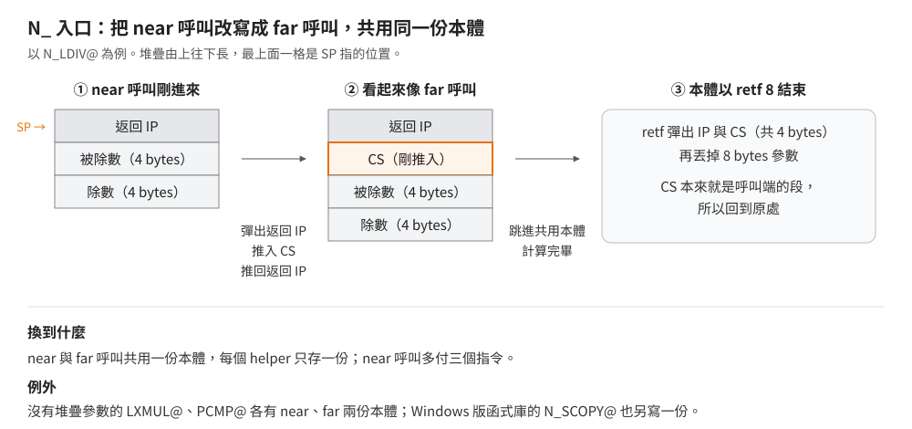
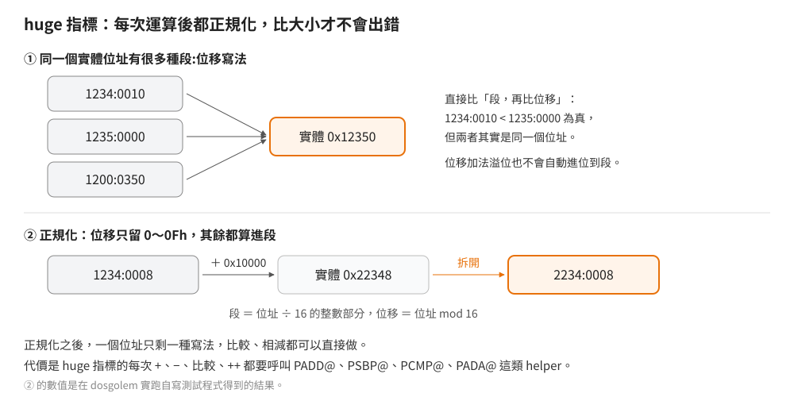

# 編譯器 helper：程式裡看不到的函式呼叫

## 結論

8086 沒有 32 位元乘除、32 位元位移的指令，段:位移指標加減也不會自動進位。
Borland C++ 2.0 的編譯器（BCC）遇到這些運算時不展開成一長串指令，而是插入一個對執行時期函式庫（RTL）的呼叫，
這些被呼叫的函式就是 helper（編譯器輔助函式）。原始程式碼裡看不到它們，反組譯時卻到處都是。

helper 的名稱以 `@` 結尾，大多有兩個版本：`N_` 開頭給 near 呼叫、`F_` 開頭給 far 呼叫。
**編譯器依程式碼指標的寬度選用**：small、compact 程式呼叫 `N_LXMUL@`，medium、large、huge 程式呼叫 `F_LXMUL@`。
這些名稱是組語寫的，連結後的符號就長這樣，不像 C 函式另外多一個底線。

| 群組 | helper | 用在 |
|---|---|---|
| 32 位元乘法 | `LXMUL@` | `long * long` |
| 32 位元除法、取餘 | `LDIV@`、`LUDIV@`、`LMOD@`、`LUMOD@` | `long / long`、`%`，有號與無號 |
| 32 位元位移 | `LXLSH@`、`LXRSH@`、`LXURSH@` | `long << n`、有號 `>>`、無號 `>>`，n 不是常數時 |
| huge 指標 | `PADD@`、`PSUB@`、`PSBP@`、`PCMP@`、`PADA@`、`PSBA@`、`PINA@`、`PDEA@`、`PSBH@` | huge 指標的 `+`、`-`、相減、比較、`+=`、`-=`、`++` |
| 結構 | `SCOPY@`、`SPUSH@` | 結構指派與回傳、以值傳遞結構參數 |
| 堆疊 | `OVERFLOW@`（DOS）、`CHKSTK@`（Windows） | 用 `-N` 編譯時的堆疊溢位檢查 |
| 浮點 | `FTOL@` | `double` 轉 `long` 或 `int` |

本文的結論來自三種證據：RTL 原始碼、以原廠工具鏈重編後與出貨函式庫的比對（helper 所在的模組全部相同），
以及一支自寫測試程式（[`examples/helpers/`](../../examples/helpers/)）在五個記憶體模型編譯、
在 dosgolem 以 8086 與 186 兩種 CPU 模式執行的結果（dosgolem 可以選擇模擬的處理器世代，用來觀察位移這類隨 CPU 而異的行為）。

## 根本問題

8086 的 `mul`、`div` 只做「16 位元乘 16 位元得 32 位元」與「32 位元除以 16 位元得 16 位元」，
`shl`、`shr` 一次只作用在一個 16 位元暫存器。C 的 `long` 是 32 位元，每一個 `long` 乘除、位移都要十幾到上百個指令才做得完。

如果編譯器在每個運算的位置展開這些指令，程式會大很多；1990 年前後的程式要塞進 640 KB 甚至一張磁片。
Borland 的取捨是：運算本身放進 RTL，只存一份；呼叫端只花幾個 bytes 準備參數、呼叫。
同樣的考量也套用在 huge 指標、結構複製、堆疊檢查上。

## 推導

### helper 的呼叫慣例不是 C 的

C 函式的參數一律放在堆疊上、由呼叫端清除。helper 是編譯器自己用的，可以挑最省的方式：

| helper | 參數 | 回傳 | 誰清堆疊 |
|---|---|---|---|
| `LXMUL@` | DX:AX 與 CX:BX 兩個 `long`（放在暫存器） | DX:AX | 沒有堆疊參數 |
| `LDIV@` 家族 | 堆疊：先推除數、再推被除數，各 4 bytes | DX:AX | helper 自己（`retf 8`） |
| `LXLSH@` 家族 | DX:AX 為被位移的值，CL 為位移量 | DX:AX | 沒有堆疊參數 |
| `PADD@`、`PSUB@` | DX:AX 為指標，CX:BX 為 32 位元增量 | DX:AX | 沒有堆疊參數 |
| `PCMP@` | DX:AX 與 CX:BX 兩個指標 | 旗標，呼叫端接 `jb`、`jnb` | 沒有堆疊參數 |
| `SCOPY@` | 堆疊：來源與目的兩個 far 指標；CX 為位元組數 | — | helper 自己（`retf 8`） |
| `SPUSH@` | DX:AX 為來源結構，CX 為大小 | 結構留在呼叫端的堆疊上 | — |
| `FTOL@` | 數學輔助處理器堆疊頂端的值 | DX:AX | — |

DX:AX 的寫法表示「DX 放高 16 位元、AX 放低 16 位元」。反組譯時，一個 `call` 前面緊接著四個載入 DX、AX、CX、BX 的 `mov`，
而 `call` 後面沒有調整 SP，多半就是 helper。

### 一份本體，兩種呼叫距離

near 呼叫只推 2 bytes 的返回位址，far 呼叫推 4 bytes（段與位移），兩者結尾要用不同的返回指令，
正常情況下得寫兩份。RTL 的大部分 helper 只寫一份以 `retf` 結尾的本體，`N_` 入口先把堆疊改成 far 呼叫的樣子：
彈出返回位址、推入目前的 CS、再把返回位址推回去。
near 呼叫只能呼叫同一個程式碼段裡的位址、不會換 CS，所以呼叫端和 helper 必然在同一段，推入的 CS 正好就是呼叫端的段，`retf` 回得去。

代價是 near 呼叫每次多三個指令，換到的是每個 helper 只存一份。例外有兩類：

- `LXMUL@`、`PCMP@`、`PSBH@` 沒有堆疊參數、本體很短，near 與 far 版各寫一份完整的本體。
- Windows 版函式庫另外寫了一份 `N_SCOPY@`，本體以 near 返回結束，不改寫堆疊。
  可能的原因是 Windows 會搬移程式碼段並修正堆疊上的 far 返回位址，偽造的 far 框架可能與這個機制衝突（假說，未查證）。

### 32 位元乘法

兩個 32 位元數 a、b 各拆成高低兩個 16 位元字：a = a₁·2¹⁶ + a₀，b = b₁·2¹⁶ + b₀。

a·b = a₁b₁·2³² + (a₁b₀ + a₀b₁)·2¹⁶ + a₀b₀

C 的 `long` 乘法只要低 32 位元，2³² 那一項整個溢出，所以只剩三個 16×16 的乘法：

低 32 位元 = a₀b₀ + ((a₁b₀ + a₀b₁) 的低 16 位元)·2¹⁶

`LXMUL@` 照這個式子做最多三次 `mul`，而且 a₁ 或 b₁ 為 0 時跳過對應的那一次。
有號與無號相乘的低 32 位元完全相同（二補數的性質），所以只需要一個版本。

實跑：123456 × (−789) = −97406784；0x7FFFFFFF × 3 = 2147483645（只取低 32 位元，高位溢出）。

### 32 位元除法

`LDIV@`（有號商）、`LUDIV@`（無號商）、`LMOD@`（有號餘數）、`LUMOD@`（無號餘數）共用一份本體，
入口只在 CX 放一個 0～3 的編號就跳進去。

1. **捷徑**：除數的高位字為 0，而且被除數的高位字也是 0（或除數整個是 0）時，直接用一次 16 位元的 `div`。
   被除數小於 65536 時商一定放得進 16 位元，不會出錯；除數為 0 時則是故意讓 `div` 觸發處理器的除以零中斷。
2. **一般路徑**：有號除法先把負的被除數、除數轉成正數，記下「商要不要變號」「餘數要不要變號」。
   接著做 32 次「整個被除數左移一位、試著減掉除數、減得下就在商的最低位記 1」，也就是二進位的長除法。
3. 依編號取商或餘數，依記下的符號變號，以 `retf 8` 返回並清掉堆疊上的兩個 `long`。

這決定了有號除法的邊界行為：

| 運算 | 結果 | 規則 |
|---|---|---|
| −7 / 2 | −3 | 商向 0 截斷 |
| 7 / −2 | −3 | 同上 |
| −7 % 2 | −1 | 餘數與被除數同號 |
| 7 % −2 | 1 | 同上 |
| 0x80000000 / −1 | 0x80000000 | 不觸發例外 |
| 0x80000000 % −1 | 0 | |
| 0xFFFFFFFF / 7（無號） | 613566756 | |

`0x80000000 / −1` 在數學上是 2³¹，放不進有號 `long`。−1 的位元組合是 0xFFFFFFFF，高位字不是 0，不符合捷徑條件，走的是一般路徑。helper 先把兩者轉正：0x80000000 取負還是 0x80000000，
當成無號數就是 2³¹；除以 1 得 2³¹；兩者都是負數所以商不變號，回傳的位元組合 0x80000000 解讀成有號數就是最小的 `long`。
一般路徑只用移位與減法，不執行 `div` 指令，所以不會觸發處理器的除法例外。

除數為 0 時會觸發中斷 0。Borland 的啟動碼在程式開始時就接管這個中斷，處理程序在標準錯誤輸出寫出 `Divide error`，
接著以結束碼 3 結束程式，**不執行 `atexit` 註冊的函式、不寫出緩衝區**。實跑：先 `printf` 一段沒有換行的文字再除以 0，
主控台只出現 `Divide error`，那段文字遺失，`atexit` 函式也沒有執行。

### 32 位元位移與 CPU 的差別

位移量小於 16 時，高低兩個字各移一次，再把移出去的位元補到另一個字；16 以上時先交換高低字（等於移了 16 位），再移剩下的量。

位移量放在 CL 這個 8 位元暫存器，helper 不檢查範圍。位移量 ≥ 32 時，結果取決於 CPU 怎麼處理位移指令：

- **8086**：`shl`、`shr`、`sar` 用完整的 CL，移 16 位以上就把 16 位元暫存器移光：`shl`、`shr` 補進來的是 0，所以結果是 0；`sar`（算術右移）補進來的是符號位，所以正數變 0、負數變 −1。
  實跑（dosgolem 的 8086 模式）：`0x12345678 << 32`、`<< 40`、`<< 48` 都得 0；`−1 >> 40`（有號）得 −1；`0x12345678 >> 48` 得 0。
- **80286 以上**：處理器把位移量遮罩成低 5 位元。依 helper 的寫法推算，位移 48～63 時第二次位移的量變成 0～15，
  `0x12345678 << 48` 會得到 0x56780000 而不是 0。這是由 CPU 規格推得的強推論，沒有實跑：dosgolem 目前沒有 286 模式，
  它的 186 模式也不遮罩位移量（80186 實機是否遮罩，本文沒有查證）。

C 標準本來就不定義位移量大於等於型別寬度時的結果。remake 的原程式如果真的依賴這種位移，要依原作實際執行的 CPU 決定行為。

### huge 指標：正規化

far 指標的段:位移有很多種寫法指向同一個實體位址，直接「先比段、再比位移」會把相同的位址判成不同；
位移加法溢位時也不會進位到段，指標加 0x10000 會繞回原處。

huge 指標的做法是每次運算之後都**正規化**：把實體位址（段×16＋位移）重新拆成「段 ＝ 位址 ÷ 16、位移 ＝ 位址除以 16 的餘數」。
一個位址只剩一種寫法，比較與相減就能直接做。helper 裡看得到這個特徵：位移進位時段加 1000h（65536 ÷ 16）、
位移右移 4 位加進段、位移只留 `and 0Fh` 之後的值。

| helper | 做什麼 | 輸入與輸出 |
|---|---|---|
| `PADD@`、`PSUB@` | 指標 ± `long` | DX:AX 指標、CX:BX 增量 → DX:AX 新指標 |
| `PSBP@` | 指標 − 指標 | 兩個指標 → DX:AX 為兩者實體位址的差 |
| `PCMP@` | 比較 | 兩個指標 → 旗標 |
| `PADA@`、`PSBA@` | `p += n`、`p -= n` | DX:AX 指向指標變數，CX:BX 增量；就地改寫 |
| `PINA@`、`PDEA@` | 指標變數加減 16 位元的量 | ES:BX 指向指標變數，AX 增量；就地改寫 |

實跑（五個模型結果相同）：`1234:0008` 加 0x10000 得 `2234:0008`；兩者相減得 65536；`p < p+1` 為真；
`p++` 得 `1234:0009`。反組譯顯示 `(*pp)++` 呼叫的是 `PADA@`（增量 1），`PINA@`、`PDEA@` 在什麼運算下出現還沒查到。

`PSBH@` 是另一種指標相減，參數由兩個符號決定。DOS 的啟動碼定義了兩個常數：`__AHINCR` 為 1000h，
是「位址加 65536 時段值要加多少」；`__AHSHIFT` 為 12，是 1000h 以 2 為底的指數。Windows 則由系統核心提供保護模式下的值。
`PSBH@` 把兩個指標的段值各右移 `__AHSHIFT` 位再相減，結果當成 32 位元差值的高位字，位移相減當成低位字。
這個算法對應的是「位移用滿 16 位元、段值每次加 `__AHINCR`」的 huge 指標寫法，與上面 `PADD@` 那組「位移只留 0～0Fh」的正規化不同（強推論）。
用符號而不寫死常數，同一份目的碼在 DOS 與 Windows 都能連結。它在什麼運算下被呼叫，還沒查到。

### 結構複製與以值傳遞

8086 沒有「複製一整塊記憶體」的單一指令，只有配合 CX 重複執行的 `rep movsb`（一次 1 byte）與 `rep movsw`（一次 2 bytes）。

- **`SCOPY@`** 用在結構指派 `a = b` 與回傳結構。它從堆疊取來源與目的兩個 far 指標，把 CX 除以 2 做 `rep movsw`，
  除 2 時移出去的那一位（奇數時為 1）存在進位旗標裡；`rep movsw` 做完時 CX 已經是 0，`adc cx,cx`（CX 加 CX 再加進位旗標）的結果就是那一位，再做一次 `rep movsb` 補最後 1 byte。
  **不論記憶體模型，兩個指標一律是 far**，small 程式的呼叫端也會推入段值。
- **`SPUSH@`** 用在以值傳遞結構參數。它彈出自己的返回位址、`sub sp,cx` 在呼叫端的堆疊上挖出結構的空間、放回返回位址，
  再把結構複製進那塊空間。返回之後，結構就像被一個一個 byte 推上堆疊的參數一樣。
- 回傳結構時，呼叫端先準備一塊空間、傳入它的位址，函式把結果 `SCOPY@` 到那裡，並以 AX 回傳該位址。

反組譯測試程式的 37 bytes 結構：指派與回傳時 CX = 37，只是在一般記憶體之間搬移；以值傳遞時 CX = 38，因為那塊空間是從 SP 挖出來的，多 1 byte 湊成偶數，讓堆疊維持在 2 的倍數。
多小的結構會改用直接搬移、不呼叫 `SCOPY@`，本文沒有測。

### 堆疊溢位檢查（`-N`）

編譯時加 `-N`，每個函式建立堆疊框之後都會檢查 SP，溢位就呼叫 `OVERFLOW@`。檢查的寫法隨資料指標寬度不同：

| 模型 | 比較 | 意思 |
|---|---|---|
| near 資料（實測 small、medium） | `___brklvl` 與 SP；SP 較大才通過 | 堆疊從 DGROUP 頂端往下長、heap 從底部往上長；SP 碰到 heap 的頂端就是溢位 |
| far 資料（實測 compact、large、huge） | `__stklen` 與 SP；`__stklen` 較大才通過 | 堆疊自成一段，SP 從 `__stklen` 往 0 數；溢位時 SP 繞回 0FFFFh 附近，反而大於 `__stklen` |

huge 模型的函式進入時 DS 已換成模組自己的資料段，所以比較前多一步把 `__stklen` 所在的段載入 ES。
呼叫的 `OVERFLOW@` 則和其他 helper 一樣依程式碼指標寬度選 `N_` 或 `F_`：compact 比較 `__stklen` 但呼叫 `N_OVERFLOW@`，medium 比較 `___brklvl` 但呼叫 `F_OVERFLOW@`。

DOS 版的 `OVERFLOW@` 用 DOS 的「印出以 `$` 結尾的字串」功能在標準輸出寫出 `Stack overflow!`，接著跳到結束程式的函式，不返回。

Windows 版函式庫的 `CHKSTK@` 是另一種東西：呼叫前 AX 放要配置的區域變數大小，
helper 檢查「SP 減掉這個量之後，是否仍高於 Windows 記錄的堆疊上限加 1024 bytes 的保留量」，通過就直接把 SP 往下調並返回，
等於替函式配置了區域變數；不通過就顯示 `Runtime Error: Stack Overflow` 並結束。
它另外公開 `__aNchkstk`、`__aFchkstk` 兩個名稱，和 Microsoft C 的 helper 同名（強推論：讓 Microsoft 格式的目的檔也能連結）。

### 浮點轉整數

C 規定浮點轉整數要捨去小數（向 0 截斷），但數學輔助處理器（8087 系列浮點晶片，沒有晶片時由軟體模擬）預設的捨入方式是「取最接近的整數，剛好一半時取偶數」。
`FTOL@` 先讀出處理器的控制字（決定捨入方式、精度與例外遮罩的 16 位元設定），把捨入方式暫時改成向 0 截斷，轉成 64 位元整數，還原控制字，回傳低 32 位元。

實跑：−1.5 → −1；2.999 → 2；3.0e9 → −1294967296；−3.0e9 → 1294967296。
後兩個是超出 `long` 範圍時只取 64 位元結果的低 32 位元造成的，不會觸發例外。

## 在執行檔裡怎麼認

| 看到的程式碼 | 身分 |
|---|---|
| 入口 `pop` 某個暫存器、`push cs`、`push` 同一個暫存器，後面跟一段以 `retf` 結尾的本體 | `N_` helper 的入口，後面是共用本體 |
| 開頭一串 `xchg`，最多三個 `mul`，中間有 `test ax,ax`、`jcxz` | `LXMUL@` |
| 幾個入口各把 CX 設成 0～3 再跳到同一處；共用區有 32 次的 `shl`、`rcl` 迴圈與 `sub`／`sbb`，另有一條只做一次 `div` 的捷徑；`retf 8` 結尾 | `LDIV@` 家族 |
| `cmp cl,16` 分兩支，各有一對位移指令，其中一支有 `xchg ax,dx` | `LXLSH@` 家族 |
| `add dx,1000h` 或 `sub dx,1000h`、`mov cl,4` 後右移、`and ax,0Fh` | huge 指標 helper |
| 從堆疊 `lds si`、`les di` 取兩個 far 指標，`shr cx,1`、`rep movsw`、`adc cx,cx`、`rep movsb`，`retf 8` | `SCOPY@` |
| 彈出返回位址、`sub sp,cx`、放回返回位址，再把 DX:AX 指向的資料複製到 SS 所在的段 | `SPUSH@` |
| 函式開頭 `cmp ___brklvl,sp` 或 `cmp __stklen,sp` 後接條件跳躍與一個 `call` | `-N` 的堆疊檢查；被呼叫的是 `OVERFLOW@` |
| 字串 `Stack overflow!$` 附近有 `mov ah,9`、`int 21h` | `OVERFLOW@` |
| `fstcw`、把控制字 OR 0Ch、`fistp` 存到 8 bytes、`fldcw` | `FTOL@` |

容易誤判的地方：

- `rep movsw`＋`adc cx,cx`＋`rep movsb` 也是 `memcpy` 的寫法。看參數從哪裡來：`SCOPY@` 從堆疊取兩個 far 指標、長度在 CX；
  `memcpy` 的長度是堆疊上的第三個參數。
- 32 次迴圈的移位減法也可能是程式自己寫的除法。看有沒有多個入口共用、`retf 8` 清掉兩個 `long`。
- helper 的呼叫端不調整 SP，不能拿「`call` 之後有沒有 `add sp,n`」來判斷參數個數。

## 給 remake 的行為規格

| 運算 | 行為 |
|---|---|
| `long` 乘法 | 取 64 位元乘積的低 32 位元，不檢查溢位 |
| `long` 除法、取餘（有號） | 商向 0 截斷；餘數與被除數同號；`LONG_MIN / −1` 得 `LONG_MIN`、`LONG_MIN % −1` 得 0，不當機 |
| `long` 除以 0 | 印出 `Divide error` 到標準錯誤輸出，結束碼 3；不執行 `atexit`、不寫出緩衝區 |
| `long` 位移量 0～31 | 一般結果 |
| `long` 位移量 ≥ 32 | 8086：左移與無號右移得 0，有號右移得 0 或 −1（依正負）；286 以上：位移 32～47 同上，48～63 依遮罩後的量計算（強推論） |
| `double` 轉 `long` | 向 0 截斷；超出範圍時取 64 位元整數的低 32 位元，不當機 |
| huge 指標比較、相減 | 以實體位址計算，不同寫法的同一位址視為相等 |

## 證據與未知

| 結論 | 出處 | 等級 |
|---|---|---|
| helper 名稱、`N_`／`F_` 版本、所在模組 | Borland C++ 2.0 RTL，`CLIB2` 的 `H_*.ASM`、`N_LXMUL.ASM`、`F_LXMUL.ASM`、`N_PCMP.ASM`、`STACK.ASM`，`WINLIB` 的 `H_CHKSTK.ASM`、`N_SCOPY.ASM`，`MATH` 的 `FTOL.ASM` | 已證實（原文） |
| 這些模組與出貨函式庫相同 | 原廠工具重編，C 函式庫 2,455 次、數學函式庫、Windows 版函式庫的對拍（`FTOL` 兩版皆相同） | 已證實（對拍） |
| 依程式碼指標寬度選 `N_` 或 `F_`、各 helper 的參數放法 | 自寫測試程式以五個模型編譯後反組譯呼叫端 | 已證實（反組譯） |
| `N_` 入口改寫成 far 框架 | 原文 | 已證實（原文） |
| Windows 版 `N_SCOPY@` 另寫一份的原因 | 無直接證據 | 假說 |
| 乘法、除法、取餘、位移（8086）、`double` 轉 `long`、huge 指標的實際結果 | 測試程式在 dosgolem 以 8086 與 186 模式、五個記憶體模型執行，結果相同 | 已證實（實跑） |
| 除以零的訊息、結束碼與不 flush 的行為 | 啟動碼 `C0.ASM` 原文＋實跑 | 已證實（原文＋實跑） |
| 286 以上位移量 ≥ 48 的結果 | 由 CPU 規格與 helper 寫法推算 | 強推論 |
| `-N` 在 near 資料與 far 資料模型的兩種形式 | 反組譯五個模型 | 已證實（反組譯） |
| `__AHSHIFT` 在 DOS 是 12 | `STARTUP.ZIP` 的 `C0.ASM` | 已證實（原文） |
| `CHKSTK@` 的 Microsoft 相容名稱的用途 | 名稱比對 | 強推論 |

尚未查證：

- `PINA@`、`PDEA@`、`PSBH@` 由哪種運算觸發。
- 多小的結構不經 `SCOPY@`。
- `Stack overflow!` 之後的結束碼。
- 80186 實機的位移量是否遮罩。
