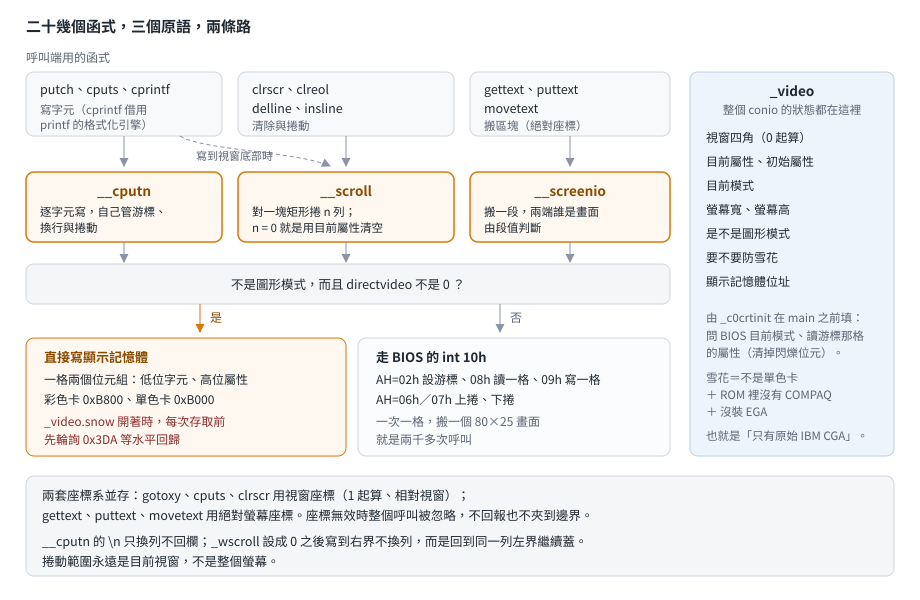

# conio：一個結構、三個原語、兩條路

## 結論

BC++ 2.0 的 conio 全部狀態放在一個叫 `_video` 的結構裡（視窗四角、目前屬性、螢幕大小、是不是圖形模式、
要不要防雪花、顯示記憶體位址），畫面操作只有三個原語：`__cputn` 寫字元、`__scroll` 捲動或清除、
`__screenio` 搬區塊。每個原語都有兩條路——直接寫顯示記憶體，或走 BIOS 的 `int 10h`——由全域變數
`directvideo` 與「是不是圖形模式」決定。

對 remake 影響最大的幾條：

- **`\n` 只換列不回欄**。conio 的換行不含歸位，`cputs("A\nB")` 的 B 會落在 A 的右下角。
- **`\b` 只把游標退一格，不清掉字元**，而且不會退出視窗左界。
- **捲動範圍是視窗，不是整個螢幕**；`clrscr`、`clreol`、`delline`、`insline` 全都是同一個捲動原語的不同參數。
- **兩套座標系並存**：`gotoxy`、`cputs`、`clrscr` 用視窗座標（1 起算、相對視窗），
  `gettext`、`puttext`、`movetext` 用絕對螢幕座標。
- **座標無效時整個呼叫被忽略**，沒有回報，也不會夾到邊界。
- **`_wscroll` 設成 0 之後，寫到視窗右界不會換列**，而是回到同一列的左界繼續蓋。

機制來自原始碼，行為規格來自一支自寫測試程式（[`examples/conio/`](../../examples/conio/)）在五個記憶體模型下、
在 dosgolem 裡的實跑結果（五個模型輸出完全相同，另外比對模擬器 dump 出來的文字畫面）。

## 根本問題

### 文字畫面有兩種寫法，各有各的代價

IBM PC 的文字模式把畫面直接對映到記憶體：每格兩個位元組（字元＋屬性），彩色卡在 `0xB800`、
單色卡在 `0xB000`。程式可以直接往那裡寫，一格兩個位元組，快得像改一個變數。

BIOS 也提供 `int 10h` 的一整組服務（設游標、寫字元、捲動）。走 BIOS 慢得多——一次呼叫只處理一個字元，
中間還要移動游標——但它在所有相容機器上都能用。

1991 年沒有「一定安全」的選擇：直接寫記憶體會撞上非標準顯示卡與某些相容機，走 BIOS 則慢到不能做動畫。

### 原始 CGA 會在畫面上撒雪花

最早的 IBM CGA 卡，顯示記憶體同時被 CPU 與 CRT 控制器存取，兩邊撞在一起時畫面會閃出白點，
當年叫它「snow」。避開的方法是等水平回歸期間再寫，代價是每格都要先去輪詢一個 I/O 埠。

後來的卡（EGA 以後，以及 COMPAQ 的相容機）沒這個問題，等回歸純粹是浪費時間。
所以「要不要等」必須在執行時判斷。

### 遊戲需要視窗

一個文字模式的遊戲畫面通常分成幾塊：地圖、狀態、訊息。每塊各自捲動、各自清除。
如果每個函式都要帶四個角座標，呼叫端會被邊界計算淹沒。

## 推導

### 一個結構裝下整個狀態

`_video` 是個十幾個位元組的結構，欄位全是 `unsigned char` 加一個遠指標：視窗的四個邊界、目前屬性、
初始屬性、目前模式、螢幕高與寬、是不是圖形模式、要不要防雪花、顯示記憶體位址。
`gettextinfo` 幾乎就是把它抄一份出來給呼叫端（多附上目前游標位置）。

它由一個掛在啟動表上的函式 `_c0crtinit` 填好，在 `main` 之前跑（見[啟動與結束鏈](startup-and-exit.md)）：

| 欄位 | 怎麼決定 |
|---|---|
| 目前模式、螢幕寬 | 問 BIOS 目前的顯示模式 |
| 初始屬性 | 讀游標所在那格的屬性，**並且把閃爍位元清掉** |
| 是不是圖形模式 | 由模式編號判斷 |
| 螢幕高 | 25，除非是 43／50 列模式（那時讀 BIOS 資料區） |
| 要不要防雪花 | 不是單色卡、BIOS ROM 裡沒有 `COMPAQ` 字樣、而且沒裝 EGA |
| 顯示記憶體位址 | 單色卡 `0xB000`，其餘 `0xB800` |
| 視窗 | 整個螢幕 |

那條雪花判斷是柵欄原則的好例子：它看起來像三個不相干的條件湊在一起，其實是在回答一個問題——
「這台機器的顯示卡是不是原始的 IBM CGA」。單色卡沒有這個問題；COMPAQ 的相容機修掉了；
EGA 以後的卡也修掉了。剩下的才需要付等回歸的代價。

### 三個原語

上層那二十幾個函式，最後都落到三個原語其中之一：

| 原語 | 做什麼 | 誰用它 |
|---|---|---|
| `__cputn` | 逐字元寫出去，自己管游標與換行 | `putch`、`cputs`、`cprintf`（也是 `printf` 三個輸出函式之一） |
| `__scroll` | 對一個矩形區域上捲或下捲 n 列，**n 為 0 時代表用目前屬性清空** | `clrscr`、`clreol`、`delline`、`insline`，以及 `__cputn` 寫到視窗底部時 |
| `__screenio` | 在顯示記憶體與一般記憶體之間搬一段（哪邊是畫面由段值判斷） | `gettext`、`puttext`、`movetext` |

清除與捲動是同一件事這點值得停一下：BIOS 的捲動服務本來就把「捲 0 列」定義成「用指定屬性填滿區域」，
所以 `clrscr` 只是「對整個視窗捲 0 列」，`clreol` 是「對游標列從游標欄到視窗右界捲 0 列」，
`delline` 是「從游標列到視窗底部上捲 1 列」，`insline` 是同一段下捲 1 列。四個函式，一個原語。

### 兩條路

三個原語都有同一個岔路：**不是圖形模式、而且 `directvideo` 非 0**，就直接存取顯示記憶體；否則走 BIOS。

走 BIOS 那條特別慢：`__screenio` 的 BIOS 版是一格一格處理的——每格先把游標移過去（`AH=02h`），
讀一格用 `AH=08h`、寫一格用 `AH=09h`，整批做完再把游標移回原處。搬一個 80×25 的畫面就是兩千多次 BIOS 呼叫。

直接寫記憶體那條，在 `_video.snow` 開著時每次存取前要先輪詢 CGA 的狀態埠等水平回歸。
`__scroll` 還有個附帶條件：只有「捲 1 列」才走直接搬移（用 `movetext` 搬區域再清掉空出來那列），
其餘情況一律交給 BIOS。

### 游標與換行的規則

`__cputn` 不依賴 BIOS 的游標推進，它自己算：進來時取一次目前欄列，處理完所有字元才把游標寫回去。
每個字元的規則是：

| 字元 | 做什麼 |
|---|---|
| `\a` | 走 BIOS 的 TTY 輸出（就為了那一聲） |
| `\b` | 欄減一，**不清字元**，不會退過視窗左界 |
| `\r` | 欄回到視窗左界 |
| `\n` | **列加一，欄不動** |
| 其他 | 寫一格（含目前屬性），欄加一 |

寫完之後檢查兩件事：欄超過視窗右界時，欄回左界、列加上 `_wscroll`；列超過視窗底部時，
對視窗上捲一列、列退回去。

`_wscroll` 預設是 1。把它設成 0，第一個檢查裡的「列加上 0」等於不換列——結果是**游標回到同一列的左界繼續寫**，
後面的字元把前面的蓋掉。這正是那個年代做狀態列的手法：不希望一個太長的字串把整個畫面頂上去。

## 在執行檔裡怎麼認

| 看到 | 推論 |
|---|---|
| 一個十幾個位元組的全域結構，被一大群畫面函式讀寫，其中兩個位元組是 `0xB800` 或 `0xB000` | `_video`；那兩個位元組是顯示記憶體位址 |
| 一個函式先比對某個全域旗標，再分岔成「`rep movsw` 到 `B800`」與「一串 `int 10h`」 | 三個原語之一；那個旗標是 `directvideo` |
| `int 10h` 搭 `AH=06h`／`AH=07h`，`AL` 有時是 0 | `__scroll`；`AL` 為 0 是清空區域 |
| 一段迴圈輪詢埠 `0x3DA`、測某個位元、寫一格顯示記憶體 | 防雪花的直接寫入路徑 |
| 啟動表裡一個優先度 16 的函式，開頭是 `int 10h AH=0Fh` | `_c0crtinit`（填 `_video` 的那支） |
| 讀 `F000:FFEA` 附近的位元組並與字串比較 | 雪花偵測裡的 COMPAQ 判斷 |

容易誤判的地方：

- **直接寫顯示記憶體的程式碼不一定是 conio**：很多遊戲自己寫一套。判準是它有沒有跟 `_video` 這個結構互動。
- **`cprintf` 與 `printf` 走的是同一個格式化引擎**，差別只在輸出函式（見 [printf 家族](printf-engine.md)），
  所以看到格式化程式碼呼叫一個會碰 `_video` 的輸出函式，那是 `cprintf`。
- 這一節的特徵是從機制推得的，還沒有逐一在第三方程式上驗證。

## 給 remake 的行為規格

實測條件：`examples/conio`，五個記憶體模型（輸出完全相同），在 dosgolem 執行，模式 3（80×25 彩色），
`directvideo` 是預設值 1。

### 視窗與游標

| 情況 | 結果 |
|---|---|
| 程式啟動時的視窗 | 整個螢幕（1, 1, 80, 25） |
| `window(10, 5, 40, 15)` 之後 | 游標跳到視窗的 (1, 1) |
| `gotoxy(3, 2)` | 視窗座標，對應螢幕的 (12, 6) |
| `gotoxy(100, 100)`（越界） | **整個呼叫被忽略**，游標不動 |
| `window(1, 1, 200, 200)`（越界） | **整個呼叫被忽略**，視窗不變 |
| `wherex()`／`wherey()` | 回傳的是視窗座標，1 起算 |

### 寫字元

以下在一個 10 欄 × 4 列的視窗裡測：

| 寫什麼 | 結果 |
|---|---|
| `"AB"` 從 (1,1) 開始 | 游標到 (3,1)，兩格分別是 `A`、`B` |
| `"XY\nZ"` 從 (1,1) 開始 | 游標到 (4,2)——**`Z` 落在第 3 欄**，不是第 1 欄 |
| `"\r"` | 游標回到欄 1，列不變 |
| 在 (1,1) 寫 `"\b\b"` | 游標留在 (1,1)，畫面不變 |
| 從 (1,2) 寫滿 10 欄 | 游標到 (1,3) |
| 在最後一列寫滿 | 視窗上捲一列，原本第一列的內容消失，游標留在最後一列的欄 1 |
| `_wscroll = 0` 時寫 13 個字元到 10 欄寬的視窗 | 游標到 (4,1)：**不換列，回到同一列左界蓋掉前面三格** |

### 兩條路的結果

| 情況 | 結果 |
|---|---|
| 同樣的 `cputs` 在 `directvideo = 1` 與 `0` 下 | 畫面上的字元與屬性**完全相同** |
| `directvideo = 0` 時的 `clrscr` 與視窗捲動 | 與直接寫顯示記憶體時相同 |

差別只在速度與相容性，不在結果——這正是那個開關能存在的前提。

### 屬性

| 情況 | 結果 |
|---|---|
| `textcolor(LIGHTGREEN); textbackground(BLUE)` | 屬性值 26 = `10 + (1 << 4)` |
| `textattr(BLINK + YELLOW + (RED << 4))` | 屬性值 206 = `128 + 14 + (4 << 4)` |
| `clrscr()` | 用**目前**屬性填空白（字元 32） |
| 程式啟動時的屬性 | 讀畫面上游標那格、清掉閃爍位元；**值隨執行環境而定**（dosgolem 下是 0） |

### 區塊操作

| 情況 | 結果 |
|---|---|
| 座標 | **絕對螢幕座標**，不受目前視窗影響 |
| `gettext` 的緩衝區 | 一列接一列，大小 = 寬 × 高 × 2 bytes；每格低位元組是字元、高位元組是屬性 |
| 座標無效 | 回 0，什麼也不做 |
| `movetext` 區域重疊 | 有處理：目的列比來源列大時改成由下往上搬 |

## 證據與未知

| 結論 | 出處 | 等級 |
|---|---|---|
| `_video` 的欄位與用途 | RTL 的 `_VIDEO.H` | 已證實（原文） |
| 三個原語與兩條路的岔路條件 | RTL 的 `SCREEN.C`、`VRAM.CAS`、`SCROLL.C`、`CPRINTF.C` | 已證實（原文） |
| 清除＝捲 0 列；`clreol`／`delline`／`insline` 都是 `__scroll` 的參數變化 | RTL 的 `CLRSCR.C`、`CLREOL.C`、`INSLINE.C` | 已證實（原文） |
| `__cputn` 的逐字元規則與 `_wscroll` | RTL 的 `CPRINTF.C` | 已證實（原文） |
| 兩套座標系、`gettext` 的緩衝區形狀、`movetext` 的重疊處理 | RTL 的 `GPTEXT.C`、`MOVETEXT.C`、`SCREEN.C` | 已證實（原文） |
| `_video` 的初始化與雪花偵測條件 | RTL 的 `CRTINIT.CAS` | 已證實（原文） |
| 行為規格各條 | `examples/conio` × 五個模型，在 dosgolem 執行，另比對文字畫面 dump | 已證實（實測） |
| 辨識特徵 | 由機制推得，未逐一在第三方程式上驗證 | 強推論 |

未知：

- **`directvideo = 0` 那條路只驗了寫字元、清除與視窗捲動**（結果與直接寫顯示記憶體完全相同）。
  區塊搬移（`gettext`／`puttext`／`movetext`）走 BIOS 的版本沒單獨測——那條路是一格一格讀寫的，
  遇到不支援 `AH=08h` 的環境會整批出錯。
- **雪花那條路完全沒測**：dosgolem 沒有 CGA 的狀態埠行為，等回歸的迴圈在模擬器裡是空轉。
- `cgets` 的緩衝區約定、`getche`／`getpass` 的鍵盤路徑、`textmode` 切換模式後 `_video` 怎麼更新，都還沒讀也沒測。
- 43／50 列模式、單色卡、40 欄模式都沒測。
- Microsoft C 的對應做法要等 M3。
