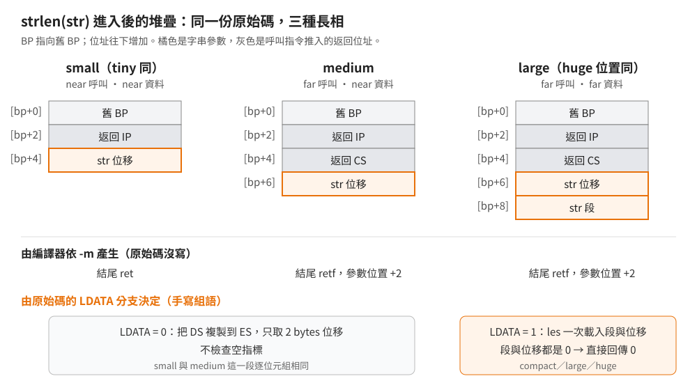
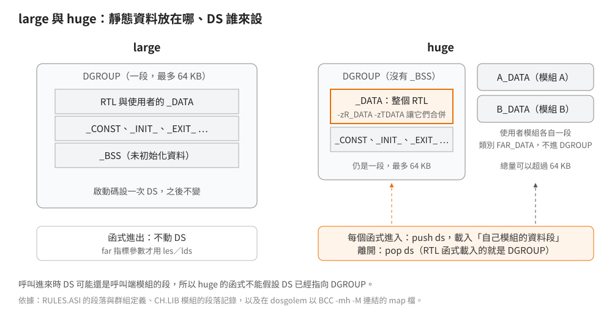

# 一份原始碼怎麼編出五個記憶體模型

## 結論

Borland C++ 2.0 的執行時期函式庫（RTL）用三層機制，讓一份原始碼編出 small、compact、medium、large、huge 五份 `.LIB`：

1. **批次檔**對每個模型各編一次。
2. **編譯器**負責大部分差異：函式怎麼進出、參數在堆疊上的位置、指標放不放得進暫存器、huge 模型要不要重設 DS。
   絕大多數純 C 模組不必為五個模型寫任何東西。
3. **手寫組語**的地方編譯器幫不上忙，改用兩個布林開關描述差異：`LDATA`（資料指標是 far）與 `LPROG`（函式呼叫是 far），
   再配一組隨開關展開的巨集。

另外有兩個常被誤解的變體：f 開頭的 far 版字串函式是 large 模型重編、改名後放進全部五個庫；
huge 模型則是在 large 的基礎上，讓每個函式進入時自己設定 DS。

這些說法都用原廠工具鏈對拍過：C 函式庫 2,455 次、far 版函式 310 次、啟動碼 20 個目的檔，重編結果與 1991-04 出貨版相同
（1991-08 改版的 C 函式庫只有 `SCROLL` 一個模組不同，與記憶體模型無關）。

本文的函式名稱用 C 原始碼裡的寫法（`strlen`、`_fstrlen`）；BCC 會替 C 符號再加一個底線，
所以在目的檔、`.LIB` 或 map 檔裡看到的是 `_strlen`、`__fstrlen`。

## 根本問題

8086 的位址是「段 × 16 ＋ 位移」，指標因此有兩種寬度：只存位移的 near 指標（2 bytes），與連段一起存的 far 指標（4 bytes）。
程式碼與資料各自選 near 或 far，就是記憶體模型（見[總覽](../00-overview/era-and-libraries.md)）。

這個選擇在編譯時就寫死進目的碼：near 函式用 `ret` 返回、far 函式用 `retf`；指標參數在堆疊上佔 2 或 4 bytes。
函式庫是預先編好的，只能配合一種模型，所以要出五份。但 RTL 有將近 600 個原始檔，不可能維護五份，
設計目標就變成：**模型差異盡量交給編譯器，交不出去的部分集中成少數幾個開關**。

## 推導

### 第一層：批次檔各編一次

建置批次檔對每個模型把全部原始檔重編一次，C 檔帶 `-m<模型>`，組語檔帶 `/D__<模型>__`，
各自收成 `CS`、`CC`、`CM`、`CL`、`CH.LIB`。tiny 模型沒有自己的庫：在 [dosgolem](../70-toolchain/bcc20-on-dosgolem.md) 裡用 `BCC -mt` 編連一支程式，
BCC 叫 TLINK（Borland 的連結器）開啟的是 `C0T.OBJ`（tiny 的啟動碼，見下文「啟動碼的變體」）與 `CS.LIB`。tiny 與 small 的程式碼和資料指標都是 near，函式庫程式碼可以共用，
差別只在啟動碼讓程式碼與資料落在同一段。

### 第二層：編譯器吸收大部分差異

<p align="center"></p>

以 `strlen` 為例。它是 `.CAS` 檔（C 函式外殼包著內嵌組語）。反組譯出貨庫、逐模型比較：

| 模型 | 返回指令 | 參數位置 | 取參數的方式 | 空指標 |
|---|---|---|---|---|
| small | `ret` | `[bp+4]` | 把 DS 複製到 ES，取 2 bytes 位移 | 不檢查 |
| medium | `retf` | `[bp+6]` | 同 small | 不檢查 |
| compact | `ret` | `[bp+4]` | `les`（一次從記憶體載入段與位移的指令）取 4 bytes | 段與位移都為 0 就回傳 0 |
| large | `retf` | `[bp+6]` | 同 compact | 同 compact |
| huge | `retf` | `[bp+6]` | 同 compact；另外在進入時 `push ds`、設定 DS，離開前 `pop ds` | 同 compact |

表的前兩欄完全由編譯器產生，原始碼裡沒有任何關於 `ret`／`retf` 或參數位移的字。
far 呼叫多推了 2 bytes 的返回段值，所以參數往下挪 2。small 與 medium 的函式主體逐位元組相同，只有這兩處不同。

純 C 的模組更徹底。`strcspn`（`.C`）的原始碼裡，唯一和模型有關的條件式是 far 版建置用的（見下文「f 開頭的 far 版函式」），
在五個模型的一般建置裡不生效；編出來卻有明顯差異：

- small、medium：兩個字串指標放進 SI、DI 暫存器，迴圈很緊湊。
- large、huge：far 指標有 4 bytes，放不進 16 位元暫存器；編譯器改把其中一個存在堆疊上的區域變數，
  每次比對都重新用 `les bx` 載入，主體長了約一倍。

`CLIB1` 的 150 個 `.C` 檔中，132 個沒有任何模型相關的巨集或 include；其餘 18 個多半只有 far 版建置用的條件式。這一層吸收得越多，第三層要處理的就越少。

### 第三層：手寫組語的兩個開關

內嵌組語與 `.ASM` 是逐指令寫的，編譯器不會替它改寫。RTL 的做法是把「五個模型」化約成兩個是非題：

| 模型 | `LPROG`（函式呼叫是 far） | `LDATA`（資料指標是 far） |
|---|---|---|
| tiny、small | false | false |
| medium | true | false |
| compact | false | true |
| large、huge | true | true |

C 端的標頭 `ASMRULES.H` 由 BCC 預先定義的模型巨集（`__LARGE__` 等）算出這兩個值；
組語端的 `RULES.ASI` 做同樣的事，另外算出一個模型代碼 `MMODEL`
（最高位元表示 far 程式碼、次高位元表示 far 資料、低位是模型序號）。
`RULES.ASI` 還把 `__s__`、`__l__` 這種單字母名稱別名到完整名稱，原因是建置批次檔直接把模型字母拼進組譯參數。

有了開關，再定義一組「在 near 與 far 時展開成不同指令」的名稱，讓一行組語同時適用兩種寬度：

| 名稱 | `LDATA` 為 false | `LDATA` 為 true | 擋住的問題 |
|---|---|---|---|
| `LES_`、`LDS_` | `mov` | `les`、`lds` | far 指標要連段一起載入段暫存器 |
| `ES_`、`SS_` | 空（或 `DS:`） | 段前綴 | near 資料時所有資料都在 DS，前綴多餘 |
| `pushDS_`、`popDS_` | 空 | 保存、恢復 DS | far 資料時要改 DS 去指來源段 |
| `DPTR_`、`dPtrSize` | 2 bytes | 4 bytes | 結構欄位與參數的位移 |

| 名稱 | `LPROG` 為 false | `LPROG` 為 true | 擋住的問題 |
|---|---|---|---|
| `Proc@`、`PubProc@`、`ExtProc@` | near 程序 | far 程序 | 返回指令與呼叫距離 |
| `CPTR_`、`cPtrSize` | 2 bytes | 4 bytes | 函式指標的寬度 |

實際使用上，`CLIB2` 的 `.CAS` 檔（112 個）有 44 個直接寫 `LDATA` 的條件分支，比較簡單的差異才用上表的名稱；
29 個 `.ASM` 檔有 27 個引入 `RULES.ASI`。

`strlen` 就是分支的例子。它的組語在 near 資料時是：

```text
ES ← DS；DI ← 字串位移；AL ← 0
```

在 far 資料時是：

```text
ES:DI ← 字串的段:位移
若 段 == 0 且 位移 == 0：回傳 0
```

之後兩條路線共用同一段掃描：方向旗標清零、CX 設為 −1、`repne scasb` 逐一比對直到遇到 0。
CX 每比一個位元組就減 1，所以掃完之後由 CX 減掉的次數就能算出長度。這是 x86 教材常見的字串長度寫法。

### far 資料版多了空指標檢查

只有 far 資料的分支檢查空指標。near 資料時空指標等於 `DS:0000`，而啟動碼刻意讓那裡是 4 個 0 位元組：
C0 的資料段以 4 個 0 位元組開頭、接著版權字串，程式結束時計算這一塊的 checksum，對不上就印出空指標寫入的錯誤訊息。
small、medium 的 DGROUP（連結器把 `_DATA`、`_BSS` 等資料段合成的一個 64 KB 以內的群組，DS 平常就指向它）從這裡開始。所以 near 資料的 `strlen(NULL)` 讀到的第一個位元組就是 0，自然回傳 0，不需要另外檢查。
far 資料時空指標是 `0000:0000`，也就是中斷向量表（記憶體最前面 1 KB，存放 256 個中斷處理程序的位址，由 BIOS 與 DOS 填入，不是 0），只能明確檢查（強推論：這是只在 far 分支加檢查的理由）。

tiny 模型的程式碼與資料同段，啟動碼不做這項檢查，`DS:0000` 是什麼要看連結成哪種格式：

- **EXE（BCC 的預設）**：DS 指向載入映像的開頭。tiny 的程式碼以 `ORG 100h` 起始（`.COM` 程式緊接在 256 bytes 的 PSP 後面，
  位移從 100h 開始；啟動碼為了兩種格式通用而保留這個起點），EXE 映像的前 256 bytes 因此是填充的 0，`DS:0000` 也是 0（實跑確認，見下）。
- **`.COM`（TLINK 加 `/t`）**：DOS 把程式載在 PSP（DOS 放在程式前面的 256 bytes 控制區）後面，DS 等於 PSP 的段，
  `DS:0000` 是 PSP 開頭的 `int 20h` 指令，不是 0（強推論，未實跑）。

在 dosgolem 實際執行三個模型的 `strlen(NULL)`：tiny（EXE）、small、large 都回傳 0；
small 版印出 `DS:0000` 起的位元組是 4 個 0 接著版權字串的開頭，tiny（EXE）版是 8 個 0。

### huge 模型：函式自己設定 DS

<p align="center"></p>

large 與 huge 的指標寬度相同，差別在靜態資料：

- **large**：所有模組的靜態資料都放進 DGROUP 這一段，最多 64 KB。啟動碼把 DS 設成 DGROUP 之後就不再動。
- **huge**：讓靜態資料總量可以超過 64 KB，每個模組的資料各放一段。代價是：far 呼叫只換 CS 與 IP，不會連帶換 DS，
  呼叫進來的時候 DS 還指著呼叫端模組的那一段，所以**每個函式進入時都要把 DS 換成自己模組的資料段**，離開時換回來。

RTL 在 huge 模型下沒有真的把資料拆成幾百段。RTL 的編譯設定固定了資料段的名稱與類別（class，目的檔裡段落的一個屬性，連結器依它決定哪些段落排在一起；`-zR_DATA -zTDATA`），
組語模組也用同樣的名稱與類別宣告資料段，連結器就把整個 RTL 的資料合成一段 `_DATA`，再由 huge 啟動碼併入 DGROUP。
實際連結一支 huge 程式，map 檔（連結器輸出的段落配置清單）顯示 RTL 的資料全在同一段 `_DATA`、程式碼全在同一段 `_TEXT`；
使用者自己的 `T.C` 則照編譯器預設，各自有 `T_TEXT` 與類別為 `FAR_DATA` 的 `T_DATA`。
所以 RTL 函式在 huge 模型下載入的 DS 就是 DGROUP；它們仍然要自己載入，因為呼叫它們的是使用者模組。

huge 模型還有兩處差別：

- 沒有 `_BSS`。未初始化資料與已初始化資料放在同一段。
- 少數需要回到 DGROUP、又沒有編譯器進出碼可依靠的組語（例如 `exec` 相關模組），從啟動碼公開的 `DGROUP@` 變數讀回段值。

`strcpy` 的原始碼示範了這一層與編譯器的分工：它在 far 資料分支裡要改 DS，所以手動保存 DS，
但特地排除 huge。反組譯可以看到 huge 版改由編譯器產生的進出碼保存、恢復 DS，手寫的那一份會重複（強推論）。

### f 開頭的 far 版函式

RTL 有 31 個字串、記憶體與字元轉換函式另有 far 版：`_fstrlen`、`_fmemcpy`、`_fstrcpy`、`_ftoupper` 等。做法是：

1. 這些原始檔在「large 模型且定義了 `__FARFUNCS__`」時多引入一個標頭 `_FARFUNC.H`，
   它把 `strlen` 這類名稱重新定義成 `_fstrlen`（`strdup` 需要的配置函式也換成 far 版）。
2. 建置批次檔以 large 模型加 `__FARFUNCS__` 各編一次。
3. 同一份目的碼加進五個模型的 `.LIB`。

出貨 `CS.LIB` 裡的 `_fstrlen`，反組譯後與 `CL.LIB` 的 `strlen` 只差名稱。

同一份 large 版目的碼能給五個模型用，是因為它的介面與呼叫端的模型無關：一律 far 呼叫、一律收 far 指標，
而且這類函式不讀寫函式庫自己的靜態資料，不在乎 DS 指向哪裡（強推論）。
呼叫端之所以會產生 far 呼叫，是因為出貨的 `STRING.H` 把 `_fstrlen` 宣告成 far 函式、參數是 far 指標。
Borland C 允許個別函式用 `far`／`near` 關鍵字蓋過記憶體模型的預設，編譯器依宣告產生呼叫，不依整支程式的模型。
它解決的是 near 資料模型的程式透過 `farmalloc` 拿到資料段以外的記憶體之後，一般的 `strlen` 處理不了的問題。

### 啟動碼的變體：`C0F` 系列

啟動碼 `C0.ASM` 另有「堆疊放在資料段裡」的變體，由 `_DSSTACK_` 開關產生 `C0FT`、`C0FS`、`C0FC`、`C0FM`、`C0FL`，
BCC 的字串表裡它們排在一般的 `c0?.obj` 之後。對拍時發現：出貨的 `C0FT`、`C0FS`、`C0FM` 與 `C0T`、`C0S`、`C0M` 逐位元組相同，
只有 `C0FC`、`C0FL` 不同。原因寫在 `RULES.ASI`：tiny、small、medium 本來就定義了 `_DSSTACK_`。
可能的理由（強推論）：near 資料模型的堆疊必須和資料同段，否則指向區域變數的 near 指標會指錯地方，所以這個開關只對 compact、large 有意義。
huge 沒有 `C0F` 變體（`C0FH` 與 `C0H` 相同）。

## 在執行檔裡怎麼認

| 看到 | 推論 |
|---|---|
| 函式庫函式以 `ret` 結尾，第一個參數在 `[bp+4]` | 程式碼 near：tiny、small、compact |
| 以 `retf` 結尾，第一個參數在 `[bp+6]` | 程式碼 far：medium、large、huge |
| 字串函式用 `les di,[bp+…]` 取參數 | 資料 far：compact、large、huge |
| 字串函式先把 DS 複製到 ES，再取 2 bytes 位移 | 資料 near：tiny、small、medium |
| 函式開頭 `push ds`，接著把某個段值載入 AX 再搬進 DS，結尾 `pop ds` | huge |
| `strlen` 開頭先比對參數的段與位移是不是 0 | 資料 far |

容易誤判的地方：

- **f 開頭的 far 版函式在任何模型的程式裡都長得像 large。** 要判斷整支程式的模型，看一般的 RTL 函式或 `main` 的呼叫方式，不要看 `_fstrlen`。
- **huge 的 `push ds` 不是 Windows 的函式開頭。** Win16 程式的函式開頭也會處理 DS，但形式不同；
  先確認執行檔是 DOS 的 MZ 格式還是 Windows 的 NE 格式。
- **tiny 與 small 的函式庫程式碼相同。** 分辨兩者要看啟動碼（tiny 的程式碼與資料在同一段，才能連結成 `.COM`），不是看函式庫函式。

## 給 remake 的行為規格

| 行為 | small、medium | compact、large、huge | tiny（EXE） | tiny（`.COM`） |
|---|---|---|---|---|
| `strlen(NULL)` | 讀 `DS:0000`；正常情況那裡是 0，回傳 0 | 不讀記憶體，回傳 0 | 讀到 `ORG 100h` 前的填充 0，回傳 0 | 從 PSP 開頭掃到第一個 0 位元組，回傳那段距離（推論，未實跑） |

small、medium 的「正常情況」指程式沒有寫過空指標：寫過的話 `DS:0000` 的內容會變，`strlen(NULL)` 的結果跟著變，
而程式結束時會印出空指標寫入的錯誤訊息。

其他字串函式對空指標的處理要逐一查證，不能由 `strlen` 類推。

## 證據與未知

| 結論 | 出處 | 等級 |
|---|---|---|
| RTL 的 C 函式庫以五個模型各編一次、與 1991-04 出貨版相同 | 原廠 BCC 2.0 在 dosgolem 重編 2,455 次，比對 OMF 語意記錄 | 已證實（對拍） |
| `LDATA`、`LPROG`、`MMODEL` 的定義與模型對應 | Borland C++ 2.0 RTL，`ASMRULES.H`、`RULES.ASI` | 已證實（原文） |
| `LES_`、`pushDS_`、`Proc@` 等名稱的展開 | 同上 | 已證實（原文） |
| `strlen` 五個模型的進出、取參數、空指標檢查 | `STRLEN.CAS`；IDA 9.4 反組譯出貨 `CS`～`CH.LIB` | 已證實（原文＋反組譯） |
| `strcspn` 的模型差異全由編譯器產生 | `STRCSPN.C` 除 far 版建置的條件式外沒有模型相關條件式；反組譯四個模型 | 已證實（原文＋反組譯） |
| 150 個 `.C` 中 132 個不含模型相關的巨集或 include | `CLIB1` 原始檔搜尋（`CLIB2` 沒有 `.C` 檔） | 已證實（計數） |
| near 資料模型的 `DS:0000` 是 4 個 0 位元組、結束時檢查 checksum | 編譯器套件 `STARTUP.ZIP` 的 `C0.ASM` | 已證實（原文） |
| tiny（EXE）、small、large 的 `strlen(NULL)` 回傳 0；small 的 `DS:0000` 是 4 個 0 接版權字串 | 在 dosgolem 編連並執行自寫測試程式 | 已證實（實跑） |
| far 資料版才檢查空指標的理由；tiny 連成 `.COM` 時的 `strlen(NULL)` | 由位址配置推得，未實跑 | 強推論 |
| huge 模型下 RTL 資料合成一段 `_DATA` 併入 DGROUP、使用者模組各自一段 | `RULES.ASI` 段落定義、`CH.LIB` 段落記錄、實際連結的 map 檔 | 已證實（原文＋實跑） |
| `strcpy` 在 huge 排除手寫保存 DS 的理由 | 原文條件式與反組譯；理由是推論 | 強推論 |
| far 版函式以 large 模型編一次、放進五個庫 | 建置批次檔；FARFUNC 31 個模組 × 兩版出貨 × 五個庫對拍 | 已證實（原文＋對拍） |
| `_fstrlen` 與 large 的 `strlen` 只差名稱 | 反組譯 `CS.LIB` 與 `CL.LIB` | 已證實（反組譯） |
| 同一份 far 版目的碼能用在五個模型的理由 | 介面分析 | 強推論 |
| tiny 程式連結 `C0T.OBJ` 與 `CS.LIB` | `BCC -mt` 實際編連時開啟的檔案 | 已證實（實跑） |
| `C0FT`／`C0FS`／`C0FM` 與無 F 版相同，因為 `RULES.ASI` 對 near 資料模型預先定義了 `_DSSTACK_` | `RULES.ASI`；出貨檔逐位元組比對；20 個啟動碼對拍 | 已證實（原文＋對拍） |
| near 資料模型要預先定義 `_DSSTACK_` 的理由 | 由 near 指標的定址方式推得 | 強推論 |

尚未查證：

- `C0.ASM` 公開了 `__MMODEL` 讓程式在執行期判斷模型，但 RTL 原始碼裡沒有任何地方讀它；使用者可能在沒有原始碼的 graphics library 或 overlay 管理器。
- BCC 傳給 TLINK 的完整命令列（包含其他模型時連結哪些庫）只觀察了 tiny 與 huge 兩個例子。
- 數學函式庫的 huge 版沒有固定資料段名稱，每個模組各有自己的資料段，與 C 函式庫不同；它對程式的影響還沒整理。
