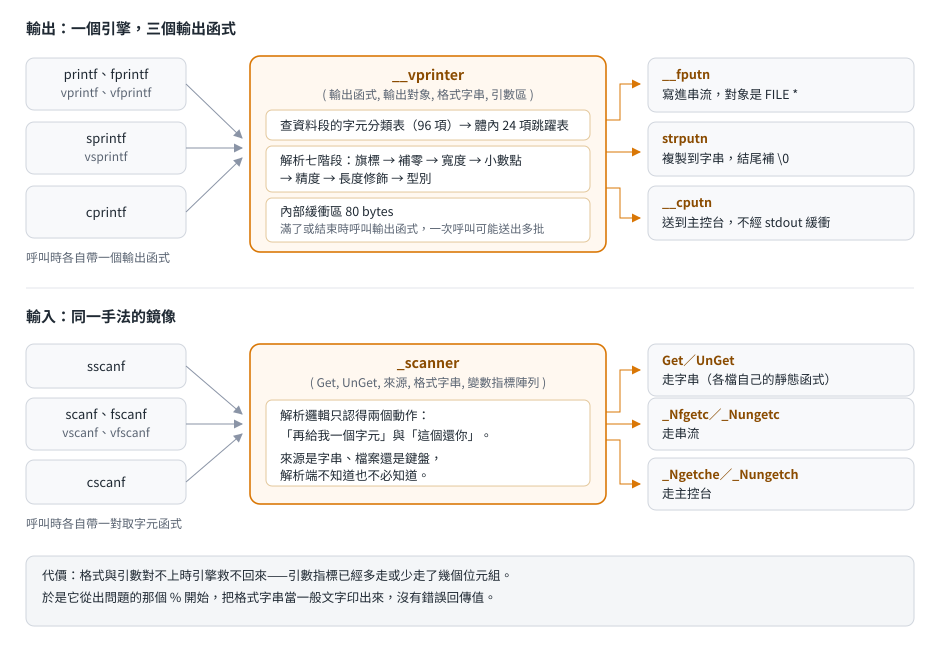
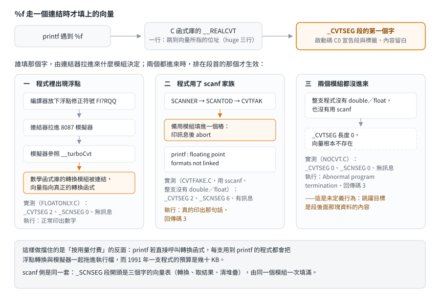

# printf 家族：一個引擎、三個出口，與浮點的連結開關

## 結論

`printf` 家族的十個函式共用同一個格式化引擎 `__vprinter`；差別只在傳給它的「輸出函式」，而輸出函式一共只有三個——
寫進 `FILE` 的 `__fputn`、寫進字串的 `strputn`、送到主控台的 `__cputn`。`scanf` 家族同樣共用一個 `_scanner`，
用「取一個字元／推回一個字元」一對函式指標抽象輸入來源，同樣只有三對。

對 remake 影響最大的幾條行為：

- **`%.0f` 用四捨六入五成雙**：0.5 印 `0`、1.5 印 `2`、2.5 印 `2`、3.5 印 `4`。
- **格式字串寫錯不會報錯**：遇到不認得的轉換，從那個 `%` 開始把格式字串當一般文字印出來。
- **`%s` 收到空指標印 `(null)`**；`%c` 印 0 會把一個 `\0` 寫進輸出。
- **`scanf` 在輸入是空的時候回 −1**（EOF），型別不合才回 0。
- **浮點格式化是連結時才接上的**：`printf` 裡的 `%f` 走一個間接跳躍；程式沒有任何浮點運算時，那個向量可能是空的。
  那句有名的 `printf : floating point formats not linked` 就是備用模組填進去的樁印出來的。

本文的機制來自原始碼與對拍（引用的模組都在「重編後與出貨版逐模組相同」的範圍內，數學函式庫的浮點轉換模組除外），
行為規格來自一支自寫測試程式（[`examples/printf/`](../../examples/printf/)）在五個記憶體模型下、在 dosgolem 裡的實跑結果。

## 根本問題

### 一份格式化程式碼要服務很多出口

`printf` 寫到 `stdout`、`fprintf` 寫到任意 `FILE`、`sprintf` 寫到字串、`cprintf` 寫到螢幕。
格式化的規則完全一樣，但輸出的動作完全不同。當年的記憶體不允許把這段幾百行的程式碼複製四份。

### 格式字串是執行時才看到的

編譯器不檢查格式字串（1991 年沒有這種檢查），引數是用可變參數傳的。函式庫只能在執行時逐字元解析，
一旦發現格式與引數對不上，它已經沒有辦法回頭——引數指標可能已經多走或少走了幾個位元組。

### 浮點轉換很大，而很多程式根本不用

把 `double` 轉成十進位字串要處理指數、精度、進位，程式碼比整數轉換大得多；沒有 8087 的機器還要靠模擬器。
如果 `printf` 直接呼叫它，每支用 `printf` 的程式都會把浮點模擬器與轉換程式一起拖進執行檔。

## 推導

<p align="center"></p>

### 一個引擎、三個輸出函式

`__vprinter` 的參數是「輸出函式、輸出對象、格式字串、引數區」。輸出函式的介面固定：拿一段位元組與長度，
把它送到輸出對象去，並保留 SI、DI 兩個暫存器。引擎內部有一塊 80 bytes 的緩衝區，滿了就呼叫一次輸出函式，
所以一次 `printf` 可能觸發好幾次輸出。

| 呼叫端 | 輸出函式 | 做的事 | 輸出對象 |
|---|---|---|---|
| `printf`、`fprintf`、`vprintf`、`vfprintf` | `__fputn` | 把位元組寫進串流（與 `fwrite` 同一條路徑） | `FILE *` |
| `sprintf`、`vsprintf` | `strputn` | 複製到字串，並在結尾補 `\0` | 指向目的字串指標的指標 |
| `cprintf` | `__cputn` | 送到 conio 的主控台輸出 | 不需要，參數被忽略 |

`printf` 與 `vprintf` 只是把 `stdout` 當成輸出對象傳進去，所以它們與 `fprintf` 共用同一個輸出函式；
十個進入點最後收斂成三條路徑。

`scanf` 側是對稱的：`_scanner` 拿「取一個字元」與「推回一個字元」一對函式指標，也是三組——
`sscanf` 給走字串的一對（定義在那個檔案裡的靜態函式）、`fscanf` 與 `scanf` 給 `_Nfgetc`／`_Nungetc`、
`cscanf` 給 `_Ngetche`／`_Nungetch`。

### 表格驅動的解析

引擎把 `0x20`–`0x7F` 的每個字元先分類（旗標、數字、長度修飾、各種轉換、不管），主迴圈查表跳到對應的處理區塊。
`0x20` 以下與高位元設起來的字元一律歸「不管」類。解析分成七個階段：旗標 → 補零 → 寬度 → 小數點 → 精度 → 長度修飾 → 型別。

支援的語法（原文寫在引擎的說明區塊裡）：

```
%  [旗標]*  [寬度]  [.精度]  [長度修飾]  型別
旗標     - + 空白 # 0
寬度     數字 或 *（由引數給）
精度     .數字 或 .*（由引數給）
長度修飾 l（long）、h（short；也用來表示堆疊上是 4 bytes 的 float）、L（long double）
型別     d i o u x X n f e E g G c s p N F
```

`N`、`F` 是 Borland 的擴充：`%Np` 印 near 指標（四位十六進位）、`%Fp` 印 far 指標（`段:位移`）。

**寫錯格式沒有錯誤回傳。** 引擎認不得某個轉換時，會從引發問題的那個 `%` 開始，把格式字串當一般文字輸出。
理由很實際：引數指標已經對不齊了，繼續解析只會讀到錯誤的資料。

### 浮點轉換的連結開關

<p align="center"></p>

C 函式庫裡的浮點轉換入口 `__REALCVT` 只有一行：跳到一個向量所指的位址。那個向量是 `_CVTSEG` 這個特殊資料段的第一個字，
啟動碼 C0 負責宣告段與標籤，**內容由連結進來的模組決定**：

| 連結進來的模組 | 向量指向 | 什麼時候 |
|---|---|---|
| 數學函式庫的浮點轉換模組 | 真正的轉換函式 | 程式裡有浮點運算：浮點修正符號把模擬器拉進來，模擬器再把轉換模組拉進來 |
| C 函式庫的備用模組 | 印 `printf : floating point formats not linked` 後 `abort` 的樁 | 備用模組被連結時 |
| 都沒有 | 空的（段長度 0） | 程式完全沒有浮點，也沒有拉進備用模組 |

這是「按用量付費」的做法：`printf` 本身不參照真正的轉換函式，所以不用浮點的程式不會把它與模擬器拖進來。
`scanf` 側有同樣的一組（`_SCNSEG` 與 `_ScanTodVector`）。

實測（`.MAP` 檔的段長度與執行檔內容）：

| 程式 | `_CVTSEG` 長度 | 執行檔裡有那句訊息嗎 | 實跑 |
|---|---|---|---|
| 有浮點運算、用 `%f` | 2 bytes | 沒有 | 正常印出數字 |
| 完全沒有浮點運算，把 8 個位元組當兩個 `long` 推給 `%f` | **0 bytes** | 沒有 | 以回傳碼 3 結束、印出 `Abnormal program termination`，**沒有**那句浮點訊息 |

所以「看到那句訊息」代表備用模組被連結了；本 repo 還沒找出 DOS 版函式庫在什麼條件下會拉進它（見未知）。

## 在執行檔裡怎麼認

| 看到 | 推論 |
|---|---|
| 一個大函式，開頭附近有一張 96 bytes 的表，被多個不同的呼叫端以「第一個參數是函式位址」的形式呼叫 | `__vprinter`；那張表是字元分類表 |
| 同一個大函式被多處呼叫，第一個參數只出現三個不同的函式位址 | 那三個位址就是 `__fputn`、`strputn`、`__cputn`；第二個參數是 `FILE *`、字串指標的指標，或被忽略 |
| 呼叫時第二個參數是一個固定的資料位址（`stdout`），其餘欄位與 `fprintf` 的呼叫相同 | `printf`；`stdout` 是 `_streams[1]` 的位址 |
| 一行 `jmp [某個資料位址]` 的函式，被格式化程式碼呼叫 | 浮點轉換的間接入口；那個資料位址就是 `_CVTSEG` 的向量 |
| 資料段裡有 `(null)` 這個字串，附近是格式化程式碼 | `%s` 的空指標輸出 |
| 字串 `printf : floating point formats not linked`（訊息分成兩段：`print` 或 ` scan` 加上共同的後半段） | 備用模組被連結了 |

用 [`signatures/borland-crtl-2.0/dos.json`](../../signatures/borland-crtl-2.0/dos.md) 掃描會命中 `__vprinter`、`__longtoa`、
`_printf`、`_fprintf`、`_sprintf`、`_cprintf`、`_scanf`、`_sscanf`、`_fscanf` 等名稱。

容易誤判的地方：

- **`sprintf` 與 `printf` 的差別只在第一、二個參數**，反組譯時光看呼叫點很容易混。
- **`cprintf` 走 conio，不是 `FILE`**；輸出不受 `stdout` 的緩衝設定影響。
- **看到浮點訊息不代表程式用得到浮點**：那正好是「沒有連結浮點轉換」的證據。

## 給 remake 的行為規格

以下每一條都有實跑支持（`examples/printf`，五個記憶體模型結果相同；`%p` 的預設寬度隨資料指標寬度不同）。

### 整數與字串

| 格式與引數 | 輸出 |
|---|---|
| `%5d`、`%-5d`、`%05d` 對 42 | `   42`、`42   `、`00042` |
| `%.3d` 對 5 | `005` |
| `%.0d` 對 0 | 空字串 |
| `%+d`、`% d` 對 7 | `+7`、` 7` |
| `%#x`、`%#X`、`%#o` 對 255、255、8 | `0xff`、`0XFF`、`010` |
| `%#x` 對 0 | `0`（值是 0 就不加前綴） |
| `%*d` 寬度給 −6、引數 42 | `42    `（負寬度等於靠左） |
| `%.2s` 對 `"abcdef"` | `ab` |
| `%s` 對空指標 | `(null)` |
| `%c` 對 0 | 輸出裡放一個 `\0`（回傳值照算） |
| `%%`、`%5%` | `%`、`%5%`（後者不認得，當字面輸出） |
| `%Fp`、`%Np` | `1234:5678`、`1234` |
| `abc%ndef%n` | 兩個 `%n` 拿到 3 與 6，回傳值 6 |
| 不認得的轉換（`a%qb`） | 原樣輸出 `a%qb`，回傳 4 |
| 格式字串以 `%` 或 `%5` 結尾 | 原樣輸出 |
| `%200d` | 輸出 200 個字元（引擎分多次送出） |

### 浮點

| 格式與引數 | 輸出 |
|---|---|
| `%f` 對 1.5 | `1.500000`（預設精度 6） |
| `%.0f` 對 2.5 | `2` |
| `%.0f` 對 0.5、1.5、2.5、3.5 | `0`、`2`、`2`、`4`（四捨六入五成雙） |
| `%.1f` 對 2.45 | `2.5` |
| `%e` 對 1234.5678 | `1.234568e+03`（指數兩位） |
| `%g` 對 1234.5678、`%.3g` 對同值 | `1234.57`、`1.23e+03` |
| `%g` 對 0.0 | `0` |
| `%.2f` 對 −0.125 | `-0.12` |

### `scanf`

| 格式與輸入 | 回傳值與結果 |
|---|---|
| `%d %d` 對 `"12 34"` | 2；12、34 |
| `%d%s` 對 `"  \t 7abc"` | 2；7、`abc`（`%d` 先跳過空白） |
| `%2d%3d` 對 `"12345"` | 2；12、345 |
| `%d` 對 `"abc"` | 0（型別不合） |
| `%d` 對空字串 | **−1**（EOF） |
| `%x %o %u` 對 `"0x1F 017 99"` | 3；31、15、99 |
| `%5s %s` 對 `"hello world"` | 2；`hello`、`world` |
| `%c%c` 對 `"xy"` | 2；`x`、`y`（`%c` 不跳空白） |
| `%[abc]%s` 對 `"abc123"` | 2；`abc`、`123` |
| `%*d %d` 對 `"42 7"` | 1；7（`%*d` 不計入回傳值） |
| `abc%d` 對 `"zz42"` | 0（字面字元不符） |
| `%lf` 對 `"3.5e2"` | 1；350.0 |
| `%d%n` 對 `"12ab"` | 1；12，`%n` 拿到 2 |

## 證據與未知

| 結論 | 出處 | 等級 |
|---|---|---|
| 十個進入點收斂成三個輸出函式、輸出函式的介面 | RTL 的 `PRINTF.C`、`FPRINTF.C`、`VPRINTF.C`、`VFPRINTF.C`、`SPRINTF.C`、`CPRINTF.C`、`VPRINTER.CAS` | 已證實（原文） |
| 表格驅動的解析、支援的語法、寫錯就當字面輸出 | RTL 的 `VPRINTER.CAS` 說明區塊與程式碼 | 已證實（原文） |
| `scanf` 用 Get／UnGet 一對函式指標，三組來源 | RTL 的 `SCANNER.CAS`、`SSCANF.C`、`FSCANF.C`、`CSCANF.C` | 已證實（原文） |
| 浮點轉換走 `_CVTSEG` 的向量、C 函式庫端只有一行間接跳躍 | RTL 的 `REALCVT.ASM`、`CVTFAK.ASM`、`MATH/REALCVT.CAS`、出貨的 `C0.ASM` | 已證實（原文） |
| `VPRINTER` 模組對外只參照兩個符號 | 拆出貨的 `CS.LIB` 看目的檔的外部符號表 | 已證實（實測） |
| 上述 C 函式庫模組與出貨版相同 | 以原廠工具鏈重編 2,455 次的對拍 | 已證實（對拍） |
| 數學函式庫的浮點轉換與字串轉數字模組 | 重編後與出貨版不同，無法對拍 | 已證實（原文） |
| 行為規格各條 | `examples/printf` × 五個模型，在 dosgolem 執行 | 已證實（實測） |
| 兩種連結情況下 `_CVTSEG` 的長度與執行結果 | 範例的 `.MAP` 與自寫的無浮點程式 | 已證實（實測） |
| 辨識特徵 | 由機制推得，未逐一在第三方程式上驗證 | 強推論 |

未知：

- **DOS 版函式庫在什麼條件下會連結備用模組**，也就是那句 `floating point formats not linked` 的實際觸發條件。
  DOS 版的其他模組都沒有參照它（Windows 版的浮點初始化模組有）；本 repo 的無浮點測試只得到「向量是空的、程式 abort」。
- 沒測：`%Lf`（long double）、`%hf`、huge 模型下 `%p` 的段值規格化、`scanf` 的 `%[^…]` 反向集合與 `%D`／`%O`／`%U`。
- `cprintf` 與 conio 的互動（換行、視窗邊界）留給 conio 那一篇。
- Microsoft C 的對應做法要等 M3。
