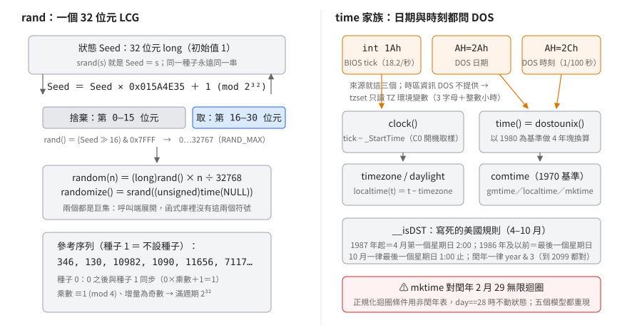

# 亂數與時間：一個 LCG、兩個 DOS 服務、寫死的美國日光節約規則

## 結論

`rand` 是單一 32 位元狀態的線性同餘產生器（LCG）：狀態乘一個固定乘數再加一，輸出取狀態的
第 16–30 位元——不設種子永遠從同一狀態開始，同一種子永遠同一串，remake 照一條式子就能逐值重現。
日期與時刻的讀取全部架在兩個 DOS 服務上（`AH=2Ah` 取日期、`AH=2Ch` 取時刻），
時區沒有資料庫——`tzset` 只剖析 `TZ` 環境變數，日光節約是寫死的美國規則
（還帶著 1986 年美國修法前後的兩套門檻）；最後有一個要記住的陷阱：
**`mktime` 對閏年的 2 月 29 日會無限迴圈**——不是你的程式錯，是這一版 RTL 的 bug，
五個記憶體模型（s／c／m／l／h）都重現。

圖把兩條主線並排：左邊是 `rand` 的狀態更新與位元抽取（含參考序列），
右邊是時間的資料流——三個時鐘來源、四套換算核心、`TZ` 的入口，
以及 `mktime` 那個要避開的 2 月 29 陷阱。

## 根本問題

1980 年代末的 DOS 環境給了這組函式四個約束：

1. **DOS 只給「日曆」不給「時區」。** DOS 用軟體中斷提供服務：`int 21h` 是服務入口、
   `AH` 暫存器放功能編號（下文的 `AH=2Ah`＝取日期、`AH=2Ch`＝取時刻，精確到百分之一秒；
   `CX`／`DX` 這類寫法是 16 位元暫存器）。時區資訊 DOS 一概不提供。沒有時區資料庫、沒有日光節約規則查詢——
   這些「現代作業系統該有的東西」，當年全靠函式庫自己想辦法。
2. **CPU 沒有時計暫存器。** 想量「程式跑了多久」只有 BIOS 的 tick 計數器可讀
   （軟體中斷 `int 1Ah`——這是 BIOS 服務編號，不是 C 的 int；每秒約 18.2 次），
   解析度 54.9 毫秒，而且計的是「午夜之後」，跨午夜要自己補。
3. **`int` 是 16 位元。** 亂數產生器想要長週期就得用 32 位元狀態（`long`），
   輸出再壓進 15 位元塞進 `int`——「狀態比輸出寬」是那個年代的常態設計。
4. **遊戲要的是可重現的「偽」亂數。** `rand` 的價值在於同一個種子永遠同一串；
   沒有設種子就永遠從固定狀態開始。這對 remake 是好消息：行為完全可以照規格重做。

## 推導

### 亂數：狀態 32 位元、輸出 15 位元的 LCG

全部機制一條式子說完：

- 狀態是一個 32 位元 `long`，初始值 **1**。
- `srand(s)`：狀態＝s（`unsigned` 截成 32 位元）。
- `rand()`：狀態＝狀態×**0x015A4E35**＋1（mod 2³²）；回傳**狀態的第 16–30 位元**
  （15 位元，0–32767，`RAND_MAX`＝32767）。

乘數 0x015A4E35（＝22,695,477）滿足「≡1（mod 4）」、增量 1 是奇數——
Hull–Dobell 定理的兩個條件，保證狀態走滿 2³² 週期才重複。
輸出捨棄低位（第 0–15 位元不見了）——一個合理的推斷是避開 LCG 低位規律性最糟的那一段
（原廠沒有寫理由）。不過輸出的最低位（狀態的第 16 位元）依 LCG 低位週期理論
週期只有 2¹⁷（本系列沒有推導驗證，實測只確認 300 步內無 ≤128 週期），
拿它做「擲硬幣」的程式（`rand() & 1`）仍可能踩到規律性。

兩個常被誤會的點：

- **`random(n)` 是巨集不是函式**：定義是 `(long)rand() × n ÷ (RAND_MAX+1)` 的整數除法
  ——用縮放而不是取餘，避免「`rand() % n` 對非 2 的冪的 n 有偏差」這個老問題。
  `n` 大的時候那個乘法會超過 16 位元，編譯器會叫長整數乘法 helper（`LXMUL@`，
  見[編譯器 helper](compiler-helpers.md)）。
- **`randomize()` 也是巨集**：就一句 `srand((unsigned)time(NULL))`。
  種子來源是 DOS 日曆鐘換算的 unix 秒數取低 16 位——所以「同一秒內啟動的兩次執行
  會拿到同一串亂數」在這套實作裡是常態，不是巧合。

### 時間：兩個 DOS 服務撐起整個家族

`time()` 的形狀：`getdate`（`AH=2Ah`）拿年月日、`gettime`（`AH=2Ch`）拿時分秒與百分之一秒，
交給 `dostounix` 換成 unix 秒（自 1970-01-01 GMT 起算的秒數；`time_t` 是 32 位元 `long`）。
換算以 **1980 年（DOS 紀元）為基準**做 4 年一塊的整數算術——3652 天＝1970→1980
（含兩個閏日），之後每 4 年 1461 天。閏年判斷一律 `(year & 3) == 0`：
對 1980–2099 全部正確（2100 年才會錯，超出實用範圍）。
**`time()` 回傳的是 GMT 秒**：`dostounix` 內部先 `tzset`，再把本地牆鐘
依 `timezone` 與日光節約換算成 GMT——改 `TZ` 會改變 `time()` 的回傳值。

轉換層有四套各自實作的核心：`dostounix`／`unixtodos`（1980 基準，服務 `time`／`stime`）、
`comtime`（1970 基準，`gmtime`／`localtime` 共用一個 static `tm`，`ctime` 經由 `localtime`、
`mktime` 成功後也經 `localtime` 回填）、`totalsec`（`mktime` 的數值來源）、
`__DOStimeToU`（DOS 打包的檔案時間戳位元欄位，服務 `getftime`／`setftime` 那條路）；
`asctime`／`strftime` 是純格式化層。四套的閏年規則全是同一個 `year & 3` 的等價形式。

**時區**：`tzset` 找 `TZ` 環境變數，格式只認「3 個字母＋整數小時＋可選 3 個字母的
日光節約名」。`TZ=CCT-8` 會把 `timezone` 設成 −28800（負號＝格林威治以東）；
有第三段（如 `EST5EDT` 的 `EDT`）才把 `daylight` 打開。**壞格式靜默退回預設 EST5EDT**，
不會失敗也不會警告。`timezone` 的語意是「以西的秒數」，所以
`localtime(t)` 內部就是 `t − timezone`。只有整小時偏移——沒有分鐘級的時區。

**日光節約（DST，Daylight Saving Time）**：`__isDST` 判定的窗口是 4–10 月；邊界月的門檻日是某個星期日，
程式裡用「目標日期減自己的星期幾」算出來。關鍵分支：**年份−1970 > 16（即 1987 年起）
用「4 月第一個星期日」；1986 年及以前用「4 月最後一個星期日」**；10 月一律最後一個星期日。
這正對應美國 1986 年立法、1987 年生效的日光節約起日變更——這層對應是外部知識，
程式碼本身只寫了 `> 16` 這個分支。切換時刻：4 月的門檻日 2 點起生效、
10 月的門檻日 1 點前仍生效。**規則完全寫死，只適用美國**；其他時區的使用者
只要 `TZ` 帶了日光節約名，就會被套上這套美國規則。

### clock：BIOS tick 減掉開機取樣

DOS 沒有「這個程序用了多少 CPU 時間」的服務，能讀的只有 BIOS 的 tick 計數器
（`int 1Ah`，回 CX:DX＝午夜後 tick 數，AL＝跨日旗標）。`clock()` 的做法：

1. 進程啟動時，啟動碼（C0）先把 tick 數記在 `_StartTime`（DGROUP 的 4 位元組）。
2. `clock()` 讀 `int 1Ah`；AL 的跨日旗標每次累加進一個靜態位元組，非零就補一天
   的 tick 數（0x1800B0＝1,573,040——BIOS 實際 tick 率比 18.2 略高，
   這個常數才是「一天」的準確 tick 數，`CLK_TCK` 的 18.2 是概數），處理「跑過午夜」的環繞。
3. 回傳「現在 − `_StartTime`」。

所以單位是 **tick**：`CLK_TCK`＝`CLOCKS_PER_SEC`＝**18.2**。
把 `clock()` 的回傳值當毫秒用的移植程式會差 54.9 倍——要除以 18.2。

### mktime：把「人填的欄位」正規化，兩個邊界要注意

`mktime` 的設計是把呼叫端亂填的 `tm`（秒 75、時 25、日 32、日 0⋯）逐層進位
正規化，成功時還回頭把正規化結果（含星期幾、年內第幾天、是否日光節約）
覆寫回呼叫端的結構。規則：

- 年份（−1900）**必須在 70..138**（1970–2038）之間，否則回 -1。
- 換算結果**必須是正的** signed 32 位元——2038-01-19 03:14:07 之後溢位成負數，回 -1。
- 非 2 月 29 的逾界值全部正常正規化（實測：1993-01-32 → 1993-02-01、
  sec=75 → 進一分 15 秒、hour=25 → 隔天 1 點、非閏年 2 月 29 → 3 月 1 日）。

兩個非 ANSI 的行為：

1. **閏年 2 月 29 日（合法日期！）無限迴圈。** 正規化迴圈的條件拿非閏年表
   （2 月＝28 天）判斷「日」是否溢位，但閏年 2 月的分支只處理「日 > 28」；
   剛好 2 月 29（內部日欄位 0 起算，值為 28）時迴圈成立、內部卻不動任何狀態——永遠轉不出來。
   隔一年的「2 月 30」反而正常（正規化成 3 月 1）。五個記憶體模型都重現
   （`examples/randtime` 的 `MKFEB29.C` 用步數上限證明「沒有結束」）。
   remake 只要保證 2 月 29 走另一條路（例如先自己正規化）就行。
2. **日光節約邊界日差一天。** 內部呼叫 `__isDST` 時「日」傳的是 0 起算的值，
   而 `__isDST` 對「月＋日」形式預期 1 起算——多減一次。只影響切換日當天的判定，
   一般輸入看不到。

### 一個 ANSI 差異：asctime 的日子補零

`asctime`／`ctime` 的格式裡「日」用**補零**的兩位（`Fri Jan 01 00:00:00 1993`）；
ANSI C 的樣板是補**空白**（`Fri Jan  1`）。總長度相同（26 bytes），字不同。
`strftime` 的 `%c` 同樣補零，`%x` 卻不補（`Thu Jul 1, 1993`）——同一個函式裡
兩種填法並存，做字串比對的人要注意。

### 工程手法：跨午夜窗口

`time()` 連續問兩個服務（日期、時刻），若剛好跨過午夜，組出來的時間會錯一整天。
`ftime` 對此做了防護：讀日期 → 讀時刻 → **再讀一次日期**，兩次日期不同就重來。
`time()` 自己沒有這層防護——午夜前後各問一次的窗口很小（兩個 `int 21h` 之間），
但存在。這是「知道問題、在重要的地方處理」的取捨範例。

## 在執行檔裡怎麼認

- **符號**：`_rand`、`_srand`、`_time`、`_stime`、`_clock`、`_dostounix`、`_unixtodos`、
  `_tzset`、`__isDST`、`__DOStimeToU`、`_getdate`、`_gettime`、`_localtime`、`_gmtime`、
  `_asctime`、`_ctime`、`_mktime`、`_strftime`、`_ftime`。`_StartTime` 由啟動碼放出、
  map 檔看得到（見[啟動與結束鏈](startup-and-exit.md)的 C0 段）。
- **`random`／`randomize` 不會有符號**——它們是巨集。反組譯指紋：
  原始邏輯裡找不到對應呼叫、卻看到 `call _srand` 前面緊跟著 `call _time`，就是 `randomize()` 展開；`random(n)` 則展開成
  `rand()`＋`LXMUL@`＋除法。
- **`clock` 的呼叫形狀**：`xor ah,ah; int 1Ah` 接著對 `_StartTime` 做 32 位元減法。
- **`time` 的呼叫形狀**：`mov ah,2Ah; int 21h` → `mov ah,2Ch; int 21h` → `call _dostounix`。
- `signatures/borland-crtl-2.0/dos.json` 收了這批的模組簽章（RAND、STIME、CTIME、TIMECVT、
  CLOCK、TZSET、FTIME、GETDATE、SETDATE、DOSTIMU、GETFTIME 等），
  對應符號如 `_rand`、`_srand`、`_tzset`、`__ISDST`、`__DOSTIMETOU`。

## 給 remake 的行為規格

以下每一條都由 `examples/randtime` 的五模型實跑（與 expected 檔逐位元組相同）或
對拍過的原始碼支持；`expected-rand.txt`／`expected-time.txt` 的數值來自一份
照原始碼語意獨立寫的參考模型，不是抄執行輸出。

**rand／srand／random**

- 狀態 `u32`，初始 1。`srand(s)`：狀態＝s。
- `rand()`：`state = (state × 0x015A4E35 + 1) mod 2³²`；輸出 `(state >> 16) & 0x7FFF`。
- 參考序列——種子 1（＝不設種子）：`346, 130, 10982, 1090, 11656, 7117, ...`；
  種子 0：`0, 346, 130, ...`（第一步狀態變 1，之後與種子 1 同步）；種子 2：
  `692, 32682, 21834, ...`。
- `random(n)`＝`floor(rand() × n / 32768)`；`randomize()`＝`srand((unsigned)time(NULL))`。

**time／stime／dostounix／unixtodos**

- `time(NULL)`＝`dostounix(getdate(), gettime())`；無快取，每次都問 DOS。
  回傳值是 **GMT 秒**（本地牆鐘依當下 `TZ` 換算；DST 期間再少一小時），
  所以同一個牆鐘時刻在不同 `TZ` 下 `time()` 回傳值不同。
- `dostounix` 以 1980 為基準；`unixtodos` 是反函數（百分之一秒欄位清 0）。
  參考值：`localtime(725864400)` 讀出 1993-01-01 00:00:00 EST
  （= GMT 值 725,846,400 ＋ 時區 18,000）。
- `stime(t)`＝`unixtodos`＋`setdate`＋`settime`，一律回 0；`setdate`／`settime`
  的 DOS 回傳值被丟棄（呼叫端無法得知失敗）。

**時區／DST**

- 預設（無 TZ 或壞格式）：`timezone`=18000、`daylight`=1、`tzname`={"EST","EDT"}（美東）。
- `TZ` 語法：恰好 3 個字母（大小寫不拘）＋整數小時（`atol` 語意：可帶正負號、可多位數、
  **沒有分鐘**）＋可選的日光節約名（小時之後第一個字母起連續 3 個字母，不足 3 個不算）。
  有日光節約名才 `daylight`=1。
- DST 窗口（僅當 `daylight` 開）：`isdst=1` ⟺ 4 月門檻日（含）之後、10 月門檻日之前；
  門檻日當天只比「時」欄位：4 月門檻日時 ≥2 起、10 月門檻日時 ≤1 止
  （即 10 月門檻日 02:00 起就不算 DST；分與秒不參與判定）。
  門檻日：1987 年起＝4 月第一個星期日；1986 年及以前＝4 月最後一個星期日；
  10 月一律最後一個星期日。
  換算方向：本地→GMT 在 DST 期間多減一小時；GMT→本地在 DST 期間多加一小時。

**clock／ftime**

- `clock()`：tick 數（÷18.2 得秒）；程式剛開始可能回 0。
- `ftime`：`timezone` 以**分鐘**計（18000 秒→300）、`dstflag` 0/1、
  `millitm`＝DOS 百分之一秒×10、`time`＝與 `time()` 同源的秒數。

**mktime**

- 呼叫端的 `tm` 被當成**本地牆鐘**（用當下 `TZ` 換算）：回傳值＝本地秒＋`timezone`
  −（DST 時 3600），即 GMT 秒；`localtime` 回來正好讀回原牆鐘。
- 年份範圍 70..138；結果**必須 > 0**（signed 32 位元；2038-01-19 03:14:07 GMT 界線；
  **結果剛好 0 也回 -1**——`TZ=GMT0` 下 `mktime(1970-01-01 00:00:00)` 回 -1，
  預設 EST 下回 18,000）；逾界回 -1。回 -1 時不覆寫呼叫端結構
  （這一條與「結果 ≤0 回 -1」出自原始碼層閱讀，實跑覆蓋了溢位與 GMT0 兩個 case）。
- 正規化：秒→分→時→日逐層進位；日跨月走月曆迴圈。
- **閏年 2 月 29 日＝無限迴圈，勿傳入**；其餘 2 月輸入：
  非閏年 2 月 29 → 3 月 1；閏年 2 月 30 → 3 月 1。
- 成功時覆寫呼叫端 `tm`（含 `tm_wday`、`tm_yday`、`tm_isdst`∈{0,1}）。

**getdate／gettime／getftime／setftime**

- `getdate`：DOS `AH=2Ah`，結構＝{年(int)、日(char)、月(char)}；`gettime`：`AH=2Ch`，
  結構＝{分、時、百分秒、秒}（欄位順序就是回傳暫存器的位元組序）。
- `getftime`／`setftime`：`AH=57h`，檔案時間戳是 DOS 打包的位元欄位
  （年−1980 用 7 位元、秒以 2 秒為單位用 5 位元）。

## 證據與未知

**已證實（對拍）**：本文全部機制敘述出自 RAND、STIME、CTIME、TIMECVT、FTIME、GETDATE、
CLOCK、TZSET、DOSTIMU、SETDATE、GETFTIME、SETFTIME（CLIB）與 DIFFTIME（MATH）——
這些模組在五個模型的重編對拍中與出貨函式庫逐模組相同（CLIB 2455/2455；
DIFFTIME 不在數學庫對拍失敗的六個模組之列）。

**已證實（實測）**：序列與轉換數值由 `examples/randtime` 在五個模型實跑，
輸出與獨立參考模型產生的 expected 檔逐位元組相同；`mktime` 閏年 2 月 29
的無限迴圈以步數上限重現於五個模型（dosgolem，本系列用於實跑的 DOS 模擬器）；`asctime` 補零、`strftime` 的 `%c`／`%x`
差異、TZ 剖析（含兩種壞格式）都在實跑輸出裡。

**外部知識**：「1986 年立法對應 `year>16` 分支」的歷史對應是外部背景，
程式碼本身只有分支沒有說明。

**未知**：

- `rand() & 1` 的精確低位週期只實測了「300 步內無 ≤128 週期」，
  理論值（狀態第 16 位元週期 2¹⁷）沒有推導到底。
- `mktime` 的 DST 邊界日 off-by-one 只在原始碼層確認（未實測切換日當天的值）。
- Windows 版函式庫（C0W 一族）的 `clock`／`time` 走哪條路沒有讀。
- `setdate`／`settime`／`setftime` 的「寫入」面：dosgolem 不落地（素材唯讀原則），
  實測只及於「服務被呼叫、參數正確、回傳成功」；真機上的 DOS 回傳語意
  （無效日期回 AL=FFh 等）以服務編號層級的文件為準。
