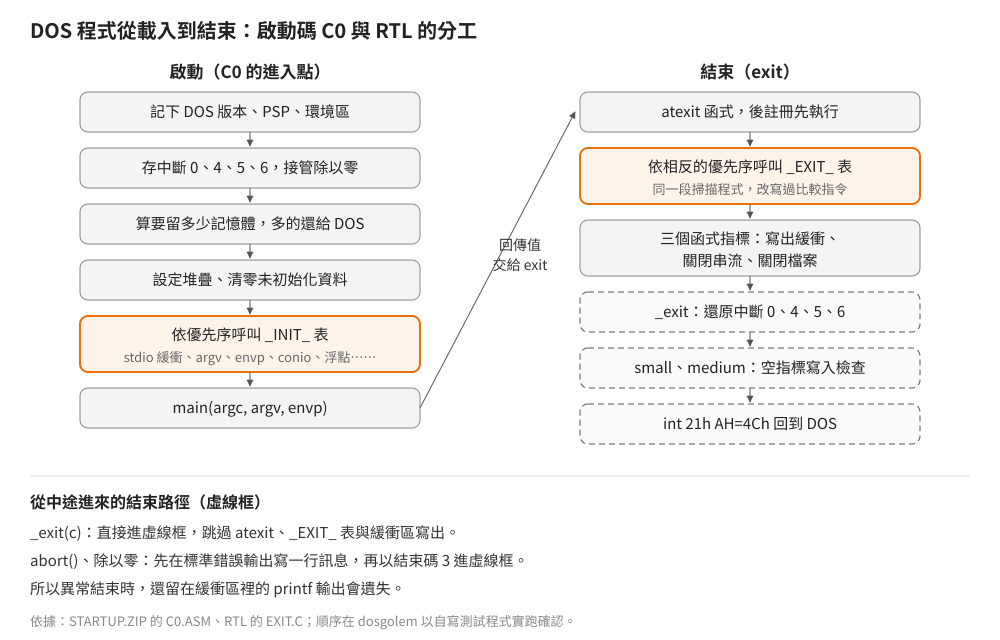
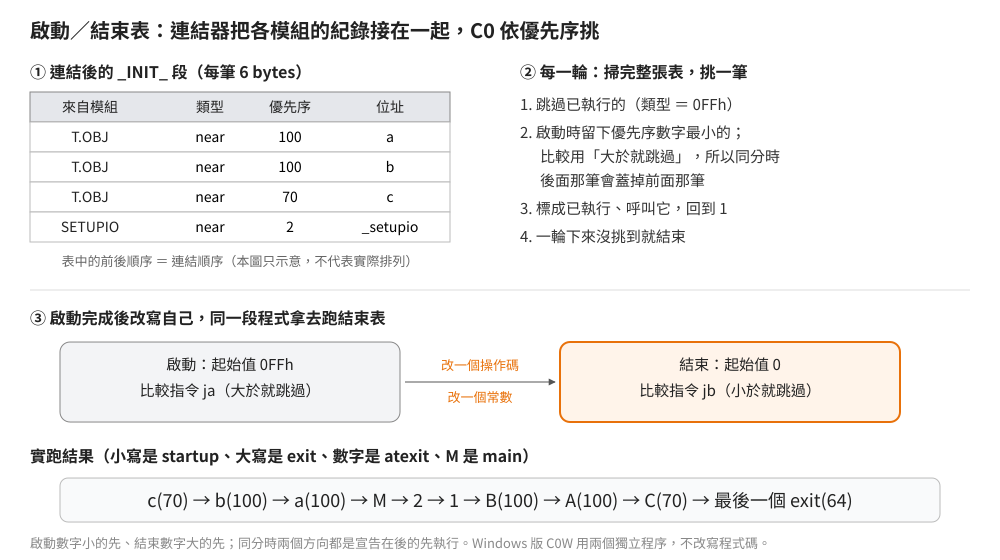

# 啟動與結束鏈：從載入到 main、從 exit 回到 DOS

## 結論

Borland C++ 2.0 的 DOS 程式不是從 `main` 開始執行，而是從啟動碼（C0，每個記憶體模型一個目的檔，例如 small 的 `C0S.OBJ`）開始。
C0 處理 DOS 交給程式的記憶體、堆疊、中斷向量，再呼叫一張**初始化表**上登記的函式，最後才呼叫 `main`。
`main` 返回後，`exit` 倒序呼叫 `atexit` 函式、呼叫**結束表**上的函式、寫出緩衝區並關閉檔案，最後還原中斷向量、回到 DOS。

這套設計有兩個重點：

- **模組自己報到。** 需要初始化的模組（stdio、命令列解析、conio——`getch`、`clrscr` 這類直接操作文字畫面與鍵盤的主控台函式、浮點）在自己的目的檔裡放一筆表格紀錄，
  連結器把所有被連結進來的模組的紀錄接成一張表。沒用到的模組不會被連結，也就不在表裡。
- **用到才付費。** 關閉串流、關閉檔案的程式碼透過預設指向空函式的函式指標呼叫；
  只有程式真的用了 `fopen`、`creat` 這些函式，對應的清理程式碼才會被連結進來。

啟動碼的原始檔 `C0.ASM`、`C0W.ASM` 隨編譯器套件的 `STARTUP.ZIP` 出貨，依同一個封存裡的建置批次檔組譯出的 20 個目的檔與出貨版全部相同。
執行順序另以自寫測試程式在 dosgolem 實跑確認（[`examples/startup/`](../../examples/startup/)）。

## 根本問題

- **C 要求 `main` 之前一切就緒。** `argc`、`argv` 要解析好，`stdin`、`stdout` 要能用；`exit` 時緩衝區要寫出、檔案要關好。
- **函式庫只連結用到的部分。** 如果啟動碼直接呼叫「初始化 stdio」「初始化 conio」，連結器就得把這些模組全部拉進來，
  一支只呼叫 `puts` 的程式也會帶著整個 conio。需要一種不指名道姓的初始化方式。
- **DOS 把記憶體整塊交給程式。** DOS 載入程式時通常把剩下的記憶體全部給它；程式不還回去，
  之後就沒有記憶體可以執行子程式（`system`、`exec`）或讓常駐程式使用。
- **中斷向量是全系統共用的。** 程式若接管除以零、溢位這類中斷（例如透過 `signal`），結束時必須還原；
  否則之後觸發中斷時會跳到已經不存在的程式碼。

## 推導

### C0 在 main 之前做的事

程式剛被 DOS 載入時，DS 與 ES 指向 PSP（DOS 放在程式前面的 256 bytes 控制區，含命令列、環境區的位置、記憶體上限）。
C0 依序：

1. **記下基本資訊。** 以 DOS 功能 30h（`int 21h`、AH=30h）取版本；從 PSP 讀出記憶體上限（PSP 位移 0002h）與環境區的段值（位移 002Ch）；存到 `_version`、`_psp`、`_envseg` 等變數。
   這是唯一還能直接讀到 PSP 的時機，之後 DS 就換成程式自己的資料段。
2. **接管中斷。** 存下中斷 0（除以零）、4（`INTO` 指令的溢位）、5（`BOUND` 指令的越界）、6（非法指令）的原始向量，把中斷 0 換成自己的處理程序。
   這四個是 `signal` 可能改動的中斷（分別對應 `SIGFPE`、`SIGFPE`、`SIGSEGV`、`SIGILL`），結束時會照存下的值還原。
3. **量環境區。** 掃描環境變數的個數與總長度，超過 32 KB 視為環境損壞，直接中止程式。
4. **決定保留多少記憶體。** 需要的大小是堆疊（`_stklen`，小於 512 bytes 時改成 512；原始碼在定義 `__NOFLOAT__` 時改用 256，但出貨的 20 個啟動碼都沒有帶這個定義）加上 near 資料模型的 heap（`_heaplen`）；
   不夠就中止。near 資料模型在 `_stklen` 或 `_heaplen` 設為 0 時，資料段直接擴充到 64 KB。
   接著以 DOS 功能 4Ah 把多的記憶體還給 DOS，並設定 far heap 的起點。
5. **設定堆疊。** 關中斷、設 SS 與 SP、開中斷。原文註解寫明關中斷是為了 1983 年以前的 8088／8086：
   那些處理器在改 SS 之後不會自動延後一個指令才接受中斷，SS 已改、SP 還沒改的那一瞬間被中斷會把資料推到錯的地方。
6. **清零未初始化資料。** 以 `rep stosb`（把 AL 的值逐一存進 ES:DI 並遞增 DI，重複 CX 次）把 `_BSS` 段清成 0（huge 模型沒有 `_BSS`，見[記憶體模型](memory-model-macros.md)）。
7. **記下起始時間。** 以 BIOS 功能 1Ah 讀開機以來的時鐘刻度，`clock()` 以此為起點。
8. **呼叫初始化表**，再呼叫 `main(argc, argv, envp)`，把回傳值交給 `exit`。

`argc`、`argv`、`envp` 不是 C0 自己算的。它們由 `_setargv`、`_setenvp` 兩個模組透過初始化表在第 8 步之前填好。
`_setargv` 是函式名，所在的模組是 `SETARGV`；`__setargv__` 則是刻意取的另一個符號，只用來讓別的目的檔參照、逼連結器把 `SETARGV` 拉進來，本身不是函式。
這兩個模組是否被連結，取決於 `main` 的寫法：BCC 編譯 `main(int argc, char **argv)` 時會在目的檔裡加一個對 `__setargv__` 的外部參照，
有第三個參數 `envp` 時再加 `__setenvp__`；`main(void)` 兩個都不參照。所以不需要命令列的程式不會帶著命令列解析的程式碼（已實際編譯確認）。

### 初始化表與結束表

每筆紀錄 6 bytes：

| 位移 | 大小 | 內容 |
|---|---|---|
| 0 | 1 | 呼叫類型：0 為 near 呼叫、1 為 far 呼叫、0FFh 表示已執行 |
| 1 | 1 | 優先序：0 最優先、0FFh 最後；原文註解寫 0～63 保留給 Borland |
| 2 | 2 | 函式的位移 |
| 4 | 2 | 函式的段（near 呼叫時不用） |

模組把紀錄放在名為 `_INIT_`（初始化）或 `_EXIT_`（結束）的段裡；C 程式寫 `#pragma startup 函式名 優先序`、`#pragma exit 函式名 優先序`，
編譯器就產生這樣一筆紀錄。連結器把所有模組的同名段依連結順序接在一起。C0 在這一段的前後各放一個標籤（C0 內部的名稱是 `InitStart`、`InitEnd`，結束表是 `ExitStart`、`ExitEnd`，不是公開符號），
表的範圍就是兩個標籤之間，掃描表格的程式不需要知道表裡有幾筆、是誰放的。

C0 挑選的方法：

1. 從頭到尾掃一遍，跳過已執行的，留下優先序數字最小的一筆。比較的寫法是「數字大於目前最小值就跳過」，
   所以數字相同時，後掃到的那筆會取代先前那筆：**同優先序時，表中較後面的先執行**。
2. 把那一筆標成已執行，呼叫它，回到第 1 步。
3. 一遍掃下來沒有可挑的就結束。

每輪都掃完整張表，筆數是 n 時要掃 n² 次；表通常只有個位數筆，這樣換來的是程式碼極短。

**結束表用同一段程式。** 初始化表跑完後，C0 改寫自己的兩個 byte：把比較後的條件跳躍從「大於就跳過」（`ja`）改成「小於就跳過」（`jb`），
把起始比較值從 0FFh 改成 0。同一段程式於是變成「每次挑數字最大的」。原文註解說明這樣做是為了省空間。
初始化表與結束表是兩份獨立的登記，但同一個模組通常在兩張表用同一個優先序（例如浮點初始化、iostream 都是 16）；
初始化挑最小、結束挑最大，兩者互為鏡像，這類模組就自動變成「越早初始化的越晚清理」。
改寫發生在初始化表跑完、呼叫 `main` 之前；之後不會再用到初始化的挑選方式，所以一次改好就行。
Windows 版的啟動碼 `C0W.ASM` 則寫成兩個獨立的程序，不改寫程式碼（強推論：Windows 保護模式下的程式碼段不能寫入，這個技巧在那裡不可行）。

以自寫測試程式實跑（五個記憶體模型結果相同）：兩個優先序 100、一個 70 的 `#pragma startup`，兩個 100、一個 70、一個 64 的 `#pragma exit`，
`main` 裡兩次 `atexit`。執行順序是：

startup 70 → startup 100（後宣告）→ startup 100（先宣告）→ `main` → 後註冊的 `atexit` → 先註冊的 `atexit` → exit 100（後宣告）→ exit 100（先宣告）→ exit 70 → exit 64

### RTL 自己登記的項目

| 模組 | 表 | 優先序 | 做什麼 | 什麼時候被連結 |
|---|---|---|---|---|
| `WILDARGS` | 初始化 | 1 | 解析命令列並展開 `*`、`?` 萬用字元 | 使用者明確把 `WILDARGS.OBJ` 加進連結；它同時滿足 `__setargv__` 的參照，一般的命令列解析就不會被連結 |
| `SETUPIO` | 初始化 | 2 | 設定 `stdin`、`stdout` 的緩衝方式 | 一律：C0 另外直接參照它，保證每支程式都連結（這與「掃描表格時不必知道表裡有誰」是兩件事） |
| `SETARGV` | 初始化 | 16 | 解析命令列，填 `argc`、`argv` | `main` 有 `argv` 參數時 |
| `SETENVP` | 初始化 | 16 | 建立 `envp` 陣列 | `main` 有 `envp` 參數時 |
| `CRTINIT` | 初始化 | 16 | 讀目前的顯示模式與文字屬性，初始化 conio | 程式用了任何 conio 函式時：各 conio 模組參照 `__turboCrt` 或 `_video`，這兩個符號定義在 `CRTINIT` |
| 浮點初始化 | 初始化與結束 | 16 | 偵測數學輔助處理器、設定模擬器 | 程式用了浮點時（模擬器本體不在授權的原始碼內） |
| iostream | 初始化與結束 | 16 | C++ 標準串流物件的建立與清除 | 程式用了 iostream 時 |

`SETUPIO` 的緩衝規則：`stdin` 若是終端機設成行緩衝，`stdout` 若是終端機設成**不緩衝**；
被轉向到檔案或管線時兩者都完全緩衝，緩衝區大小為 `BUFSIZ`。

### exit、_exit、abort

`exit(c)` 的實作只有兩步：倒序呼叫 `atexit` 表（最多 32 個，滿了 `atexit` 回傳非 0），再呼叫 C0 的 `_exitclean`。
`_exitclean`（C0 以組語寫成，連結後的符號名稱多一個底線，是 `__exitclean`）跑結束表、呼叫三個清理函式指標，**沒有返回指令，直接往下執行進入 `_exit`**。

| 結束方式 | `atexit` 函式 | 結束表 | 寫出緩衝、關閉串流與檔案 | 還原中斷向量 | 空指標寫入檢查 | 結束碼 |
|---|---|---|---|---|---|---|
| `main` 返回、`exit(c)` | 執行 | 執行 | 執行 | 執行 | small、medium 執行 | 回傳值或 `c` |
| `_exit(c)` | — | — | — | 執行 | small、medium 執行 | `c` |
| `abort()` | — | — | — | 執行 | small、medium 執行 | 3，先在標準錯誤輸出寫 `Abnormal program termination` |
| 除以零 | — | — | — | 執行 | small、medium 執行 | 3，先在標準錯誤輸出寫 `Divide error` |

`stdout` 轉向到檔案時是完全緩衝（見上一節），而異常結束不寫出緩衝區，所以緩衝區裡還沒寫出的 `printf` 輸出會整段遺失。

三個清理函式指標初值都指向一個什麼都不做的函式：

| 指標 | 誰把它改掉 | 改成 |
|---|---|---|
| `_exitbuf` | `setvbuf`（`SETUPIO` 初始化時就會呼叫，所以實際上一定被設定） | 寫出所有串流的緩衝區 |
| `_exitfopen` | `fopen` | 關閉所有 `fopen` 開的串流 |
| `_exitopen` | `creat`、`dup`、`dup2`（原始碼裡找到的三處） | 關閉所有低階檔案代號 |

`system` 與 `exec` 系列在執行子程式前也會呼叫 `_exitbuf`，先把緩衝區寫出（強推論：避免父程式先前的輸出排到子程式的輸出之後）。

### 空指標寫入檢查

small、medium 模型中，C0 的資料段開頭是 4 個 0 位元組，後面接著版權字串。這一塊位在 DS:0000，
也就是 near 空指標指向的地方。`_exit` 計算這一塊所有位元組的和，與組譯時算好的常數比較，不同就在標準錯誤輸出寫 `Null pointer assignment`。

- 只報告、不改結束碼。
- 只抓得到「經由空指標寫到資料段開頭附近」的錯誤，而且要到程式結束才知道。
- 原文以條件組譯排除 tiny、compact、large、huge。可能的原因（強推論）：tiny 的程式碼與資料同段，DS:0000 不是這一塊；far 資料模型的空指標指向 `0000:0000` 的中斷向量表，不在程式的資料段裡。

### Windows 版（C0W）

| DOS（C0） | Windows 3.x（C0W） |
|---|---|
| 自己從 PSP 取資訊、決定記憶體、設堆疊 | 呼叫系統核心的 `INITTASK`，由它設好暫存器與堆疊，並傳回命令列、`hInstance`、`hPrevInstance`、`nCmdShow` |
| — | near 資料模型以 `LOCKSEGMENT(-1)` 鎖住資料段，結束前解鎖 |
| — | 呼叫 `WAITEVENT(0)`、`INITAPP(hInstance)`，失敗就以結束碼 0FFh 結束 |
| — | 以 `GETWINFLAGS` 判斷是否在保護模式、有沒有數學輔助處理器 |
| 呼叫 `main(argc, argv, envp)` | 呼叫 `WinMain(hInstance, hPrevInstance, lpCmdLine, nCmdShow)` |
| 還原中斷向量、空指標檢查 | 都沒有 |
| 資料段開頭是 4 個 0 位元組與版權字串 | 資料段開頭是 16 bytes 的保留區，版權字串在別處 |
| — | 公開 `__acrtused` 這個名稱，原文註解說是暫時為了與 Microsoft 相容 |

- near 資料模型要鎖住資料段，可能的原因（強推論）：Windows 記憶體管理可以搬動資料段，near 指標只存位移、不存段值，
  段一搬走，程式記在暫存器與變數裡的段值就失效。
- `__acrtused` 是 Microsoft C 啟動碼的符號，Microsoft 格式的目的檔會參照它；提供這個名稱讓那些目的檔也能連結（強推論）。

Windows DLL 用的 `C0D.ASM` 本文沒有分析。

### 與 Microsoft C 的比較

Visual C++ 1.0 的 16 位元 CRT 原始碼也有 DOS 與 Windows 各自的啟動碼（`STARTUP/DOS/CRT0.ASM`、`STARTUP/WINDOWS/CRT0.ASM`），但本知識庫還沒讀它、也還沒取得 Visual C++ 1.0 的工具鏈，無法對拍；
兩家的比較留待 Microsoft CRT 的研究完成後補上（見 `PLAN.md`）。

## 在執行檔裡怎麼認

| 看到 | 身分 |
|---|---|
| 進入點附近：DOS 功能 30h；讀 `[0002h]`、`[002Ch]`；四次 DOS 功能 35h（中斷 00、04、05、06）；一次功能 2500h | DOS 版 C0 的開頭 |
| 以 `mov cx,7FFFh` 搭配 `repnz scasb` 掃描環境區 | C0 量環境區 |
| 一個迴圈每次加 6 走訪一段記憶體，比較第 0 個 byte 是否 0FFh、第 1 個 byte 的大小，最後把第 0 個 byte 設成 0FFh 再 `call word ptr`／`call dword ptr` | 初始化表／結束表的掃描程式；它的起點位址就是表的開頭 |
| 對 `cs:` 某處寫入 `72h`（`jb` 的操作碼） | C0 在呼叫 `main` 之前把掃描程式改成結束模式 |
| 一律推入三個參數（near 資料模型 3 個字；far 資料模型的 `envp`、`argv` 各 4 bytes，共 5 個字）後的 `call`，接著 `push ax`、`call` | 呼叫 `main`、再呼叫 `exit`；不論 `main` 宣告了幾個參數都一樣 |
| 字串 `Null pointer assignment`、`Divide error`、`Abnormal program termination` 放在一起，前面是 `Borland C++ - Copyright 1991 Borland Intl.` | C0 的資料區；small、medium 才有第一個字串 |
| 進入點第一個 far 呼叫是 `INITTASK` | Windows 版 C0W |

找 `main` 最快的方式：從程式進入點往下，找到改寫 `72h` 的那一行之後的第一個 `call`。

## 給 remake 的行為規格

- **初始化與結束順序**：初始化時優先序數字小的先執行，結束時數字大的先執行；同優先序時，兩個方向都是連結順序較後的先執行。
- **`atexit`**：最多 32 個，後註冊先執行，全部在 `#pragma exit` 函式之前執行。
- **`exit` 之後**：`atexit` 函式 → `#pragma exit` 函式 → 寫出所有緩衝區 → 關閉 `fopen` 的串流 → 關閉低階檔案 → 還原中斷向量 → 空指標檢查（small、medium）→ 結束。
- **`stdout` 的緩衝**：輸出到終端機時不緩衝；轉向到檔案或管線時完全緩衝，要到緩衝區滿、`fflush` 或正常結束才寫出。
- **異常結束**（`abort`、除以零）：訊息寫到標準錯誤輸出，結束碼 3，不寫出緩衝區。轉向到檔案的 `printf` 輸出因此可能整段遺失。
- **堆疊大小**：`_stklen` 小於 512 bytes 時，出貨的啟動碼改用 512。

## 證據與未知

| 結論 | 出處 | 等級 |
|---|---|---|
| C0 的各步驟、表格式、挑選演算法、改寫程式碼 | 編譯器套件 `STARTUP.ZIP` 的 `C0.ASM` | 已證實（原文） |
| 啟動碼原始檔與出貨的 20 個 `C0*.OBJ` 相同 | 以 `BUILD-C0.BAT` 在 dosgolem 組譯後比對 | 已證實（對拍） |
| 初始化、結束、`atexit` 的執行順序（含同優先序） | `examples/startup/` 在五個記憶體模型 實跑 | 已證實（實跑） |
| `main` 的參數決定是否連結 `SETARGV`、`SETENVP` | 編譯三種 `main` 寫法後檢查目的檔的外部參照；`SETARGV.ASM` 原文註解 | 已證實（實跑＋原文） |
| RTL 登記的表項與優先序 | RTL 的 `SETUPIO.C`、`SETARGV.ASM`、`SETENVP.ASM`、`WILDARGS.ASM`、`CRTINIT.CAS`、`EMU/FPINIT.ASM`、`IOSTSTD.CPP` | 已證實（原文） |
| `exit` 的步驟、三個清理函式指標與設定它們的函式；`system`、`exec` 先寫出緩衝區 | RTL 的 `EXIT.C`、`ATEXIT.C`、`SETVBUF.C`、`FOPEN.C`、`CREAT.CAS`、`DUP2.CAS`、`LOADPROG.C`、`SYSTEM.C` | 已證實（原文） |
| 除以零的訊息、結束碼、不寫出緩衝區 | `C0.ASM` 原文；自寫程式實跑 | 已證實（原文＋實跑） |
| `abort` 的訊息與結束碼、空指標檢查 | `C0.ASM` | 已證實（原文），未實跑 |
| Windows C0W 的流程 | `STARTUP.ZIP` 的 `C0W.ASM` | 已證實（原文） |
| C0W 不改寫程式碼、near 資料模型鎖定資料段、`__acrtused` 的原因 | 由 Windows 的記憶體管理推得 | 強推論 |

尚未查證：

- 同優先序的 RTL 模組（例如 `SETARGV` 與 `CRTINIT` 都是 16）實際的連結順序，取決於 TLINK 從各 `.LIB` 拉模組的順序。
- Windows DLL 的啟動碼 `C0D.ASM`。
- 浮點初始化與結束函式的內容（8087 模擬器原始碼不在授權內）。
- 與 Microsoft C 1.0 啟動碼的比較。
