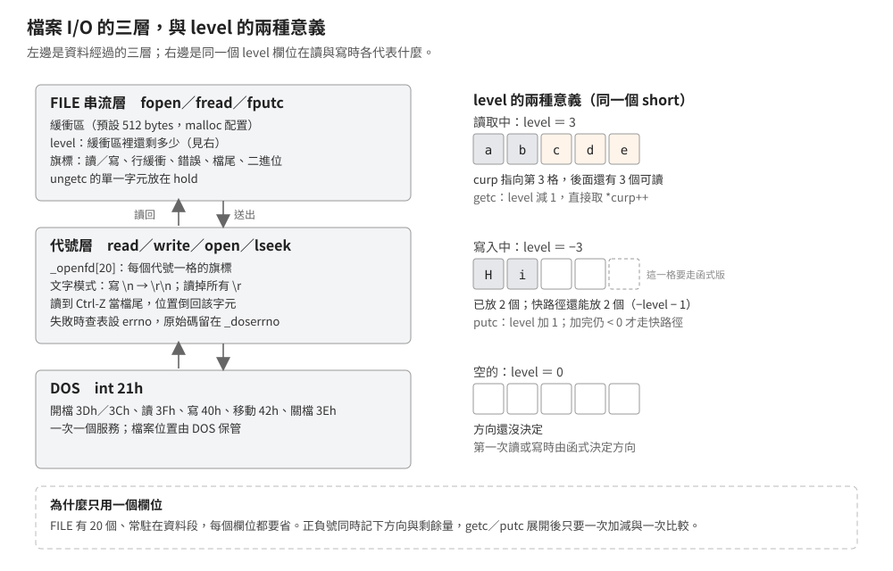

# 檔案 I/O：FILE、緩衝區、文字模式與錯誤碼

## 結論

Borland C++ 2.0 的檔案 I/O 分三層：`FILE` 串流層負責緩衝與旗標，代號層（`read`、`write`）負責文字模式的
CR／LF 轉換與錯誤碼，最底下是 DOS 的 `int 21h`。remake 最容易踩到的是中間那層：

- **文字模式讀取會丟掉檔案裡所有的 `\r`**，不只是 `\r\n` 的那一個；讀到 `1Ah`（`Ctrl-Z`）就當檔尾，並把檔案位置停在那個字元。
- **文字模式寫入把每個 `\n` 變成 `\r\n`**，`ftell` 回報的是轉換後、檔案裡的位置。
- **`"a"` 模式開檔後位置是 0，但任何寫入都落在檔尾**，`fseek` 不影響寫入位置。
- 檔案預設全緩衝、緩衝區 512 bytes；`stdout` 接終端機時不緩衝，被轉向到檔案時全緩衝——這就是程式當掉時輸出整段消失的原因。
- `fopen` 的模式字串不合法時只回 `NULL`，**不設 `errno`**；低階 `read` 用沒開過的代號會回 0 而不是 −1。

這些結論來自原始碼、對拍（本文引用的模組都在「重編後與出貨版逐模組相同」的範圍內），
以及一支自寫測試程式（[`examples/stdio/`](../../examples/stdio/)）在五個記憶體模型下、在 dosgolem 裡實跑的結果。

## 根本問題

### DOS 的檔案服務一次只做一件事

DOS 的 `int 21h` 提供的是「開檔、讀 N 個位元組、寫 N 個位元組、移動位置、關檔」。每一次呼叫都要切到 DOS、
可能碰硬碟。程式如果每印一個字元就呼叫一次，速度會慢到不能用。C 函式庫的解法是在使用者這邊放一塊緩衝區，
累積到一定量再送出去——代價是「寫進去」與「真的在檔案裡」變成兩件事。

### 文字檔在 DOS 是 `\r\n`，在 C 是 `\n`

C 語言規定換行是一個 `\n`；DOS 的文字檔慣例是 `\r\n` 兩個位元組，檔尾還可能有一個 `Ctrl-Z`
（CP/M 時代用來標記檔案結束：那時的檔案長度只能是 128 bytes 的倍數，最後一塊的尾巴是填充，真正的結尾要靠檔案內容裡的這個字元自己標出來）。
函式庫要嘛讓程式自己處理，要嘛在讀寫時翻譯。Borland 選擇翻譯，而且放在代號層——這樣 `FILE` 層與直接用代號的程式都適用。

### 記憶體很小，`FILE` 要塞得下 20 個

`_streams` 是靜態陣列，開機就存在。20 個 `FILE` 每個 16 bytes（far 資料模型 20 bytes），
加上每個開啟的串流各 512 bytes 緩衝區——緩衝區用 `malloc` 動態配置，而 `FILE` 本身要小。
所以 `FILE` 裡沒有「讀寫方向」「還剩幾個位元組」兩個欄位，而是用**一個有號數**同時表達。

## 推導

### `FILE` 的欄位

| 欄位 | 大小 | 意思 |
|---|---|---|
| `level` | 2 | 雙向計數器，見下 |
| `flags` | 2 | 讀／寫、緩衝方式、錯誤、檔尾、二進位、方向、是不是終端機 |
| `fd` | 1 | DOS 檔案代號；沒在用的串流是 −1 |
| `hold` | 1 | 沒有緩衝區時，`ungetc` 推回的字元放這裡 |
| `bsize` | 2 | 緩衝區大小，0 表示不緩衝 |
| `buffer`、`curp` | 各 2 或 4 | 緩衝區起點與目前位置 |
| `istemp` | 2 | `tmpfile` 建立的暫存檔標記 |
| `token` | 2 | 自我檢查：值等於這個 `FILE` 自己的位址低位字 |

`sizeof(FILE)` 在 small、medium 是 16，在 compact、large、huge 是 20（兩個指標各多 2 bytes）——實測結果。
`token` 讓 `setvbuf`、`fflush` 可以拒絕一個沒開過或被覆寫的 `FILE`。

**`level` 的兩種意義**是這個設計的核心：

| `level` | 意思 | `getc`／`putc` 巨集怎麼用 |
|---|---|---|
| > 0 | 緩衝區裡還有這麼多位元組可讀 | `getc` 先減一，減完仍 ≥ 0 就直接取 `*curp++` |
| < 0 | 緩衝區還能用快路徑放 `−level − 1` 個位元組 | `putc` 先加一，加完仍 < 0 才直接寫 `*curp++`；正好填到最後一格時會落到函式版 |
| ＝ 0 | 空的，方向未定 | 兩個巨集都會落到函式版，由函式決定方向 |

`getc`、`putc` 是巨集，快路徑完全不呼叫函式；只有緩衝區用完才進 `_fgetc`／`_fputc`，
它們把巨集動過的 `level` 調回來，再做真正的填充或寫出。反組譯時看到「先加減一個記憶體位置、再比較、才決定要不要呼叫函式」
的樣板，就是這兩個巨集。

### 緩衝方式是誰決定的

| 串流 | 決定的地方 | 結果 |
|---|---|---|
| `fopen` 開的檔案 | `fopen` | 終端機（用 `isatty` 判斷這個代號是不是連著終端機）→ 行緩衝；其餘 → 全緩衝，512 bytes |
| `stdin` | 啟動碼的 `_setupio`（優先序 2 的初始化函式，見[啟動與結束鏈](startup-and-exit.md)） | 終端機 → 行緩衝；被轉向 → 全緩衝 |
| `stdout` | 同上 | 終端機 → **不緩衝**；被轉向 → 全緩衝 |
| `stderr` | 靜態初值 | 不緩衝 |

緩衝區由 `malloc` 配置（`setvbuf` 的 `buf` 給 `NULL` 時），配置不到就關檔、`fopen` 回 `NULL`。
自己給緩衝區時，那塊記憶體必須活得比串流久——這是當年常見的當機原因（把緩衝區宣告成區域變數）。

行緩衝的判斷在寫入時做：寫進去的字元是 `\n` 或 `\r` 就立刻 `fflush`。

### 文字模式的轉換在代號層

`read` 與 `write` 各有一個文字模式分支，看的是 `_openfd[]`（每個代號一格的旗標表，共 20 格）裡的 `O_TEXT`／`O_BINARY`：

- **寫入**：用一塊 129 bytes 的區域緩衝，逐字元複製，遇 `\n` 先放一個 `\r`；滿 128 bytes 就送一次 DOS 寫入。
  回傳值是「呼叫端給的位元組數」，不是實際寫進檔案的數量。
- **讀取**：先跟 DOS 要資料，再就地把所有 `\r` 壓掉。壓縮後若長度變成 0（整段都是 `\r`），會再讀一次。
  遇到 `Ctrl-Z` 就停：把檔案位置倒回那個字元，替該代號設一個「已到檔尾」的旗標，之後再讀都回 0。寫入會清掉這個旗標。

**孤立的 `\r` 也會被丟掉**，不論後面接的是不是 `\n`。存檔格式如果把 `\r` 當資料用，一定要用二進位模式開檔。

`O_TEXT` 與 `O_BINARY` 都沒寫在模式字串裡時，看全域變數 `_fmode`，出貨的預設值是文字模式。

### `ftell` 怎麼在有緩衝區的情況下答對

DOS 那邊的檔案位置只到「已經送出或讀進來的量」，緩衝區裡還有一段沒消化。`ftell` 的做法是：

1. 問 DOS 目前的位置。
2. 算出緩衝區裡未消化的位元組數：寫入方向是「緩衝區大小 ＋ `level` ＋ 1」，讀取方向是 `level` 的絕對值。
3. **文字模式再掃一次緩衝區**，每看到一個 `\n` 就加 1——因為那個 `\n` 在檔案裡占兩個位元組。
4. 把第 2、3 步相加當成補償值：**檔案位置 ＝ DOS 位置 ＋ 補償值（寫入方向）或 − 補償值（讀取方向）**。

例：文字模式寫 `"12\n"` 之後還沒 `fflush`，DOS 位置是 0、緩衝區裡未消化 3 bytes、其中一個 `\n` 再加 1，`ftell` 得到 4——正好是資料寫出去之後檔案的長度。

`fseek` 的流程不同：它一開始就無條件 `fflush`，所以寫入方向的資料已經送出去、DOS 的位置也同步了；
只有讀取方向還可能留著預讀的資料，那時 `SEEK_CUR` 才會先減掉同一個補償值再交給 `lseek`。之後清掉方向與檔尾旗標、把緩衝區歸零。
（`ftell` 不 `fflush`，所以它得自己處理讀與寫兩個方向。）
所以**在文字模式下，`ftell` 回報的數字可以拿去 `fseek`，但不能拿來當「讀了幾個字元」**。

### 錯誤碼

DOS 的服務用進位旗標回報失敗、`AX` 放 DOS 錯誤碼。函式庫的 `__IOerror` 把它查一張表轉成 `errno`，
同時把原始碼留在 `_doserrno`，回傳 −1。常見的幾個：

| DOS 錯誤碼 | `errno` 符號 | Borland 標頭裡的值 | 什麼時候 |
|---|---|---:|---|
| 2、3 | `ENOENT` | 2 | 檔案或路徑找不到 |
| 4 | `EMFILE` | 4 | 開太多檔 |
| 5、16、32、33 | `EACCES` | 5 | 存取被拒：唯讀屬性、對象是目錄、共享或鎖定衝突 |
| 6 | `EBADF` | 6 | 代號不對 |
| 7、8、9 | `ENOMEM` | 8 | 記憶體不足或控制區被破壞 |
| 80 | `EEXIST` | 35 | 檔案已存在（`O_EXCL`） |
| 19、29、62… | `EROFS`、`EIO`、`ENOSPC` 等 | **−1** | 這些是「Unix 有、MS-DOS 沒有對應」的符號，出貨的 `errno.h` 把它們全部定成 −1 |

**值 −1 的那些符號互相分不開。** 寫入唯讀媒體、寫入失敗、磁碟滿⋯⋯轉出來的 `errno` 都是 −1，
要分辨只能看 `_doserrno` 裡的原始 DOS 碼。remake 若照現代 libc 的 `EROFS`（正整數）去比對，永遠不會相等。

**不是每條失敗路徑都會設 `errno`**：`fopen` 的模式字串第一個字元不是 `r`、`w`、`a` 時直接回 `NULL`，
`errno` 維持上一次的值。要判斷失敗原因，先把 `errno` 歸零再呼叫。

## 在執行檔裡怎麼認

| 看到 | 推論 |
|---|---|
| 一個 16 或 20 bytes 的結構被當參數傳來傳去，位移 4 是小整數（0–19），最後兩個 bytes 是結構自己的位址低位字（near 資料模型在位移 14、far 資料在 18） | `FILE`；那個自我檢查值是最好認的特徵 |
| 一個 20 格的靜態 `FILE` 陣列，前五格的代號欄位是 0、1、2、3、4 | `_streams`；`stdin` 是第 0 格 |
| 「對某個位移做加一或減一、與 0 比較、不符才呼叫函式」的樣板，重複出現在很多地方 | `getc`／`putc` 巨集展開；被呼叫的函式就是 `_fgetc`／`_fputc` |
| 一個把 `0Dh` 壓掉、比較 `1Ah` 的迴圈，前面剛呼叫過 DOS 的讀檔服務 | 代號層的文字模式讀取 |
| 一段 129 bytes 的區域緩衝，逐字元複製、遇 `0Ah` 先放 `0Dh`，滿 128 就呼叫 DOS 寫入 | 代號層的文字模式寫入 |
| 呼叫 DOS 之後、進位旗標判斷失敗時去查一張 89 格的位元組表 | `__IOerror`；表後面就是 `_doserrno` |

用 [`signatures/borland-crtl-2.0/dos.json`](../../signatures/borland-crtl-2.0/dos.md) 掃描時，這一組會命中
`_fopen`、`_fclose`、`_fread`、`_fwrite`、`_fseek`、`_ftell`、`_setvbuf`、`_fflush`、`_ungetc`、`_fgets`、`__fgetc`、`__fputc`、`_read`、`_write`、`_open`、`_lseek`、`_setmode`、`_dup` 等名稱（全部都有樣式，沒有因為太短被略過）。

容易誤判的地方：

- **`FILE` 的大小隨資料指標寬度變**（16 或 20），不要拿 16 記死。
- **`getc` 的樣板也可能是別的巨集**：光看「加一、比較、呼叫」不夠，要看被呼叫的函式是不是同一個、以及那個結構的自我檢查欄位。
- **代號層的文字模式轉換是內嵌組語**，反組譯裡看不到函式呼叫，會混在 `read` 的本體裡。

## 給 remake 的行為規格

以下每一條都有實跑支持（`examples/stdio`，五個記憶體模型結果相同）。

### 文字模式

| 情況 | 行為 |
|---|---|
| 寫 `"a\nb\n"` | 檔案裡是 `61 0D 0A 62 0D 0A`（6 bytes） |
| 讀 `x\r\ny\rz\r\n` | 拿到 `x\nyz\n`（5 bytes）；**孤立的 `\r` 也被丟掉** |
| 讀 `abc` `1Ah` `def` | 只拿到 `abc`；`feof` 為真；`ftell` 是 3 |
| 同一個檔用二進位讀 | 7 bytes 全拿到，`1Ah` 是普通資料 |
| 文字模式寫 `"12\n"` 之後 `ftell` | 4（檔案裡的位置），`fflush` 前後相同 |

### 位置與檔尾

| 情況 | 行為 |
|---|---|
| `fseek` 越過檔尾再寫 | 中間的洞由 DOS 補 `00` |
| 讀到檔尾再讀 | `fread` 回 0、`feof` 為真、`ferror` 為假 |
| `clearerr` | 檔尾與錯誤旗標一起清掉 |
| `ungetc` 一個字元 | `ftell` 少 1；再讀一次拿回同一個字元（實測兩次讀到的都是 `a`） |
| `fgets` 讀到沒有換行的最後一行 | 回傳字串沒有 `\n`；再呼叫一次回 `NULL` 且 `feof` 為真 |
| `"ab"` 模式開檔後 `ftell` | 0（不是檔案長度）；寫入仍落在檔尾 |
| `"r+b"` 模式 | `fseek` 之後可以就地改寫 |

### 緩衝

| 情況 | 行為 |
|---|---|
| 預設（全緩衝）寫 10 bytes，從另一個代號看檔案 | `fflush` 前是 0 bytes，之後是 10 |
| `setvbuf(..., _IONBF, 0)` | 每次寫入立刻進檔案 |
| 自備 8 bytes 緩衝區寫 10 bytes | 超過緩衝區的部分在關檔前就已寫出 |

### 錯誤

| 情況 | 回傳 | `errno` | `_doserrno` |
|---|---|---|---|
| `fopen` 不存在的檔（`"r"`） | `NULL` | 2（`ENOENT`） | 2 |
| `fopen` 模式字串不合法 | `NULL` | **不變** | 不變 |
| `open` 不存在的檔 | −1 | 2 | 2 |
| `read` 沒開過的代號 | **0**（不是 −1） | 不變 | 不變 |

### 其他

- `BUFSIZ` ＝ 512、`FOPEN_MAX` ＝ 20（一般編譯模式；嚴格 ANSI 模式下出貨的標頭把它定成 18，同時沒有 `stdaux`、`stdprn`）、代號表 20 格。
- `dup` 出來的代號與原代號共用檔案位置。
- `_fmode` 預設是文字模式。

## 證據與未知

| 結論 | 出處 | 等級 |
|---|---|---|
| `FILE` 的欄位與旗標定義 | 出貨的 `stdio.h` | 已證實（原文） |
| `level` 的雙向語意、`getc`／`putc` 巨集的快路徑 | 出貨的 `stdio.h` 與 RTL 的 `PUTC.C`、`GETC.CAS` | 已證實（原文） |
| 緩衝策略（`fopen` 與 `_setupio` 各決定一次） | RTL 的 `FOPEN.C`、`SETVBUF.C`、`SETUPIO.C` | 已證實（原文） |
| 文字模式的轉換規則與 `Ctrl-Z` 處理 | RTL 的 `READ.CAS`、`WRITE.C` | 已證實（原文） |
| `ftell`／`fseek` 的補償演算法 | RTL 的 `FSEEK.C` | 已證實（原文） |
| DOS 錯誤碼到 `errno` 的對應 | RTL 的 `IOERROR.CAS` | 已證實（原文） |
| 上述模組與出貨的 `.LIB` 相同 | 以原廠工具鏈重編 2,455 次的對拍結果 | 已證實（對拍） |
| 行為規格各條 | `examples/stdio` × 五個模型，在 dosgolem 執行 | 已證實（實測） |
| 辨識特徵 | 由上述機制推得，未逐一在第三方程式上驗證 | 強推論 |

未知：

- **`fread` 一次要求量大於緩衝區時走的整塊路徑沒有單獨驗證。** 範例程式的每次 `fread` 都遠小於 512 bytes，
  而 remake 常見的「一次讀進整個檔案」正好走那條路徑。
- 沒測過磁碟滿、唯讀屬性、共享模式（`O_DENY*`）、`stdaux`／`stdprn`、`tmpfile`／`tmpnam`、`freopen`、多程序同時開檔。
- `ungetc` 連續推回多個字元、或在不緩衝的串流上推回的行為（`hold` 只有一個 byte）。
- Windows 版函式庫（`CWIN*.LIB`）的對應模組沒有比較；Microsoft C 的做法要等 M3。
- dosgolem 是決定性的 DOS 執行器，不是真機；與真實 DOS 在磁碟錯誤這類路徑上的差異沒有驗證。
