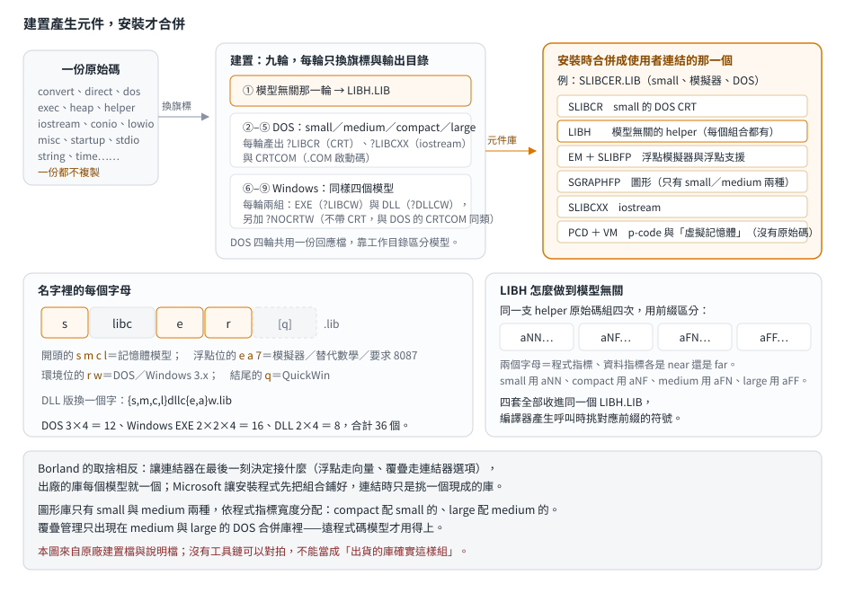

# 一套 CRT 原始碼怎麼變成三十幾個 .LIB

## 結論

Visual C++ 1.0 的 16 位元 CRT，使用者實際連結的那個 `.LIB` **不是建置出來的，是安裝時合併出來的**。
建置流程產生一組「元件庫」——模型專屬的 CRT、模型無關的 helper、iostream、不帶 CRT 的最小啟動——
安裝程式再依「記憶體模型 × 浮點方式 × 執行環境」把它們合併成三十幾個**最終庫**（下文一律用這個詞）。

幾個對逆向與比較有用的點：

- **與模型無關的那部分被抽成一個 `LIBH.LIB`**，所有組合都連同一個檔。
  「無關」指的是**邏輯**無關——呼叫方式還是得跟著模型變，所以同一支原始碼仍然編四份，
  用 `aNN`、`aNF`、`aFN`、`aFF` 前綴區分，四份一起收進那一個庫，由編譯器挑對應的符號。
- **huge 模型存在，但沒有專屬的庫**。四套庫只到 large；huge 的位址算術靠兩個絕對符號
  `__AHSHIFT` 與 `__AHINCR`——DOS 版由一個 helper 目的檔併進 CRT，Windows 版由系統核心匯出
  （原始碼裡那份匯出定義檔把它們掛在 `DOSCALLS` 底下）。Borland 的
  [編譯器 helper](../10-borland-crtl/compiler-helpers.md) 用的是同一組符號名。
- **浮點方式在合併時就決定**：DOS 版分模擬器／替代數學／要求 8087 三套——其中前兩者其實共用同一份浮點庫，
  差別只在底下接模擬器還是協同處理器的那一個成分。Windows 版只有兩套，因為它的浮點庫本身就「em/87」兩者通吃。
- **`CRTCOM.LIB` 不是合併庫**，是 `.COM` 檔的啟動碼庫，整個庫只有兩個目的檔，
  而且**只在 small 那一輪建一次**（它沒有模型前綴）。

**這篇沒有對拍。** 本 repo 目前沒有 VC++ 1.0 的工具鏈與出貨 `.LIB`，所有結論都只能說
「原廠附的建置檔與說明檔這樣寫」，不能說「出貨的庫確實這樣組」。差別見文末的證據與未知。

## 根本問題

### 一個 16 位元程式有四種指標組合

8086 的位址是「段 × 16 ＋ 位移」，所以指標有兩種寬度（背景見[五份函式庫的全景](../00-overview/era-and-libraries.md)）。
程式呼叫與資料存取各自可以只用位移（near，2 bytes）或段加位移（far，4 bytes），
兩兩組合就是四種：近碼近資料、遠碼近資料、近碼遠資料、遠碼遠資料——也就是 small、medium、compact、large。
函式庫裡每一支函式的呼叫方式與指標寬度都跟著變，所以**同一支原始碼至少要編四份**。

### 執行環境也在變

1993 年的一支 16 位元程式可能是 DOS 程式、Windows 3.x 的 EXE、Windows 3.x 的 DLL，
甚至是「用 DOS 風格寫、包成視窗跑」的 QuickWin 程式。啟動碼、記憶體管理、標準輸出的去向都不一樣。

### 浮點有三種買法

有 8087 協同處理器的機器直接用它最快；沒有的要靠軟體模擬；不在乎精度、要小要快的可以用「替代數學」庫。
這三種的取捨在**連結時由開發者決定**（選哪個庫），不是函式庫作者寫死的。

把三件事乘起來，使用者需要的組合數量就爆炸了。Microsoft 的答案是：**不要在建置時窮舉，在安裝時合併**。

## 推導

<p align="center"></p>

### 建置產生元件，安裝才合併

建置批次檔的順序是：先做模型無關的 `LIBH`，再對 small、medium、compact、large 各跑一輪 DOS 版，
然後對同樣四個模型各跑一輪 Windows 版（EXE 與 DLL 兩組）。

每一輪切換的是編譯器與組譯器的旗標（模型選項、`_WINDOWS` 這類定義）與目的檔的輸出目錄；
原始碼一份都沒有複製。一輪結束時，在該模型的目的檔目錄裡收出幾個元件庫。

**合併其實發生兩次，而且第一次是減法。** Windows 的 DLL 庫不是直接建出來的：
那九輪產出的是一個「半成品」DLL 庫，九輪跑完之後還有一段收尾——
把同模型的 Windows **EXE** 庫複製一份，用一張清單從裡面**刪掉**約七十個目的檔
（一類是 DLL 環境不支援的，一類是要被 DLL 專用版取代的），再與那個半成品合併，才得到最終的 DLL 元件庫。
安裝時的合併是第二次，那次是加法。

安裝程式拿這些元件庫合併。以 small 模型、浮點模擬器、DOS 為例，最終庫由這些成分組成：

```
SLIBCER.LIB  =  SLIBCR（small 的 DOS CRT）
              + LIBH（模型無關的 helper）
              + EM（浮點模擬器）
              + SLIBFP（small 的浮點）
              + SGRAPHFP（圖形）
              + SLIBCXX（small 的 iostream）
              + PCD + VM（p-code 與「虛擬記憶體」支援，見下）
```

最後那兩個成分沒有原始碼，這裡只能說它們在清單上。`PCD` 對應的 p-code 是 Microsoft 當年的
「把程式碼編成緊湊的位元組碼、用直譯器跑」選項，拿速度換體積；`VM` 在 16 位元 DOS 上不會是分頁式虛擬記憶體，
實際管什麼**沒查**。

### 名字裡的每個字母

```
{s,m,c,l} libc {e,a,7} {r,w} [q] .lib      ← EXE 用
{s,m,c,l} dllc {e,a}   w      .lib          ← Windows DLL 用
```

| 位置 | 值 | 意義 |
|---|---|---|
| 開頭那一位 | `s`／`m`／`c`／`l` | 記憶體模型 |
| 浮點位 | `e`／`a`／`7` | 模擬器／替代數學／要求 8087 |
| 環境位 | `r`／`w` | DOS（real mode）／Windows 3.x |
| 結尾那一位 | `q` | QuickWin |

**Windows 版只有兩種浮點，不是三種**：它的浮點庫原廠說明寫的是「em/87」——同一個庫兼顧模擬器與協同處理器，
有 8087 就用、沒有就模擬，不必在連結時就決定。DOS 版才要在三者之間挑一個。

數量：DOS 是 3 種浮點 × 4 模型 = 12；Windows EXE 是 2 種浮點 × 2（QuickWin 與否）× 4 模型 = 16；
Windows DLL 是 2 × 4 = 8。合計 36 個。

把 36 行合併清單逐行數過，還看得出這些分佈：

- **`LIBH` 出現在全部 36 個**，它是所有組合的共同底座。
- **p-code 支援也是 36／36**（EXE 用一種、DLL 用另一種）。
- **「虛擬記憶體」支援只在 12 個 DOS 庫**，Windows 那邊不需要。
- **圖形庫也只在 12 個 DOS 庫**，Windows 程式畫圖走系統的繪圖介面。
- **非 QuickWin 的 16 個 Windows 庫裡放的是一個叫 `NOQWIN` 的樁庫**——與 Borland 用備用模組填向量
  （[printf 家族](../10-borland-crtl/printf-engine.md)）是同一個手法：需要那組符號存在，但內容是「什麼都不做」。
- **圖形庫只有 small 與 medium 兩種，依程式指標寬度分配**：compact（近程式碼）配 small 的圖形庫、
  large（遠程式碼）配 medium 的。圖形庫不需要知道資料指標多寬，只需要知道怎麼被呼叫。
- **覆疊管理有新舊兩代，只有新的那一代限定模型**。覆疊（overlay）是把程式碼切成幾塊、
  同一時間只留需要的那塊在記憶體、其餘留在磁碟上的機制。舊的那個管理器在**四個模型的 DOS CRT 裡都有**
  （四個模型共用的回應檔就收了它）；新的 `MOVE` 管理器另外成庫，只併進 medium 與 large 的 6 個 DOS 合併庫。
  遠程式碼模型才有多個程式段可以換進換出——**這個因果是推的**，原廠文件沒明講。

### `LIBH`：兩個 helper 家族

長整數乘除、位移、旋轉這些 helper（編譯器遇到 `long` 運算會自動呼叫的那些，
對照 [Borland 的編譯器 helper](../10-borland-crtl/compiler-helpers.md)），在這裡分成兩家，
原始碼的組語巨集定義檔把規則寫得很清楚：

| 家族 | 符號形狀 | 幾份 | 為什麼 |
|---|---|---|---|
| **不做指派的** | `__aN<運算>`、`__aF<運算>` | 兩份 | 只需要知道**程式指標**多寬（呼叫進來是 near 還是 far call） |
| **做複合指派的** | `__aNNa<運算>`、`__aNFa<運算>`、`__aFNa<運算>`、`__aFFa<運算>` | 四份 | `long` 的 `*=`、`/=` 這類要拿到左值的**指標**，所以多一個資料指標維度 |

四份「做指派的」最後都跳進對應的「不做指派的」核心：`aFF` 與 `aFN` 跳 `aF` 版、`aNF` 與 `aNN` 跳 `aN` 版。
**第一個字母是程式指標（決定跳哪一支核心），第二個是資料指標**，`N` 是 near、`F` 是 far。

| 模型 | 做指派的那份 | 跳進哪支核心 |
|---|---|---|
| large（遠碼遠資料） | `__aFFa…` | `__aF…` |
| medium（遠碼近資料） | `__aFNa…` | `__aF…` |
| compact（近碼遠資料） | `__aNFa…` | `__aN…` |
| small（近碼近資料） | `__aNNa…` | `__aN…` |

六份全部收進同一個 `LIBH.LIB`。值得注意的是：**四份「做指派的」沒有各自放進四個模型的庫，而是擠在同一個檔裡**。
如果前綴真的由程式的記憶體模型唯一決定，把對的那一份放進各模型自己的庫會更省；
放在一起比較像是預期「同一支程式可能用到不只一份」——例如 small 模型的程式對一個 far 限定的 `long` 做複合指派。
（這是從配置方式反推的，原廠沒明講。）

`LIBH` 裡除了這兩家，還有 far 版的字串與記憶體函式，以及 C++ 的陣列建構與解構 helper。
後者的命名帶三個位置（`this` 的模型、建構子的呼叫模型、建構子的 `this` 模型），其中包含 huge——
它們在建置時會被改名成一組特殊符號，也就是今天在 MSVC 編出來的程式裡還看得到的
「向量建構子迭代器」那一類名字（`??_H`、`??_I`）的源頭。

### 回應檔與工作目錄

庫是用 `LIB` 工具的回應檔（response file）收出來的——一份文字檔列出要收進去的目的檔，分組排列。

建置批次檔還傳了一個沒人用的巨集給 helper 的建置規格——全樹沒有任何 makefile 讀它，
也就不會產生第二套目的檔。看到那個名字不必去找對應的產物。

**DOS 版四個模型共用同一份回應檔**：裡面的路徑都是相對的，建置時先切到該模型的目的檔目錄再執行，
所以同一份清單在四個目錄下就收出四個模型的庫。

**Windows 版是每個模型一份回應檔**，四份的差異**只有目的檔的來源目錄名**。
原因是 Windows 版的庫要回頭引用 DOS 那一輪編好的部分目的檔（那些函式在兩種環境下相同，不必重編），
而引用路徑寫死成 `..\sobjs\` 這種形式，於是一個模型一份。

### 不帶 CRT 的那條路

結論裡提到的「不帶 CRT 的最小啟動」在兩個環境各有一個名字：DOS 是 `CRTCOM.LIB`（`.COM` 檔的啟動碼），
Windows 是 `?NOCRTW.LIB`（EXE）與 `?NOCRTDW.LIB`（DLL）。三者的共同點是**整個庫只有兩個目的檔**：
一段啟動碼加一份空的資料。

用途是「我自己來」——程式不要 CRT 的初始化、不要 `main` 之前那一整套，
只借連結器一個進入點。DOS 那個還多一層意義：`.COM` 格式沒有重定位表，啟動碼必須另寫。

### 哪些沒附原始碼

原廠的說明檔自己列了「這些庫**不能**從這份原始碼建出來」：浮點的全部（8087 版、模擬器、替代數學、
Windows 版的浮點）、圖形庫、QuickWin、PWB 的擴充支援。

這與 Borland 的情況一致：兩家都把浮點與圖形留在原始碼之外。要研究這部分只能從介面與呼叫端行為推。

## 給 remake 與逆向的參考

| 看到 | 推論 |
|---|---|
| 程式連結的庫名是 `?LIBC?R.LIB` | DOS 程式；第一個字母是記憶體模型，第四個字母是浮點方式 |
| 庫名結尾是 `W.LIB` 或 `WQ.LIB` | Windows 3.x 程式；後者是 QuickWin |
| 庫名是 `?DLLC?W.LIB` | Windows 3.x DLL |
| 符號名形如 `__aNNa…`、`__aFFa…` | `LIBH` 裡「做複合指派」的 helper，後面接運算名（長整數乘除、位移、旋轉） |
| 符號名形如 `__aN…`、`__aF…` | 同一個庫裡「不做指派」的核心，前者供近程式碼模型、後者供遠程式碼模型 |
| `__AHSHIFT`、`__AHINCR` | huge 模型的位址算術；Borland 用同一組名字 |
| 同一支程式裡出現不只一種兩字母前綴 | **正常**。前綴反映的是呼叫點的指標寬度，不是整支程式的模型；混用 `near`／`far` 限定的資料就會這樣 |
| 程式裡有覆疊管理的成分 | 這個組合是 medium 或 large 的 DOS 庫 |

**這一節不是判準，是預期**：上面說的是「照建置檔推算，庫名與符號應該長這樣」，沒有在真實執行檔上驗證過。
真正可用的模型判斷方式，Borland 那邊的做法見
[從執行檔判斷 runtime 廠牌、版本與記憶體模型](../60-re-fingerprints/identify-vendor-and-model.md)；
Microsoft 的對應判準要等工具鏈到位、能對拍之後才做。

## 與 Borland C++ 2.0 的對照

| | Borland C++ 2.0 | Visual C++ 1.0 |
|---|---|---|
| 模型與庫 | 六種模型、五個庫：small、compact、medium、large、huge 各一個，tiny 用 small 的庫配 tiny 的啟動碼 | 六種模型、四套庫：huge 沒有專屬庫，靠 `__AHSHIFT`／`__AHINCR` 兩個符號處理位址算術 |
| 使用者連結的庫 | 出廠就是最終形式，每個模型一個 | 安裝時由 Setup 合併元件庫 |
| 模型無關的部分 | 沒有獨立出來 | 抽成 `LIBH.LIB`，helper 用四套命名區分 |
| 浮點怎麼選 | C 函式庫本身不分；連結器按需求拉進模擬器或 87 的庫，再靠 `_CVTSEG` 向量決定格式化轉換要不要接上 | C 函式庫本身也不分；差別是**組合先鋪好了**——每種選擇各合併成一個庫，連結時挑一個 |
| 圖形 | 另一個庫，原始碼未附 | 併進合併庫，原始碼未附 |
| 覆疊 | 連結器選項加執行時期管理器（Borland 叫它 VROOMM） | 同樣是連結器選項加管理器；舊的管理器在四個模型的 DOS CRT 裡都有，新的 `MOVE` 另外成庫、只給遠程式碼模型 |

兩家的取捨方向不同：Borland 讓**連結器**在最後一刻決定接什麼，Microsoft 讓**安裝程式**先把組合鋪好，
連結時只是挑一個現成的庫。這個差別影響的是建置與發行的複雜度，不是執行檔大小——
連結器本來就只拉被參照到的目的檔，庫裡有多少東西不影響最後的執行檔。
（Borland 的向量機制確實讓不用浮點的程式不必拖進轉換與模擬器，但那是向量的功勞，與庫怎麼組無關。）

## 證據與未知

| 結論 | 出處 | 等級 |
|---|---|---|
| 三個維度、36 個最終庫的命名與組成、各成分的分佈計數 | VC++ 1.0 RTL 原始碼的 `README.TXT` Part 4 與 Part 5，逐行數過 | 已證實（原文） |
| 建置流程的九輪順序、每輪切換的旗標、`CRTCOM` 只在 small 那一輪建 | 原始碼樹的頂層建置批次檔 | 已證實（原文） |
| **兩個 helper 家族的分野**（不做指派的兩份看程式指標、做指派的四份多一個資料指標維度，且跳進前者） | `VCCRT2/INC/CMPHLP.INC` 的兩個組語巨集定義 | 已證實（原文） |
| DLL 庫是「複製 EXE 庫 → 刪掉約七十個目的檔 → 與半成品合併」組出來的 | `BUILD/WINCDLL.BAT` 與頂層批次檔的收尾段 | 已證實（原文） |
| huge 模型靠 `__AHSHIFT`／`__AHINCR`；Windows 版由系統核心匯出 | helper 目錄下的 huge 差值常式與那份匯出定義檔 | 已證實（原文） |
| DOS 版共用一份回應檔、Windows EXE 版每模型一份且只差目錄名 | 逐份比對 `BUILD/` 下的回應檔（正規化目錄名後四份完全相同） | 已證實（原文＋比對） |
| `CRTCOM`、`NOCRTW`、`NOCRTDW` 各只有兩個目的檔 | 對應的 makefile | 已證實（原文） |
| 新舊兩代覆疊管理器的分佈；`MOVE` 的身分 | 四模型共用的回應檔收了舊的那個；`EXEC/DOS/DOSPAWN.ASM` 裡的開關與註解點名 `MOVE` | 已證實（原文） |
| 哪些庫沒附原始碼 | `README.TXT` Part 4 | 已證實（原文） |
| 與 Borland 的對照 | 本庫已完成的四篇 Borland 文章 | Borland 那半有對拍撐著（見該系列）；Microsoft 這半只到已證實（原文） |
| 「四份做指派的 helper 擠在同一個庫」是為了讓一支程式能用不只一份 | 由配置方式反推 | 強推論 |
| 覆疊只給遠程式碼模型的因果 | 由機制推得，原廠沒明講 | 強推論 |
| 「看到 → 推論」那一節 | 由建置檔推得，**未在任何真實執行檔上驗證** | 強推論 |

未知：

- **原廠自己說重建的結果不保證與出貨版逐位元組相同。** 說明檔寫明這份原始碼「與出貨版功能等價」，
  但同時預告某些 `.LIB`／`.OBJ` 可能無法逐位元組比對，因為出貨庫是用 pre-production 的工具建的。
  **這代表日後就算取得工具鏈，重建產物也不能當出貨庫的位元組簽章來源**——簽章必須取自真正的出貨 `.LIB`。
- p-code 支援、「虛擬記憶體」支援、`MOVE` 三個成分的**實作**沒有原始碼（用途在說明檔裡有一行描述）。
- 原始碼樹第二片的內容只讀了組語 include 的部分（就是解開 helper 命名的那一份），其餘沒讀。
- Windows 版有八十幾個目的檔直接引用 DOS 那一輪的產物，但沒有逐一列出是哪些函式。
- VC++ 2.0（32 位元）的做法沒比對。
