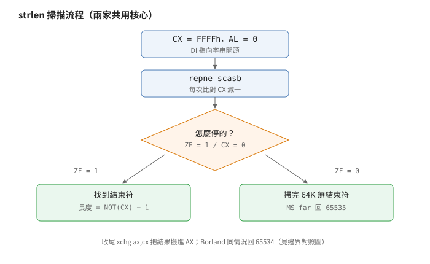
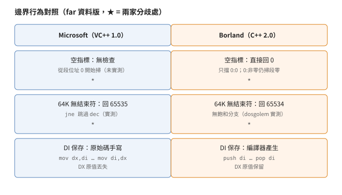

# `strlen` 的兩種長相

## 結論

Microsoft（Visual C++ 1.0 CRT）與 Borland（C++ 2.0 RTL）的
`strlen` 共用同一個核心慣用法：`CX` 從 `FFFFh` 倒數，
`repne scasb` 掃到 `0` 為止，再用 `not` 加 `dec` 把剩餘數
換算回長度。兩家連收尾那個 1 位元組的 `xchg ax,cx` 都一樣。

差別全在邊界：Microsoft 的 far 版多一道飽和分支
（掃到底沒找到就回最大值，不讓計數器歸零），
64K 掃完找不到結束符就回 65535；Borland 的 far 版沒有這道分支
（同樣情況回 65534），但多一道 NULL 檢查（空指標直接回 0，
Microsoft 沒有）。`DI`（掃描指標）兩家都保，
只是 Microsoft 寫在原始碼裡，Borland 交給編譯器產生。下面五組出貨位元組（Microsoft）與
Borland 簽章檔裡的五組樣式可以逐位元組對上，行為也在模擬器裡
實跑過。

## 根本問題

16 位元程式的字串是以 `0` 結尾的一串位元組，長度只能用掃的。
掃描迴圈有三個現實約束。第一，指標有兩種寬度：near 指標只有
段內位移（2 bytes），far 指標還帶段值（4 bytes），同一個函式
要為兩種呼叫方式各編一份。第二，一個段最多 64K，
`CX` 倒數掃完整段會繞回零，得決定這算什麼。第三，
`SI` 與 `DI` 是跨呼叫必須保留的暫存器（呼叫端拿它們當變數用），
`strlen` 內部要用 `DI` 當掃描指標，就得先存後還。

## 推導

### 核心：為什麼是倒數加掃描

<p align="center"></p>

長度定義是「結束符之前有幾個字元」。`repne scasb`
一次比一個位元組，`CX` 每比一次減一，所以掃完時
`CX ＝ FFFFh − 比過的個數`。結束符本身也被比了一次，
比過的個數是 `長度＋1`，倒回去就是
`長度 ＝ NOT(CX) − 1`。這就是結尾 `not` 加 `dec` 的來歷，
不是什麼神秘最佳化，是定義直接長出來的算式。

`CX` 從 `FFFFh` 起步而不是先量長度再掃，是因為先量就等於
多掃一遍。`AL` 先清零是因為要找的位元組就是 `0`。
收尾用 `xchg ax,cx` 而不是 `mov ax,cx`，純粹是少一個位元組
（`xchg` 對 `AX` 有單位元組編碼）。Borland 把 `xchg` 放在
`not` 之前、Microsoft 放在之後，結果一樣，因為交換與取反
可互換順序。

### Microsoft far 版的飽和分支：跟資料模型走

<p align="center"></p>

`repne scasb` 有兩種停法：找到 `0`
（比中時 CPU 把零旗標 `ZF` 設為 1），或 `CX` 歸零
（`ZF＝0`）。Microsoft 的 far 版在 `not cx` 之後用 `ZF`
分流：找到結束符才走 `dec cx`；`CX` 掃完一整段（`FFFFh` 個
位元組）都沒找到，就跳過 `dec`，直接回 `FFFFh`（65535）
作飽和值。

這道分支只出現在 far 資料的版本（compact 與 large 的庫，
以及 `LIBH` 裡給 small／medium 呼叫的 far 版）。
near 資料版（small、medium）沒有它：出貨位元組裡
small／medium 版就是沒有這道分支（near 字串住在 `DGROUP`——
全域變數住的那段——裡，實務上不會單獨佔滿一段，
計數器耗盡的情況沒人處理）。分支跟的是資料指標寬度，不是呼叫方式——
medium（遠呼叫、近資料）沒有，compact（近呼叫、遠資料）有。

### Borland 的 NULL 衛兵：只擋全零

Borland 的 far 版在掃描前先比段值與位移：兩者皆零就直接回 0
（`AX` 本來就是零，不必再設）。但它只擋 `0:0` 這個全零指標；
段為零而位移非零的指標會掉進掃描迴圈，
用 `ES＝0`（掃描用的段暫存器歸零）去掃低記憶體。
near 版沒有這道檢查。Microsoft 兩版都沒有：空指標進去就是
從該段位址零開始掃。

### `DI` 保存在哪一層

Microsoft 在原始碼裡手寫保存：進函式把 `DI` 寄到 `DX`，
離開前搬回來。代價是 `DX` 原值丟失（`DX` 不在被呼叫端保留之列，
合法）。Borland 的原始碼裡沒有保存動作，`DI` 的 `push`／`pop`
是編譯器看到內嵌組語用了 `DI` 才自動加的。結果兩家都保住了
`DI`，但 Borland 版的 `DX` 原值還在。出貨位元組可以逐位元組驗證
這句話：Microsoft 版首尾是 `mov dx,di`／`mov di,dx`，
Borland 版首尾是 `push di`／`pop di`。

### 建置形狀不同，呼叫端看到的符號也不同

Microsoft 用一份組語源，靠條件編譯為四個模型各編一個
`STRLEN` 模組（公開符號都是 `_strlen`），另外再為
`LIBH` 編一個公開符號叫 `__fstrlen` 的 far 版，
給 small／medium 程式呼叫（呼叫端寫 `_fstrlen`）。
Borland 用一份 C 加內嵌組語的源，每個模型各編一次，
再把同一批源用 large 加特殊旗標重編一輪，
產出 far 版（`_fstrlen`），收進**每一個**模型的庫——
所以 small 的庫裡也有 `retf`（遠返回）結尾的 far 版 `strlen`。

## 在執行檔裡怎麼認

先找 `F2 AE`（`repne scasb`）。若它前面是
`B9 FF FF`（`CX＝-1`）且 `AL` 被清過零，
後面跟著 `not`、`dec`、`xchg ax,cx` 的收尾，
就是 `strlen` 家族。容易誤判的是 `memchr` 與
`strchr` 家族：它們也用 `repne scasb`，
但 `AL` 來自參數（要找的字元），結尾回的是指標
而不是算出來的長度。

認出家族後，用四處分叉定廠牌與模型：

1. `DI` 怎麼存：`mov dx,di` 開頭是 Microsoft，
   `push di` 開頭是 Borland。
2. 指標怎麼取：`mov di,[bp+4或6]` 是 near 資料，
   `les di,[bp+4或6]` 是 far 資料；
   `bp+4` 對近呼叫，`bp+6` 對遠呼叫
   （遠呼叫的返回位址多帶一個段值，參數往後擠 2 bytes）。
3. 有沒有 `75 01`（`jne` 跳過 `dec`）：
   有就是 Microsoft 的 far 資料版；
   Borland 的 far 版沒有它，但前面多一對
   `cmp`（NULL 檢查）。
4. 掃描前有沒有 `FC`（`cld`）：有是 Borland，
   沒有是 Microsoft。

出貨位元組的完整樣式：Microsoft 五筆在
[`signatures/msvc-1.0-crt/strlen.json`](../../signatures/msvc-1.0-crt/strlen.json)，
Borland 五筆已經在 `signatures/borland-crtl-2.0/dos.json`
裡（模組 `STRLEN` 與 `FSTRLEN`）。Microsoft 五筆 31 bytes 以內、
無需遮罩；Borland 有四筆同此，唯 huge 那筆 36 bytes 且
`mov ax,段值` 處留了遮罩（huge 版把段值寫成連結期才填的常數，
別家沒有這個立即值）。

## 給 remake 的行為規格

以下虛擬碼是照行為重寫的規格，不是任一家的原始碼；
命名與順序都與原檔無關：

```text
function spec_strlen(ptr, is_far, vendor):
    if is_far and vendor == BORLAND and ptr == 0:0:
        return 0
    count = 0
    while memory[ptr + count] != 0:
        count += 1
        if is_far and count == 65535:
            # 比了 FFFFh 次都沒中：第 65536 個位元組硬體根本不讀，
            # 直接按廠牌回飽和值
            if vendor == MICROSOFT: return 65535
            else: return 65534
    return count
```

這份規格只寫到 far 版的 64K 飽和；near 版數到 64K 以上
不在規格內（見邊界表「未實測」那列）。

邊界表（`far` 指 far 資料版；`near` 指 near 資料版）：

| 輸入 | Microsoft | Borland |
|---|---|---|
| 空字串 | 0 | 0 |
| 一般字串 | 結束符前個數 | 同左 |
| far `0:0` | 從段零掃（未實測） | 0 |
| far `0:非零` | 從段零掃（未實測） | 從段零掃（靜讀，未實測） |
| far 64K 無結束符 | 65535（實測） | 65534（實測） |
| near 64K 無結束符 | 未實測（無飽和分支） | 未實測（無飽和分支） |

暫存器契約（出貨位元組實證）：`DI`、`SI`、`BP` 兩家都保留；
`AX`、`CX`、`ES` 兩家都破壞；`DX` 只有 Borland 保留
（Microsoft 拿它暫存 `DI`）。方向旗標兩家不同：
Borland 開頭有 `cld`（`DF＝0` 出）；Microsoft 全程不碰 `DF`
（呼叫慣例保證進入時為 0，離開時不變）。

## 證據與未知

- 核心慣用法（兩家同核、`xchg` 省位元組）：
  五加五組出貨位元組實證，**已證實**。
- Microsoft far 飽和分支與 65535：
  出貨位元組有 `75 01`，直配 64K 段實跑整段無 NUL 的
  飽和行 `sat＝65535`、第 65534 號位元組補 0 的邊界行
  `edge＝65534`，雙引擎（DOSBox＋dosgolem）× 兩版
  （A 連 1.0 源重建的 OBJ、B 連 1.52 的 `SLIBCE`）
  四格一致，**已證實**。版本揭露：簽章的出貨位元組是
  1.0 五庫；B 版借的是 1.52 庫（與重建品靜態語意
  7／7 相同）。
- Borland 65534：`allocmem` 直配整段 64K 全填無 NUL，
  dosgolem 實跑 `sat＝65534`、`edge＝65534`，
  與靜讀預測一致，**已證實**（dosgolem 單引擎；
  Microsoft 側另有雙引擎四格）。
- Borland `0:非零` 掉入掃描：純靜讀推導，
  未實跑，**強推論**。
- Borland far NULL 回 0：出貨位元組有完整的
  比較加跳躍對，邏輯無歧義；執行層
  `fnull＝0` 也跑出來了，**已證實**。
- `DI` 兩家都保、保存層次不同：出貨位元組實證，
  **已證實**。寫作中曾誤判 Borland 不保，
  出貨碼的 `push di` 推翻了該推論。
- 建置形狀（四模組加 `LIBH` far 版；
  Borland 每庫收 far 版）：出貨庫拆解實證，
  **已證實**。Microsoft 用零售 MASM 重建的
  small／far 版，與出貨品除一筆編譯器註記外
  逐位元組相同。
- 未知：Microsoft near 版 64K 計數器耗盡的行為、
  Microsoft 空指標的行為、Borland huge 版的長相
  （簽章檔裡 huge 有一筆 `DS` 切換不同的版本，
  尚未寫進行為表）。

動手跑：[`examples/strlen/`](../../examples/strlen/)
用自寫測試程式在 dosgolem 裡把 Borland 側整張表跑一遍
（`sat＝65534`、`edge＝65534`、`fnull＝0` 都在 `expected.txt` 裡鎖住；
執行方式見該目錄的 `README.md`）。
只驗 Borland 側是因為 Microsoft 側要 MSVC 工具鏈，
這裡只有 Borland 工具鏈。

出處：Visual C++ 1.0 CRT，`STRING` 目錄的 `STRLEN.ASM`
與出貨的 `SLIBCR／MLIBCR／CLIBCR／LLIBCR／LIBH`；
Borland C++ 2.0 RTL，`CLIB2` 目錄的 `STRLEN.CAS`
與出貨的 `CS／CC／CM／CL／CH`。
