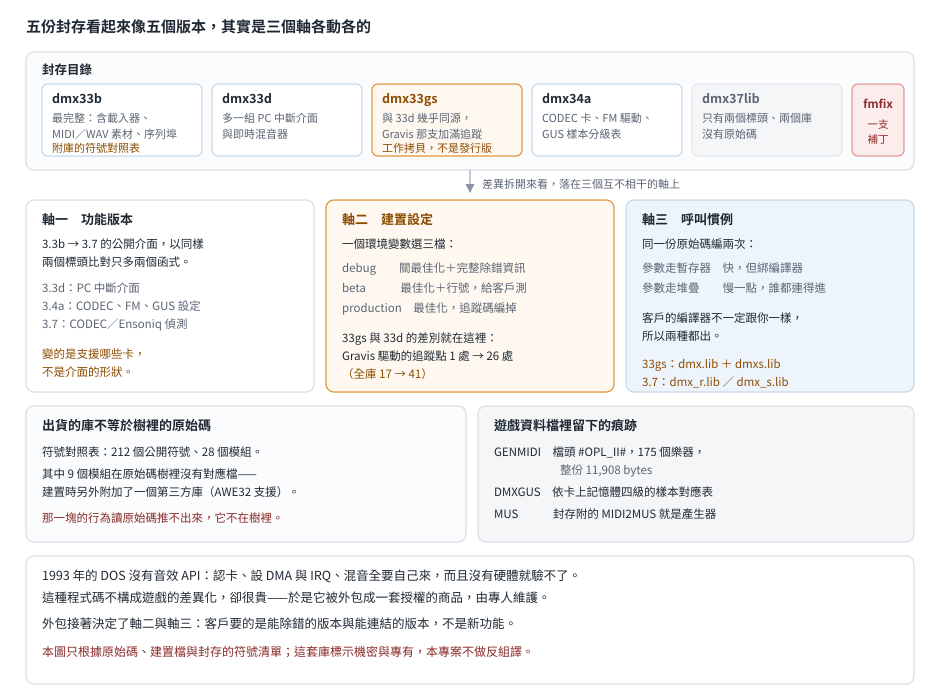

# DMX 的五份封存：版本號、建置設定與呼叫慣例是三件事

## 結論

DMX（Digital Expressions 的 Paul J. Radek 寫的 DOS 音效函式庫）流傳出五份原始碼封存，
目錄名看起來像五個版本：`dmx33b`、`dmx33d`、`dmx33gs`、`dmx34a`、`dmx37lib`。
逐檔比對之後，它們的差異落在三個互相獨立的軸上：

- **功能版本**只變了一次半。3.3b 到 3.3d 補了一組 PC 中斷介面，3.4a 加了 CODEC 類音效卡、
  一支改名的 FM 驅動與 GUS 的設定檔。以同樣兩個標頭比對，整條 3.3b → 3.7 的公開介面
  只多出兩個偵測函式（`CODEC_Detect`、`ENS_Detect`）。呼叫端幾乎可以當同一套用。
- **建置設定**是另一個軸。建置檔靠環境變數選 debug／beta／production 三檔，
  差別在最佳化旗標與追蹤碼。`dmx33gs` 與 `dmx33d` 的原始碼幾乎相同，
  差異集中在把某一支驅動的追蹤點從 1 處加到 26 處——那是為了追某張卡的問題而做的一份，
  不是新版本。
- **呼叫慣例**是第三個軸，而且是唯一會影響「你能不能連結進去」的軸。
  同一份原始碼編兩次，一次用暫存器傳參數、一次用堆疊傳參數，出兩個庫。
  3.7 的 `dmx_r.lib` 與 `dmx_s.lib` 把這件事寫進了檔名。

對 remake 讀者另有一個副產品：遊戲資料檔裡的 `GENMIDI`、`DMXGUS`、`MUS` **不是遊戲自創的格式**，
是這套函式庫的隨附格式。封存的範例目錄裡就有 `genmidi.op2` 與 `dmxgus.ini`，
工具目錄裡有把標準 MIDI 轉成 `MUS` 的 `MIDI2MUS`。

## 根本問題：1993 年沒有音效 API

那幾年 DOS 遊戲要出聲，必須自己認卡、自己設 DMA 與 IRQ、自己寫混音。卡的數量還在長：
AdLib、Sound Blaster 一家四代、Pro Audio Spectrum、Gravis UltraSound、
各種用 CODEC 晶片（負責類比與數位訊號互轉、順便管取樣率的那顆）的相容卡、
再加上 AWE32 這種自帶音色樣本與卡上記憶體的。每張卡的偵測方法、初始化順序與失敗模式都不一樣，
而且偵測失敗的代價很高——讀錯埠會讓機器停住。

這是典型的「值得外包」的問題：對遊戲公司來說，這些程式碼不構成任何差異化，
卻要吃掉一個人幾個月，而且沒有硬體就驗不了。DMX 走的就是這條路——原始碼每一支的版權頁都寫著
同一個名字與公司、標示機密與專有，封存裡還留著客戶端開發者寄來的 bug 回報信；
這是一套由專人維護、授權給遊戲公司使用的商品，而不是隨遊戲附帶的自用程式碼。

外包帶來第二個問題：**客戶的編譯器不見得跟你一樣**。編譯器不同，參數放哪裡、誰負責清堆疊、
函式在目的檔裡叫什麼名字（符號修飾）就不同，目的碼根本連不起來。這決定了後面那條呼叫慣例的軸。

## 三個軸

### 軸一：功能版本

| | 3.3b | 3.3d | 3.3gs | 3.4a | 3.7 |
|---|---|---|---|---|---|
| `api` 檔數 | 48 | 48 | 48 | 51 | 1（只有測試程式） |
| `inc` 標頭數 | 24 | 25 | 25 | 25 | 2 |
| `lib` | `dmx.lib` ＋符號清單 | `dmx.lib` | `dmx.lib`、`dmxs.lib` | `dmx.lib` | `dmx_r.lib`、`dmx_s.lib` |
| 額外目錄 | `ldr`、`midi`、`sercom`、`wav` | — | — | — | — |
| 這一版新增 | — | `pcints`（PC 中斷介面）、一支即時混音器、一支測試程式 | — | `codec.c`、`fmopl2.c`、`dmxgus.ini` | 看不到原始碼 |
| 檔案時戳 | 1991-10 ～ 1995-04 | 1993-07 ～ 1994-08 | 1993-07 ～ 1994-08 | 1991-10 ～ 1994-08 | 1994-12 |

標頭層面的變化比目錄差異小得多。3.3b 到 3.3d 之間，既有標頭幾乎沒動，只多了新模組那一支；
3.3d 與 3.3gs 的標頭**逐位元組相同**。跨全部標頭數宣告，3.3b 有 116 個函式宣告、3.4a 有 120 個，
多出來的四個全是新模組帶來的。

3.7 只留兩個標頭與兩個庫，沒有原始碼。拿這兩個標頭跟 3.4a 的同兩個比，多出 `CODEC_Detect` 與
`ENS_Detect`（Ensoniq），旗標多了 `AHW_CODEC`、`AHW_ENSONIQ`、`AHW_FM_OPL3`。
換句話說 3.7 相對 3.4a 的變化就是「又多支援了幾張卡」（Ensoniq 是 1994 年前後進入這個市場的
音效晶片供應商，它的晶片用在 Soundscape 一類的卡上），介面的形狀沒變。

### 軸二：建置設定

建置檔用的是 Watcom 的 32 位元編譯器與它自己的 make（`wmake`），記憶體模型選 flat（平坦：
位址是單一的 32 位元整數，沒有段與位移之分），連結器指定的執行環境是 DOS/4GW——
一種 DOS extender（讓 DOS 程式切進 386 保護模式、用完整 32 位元位址空間的執行環境）。

**這不是一套 16 位元函式庫。** 同期的 Borland C++ 2.0 與 Visual C++ 1.0 的 CRT 都在 16 位元、
分段定址的世界裡，指標寬度與記憶體模型是編譯時的大事；DMX 預設遊戲本身已經跑在 extender 上，
那些問題根本不存在，取而代之的是下一節那個問題：參數怎麼傳。

版本選擇靠一個環境變數，三檔：

| 檔位 | 用意 | 對產物的影響 |
|---|---|---|
| debug | 關最佳化、帶完整除錯資訊、定義 `DEBUG` | 追蹤巨集展開成實際輸出 |
| beta | 開最佳化、帶行號資訊、定義 `BETA` | 給客戶測試用 |
| production | 開最佳化、定義 `PROD` | 出貨；追蹤巨集多半被編掉 |

`dmx33gs` 就是這個軸上的產物。它與 `dmx33d` 的差異只有九個檔，其中八個是小改，
真正的差異在 Gravis 那支驅動：追蹤點從 1 處增加到 26 處，全庫的追蹤點從 17 處變成 41 處。
目錄名的 `gs` 應該就是 Gravis——這是為了追那張卡的問題而加滿追蹤碼的一份工作拷貝，
不是發行版本。同一份拷貝裡還看得到另一個小動作：某支模組把一段輸出的條件從
「debug 檔位才編進去」改成「production 檔位才編掉」——差別在 beta 檔位下那段還在。

3.3b 的 `beta.lst` 與 `pro.lst` 是同一件事的另一個角度：它們不是文字清單，
是編譯器產生的組譯清單檔，同一支模組在兩個檔位下的產物並排。beta 那份 124,850 bytes、production 那份 99,801 bytes。
以清單開頭那支模組為例，它的碼段在 beta 下是 4,967 bytes、在 production 下是 4,901 bytes——差 66 bytes。
這兩份留在封存裡，本身就是「同一份原始碼、不同檔位」的證據。

### 軸三：呼叫慣例

Watcom 的 32 位元編譯器有兩種參數傳遞方式：暫存器（旗標 `-4r`）與堆疊（`-4s`）。
暫存器版快，但兩者的傳參位置與**符號修飾**（同一個函式在目的檔裡的名字，會隨呼叫慣例改變）
都不一樣，另一家編譯器產生的呼叫接不上去。
函式庫作者不能替客戶決定這件事，只能兩種都出。

這條軸在封存裡留下三處痕跡：

1. 3.3b 與 3.3d 的建置檔把 `-4r` 寫死在 production 那一檔，只出一個庫。
2. 3.3gs 的建置檔多了一個環境變數，用它在 `-4s` 與 `-4r` 之間切，而且把旗標從編譯旗標裡
   抽出來變成獨立變數——同一份原始碼於是能編兩次。它的 `lib` 目錄剛好有 `dmx.lib` 與 `dmxs.lib` 兩個。
3. 3.4a 的建置檔把兩個旗標都定義成具名變數，但沒有接上切換邏輯；3.7 直接把結果寫進檔名：
   `dmx_r.lib` 與 `dmx_s.lib`。

所以 `dmxs.lib`／`dmx_s.lib` 的 `s` 是 stack，不是 small、不是 sound、不是 shareware。
這是本篇最強的推論之一，但仍是推論：封存裡沒有任何一行文件寫明這件事，
證據是建置檔的切換旗標、兩個庫同時出現的時機、以及 3.7 的命名三者吻合。

## 庫裡有什麼：不必反組譯也看得出來

3.3b 的 `lib` 目錄附了一份庫管理工具（`wlib`）產生的符號對照表——每個公開符號對到它所在的模組。
這份東西讓庫的內容在原始碼層級就攤開了：212 個公開符號、28 個模組。
依符號數排前幾名的是 Gravis 驅動（38）、音樂 API（19）、CODEC 抽象層與 DSP 介面（各 13；
DSP 指 Sound Blaster 那類卡上接收指令的處理晶片，不是泛稱的數位訊號處理）。

比較有意思的是那 28 個模組裡有 9 個在 `api` 目錄裡**找不到對應的 `.c`**：
`awe32`、`awevar`、`midieng`、`midivar`、`embed`、`hardware`、`register`、`sbkload`、`misc32`。
建置檔給出了答案：合併庫的時候，除了自家的目的檔，還附加了一個第三方庫
（`pawe32.lib`，47 KB，日期 1994-04）。從模組名推，那是 AWE32 的支援
（`sbkload` 對應卡上音色樣本庫的載入——當年那張卡吃的是 `.SBK`，後來這系列格式通稱 SoundFont；
`embed` 對應卡上內建的那組音色）。

**AWE32 支援不是 DMX 自己寫的，是併進來的第三方目的碼**——這解釋了為什麼原始碼樹裡
只有一支不到 10 KB 的 `awe32.c`（相比之下 Gravis 那支接近 100 KB），卻在庫裡看得到一整組 AWE32 符號。對 remake 讀者的意義是：
這一塊的行為不能靠讀 DMX 原始碼推，它根本不在樹裡。

## OPL3 偵測：`fmfix` 修的是什麼

封存裡另有一個 `fmfix` 目錄，只有一支 FM 驅動與一支測試執行檔，日期與 3.4a 同一天。
比對之後，它修的是 **OPL3 的偵測條件**。

根本問題是：AdLib 的 OPL2 與後來的 OPL3 共用同一組埠，而且沒有版本暫存器可讀。
唯一的線索是狀態埠讀回來的值——OPL2 有幾個位元永遠是 1，OPL3 把它們清成 0。
埠位址是固定的：基底 `0x388`，第二個狀態埠 `0x38A`。
3.4a 的做法是只讀基底埠，讀回 0 就當成 OPL3；作者自己在註解裡寫這招在某些
Sound Blaster Pro II 上會出事。`fmfix` 改成兩個埠一起看：`0x388` 要讀回 0、
`0x38A` 要讀回 `0xFF`，兩個條件同時成立才認定是 OPL3。

這是典型的「靠副作用做版本偵測」問題：可觀測的狀態不是為了回答這個問題而設計的，
於是只能疊條件把偽陽性擠掉。同一個模式在這套庫裡到處都是——
所有 `*_Detect` 函式都是在做同一件事的不同版本。

## 在遊戲資料裡怎麼認出 DMX

這一節講的是**資料檔**，不是執行檔。這套庫的版權頁寫著機密與專有、權利狀態不明，
所以本專案對它不做反組譯，也不出位元組簽章——執行檔層級的辨識這篇不寫。
不過它在遊戲的資料檔裡留下的痕跡很好認，而且這些痕跡本身就是公開的檔案格式：

| 痕跡 | 怎麼認 | 出處 |
|---|---|---|
| `GENMIDI` | 檔頭 8 bytes 是 `#OPL_II#`，之後每個樂器 36 bytes、共 175 個，再接 175 個 32 bytes 的名稱欄；整份正好 11,908 bytes | 封存的範例目錄有同樣格式的 `genmidi.op2`，大小一致 |
| `DMXGUS` | 純文字表格：每行是一個 MIDI 樂器編號、它在 256 KB／512 KB／768 KB／1 MB 四種卡上記憶體下各要載入哪個樣本、以及樣本檔名 | 封存的 `dmxgus.ini`（190 條，編號 0 到 215，涵蓋 General MIDI 的旋律樂器與打擊音色），檔頭自述用途是「不同記憶體大小配不同的樣本庫」 |
| `MUS` | 比標準 MIDI 精簡的事件流；封存附的 `MIDI2MUS` 就是產生器 | `midi2mus/` 原始碼與 `bin/midi2mus.exe` |
| 符號名 | `DMX_Init`／`DMX_DeInit`、一組 `*_Detect`、以及依子系統分的前綴：`MUS_*`（音樂 14 個）、`TSM_*`（計時 12）、`WAV_*`（數位音訊 11）、`GSS_*`（通用音色集 6）、`PCS_*`（PC 喇叭 5）、`SFX_*`（音效 4） | 標頭與庫的符號表 |

前三項是最有用的：它們是**資料檔**，不受執行檔壓縮與連結器影響，
而且用途明確——看到 `#OPL_II#` 就知道這個遊戲的 FM 音色表是 DMX 那套，
看到 `DMXGUS` 就知道它支援 GUS 而且用的是 DMX 的樣本分級表。

## 給 remake 的行為規格

**這一節沒有實跑支持**，來源只有原始碼與隨附的資料檔。只有兩件事寫得夠清楚，可以直接當規格用：

**GUS 的樣本分級。** 卡上記憶體是硬上限，DMX 的做法是預先列好一張表：每個 MIDI 樂器編號在四種
記憶體大小（256 KB／512 KB／768 KB／1 MB）下各對應到哪個樣本——記憶體小的那幾欄大量共用同一個樣本，
把樂器擠進空間裡。表的設計還刻意留下 8 KB 又 32 bytes 給數位音效用（檔頭自述）。
remake 若要重現原版在 256 KB GUS 上的音色，得照這張表做樂器代換，而不是全部載入。

**OPL3 的偵測。** 若 remake 想忠實重現「原版在某些機器上把 OPL3 誤認成 OPL2（或反過來）」的行為，
判斷式就是上一節那兩個條件；`fmfix` 之前與之後是不同的行為，而遊戲出貨時綁的是哪一份，
要從遊戲本身的年代推。

其餘（混音、音量曲線、MIDI 事件時序）都需要實跑才能定，本篇不下規格。

## 證據與未知

**已證實（原文）**：各版目錄與檔案清單、逐檔比對結果、標頭宣告數與差異、
建置檔的編譯器與旗標、三個檔位的定義、追蹤點計數、`pawe32.lib` 被併進庫、
符號對照表的 212 個符號與 28 個模組、`genmidi.op2` 的檔頭與大小、`dmxgus.ini` 的用途自述、
`fmfix` 改動的偵測條件。

**強推論**：`s` 是 stack calling convention（三處痕跡吻合，但無文件）；
`gs` 指 Gravis（追蹤碼分布）；那 9 個庫內模組來自 AWE32 第三方庫（模組名與併入關係）；
3.3gs 是工作拷貝而非發行版本。

**未知**：

- 版本號與目錄名的對應沒有一手證據，封存者可能自己命名；3.3b 目錄裡甚至有比 3.7 更晚
  （1995-04）的檔案時戳，表示封存後被動過。
- **沒有編譯、沒有實跑**，也不會有二進位層面的驗證：這套庫的版權頁標示機密與專有，
  權利狀態不明，本專案對它只做原始碼層級的閱讀。
- 3.4a 新增的三個模組只讀了檔頭與介面，實作沒讀。
- 3.7 的兩個庫沒有對應原始碼，只能從兩個標頭推它多支援了什麼。
- 3.3b 獨有的 `ldr`、`midi`、`sercom`、`wav` 四個目錄沒細讀；其中 `sercom` 是一組序列埠程式，
  出現在音效庫裡的理由沒查（可能與外接 MIDI 或除錯輸出有關）。
- `GENMIDI`、`DMXGUS`、`MUS` 在各款遊戲的資料檔裡實際叫什麼名字、放在哪種容器裡，沒有逐款查；
  本篇只確認了封存裡的同格式檔案。
- AWE32 卡上內建的那組音色實際是什麼、佔多少空間，封存裡看不到（那塊是併進來的第三方目的碼）。
  remake 若要在沒有該卡的情況下重現它的音色，這是最大的缺口。
- beta 與 production 兩個檔位的最佳化差異會不會影響行為（而不只是體積與速度），沒有驗；
  本篇不做位元組比對，這點留白。
- `bugs.lst` 是 1994 年 7 月一位遊戲開發者寄給作者的 bug 回報信。它佐證了封存的年代與
  這套庫的實際使用者，但內容涉及第三方通訊，本文不引用。
