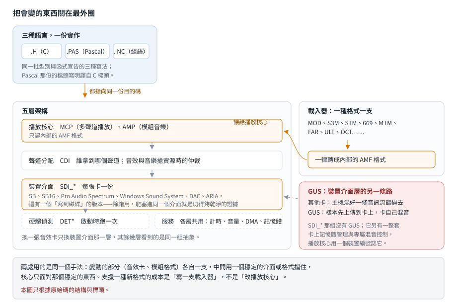

# DSMI：一份實作，三種語言接得上

## 結論

DSMI（Digital Sound and Music Interface，Otto Chrons 與 Jussi Lahdenniemi 在 1990 年代初寫的
DOS 音效與模組音樂函式庫）常被說成「有 C、組語、Pascal 三套介面」。讀過原始碼之後，比較準確的說法是：
**實作只有一份，另外兩套是同一批宣告的翻譯。**

- 每個模組的實作是 C 或組語（`.C`／`.ASM`），對外的介面有三份：`.H`（C 標頭）、`.PAS`（Pascal 的 unit）、
  `.INC`（組語的 include）。Pascal 那份的檔頭自己寫著它譯自 C 標頭。三種語言的程式連的是同一份目的碼。
- **介面檔與實作檔的名字不一定相同**：`MCP.*` 是介面，實作在 `MCPLAYER.C`；`AMP.*` 是介面，實作在 `AMPLAYER.ASM`。
  用「有沒有同名的 `.C`」判斷某個模組有沒有附實作會判錯。
- 架構分五層：播放核心、聲道分配、裝置介面、硬體偵測、服務。**換一張音效卡只換裝置介面那一層**。
- **Gravis UltraSound 是特例**：它不在 `SDI_*` 那組裡，而是裝置介面層的另一條並列路徑，
  多帶卡上記憶體管理與專屬混音控制——因為那張卡自己有音訊記憶體、由卡自己混音。
- 封存裡有八個 `.CH` 檔**不是原始碼**，是當年 DOS 檔案比較指令的輸出。

這一篇只讀原始碼。**DSMI 的授權禁止逆向該套件**，所以沒有反組譯、沒有位元組簽章，
也沒有編譯或實跑（沒有當年的工具鏈）。

## 根本問題

### 1992 年的 DOS 沒有音訊 API

作業系統不管聲音。要出聲就得自己認卡、自己設好 DMA（Direct Memory Access，讓音效卡不經 CPU
直接從記憶體讀音訊資料的機制）、自己餵資料。而市面上的卡彼此不相容：
Sound Blaster 系列、Pro Audio Spectrum、Windows Sound System、Gravis UltraSound，
還有一堆相容品。每張卡的偵測方式、埠位址、資料格式、中斷行為都不一樣。

### 模組音樂要在執行時自己混音

一個模組（module）檔案裡同時裝著兩樣東西：**樣本**（sample，每種音色的一小段錄音）與**樂譜**
（哪一軌、在哪一刻、用哪個樣本、彈什麼音高、加什麼效果）。播放時沒有現成的音源可以叫，
程式得自己把同時發聲的好幾軌樣本**即時疊加**成一條輸出音訊——這件事就是**混音**。

能同時疊幾軌有上限（受 CPU 與硬體限制），那個上限就是**聲道**數（這裡指可同時發聲的軌數，
不是立體聲的左右聲道）。遊戲通常要一邊放多軌的背景音樂、一邊隨時插進音效，兩邊搶的是同一批聲道。

格式也一樣亂：追蹤器（tracker，編輯這種音樂的程式）音樂從 Amiga 的 MOD 開始，
PC 上冒出 STM、S3M、669、MTM、FAR、ULT、OCT⋯⋯每種的樣本編碼、效果指令、聲道數都不同。

### 寫遊戲的人用什麼語言都有

1992 年的 DOS 遊戲圈，C、Turbo Pascal、純組語都是主流。函式庫作者如果每種語言各寫一份實作，
維護成本會乘以三，而且三份的行為遲早會不一致。

## 推導

### 三種語言，一份實作

作者的做法是：**實作只寫一次，介面翻譯三份。**

| 語言 | 介面檔 | 內容 |
|---|---|---|
| C | `.H` | 型別（結構）、常數、函式宣告；共用的基本型別集中在 `DSMIDEF.H` |
| Pascal | `.PAS` | unit（Pascal 的模組單位，分 `Interface` 與 `Implementation` 兩段）的 `Interface` 段：同一批結構改寫成 record、同一批函式宣告成外部函式 |
| 組語 | `.INC` | 同一批結構與常數的組語定義 |

三份介面描述的是同一組目的碼的符號，所以三種語言的呼叫端連結後跑的是同一份程式。
Pascal 那份的比例最大——同一個模組的 Pascal 介面往往是 C 標頭的兩倍長，
因為 Pascal 的 record 與外部宣告寫起來比 C 的標頭囉嗦。

這個做法的代價是：**介面翻譯得自己維持同步**。C 標頭改了型別，Pascal 與組語那兩份要跟著改，
編譯器不會替你檢查。封存裡那幾個檔案比較指令的輸出，看起來就是作者在做這件事時留下的。

### 五層架構

`DSMI.H` 一口氣把整套包進來，從它的引入清單就看得出分層：

| 層 | 模組 | 做什麼 |
|---|---|---|
| 播放核心 | `MCP`（Multi Channel Player）、`AMP`（Advanced Module Player） | 多聲道混音播放、模組音樂的播放邏輯 |
| 聲道分配 | `CDI`（Channel Distributor） | 誰拿到哪個聲道；音效與音樂搶資源時的仲裁 |
| 裝置介面 | `SDI_*`（Sound Device Interface） | 每張卡一份：SB、SB16、Pro Audio Spectrum、Windows Sound System、DAC、ARIA，還有一個寫到磁碟的版本 |
| 裝置介面（另一條） | `GUS`、`GUSHM`、`GUSHEAP` | Gravis UltraSound **不走 `SDI_*`**，自成一路；見下節 |
| 硬體偵測 | `DET*` | 每張卡一支偵測常式 |
| 服務 | `TIMESERV`、`MIXER`、`VDS`、EMS 與 GUS 的記憶體管理 | 計時；音效卡**硬體混音器**的音量控制（與播放核心做的取樣疊加是兩回事）；虛擬 DMA 服務（Virtual DMA Services，在記憶體管理程式底下安全取得實體位址）；樣本要放在哪塊記憶體（含 EMS，Expanded Memory Specification 那種擴充記憶體） |

**換卡只換裝置介面那一層**——其餘四層看到的是同一組抽象。
硬體偵測只在啟動時跑一次，服務那一層是各層共用的工具，兩者都不在「播放資料」這條主鏈上。
`SDI_*` 裡那個「寫到磁碟」的版本特別能說明這個設計：它不是給使用者的功能，是開發時的除錯管道，
把本來要送給音效卡的資料寫成檔案。能塞進同一個介面，表示那個介面切得夠乾淨。

### 載入器與內部格式

每種模組格式一支載入器（`MODLOAD`、`S3MLOAD`、`STMLOAD`、`669LOAD`、`MTMLOAD`、`FARLOAD`、
`ULTLOAD`、`OCTLOAD`），另有一組轉換工具把它們轉成**內部的 AMF 格式**（Advanced Module Format）。

播放核心只認 AMF。所以支援一種新格式的成本是「寫一支載入器」，不是「改播放核心」——
這與裝置介面那一層是同一個手法：**把變動的部分關在最外圈**。

### 為什麼 Gravis UltraSound 是特例

其他卡的模型是「主機把所有聲道混成一條音訊流，再餵給卡」。GUS 不是：
它自己有音訊記憶體，樣本先上傳到卡上，播放時由卡自己混音。

於是 DSMI 得替它多寫一整套東西：卡的介面本身（`GUS`）、卡上記憶體的配置管理（`GUSHM`、`GUSHEAP`）、
專屬的混音控制（`GUSMIX`），偵測那一支（`DETGUS`）則與其他卡並列。

**它在架構裡的位置**：`SDI_*` 那一組**沒有** GUS 這張卡——它不走那條路，是裝置介面這一層的另一條並列路徑。
主標頭把 `GUS` 與 `GUSHM` 排在播放核心之後、`CDI` 與 `SDI_*` 之前；播放核心那邊則是用一個裝置編號認得它。
上面兩層（播放核心、聲道分配）看到的仍是同一組抽象，差別在下面：走 `SDI_*` 的卡由主機混音，走 GUS 的由卡混音。

這不是 DSMI 的設計問題，是那張卡的模型與其他卡不同。同時期其他音效函式庫也都得為 GUS 另闢一條路。

## 讀這份封存的人要知道的事

| 你看到的 | 意思 |
|---|---|
| `.H`／`.PAS`／`.INC` 同名三份 | 同一個模組的三種語言介面，不是三份實作 |
| 某模組只有 `.H`／`.PAS`／`.INC`，沒有同名的 `.C`／`.ASM` | **不代表沒有實作**，去找名字不同的實作檔（`MCP` → `MCPLAYER`，`AMP` → `AMPLAYER`） |
| `.CH` 檔 | 不是原始碼，是 DOS 檔案比較指令的輸出（開頭就是 `Comparing files ...`） |
| `PMP*`、`GMP*`、`DMP*` 一大批 Pascal 檔 | 以 DSMI 為基礎寫的播放器程式，不是函式庫本身 |
| `.WAV`、`.RAW`、`.AMF`、`.S3M` | 測試資料 |
| 檔頭年份不一致（1992～1994） | 封存是不同時期的檔案混在一起，不是單一版本的快照 |

## 證據與未知

| 結論 | 出處 | 等級 |
|---|---|---|
| 三種語言的介面檔與對應關係、Pascal 譯自 C 標頭 | DSMI 原始碼樹的標頭與 unit 檔頭 | 已證實（原文） |
| 五層架構與各層的模組 | 主標頭的引入清單、各模組檔頭的描述行 | 已證實（原文） |
| 介面檔與實作檔命名不一致 | 檔案清單比對 | 已證實（原文） |
| 載入器各自獨立、內部統一成 AMF | 檔案清單與轉換工具的命名 | 已證實（原文） |
| GUS 不在 `SDI_*` 那組、是並列的另一條路；播放核心用裝置編號認它 | `SDI_*` 的檔案清單、主標頭的引入順序、播放核心標頭裡的裝置編號 | 已證實（原文） |
| GUS 有自己的記憶體管理與混音 | 專屬模組的存在與檔頭描述 | 已證實（原文） |
| `.CH` 是檔案比較指令的輸出 | 檔案內容（開頭那行） | 已證實（原文） |
| 「三種語言連的是同一份目的碼」 | 由結構推得：只有 `.C`／`.ASM` 帶實作，`.PAS` 只有介面段與外部宣告 | 強推論 |
| GUS 特例的原因（卡上混音） | 由模組組成推得，並與該卡的公開規格一致 | 強推論 |

未知：

- **沒有編譯、沒有實跑。** 沒有當年的工具鏈，所有結論停在原始碼結構層面。
- 各 Pascal unit 的外部宣告實際連到哪一個目的檔，沒有逐檔查。
- DSMI/32 與 16 位元版的關係沒讀。
- 三種語言的檔案是不是同一份快照沒有驗（檔頭年份從 1992 到 1994 都有）。
- 混音核心的演算法、效果指令的處理、各格式載入器的細節都沒讀——這一篇只做到架構層級。
- **不會有二進位層面的驗證**：授權禁止逆向該套件。
