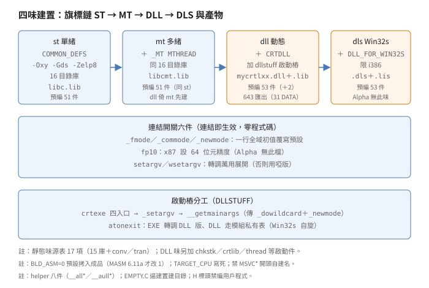
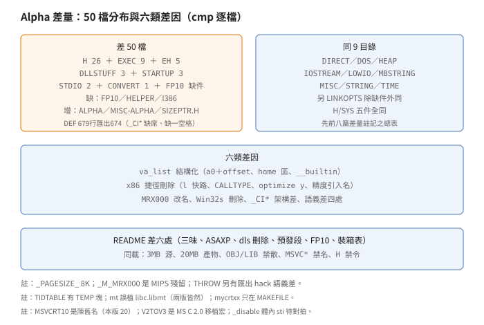

# 收尾：連結選項、啟動樁、Alpha 差量與四味建置

## 結論

（名詞細節見推導各節，
此處先給全貌。
自造詞先定義：
開關＝連結即生效的 OBJ、
樁＝啟動期膠合碼、
四味＝四種函式庫建置。）

`LINKOPTS`（8 項 6 源）
是六個連結開關：
`binmode／commode／newmode`
各一行全域初值
（`_fmode／_commode／
_newmode`），
連結即覆寫預設；
`fp10` 設 x87 為 64 位元
精度；
`setargv／wsetargv`
轉調萬用展開
（萬用＝命令列
`*／?` 展檔名）。
`README` Part 4
把六者與 `CHKSTK`
並列為
可建 `OBJ` 全表。

`DLLSTUFF`（16 項）
是 DLL 模型的啟動樁：
`crtexe` 管四入口
（`main／wmain／WinMain／
wWinMain` 加 `CRTStartup`，
`__try／__except` 護全程、
`_setargv` 展萬用、
`__getmainargs` 取參），
`crtlib` 是 DLL 本體
（含 `_aexit_rtn`、
TLS 配置、
Win32s TLS 0-2
迴避），
`crtdll` 是各 DLL 的
C++ 建構樁
（檔頭 `MSVCRT10.DLL`
是陳舊名，
本版應為 20），
`cinitexe` 釘
C++ 段樁到 EXE，
`atonexit` 判
EXE／DLL 分流
（EXE 轉調 DLL 版、
DLL 走模組私有表、
Win32s 下 `Sleep(0)`
自旋互斥），
`dllargv` 是啞
`_setargv`
（連結 `SETARGV.OBJ`
才被取代），
`wildcard` 放
`_dowildcard` 初值，
`dllsupp` 定三個
公開常數
（`_except_list／
_fltused／_ldused`）。

`HELPER`（5 項）
只有一個空 C 檔
（逼建置系統建目錄）
加 8 個 x86 組譯
64 位元 helper
（`__alldiv／__allmul／
__allrem／__allshl／
__allshr／__aulldiv／
__aullrem／__aullshr`；
左移不分號、
乘法二補數通用，
故無 `ullmul／ullshl`）。
`I386`（7 項）
是預編成品：
四味各 51／51／53／53 件
（DLL 味多
`DLLSUPP` 與 `FP8`），
`CONV.LIB／TRAN.LIB`
是無源碼的浮點兩庫
（`ar` 見 `sti386.obj`
路徑、
`87*` 系列），
`_SAMPLE_.DEF`
列 643 個匯出
（31 個 `DATA`），
`BLD_ASM=0` 時全靠拷入。

`H`（75 項）
是建置專用標頭：
`README` 明禁拿去編
用戶程式；
19 件標 `[Internal]`，
`WIN32S.H` 獨大
（1104 行，
Win32s 專用結構）；
`V2TOV3.H` 是
MS C 2.0 移植宏
（`O_RAW` 等化石）；
`SYS/` 五件
（`locking／stat／
timeb／types／utime`）。

Alpha 版
（`VC20CRTA`）
是同源雙器：
README 差六處
（三味無 Win32s、
`ASAXP` 組譯器、
`dls` 段刪除、
預發段新增、
`FP10` 刪除、
裝箱表附全量），
C／C++ 源差 50 檔
（49 差加 `FP10.C`
缺件 1）：
`H` 26（`va_list`
改結構、
`_M_IX86` 枝刪除、
`_M_MRX000` 改名
`_M_ALPHA`、
`_PAGESIZE_` 8K）、
`EXEC` 9（八 `l` 系列
刪 x86 捷徑、
`CENVARG` 刪
`#ifndef _M_IX86`
兩行）、
`EH` 5（`THROW` 檔頭改版、
`FRAME` 取
`DispatcherContext`)、
`DLLSTUFF` 3、
`STARTUP` 3、
`STDIO` 2、
`CONVERT` 1、
`FP10.C` 缺件；
9 目錄零差異；
目錄差為缺
`HELPER／I386`、
增 `ALPHA/`
（預編三味）
與 `MISC/ALPHA/`
（22 `.S` 加 2 `.HS`）、
`H/SIZEPTR.H` 獨有。

建置是四味拓樸
（拓樸＝目標依賴圖，
箭頭表旗標疊加）：
`nmake st／mt／dll／dls`
（小寫是目標名，
大寫是旗標或目錄名，
下同；
`MAKEFILE:11` 註、
`:252／:281` 起實作），
`libc.lib／libcmt.lib／
mycrtlxx.dll／.dls`
（`:217` 起，
`.lis` 是 Win32s 版
引入庫），
旗標鏈
`ST → MT(+_MT) →
DLL(+CRTDLL) →
DLS(+DLL_FOR_WIN32S)`
（`:212` 起），
`TARGET_CPU` 寫死
`i386`／`alpha`。

## 盤點

`VC20CRTL/LINKOPTS` 8 項：
`BINMODE／COMMODE／FP10／
NEWMODE／SETARGV／WSETARGV`
6 源加
`LSOURCES／DEPEND.DEF`。
`VC20CRTL/DLLSTUFF` 16 項：
`ATONEXIT／CINITEXE／CRTDLL／
CRTEXE／CRTEXEW／CRTLIB／
DLL_ARGV／DLLARGV／WCRTEXE／
WCRTEXEW／WDLLARGV／
WILDCARD`
12 源、
`I386/DLLSUPP.ASM`、
`LSOURCES／DEPEND.DEF／
SPECIAL.MAK`。
`VC20CRTL/HELPER` 5 項
（子目錄計 1 項，
下同）：
`EMPTY.C`、
`I386/` 8 個 `.ASM`、
`LSOURCES／DEPEND.DEF／
SPECIAL.MAK`
（`LSOURCES:4-12` 列 9 個
`OBJ`，
含 `empty.obj`）。
`VC20CRTL/I386` 7 項：
`ST_LIB／MT_LIB／DLL_LIB／
DLS_LIB／WIN32S`
五目錄、
`_SAMPLE_.DEF`、
`SDKNAMES.LIB`
（6K，
SDK 名引入庫）。
`VC20CRTL/H` 75 項
（含 `SYS/` 目錄與
`CRUNTIME.INC／MM.INC`
兩組譯引入）。
`VC20CRTA/CRT/SRC`
缺 `HELPER／I386`、
增 `ALPHA/`、
餘目錄與 x86 同名。

## LINKOPTS：六開關

三個開關各一行
全域初值：
`int _fmode = _O_BINARY`
（`BINMODE.C:18`，
全檔除檔頭含入外
就這一行有效碼）、
`int _commode = _IOCOMMIT`
（`COMMODE.C:18`）、
`int _newmode = 1`
（`NEWMODE.C:20`，
檔頭註明 2.0 起預設
`malloc` 敗不調
new 處理器，
連結此物恢復
2.0 之前的舊行）。
原理是弱覆寫
（連結器只在符號
未解時拉函式庫成員，
命令列 `OBJ` 先佔位，
函式庫版即不連入，
故覆寫零程式碼）：
CRT 預設值住函式庫
（`LOWIO/TXTMODE.C:16`
`_fmode = 0`、
`STDIO/NCOMMODE.C:17`
`_commode = 0`、
`HEAP/_NEWMODE.C:24`
`_newmode = 0`），
連結開關版優先。
`FP10.C`
（`:20`）
`_controlfp(_PC_64,
_MCW_PC)` 設 x87
為 64 位元精度
（`_PC_64` 是精度控制值
（64 位元尾數）、
`_MCW_PC` 是遮罩，
`FLOAT.H:151-152`；
10 位元組
`long double` 模式；
README 稱
64-bits to 80-bits，
尾數與總寬兩種口徑，
皆對）；
Alpha 版無此檔
（x87 專屬）。
`_setargv／_wsetargv`
（`SETARGV.C:36`、
`WSETARGV.C` 同式）
直轉
`__setargv／__wsetargv`
（源在
`STARTUP/STDARGV.C`
（兩版皆有），
`SETARGV.C:19` 的
`stdargv.asm`
寫法已過時，
屬檔頭化石）；
不連結此物就用
啟動碼內建的啞版
（見下節 `dllargv`）。
`README` Part 4
列可建 `OBJ`：
x86 七件
（上六加 `CHKSTK`
（堆疊探測，
見啟動篇））、
Alpha 六件
（無 `FP10.OBJ`
兩行，
與缺件對應）。

## DLLSTUFF：四入口與分流

`CRTEXE.C` 是 EXE 側
啟動樁
（與 `STARTUP` 的
`crt0.c` 銜接，
此處只論 DLL 模型
增量）：
四入口
`main／wmain／WinMain／
wWinMain` 加 `CRTStartup`
（`:130` 起），
全程 `__try／__except`
（`:163`，`:159` 是註），
調 `_setargv()`
（`:187`，
啞版或萬用版）、
`__getmainargs／
__wgetmainargs`
取參
（`:207／:210`，
傳 `_dowildcard` 與
`_newmode`）。
`_setdefaultprecision()`
（`:56` 宣告、
`:191` 呼叫點，
限 `_M_IX86`，
Alpha 版整段刪除），
實作由 `FP10.C` 提供
（連結開關；
`CONV.LIB` 二進位內
亦含同名字串，
是否為預設實作屬未知）。
`CRTEXEW／WCRTEXE／
WCRTEXEW`
三件只是旗加包含
（各 20 行上下），
四檔實際映射經
`CRTEXE.C:127-143`
兩層 `#ifdef`
展開為
`main／WinMain／wmain／
wWinMain` 加 `CRTStartup`。
`CRTEXEW.C:2,7` 自稱
`_wmainCRTStartup`
（寬字 console），
實際 `:14` 只下
`_WINMAIN_`，
展開為
`WinMainCRTStartup`
（窄字 GUI），
檔頭化石。
`WCRTEXE.C` 無
`CRTDLL` 門控
（直下旗），
與餘兩件不對稱。
`WILDCARD.C`
（`:16`）
`int _dowildcard = 0`
限 `CRTDLL`
（註明應進
`internal.h` 而未進）。
`DLLARGV.C／WDLLARGV.C`
是啞 `_setargv`
（檔頭自述：
不連結 `SETARGV.OBJ`
就用此物，
萬用旗不設）。
`DLL_ARGV.C` 反而是
致能件：
`__setargv(){_dowildcard
=1;}`
（`:49-58`，
檔頭 `:7-11` 明寫
連結 `SETARGV.OBJ`
才連入）。

`CRTLIB.C` 是 DLL 本體：
`_aexit_rtn` 初指
`_exit`
（`:67`）、
`__getmainargs` 實作
（`:118` 起）、
`_amsg_exit`、
`_crtTlsAlloc`
（`:338` 起，
Win32s 迴避：
TLS（執行緒區域儲存，
每執行緒私有槽）
0 到 2 號
Win32s 先佔用又發給用戶、
覆寫用戶資料，
故迴圈跳過，
Alpha 版整函刪除）。
另 `:636-843`
（限 `_M_IX86`，
Alpha 整段刪除）
是 `__p_` 存取函式群：
`AFNAME／AFRET`
兩宏批量生成
（per-process 變數的
取值函式層，
CRTDLL 資料匯出用）。
`CRTDLL.C` 是各 DLL 的
C++ 建構樁：
`_DllMainCRTStartup／
_CRT_INIT` 調
`_initterm(__xc_a,
__xc_z)`
（`__xc_*` 是 C++
初化器表頭尾，
`CRTDLL.C` 檔頭宣告）；
檔頭 `MSVCRT10.DLL`
（`:9`）
是陳舊名
（1.0 版 DLL 名，
本版應為 `MSVCRT20`，
見 `MAKEFILE`
`:28` 註），
屬註解化石。
`CINITEXE.C`
（`:21` 起）
釘兩對四段
（`XIA／XIZ、XCA／XCZ`）
到 EXE
（註明初化器住用戶
EXE 資料段，
段樁必須同在），
另 `:33-34` 以
`.drectve` 指示合併
`.CRT` 段進 `.data`
並預設連結
`kernel32.lib`。
`ATONEXIT.C`
判 EXE／DLL 分流：
`__win32sflag` 首次
`GetVersion` 判定
（`:97`，
低位元組主版號 3
加最高位元即 Win32s
（Win32s＝跑在
Windows 3.x 上的
32 位子集，
見 misc 篇）、
存靜態旗後續免問）、
Win32s 下
`Sleep(0)` 自旋互斥
（`:112`，
測旗被佔就讓出
時間片重測，
註明假設測設之間
不切換行程）、
`__onexitbegin == -1`
為 EXE
（-1 由 EXE 啟動碼
`CRTEXE.C:170`
寫入，
DLL 側維持表頭指標，
故判值即判身分），
（轉調 DLL 版
`*_imp___onexit`
（`_imp_` 是引入跳表
前綴，
即 DLL 匯入函式），
`:79-83`，
分 `_M_IX86` 兩名，
Alpha 版整段刪除）、
否則 `__dllonexit`
走模組私有表。
`DLLSUPP.ASM`
35 行定三常數：
`_except_list／_fltused／
_ldused`
（`:26／:29／:32`）。

## HELPER 與 I386：helper 與成品

helper 是編譯器
自動插入呼叫的
運行期函式
（用戶不直調，
編譯器遇 64 位元
運算即生成呼叫）。
8 個 helper 按號分工：
有號除／乘／餘
（`__alldiv／__allmul／
__allrem`）、
無號除／餘
（`__aulldiv／__aullrem`）、
左移／右移
（`__allshl／__allshr／
__aullshr`）。
`LLMUL.ASM:12` 註明
二補數下乘法不分號
（故無 `ullmul`），
`LLSHL.ASM` 註明
左移不分號
（故無 `ullshl`）。
呼叫約定見
`LLDIV.ASM:26` 起：
QWORD（64 位元
四字組）參數壓棧
（除數、被除數
各 8 位元組依序壓）、
商回 `EDX:EAX`、
被調清棧
（`ret 16`，
`LLDIV.ASM:203`、
`LLMUL.ASM:74`）。
左移不分號因移位
只搬位元不判號、
乘法不分號因二補數
低位乘積與號無關、
除餘分號因商號與
餘數截斷方向有關。
`EMPTY.C` 三行：
逼建置系統建目錄。
`HELPER/SPECIAL.MAK`
與 `DIRECT` 同式：
`BLD_ASM==0` 逐件拷入
（8 段全列）。

`I386` 四味件數：
`ST／MT` 各 51、
`DLL／DLS` 各 53，
差只在
`DLLSUPP.OBJ／FP8.OBJ`
（`diff` 證實、
`ST` 對 `MT` 零差），
`WIN32S/` 只有
`_SAMPLE_.DEF`。
`CONV.LIB`（21K）
與 `TRAN.LIB`（56K）
`ar t` 見
`sti386.obj` 路徑：
前者 12 件
`fltinf／fpinit／
fp8／cfin／cfout／cvt／
x10fout／intrncvt／
constpow／tenpow／
mantold／strgtold`
（轉換系，
判準見下），
後者 `filter／fsqrt／
frnd／huge／ieee87／
fpctrl／ftol／87*`
（超越系，
`87tran／87trig` 等）。
分類判準只看檔名：
`cvt／cfout／tenpow`
（轉換字根）歸轉換系、
`87tran／87trig／fsqrt`
（87 協處理器字根
加超越函數名）歸超越系，
屬強推論
（無源碼，
檔名或有誤導）。
`_SAMPLE_.DEF`
（DEF＝模組定義檔，
列 DLL 匯出表；
引入庫是連結期用的
跳表庫，
執行期再綁 DLL）
643 行匯出
（31 個 `DATA`
（資料匯出，
相對函式匯出），
`atexit DATA` 等），
`DESCRIPTION` 寫明
自建 DLL 範本。
Alpha 版 `ALPHA/`
三味各 43 件
（無 `DLS`，
`_SAMPLE_.DEF`
總行 679、
匯出 674
（x86 總行 648、
匯出 643，
口徑統一），
`_CI*` 十六件與
`_control87` 缺席，
`abnormal_termination`
缺席，
`DESCRIPTION`
`Librarybased`
（x86 `Library based`，
缺一空格））。

## H：建置專用標頭

75 項分兩群：
18 件標 `[Internal]`
（x86 樹實測；
Alpha 樹 19 件，
多 `SIZEPTR.H`；
`MTDLL` 與 `EH*`
檔頭無此標，
不計），
餘為類公開標頭
（`STDIO／STDLIB` 等，
但 `README` Part 3
明禁拿去編用戶程式，
只能用
`MSVC20\INCLUDE`）。
`WIN32S.H` 獨大
1104 行
（`DLL_FOR_WIN32S＋
CRTDLL` 門控，
全域結構大包）。
`V2TOV3.H` 是
MS C 2.0 移植宏
（`:2`，
`O_RAW` 映 `O_BINARY`
（`:17`）等，
1985 到 1990 版權）。
`AWINT.H`（43 行，
`:24-37`）
是 `AW_*` 六件的
A／W 包裝函式宣告
（`__crtCompareString／
GetLocaleInfo／LCMapString／
GetStringType` 各 A／W 雙版
加 `GetCommandLineW／
GetEnvironmentStringsW`，
全文無 `USE_`，
與 misc 篇銜接）。
`SYS/` 五件兩版
逐位元組同。
`SIZEPTR.H` 是
Alpha 獨有
（`INPUT.C` 引用，
x86 版無此檔）。

## 建置：四味拓樸

（圖一看圖順序：
先看上排四味盒的
旗標疊加與產物、
再看中框六開關、
末看下框啟動樁
呼叫鏈。）

`MAKEFILE` 四目標
（`:12` 起）：
`st／mt／dll／dls`，
預設全建。
產物
（`:217` 起）：
`libc.lib／libcmt.lib／
mycrtlxx.dll／.dls`，
引入庫 `.lib` 與
Win32s 版 `.lis`，
`dls` 限 `i386`
（`:222` 起）。
旗標鏈
（四味編譯旗逐級疊加，
`:212` 起）：
`ST` 基底
（`COMMON_DEFS`、
`CC_OPTS -Oxy -Gds
-Zelp8 -W3`，
`:208`）、
`MT` 加 `_MT／MTHREAD`、
`DLL` 加 `CRTDLL`、
`DLS` 加
`DLL_FOR_WIN32S`。
`MAKE_DIRS` 16 目錄
（`:69`，
無 `dllstuff`）、
`MAKE_DIRS_DLL` 加之
（`:87`，
無 `linkopts`）；
靜態味源表 17 項
（`:108`，
15 庫（無 `linkopts`，
其 OBJ 直連不組庫）
加 `conv.lib／tran.lib`）、
DLL 味另加
`chkstk／crt0dat／
crt0fp／crtlib／mlock／
thread／tidtable／
wild` 等啟動件
（`:130`）。
`TARGET_CPU` 寫死
（`:193`，
不讀環境）。
`MAKEFILE.SUB`
是通用子模：
`BLD_ASM=0`
（`:24`，
有 MASM 6.11a 才改 1）、
`NOBUILD_ST／MT／DLL`
三開關、
`DEPEND.DEF` 手動
`NMAKE DEPEND` 重建
（README 稱不保證全對）。
`SAMPLE_DLL／LIB／DEF`
（`:31／:39／:47`）
三變數定自建名，
禁 `MSVC*` 開頭
（`:21` 起），
對應出貨
`MSVCRT20.DLL／
MSVCRT.LIB`
（與 `CRTDLL.C:9`
陳舊名互證，
回指 DLLSTUFF 節）；
改名後須同步更名
`_SAMPLE_.DEF`
（`:42-44`）。

## Alpha：同源雙器

（圖二看圖順序：
先看左熱框差 50 的
分項與缺增件、
再看右框同 9 目錄、
末看中框六類差因
與下框 README 差。）

Alpha 版 README
（`VC20CRTA/CRT/SRC/
README.TXT`）
與 x86 版同骨五段，
差六處：
X86／Alpha 族名、
三味無 Win32s
（`st／mt／dll`）、
組譯器 `ASAXP.EXE`
（對 MASM 6.11）、
`dls` 段落刪除
（含 `.DLS` 副檔名
與 `builting` 誤植段）、
預發組譯器段落新增
（成品與出貨同、
自建未必同）、
Part 4 刪 `FP10.OBJ`
兩行、
Part 5 附全量裝箱表
（x86 版只列到
`CONVERT` 首段，
且上游裝箱表自帶
三誤植：
`I386\MSVCRT20.DEF`
對實物 `_SAMPLE_.DEF`、
`OSTDIV.S` 對實物
`OTSDIV.S`、
`STRING\STRLEN.C`
有目無檔
（兩版皆無此檔））。
`mt` 誤植
`libc.libmt`
（`:61`）
兩版皆然。
`mycrtxx` 短名只在
Alpha `MAKEFILE:30,38`，
兩版 README
皆寫 `MYCRTLXX`，
互不一致。
兩版同載：
3MB 源、20MB 產物、
`LIB／INCLUDE／PATH`
三變數、
`dll` 倚 `mt`、
`NMAKE DEPEND`、
清理目錄各隨 CPU
（`stalpha.obj` 對
`sti386.obj`），
LNK4006／4070／4077
（連結警告，
README 稱原版可忽略）
可忽略、
MFC（微軟基礎類別庫，
README 稱源隨編譯器附）
已附、
H 禁令、
功能等價但二進位
未必同
（預發工具所致）、
OBJ／LIB 禁散、
EXE／DLL 可散、
`MSVC` 開頭禁名。

差量總表
（`cmp` 逐檔比位元、
`diff` 看行差、
`ar t` 列庫成員、
`comm` 比檔名清單，
C／CXX／H／INC；
受詞是檔名清單與
行差，
非 OBJ 內容）：
50＝49 差加
`FP10.C` 缺件 1。
50 檔差、
9 目錄共有檔同
（`DIRECT／DOS／HEAP／
IOSTREAM／LOWIO／
MBSTRING／MISC／STRING／
TIME` 兩版共有檔
逐位元組同，
但 `STRING／MBSTRING`
Alpha 側另有增件；
另 `LINKOPTS` 除缺件外同、
`H/SYS` 全同）。
差因六類：
`va_list` 結構化
（Alpha 傳參用暫存器、
home 區留影、
`STDARG.H` 檔頭自述
六整六浮；
`STDARG／VARARGS／
INTERNAL／CRUNTIME`
四檔，
`a0＋offset`、
home 區六整六浮、
`__builtin_va_start`），
x86 捷徑刪除
（`EXEC` 八 `l` 系列
`_M_IX86` 快路、
`CENVARG` 兩行、
三向量檔 `CALLTYPE`、
`MLOCK` 兩處
`optimize("y")`、
`CRTEXE` 精度段
與 `_IMP_` 引入段、
`ATONEXIT` 引入名段、

`_M_MRX000` 改名
（`_M_*` 是目標 CPU
編譯巨集；
`MRX000` 是 MIPS
分支舊巨集
（`CRUNTIME.H:44`
並列 MIPS or ALPHA），
改 `_M_ALPHA`：
`CRUNTIME／HEAP／
OUTPUT／CRT0DAT`
等，
`_PAGESIZE_` 8K 另增），
Win32s 段刪除
（`CRTLIB` TLS 迴避、
`TIDTABLE` 宣言），
CPU 架構差
（`_SAMPLE_.DEF`
`_CI*` 十六件
（x87 超越 helper 名，
Alpha 缺席；
Alpha 仍有
`TRAN.LIB`，
故非功能缺席）），
語義差四處
（`FRAME` 取
`DispatcherContext`
合成（另有 unwind
語義塊與檔頭改版，
124 行差）、
`_FPTOSTR` 截尾一字、
`INPUT` 增引
`SIZEPTR.H`、
`THROW` 匯出 hack）。
三向量檔
（`EHVECCTR／EHVECCVB／
EHVECDTR`）差在
`CALLTYPE __thiscall`
`_M_IX86` 段刪除
（`:19-23` 等，
歸 x86 捷徑刪除）。
`THROW.CXX` 另計語義差：
`:30` 去 `static`、
`:88` 起 CRTDLL
匯出 hack
（`.drectve` 掛
`-export:_CxxThrowException`，
門控含 `_M_MRX000`），
檔頭 `THROW.CPP`
舊名另計。
缺件三處：
`FP10.C`、
`HELPER/`、
`I386/`；
增件五處：
`ALPHA/`、
`MISC/ALPHA/`
（22 `.S` 加 2 `.HS`）、
`EH/ALPHA/`
（`BRIDGE.H／EHUNWIND.H／
TRNSCTRL.CXX`）、
`STRING/ALPHA/`
（`STRCAT.C` 加 3 `.S`）、
`STRING` 23 `.C`、
`MBSTRING` 2 `.C`
（`comm` 實測，
x86 側同名功能
以預編 `OBJ` 存在，
故增 C 源）。

## 認法

（認＝在二進位裡
辨認本版特徵，
以下全是強推論，
無工具鏈對拍。）

連結開關認初值：
`_fmode／_commode／
_newmode／_dowildcard`
四全域。
啟動樁認四入口名
加 `__getmainargs`；
DLL 認 `_aexit_rtn`
與 `_DllMainCRTStartup`。
helper 認
`__alldiv／__aulldiv`
八字首
（`__all*／__aull*`）。
預編成品認
`sti386.obj` 路徑串
與 `87*` 檔名群。
Alpha 認
`va_list` 結構
（`a0＋offset`）、
`_PAGESIZE_` 8K、
`mycrtxx` 短名、
`MSVCRT10` 陳舊串
（兩版皆有）。

## 證據與未知

（已證實＝原文或實測
直接支持；
強推論＝證據充分但
缺一手確認；
未知＝無證據。
下同系列慣例。）

- 已證實（原文）：
  六開關初值、
  四入口、
  段樁、
  EXE／DLL 分流、
  啞 `setargv`、
  三常數、
  八 helper 分工、
  四味件數、
  兩庫成員、
  643 匯出、
  H 內外、
  四味拓樸、
  旗標鏈、
  Alpha 三味、
  50 檔差量、
  六類差因、
  缺增件。
  行號見各節，
  皆親讀去 `\r` 原文
  或 `cmp／diff／ar`
  實測。
- 已證實（比對）：
  差量總表、
  `_SAMPLE_.DEF`
  行數差、
  `SYS/` 全同。
- 強推論：
  認法節全部、
  `MSVCRT10` 陳舊解讀。
- 未知：
  `CINITEXE` 段樁的
  連結期行為、
  `CONV／TRAN` 內部
  演算法
  （無源碼，
  只列成員）、
  出貨 `LIB` 的對拍
  （無 Win32 工具鏈，
  留待後續）。
