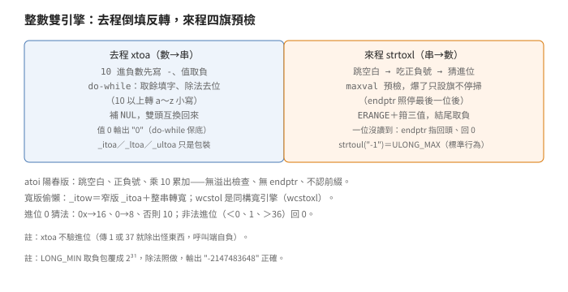
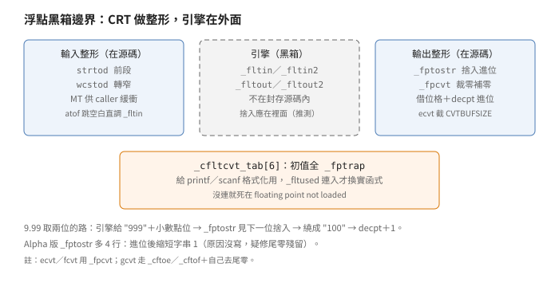

# 轉換：整數雙引擎、浮點黑箱、字元雙生

## 結論

`CONVERT` 目錄管三種轉換：整數來回、
浮點來回、字元分類與大小寫。
整數去（數字轉字串）叫 `xtoa`
（內部 helper，`x` 表任意進位）：
倒著填數字、再雙頭反轉回來，
只有 10 進位的負數加負號，
`_itoa／_ltoa／_ultoa` 只是三個包裝。
整數來（字串轉數字）叫 `strtoxl`：
跳空白、吃正負號、猜進位、
逐字累加——先算乘完不溢出的上限
（`maxval ＝ ULONG_MAX／進位`），
比上限判爆，爆了設 `ERANGE`
並箝制（clamp，超界取邊界值）
到三個極值之一。

`atoi／atol` 不調 `strtol`，
自己寫迴圈：跳空白、正負號、
`total ＝ 10×total＋digit`——
沒有溢出檢查，爆了就包覆。
寬版轉換偷懶：`_itow` 先調窄版
`_itoa`、再整串 `MultiByteToWideChar` 轉寬，
不重寫引擎。

浮點引擎外置（黑箱，不在封存源碼內），
CRT 只做兩頭整形：捨入進位
（`9.99` 取兩位變 `10.0` 還要把小數點
位置加一，引擎只給數字串不管這個）
與位數截斷（符號名見推導節）。
`_cfltcvt_tab` 六格初值全是 `_fptrap`
（印 `floating point not loaded` 死）。
這張表是給 `printf／scanf` 的浮點格式化用的：
有連浮點模組（`_fltused`）才換上實函式；
沒連，格式化浮點就死在陷阱裡。
（`_ecvt／_fcvt／_gcvt` 不走這張表，
沒浮點庫是連不上、不是死陷阱。）

字元分類是巨集函式雙生：
`isalpha(c)` 巨集走查表
（多位元組碼頁改走 `_isctype`），
另有一個同名函式本體只做
`return isalpha(c)`——給要取函式位址的人用。
`_isctype` 拿屬性位元遮罩查
（`_UPPER` 就是大寫位）：-1 到 255 查表，
以外走 `__crtGetStringTypeA` 包裝；
六個遮罩用 `#error` 鎖死跟 `winnls` 一致，
對不上編不過。
`tolower` 三層：C locale 手算、
非 C 先查表（不是大寫直接回）、
再走 NLS。
多位元組轉寬字元 MT 版只是加鎖調 `_lk` 版，
另斷言 `MB_CUR_MAX` 是 1 或 2。

`STRTOQ.C` 442 位元組只有檔頭
（DEC 版權）：`strtoq／strtouq` 沒實作，
是樁檔。`_swab` 奇數長度少拷一個位元組
（只拷 `nbytes-1`）。

## 根本問題

轉換函式卡在兩個世界之間：
人讀的字串（十進位、小數點、正負號、
空白）和機器存的數（二進位、IEEE 754）。
整數來回是精確的（除了溢出），
可以全寫在 CRT 裡；浮點來回要正確捨入，
引擎的多倍精度運算量太大
（為什麼拆出去是推導，原文只留了拆分事實），
2.0 把它拆出去：CRT 只留介面與整形，
引擎在別處（編譯器 runtime 或數學庫，
封存源碼內沒有）。
字元分類卡的是另一條線：
locale 是語系設定（語言、碼頁、排序規則），
C locale 是預設值（英文位元組序，
沒設語系時就是它）；NLS 是作業系統的
語系服務。C locale 查表最快，
非 C locale 得問 NLS（碼頁、語系都會變），
同一個函式要有兩條路。

## 推導

### 去程 xtoa：倒填加雙頭反轉

<p align="center"></p>

`xtoa` 吃無號長整數、緩衝區、
進位、負號旗四個參數。
負號旗只在「10 進位且值為負」時設：
先輸出 `-`、值取負（轉無號再做，
`LONG_MIN` 取負包覆回來剛好是 2³¹，
後面除法照做不誤）。

主迴圈 `do-while`：取餘得一位、
除法去一位，10 以上轉 `a` 到 `z`
（小寫，`digval-10+'a'`），
以下轉 `0` 到 `9`。
數字在緩衝區裡是倒的，
結尾補 NUL 後雙頭互換回來。
`do-while` 保證至少跑一輪——
值 0 輸出 `"0"`，不是空字串。

三個包裝只差怎麼傳參：
`_itoa` 管 `int`、`_ltoa` 管 `long`、
`_ultoa` 傳無號且永不設負號旗。
進位檢查不在這裡（註解沒寫、
程式沒驗——傳 1 或 37 就除出怪東西，
呼叫端自負）。

寬版（`XTOW.C`）不重寫：
調窄版 `_itoa` 填窄緩衝，
再 `MultiByteToWideChar` 整串轉寬。
`WTOX.C` 反向同式。
窄轉寬兩次工，但程式少兩份引擎。

### 來程 strtoxl：四旗加預檢

`strtol／strtoul／wcstol` 共用
`strtoxl`（寬版是同構的另一份），
第四個參數說自己是無號還是有號。
四個旗管狀態：無號、見過負號、
溢出、讀過至少一位。

順序：跳空白（`isspace`）、
吃一個正負號（記旗，`+` 直接丟）、
驗進位（小於 0、等於 1、大於 36
就 `endptr` 指回頭、回 0；
`endptr` 是輸出參數，指轉換停下的位置）、
進位 0 就猜（`0x` 開頭 16 進位、
`0` 開頭 8 進位、否則 10 進位）、
16 進位就剝 `0x` 前綴。

先算乘完不溢出的上限再比上限判爆：
`maxval ＝ ULONG_MAX／進位`，
`number ＜ maxval` 一定安全；
等於才比餘數
（`digval ≤ ULONG_MAX％進位`）。
會爆就不乘、只設溢出旗——
但掃描繼續（`endptr` 要停在
最後一位數字後面，不管爆沒爆）。

收尾：一位都沒讀到就 `endptr` 指回頭、回 0；
溢出（或有號版超過 `LONG_MAX／LONG_MIN` 範圍）
就 `errno ＝ ERANGE` 並箝制：
無號版箝 `ULONG_MAX`，
有號版按正負箝 `LONG_MAX／LONG_MIN`；
最後有負號旗就取負。
注意 `strtoul("-1")`：負號照吃、
結果取負包覆——回 `ULONG_MAX`，
這是標準行為不是 bug。

### atoi：陽春迴圈，無溢出檢查

`atoi／atol` 不調 `strtol`：
跳空白、記正負號、
`total ＝ 10×total＋digit` 累加、
負號取負。四行搞定，
代價是沒有溢出檢查、沒有 `endptr`、
不認進位前綴（`"0x10"` 讀成 0）。
要哪個語意用哪個函式，
名字像不代表同路。

### 浮點：黑箱加整形

<p align="center"></p>

`strtod` 調 `_fltin(ptr, len, 0, 0)`，
`atof` 自己跳空白後也直調 `_fltin`
（不經 `strtod`）；MT 版改調 `_fltin2`，
多傳一個 caller 供的結構
（引擎的暫存不放全域，放呼叫端給的塊）。
`wcstod` 先 `malloc`、用 `wctomb` 逐字迴圈轉窄
（這塊 `malloc` 沒 `free`，
源碼還留了兩行 `UNDONE` 自首）再調——
跟 `_itow` 同一個偷懶形狀，只是更糙。

反向 `_ecvt／_fcvt` 調 `_fltout` 拿 `STRFLT`
（四個欄：正負、小數點位置、
溢出旗、有效數字串），
再 `_fpcvt` 截斷位數（超過 `CVTBUFSIZE-2` 就截）
轉調 `_fptostr`。
`_gcvt` 不走 `_fpcvt`：先看數量級，
大小用 `_cftoe`（科學記號）、
中間用 `_cftof`（定點），
再自己迴圈去尾零。
`_fptostr` 管捨入：緩衝區第 0 格先放 `'0'`
（不是 NUL——進位溢出時的借位格；
形狀如 `0｜9｜9｜9`，第 0 格專收溢出進位），
數字拷進去，不夠位補 `'0'`；
下一位 `≥'5'` 就從尾往前繞
（`9` 變 `0` 繼續進位），
繞到第 0 格變 `'1'` 就小數點位置加一，
否則整串左移吃掉借位格。
`9.99` 取兩位就是這樣變成 `10.0` 的。

`_cfltcvt_tab` 六格初值全 `_fptrap`，
是給 `printf／scanf` 格式化浮點用的
（`input.c／output.c` 調表上的
`_cfltcvt／_cropzeros／_fassign／_forcdecpt／
_positive／_cldcvt` 六個槽）；
`_fltused` 模組連進來才由 `_cfltcvt_init`
換上實函式，沒連就死在
`floating point not loaded`。

Alpha 版 `_fptostr` 多 4 行：
進位後把字串縮短 1
（跟 x86 分歧，原因沒寫，
看起來像修尾零殘留，屬強推論）。

### ctype 雙生：巨集給速度，函式給位址

`_CTYPE.C／_WCTYPE.C` 通篇同一個形狀：
`int (isalpha)(int c) { return isalpha(c); }`。
函式名加括號是 C 的標準抑制技巧：
定義處的巨集不展開，裡面調的才是巨集版。
巨集版按 `MB_CUR_MAX` 分流：
多位元組碼頁走 `_isctype`，
單位元組才查 `_pctype` 表。
要速度的 include 標頭走巨集，
要函式指標的連這檔。
只要 C 標準有的分類函式，
這裡全有一份，名字一個不差。

`_isctype(c, mask)` 是通吃版：
-1 到 255 查表跟屬性位元遮罩比
（`_UPPER` 就是大寫位），
以外拼成一兩個位元組的字串、
調 `__crtGetStringTypeA` 包裝問系統，
問不到回 0。
六個遮罩跟 `winnls` 的 `C1_*`
用 `#error` 鎖死：
兩邊定義對不上，編譯直接死。
（寬版 `iswctype` 同形，
走 `GetStringTypeW`；
另有舊名 `is_wctype` 轉發。）

### tolower 三層與 mbtowc 雙生

`tolower`：C locale 手算
（`isupper` 才加 `'a'-'A'`）就解鎖回；
非 C locale、`c＜256` 且不是大寫，
查表直接回；否則拼多位元組串走 NLS。
三層由便宜到貴，前面擋掉就不花後面。
（同檔另有 `_tolower`：無條件套轉換巨集，
不驗大小寫，給確定是大寫的人用。）

`mbtowc／wctomb／mbstowcs／wcstombs`
MT 版只是加 `_LC_CTYPE_LOCK` 調 `_lk` 版。
`_mbtowc_lk` 斷言 `MB_CUR_MAX` 是 1 或 2
（這版只支援一兩個位元組的碼頁），
單字節或長度不夠直接判，
否則 `MultiByteToWideChar`。
`mblen／_mbstrlen` 同一個斷言。

### 樁檔與邊角

`STRTOQ.C` 442 位元組：DEC 版權檔頭之外
什麼都沒有。`strtoq／strtouq`
（64 位元整數轉換，Alpha 時代的預告）
在這包沒實作——要調就連不上。
（跟 `STRING／ALPHA` 的三支 DEC `.S` 對讀：
那三支有實作，這支沒有。）

`_swab` 偶奇位元組互換搬移：
`nbytes` 是奇數就只搬 `nbytes-1`，
最後一個位元組不動。
註解寫在檔頭，用前自己看。

## 在執行檔裡怎麼認

以下全是從原始碼推導的靜態特徵，
封存裡 `CONV.LIB／TRAN.LIB` 還沒拆開對位元組，
證據等級見證據節。

- **`xtoa` 倒填反轉**：`% radix／除法` 迴圈
  在前、雙頭互換在後，中間一個 NUL；
  只有 `radix＝10` 才比負號。
- **`strtoxl` 四旗**：`ULONG_MAX／ibase` 除法
  算 `maxval` 在前、逐字 `number＜maxval`
  比大小在後；`errno ＝ ERANGE` 三箝制
  在收尾。
- **`atoi` 陽春迴圈**：跳空白、正負號、
  乘 10 累加，沒有 `endptr`、沒有溢出分支——
  比 `strtol` 短一大截。
- **`_fptostr` 借位格**：緩衝區第 0 格寫 `'0'`、
  `≥'5'` 回繞、`decpt` 加一三件套。
- **`_cfltcvt_tab` 六格**：六個同值函式指標、
  預設全指陷阱；`conv.lib` 連了才會變。
- **ctype 雙生**：巨集版是查表式，
  函式版是跳板（進去就調巨集式）。
- **`tolower` 三層**：C locale 手算、
  表查直回、NLS 收尾，鎖頭尾包。

## 給 remake 的行為規格

以下全部來自原始碼直接寫明的介面與順序，
沒有實跑支持（無 Win32 工具鏈）。
命名與順序都與原檔無關：

```text
function spec_atoi(s):                 # 無溢出檢查、無 endptr
    skip_spaces(s)
    sign = eat_sign(s)                 # + 丟，- 記
    total = 0
    while isdigit(c): total = 10*total + digit(c)
    return -total if sign == '-' else total

function spec_strtol(s, base, unsigned):  # 四旗＋預檢
    skip_spaces(s); sign = eat_sign(s)
    if base invalid (<0, 1, >36): endptr = s; return 0
    if base == 0:                         # 猜進位：
        if s startswith 0x: base = 16     #   0x 開頭→16
        elif s startswith 0: base = 8      #   0 開頭→8
        else: base = 10                    #   否則 10
    if base == 16: strip_0x(s)
    maxval = ULONG_MAX / base
    loop digits:
        if number < maxval: number = number*base + d
        elif number == maxval and d <= ULONG_MAX % base: 同上
        else: overflow = True          # 繼續掃，endptr 照走
    if no digits: endptr = s; return 0
    if overflow or signed_range_bad:
        errno = ERANGE; clamp()        # ULONG_MAX／LONG_MAX／MIN
    endptr = stop_pos
    return -number if sign == '-' else number

function spec_fptostr(buf, digits, flt):
    buf[0] = '0'                       # 借位格
    copy digits (pad '0'), NUL 結尾
    if 下一位 >= '5': 從尾回繞進位      # 9 變 0 繼續
    if buf[0] == '1': flt.decpt += 1   # 溢出，小數點右移
    else: buf = buf[1:]                # 吃掉借位格
```

表一：整數來回對照。

| 方向 | 引擎 | 溢出 | 進位 | 空輸入 |
|---|---|---|---|---|
| 去（數→串） | `xtoa` 倒填反轉 | 不可能（除法收斂） | 呼叫端給，不驗 | 值 0 輸出 `"0"` |
| 來（串→數） | `strtoxl` 四旗 | `ERANGE` 加箝制 | 0 猜，非法回 0 | `endptr` 指回頭、回 0 |
| 陽春來 | `atoi` 迴圈 | 包覆（無檢查） | 只認 10 進 | 回 0 |

表二：浮點黑箱邊界。

| 層 | 函式 | 在不在封存源碼 |
|---|---|---|
| 輸入整形 | `strtod` 前段、`wcstod` 轉窄 | 在 |
| 引擎（串→數） | `_fltin／_fltin2` | 不在（黑箱） |
| 引擎（數→串） | `_fltout／_fltout2` | 不在（黑箱） |
| 輸出整形 | `_fptostr`、`_fpcvt` | 在 |
| 開關 | `_cfltcvt_tab` 六陷阱 | 在（`_fltused` 換實函式，給 printf／scanf 用） |

表三：字元分類路由。

| 函式 | -1～255 | 以外 | 上鎖 |
|---|---|---|---|
| `isalpha` 等巨集 | 查 `_pctype` | （同左，表涵蓋） | 否 |
| `isalpha` 等函式 | 調巨集版（跳板） | 同左 | 否 |
| `_isctype` | 查表 | `GetStringTypeA`，失敗回 0 | 否 |
| `iswctype` | 查表 | `GetStringTypeW` | 否 |
| `tolower` | C 手算／表查直回 | NLS | `CTYPE` 單鎖 |

## 證據與未知

- `xtoa` 倒填反轉、負號條件、三包裝、
  寬版偷懶：原始碼直接寫明，
  **已證實（原文）**。
- `strtoxl` 四旗、進位猜測與驗證、
  `maxval` 預檢、掃描不停、`endptr` 語意、
  `ERANGE` 三箝制、結尾取負：
  原始碼直接寫明，**已證實（原文）**。
- `atoi` 陽春迴圈無溢出檢查：
  原始碼直接寫明（累加無預檢），
  **已證實（原文）**；包覆是 C 語意的心算，
  屬**強推論**。
- `_fltin／_fltout` 黑箱邊界、MT 的 `2` 版、
  `atof` 直調、`wcstod` 逐字迴圈加洩漏：
  呼叫端原始碼直接寫明，
  **已證實（原文）**；引擎內部不在封存內，
  **未知**。
- `_fptostr` 借位格、`≥5` 回繞、`decpt` 加一、
  `STRFLT` 四欄、`_fpcvt` 截斷轉調、
  `_gcvt` 走 `_cftoe／_cftof`：
  原始碼直接寫明，**已證實（原文）**；
  Alpha 多 4 行的原因沒寫，屬**強推論**。
- `_cfltcvt_tab` 六陷阱、`_fltused` 換裝、
  給 `printf／scanf` 用：註解直接寫明，
  **已證實（原文）**。
- ctype 雙生、巨集 `MB` 分流、`_isctype` 兩路、
  遮罩 `#error` 鎖、`tolower` 三層加 `_tolower`、
  `mbtowc` 雙生加斷言：原始碼直接寫明，
  **已證實（原文）**。
- `STRTOQ` 樁檔、`_swab` 奇數少拷：
  原始碼直接寫明，**已證實（原文）**。
- 在執行檔裡怎麼認的七條：從原始碼推導，
  `CONV.LIB／TRAN.LIB` 還沒拆，
  **強推論**。
- 未知：`_fltin／_fltout` 引擎內部、
  `STRTOQ` 之外還有沒有樁。

出處：Visual C++ 2.0 CRT，`CONVERT` 目錄的
`XTOA.C／XTOW.C／WTOX.C／STRTOL.C／WCSTOL.C／
ATOX.C／STRTOD.C／WCSTOD.C／FCVT.C／GCVT.C／
_FPTOSTR.C／_CTYPE.C／_WCTYPE.C／ISCTYPE.C／
ISWCTYPE.C／TOLOWER.C／TOUPPER.C／TOWLOWER.C／
TOWUPPER.C／MBTOWC.C／WCTOMB.C／MBSTOWCS.C／
WCSTOMBS.C／MBLEN.C／_MBSLEN.C／STRTOQ.C／SWAB.C`
與 `MISC` 目錄的 `CMISCDAT.C`。
`CONV.LIB／TRAN.LIB` 還沒拆開對位元組。
