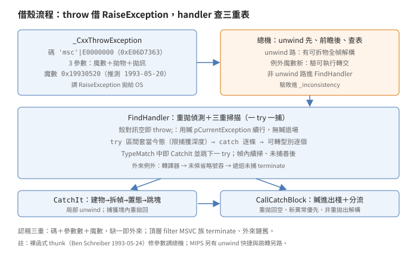
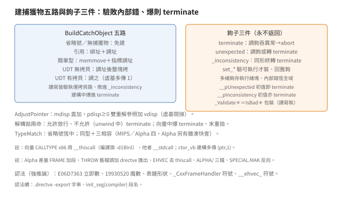

# 例外處理：NT 借殼、查表三重、鉤子三件

## 結論

（名詞細節見推導各節，
此處先給全貌。）

`EH`（12 項：10 個 `CXX` 檔
（根目錄 9 加 `I386` 轉場 1）
加建置）
是 C++ 例外的運行期：
借 NT 結構化例外（SEH，
作業系統的棧回溯機制）的殼，
裝 C++ 的型別查表機。
平台三分：
x86 與 MIPS 同源
（`_M_MRX000` 分支散各處）、
Alpha 另樹。
借殼三件：例外碼
`'msc'|0xE0000000`
（多字元常數標籤，
讀作 msc）、
3 參數
（魔數 `0x19930520`
推測即 1993-05-20、
拋物指標、拋訊指標）、
認親宏
`PER_IS_MSVC_EH`
（碼加參數數加魔數三重驗）。

`_CxxThrowException`
只做一件事：
調 `RaiseException`
（旗標不可續行）
把殼拋給 OS。
附兩招防務
（防連結與裝載踩坑）：
靜態取
`__CxxUnhandledExceptionFilter`
址
（靜態參照拉住不放，
連結器不敢當死碼消除；
`FRAME.CXX` 同款一處）、
原型與 `_ThrowInfo`
因編譯器預注入
須用同型、
故不用 `_CRTIMP`
（註解明寫此因）。
手工 `.drectve -export`
只存 Alpha 版，
x86 版註解懸空
（見差量節）。

`__InternalCxxFrameHandler`
是總機：
先判 unwind 路
（有可拆物且主註冊節點才
全幀解構到空態
`EH_EMPTY_STATE＝-1`），
有 `try` 塊再驗版本
（例外記錄的魔數新於運行期、
且拋訊附了前瞻 handler，
轉交新版 handler——
`_ValidateExecute`
（驗位址可讀寫執行者）
驗可執行才調，
否則 `_inconsistency`），
非 unwind 路進 `FindHandler`。

`FindHandler` 三重掃描：
區間套當今態的 `try`
（`tryLow≤state≤tryHigh`，
且限當今捕獲深度）、
`catch` 子句逐條、
可轉型別逐個，
中內兩層逐一調 `TypeMatch`
（省略號由其內先判恆中），
中即 `CatchIt`
並跳下一 `try`
（一 `try` 一捕，
幀內續掃，
捕獲塊重拋回來接著找）。
重拋偵測：
MSVC 殼加 `ThrowInfo` 空，
即 `throw;`，
用贓物
（`pCurrentException`，
上次捕獲存下的例外，
下稱贓）
續行；
無贓退場
（`ExceptionContinueSearch`，
下稱退場即續搜）。

外來例外
（非 MSVC 的 SEH，如整數除零）：
先調轉譯器
（`translator`，
預設 `NULL` 不譯，
轉生即轉成 C++ 型別重拋），
末條為省略號者吞，
遞迴（重入：
轉譯中又來）未捕
進 `terminate`。
MSVC 遞迴未捕
（轉譯物在本幀未捕）
先解構拋物
（不許再拋，
爆轉 `terminate`）
再退場。

`TypeMatch` 兩關：
省略號（即 `catch(...)`）恆中；
同型
（同址或名同，
名串認親推測為跨模組關鍵）
加引用、`const`、`volatile`
相容
（MIPS 與 Alpha 另加 `unaligned`）。
拋物標 `byref`（須引用接）者，
值捕獲拒配。

`CatchIt` 五步：
`BuildCatchObject` 建捕獲物
（轉換空則免建）、
`_UnwindNestedFrames` 拆內幀、
局部 unwind 到 `try` 低態、
置態到捕獲高態加一、
`_JumpToContinuation`
跳捕獲塊。
續行址空
（捕獲塊內重拋）
則回不跳。

`CallCatchBlock`
管捕獲塊的一生：
存 ESP（x86，
防塊內再 `try`）、
贓進出棧、
funclet
（小函式，
設框（設呼叫框指標）呼叫的
捕獲塊本體）
執行、
`ExFilterRethrow`
分重拋（無訊）
與新異常（優先）、
`finally` 還原 ESP 與贓、
非重拋出解構原拋物。

`BuildCatchObject` 五路：
省略號或無捕獲物免建；
引用綁調址
（調指標指向基類子物件）；
簡單型（含指標）
`memmove` 加指標調址
（定長為指標寬時）；
UDT（使用者自定型）
無拷貝函數調址後整塊拷；
有則調拷貝函數
（虛基多傳 `1`）。
讀寫四路皆驗、
執行僅拷貝路驗，
敗 `_inconsistency`、
爆 `terminate`。

`AdjustPointer`
是虛基算式：
`mdisp` 直加、
`pdisp≥0` 雙重解參照加 `vdisp`
（三位移存於 `PMD`
成員指標述）。
`DestructExceptionObject`
調 unwind 函數：
解構開關允許拋則放行、
開關禁拋（已在 unwind 中）
則吞下進 `terminate`。

鉤子三件各一形：
`terminate`
（調使用者鉤、
吞任何異常、
`finally` 進 `abort`
中止行程）、
`unexpected`
（調鉤或轉 `terminate`）、
`_inconsistency`
（同 `terminate` 形、
終轉 `terminate`）。
三鉤皆「永不返回」
（回來、爆了都另有去處）。
`set_*` 四件
（三終止鉤加轉譯器）
驗可執行才裝
（`NULL` 放行、
回舊鉤）。
多緒鉤存執行緒塊
（`_tiddata`，
每執行緒私有），
`_inconsistency` 恆全域。

`UNHANDLD` 用
`init_seg(compiler)`
（編譯器初始化段，
CRT 啟動期執行）
掛頂層 filter：
MSVC 族 `terminate`、
外來鏈舊 filter
（驗可執行，
`NULL` 或驗敗回續搜）。

向量三件
（陣列 helper
`__ehvec_ctor／ctor_vb／dtor`）：
`try` 建全陣、
`catch(...)` 倒序解構
（建構版拆已建前綴、
解構版續拆剩餘）、
解構中又拋 `terminate`、
末重拋。
`ctor／dtor` 函數指標的
呼叫慣例 x86 用
`__thiscall`
（`this` 放暫存器者）、
他者 `__stdcall`
（檔頭註明編譯旗
`-d1Binl`
方可在使用者層指定；
`__ehvec_*` 本身恆
`__stdcall`）。
`ctor_vb` 建構多傳
`(ptr,1)` 虛基旗。
「吞掉續行」之說誤，
實碼是 `terminate`。

## 根本問題

第一約束是別重寫 unwind。
NT 已有全套棧回溯：
註冊鏈、unwind 呼叫、
續行跳轉。
C++ 例外只缺型別語意：
`catch` 比對、`catch` 物建構、
部分解構。
借殼是答案：
拋用 OS 的、
找用自己的、
拆用 OS 的、
跳用自己的。
運行期只寫查表與建構，
不碰棧迴溯。

第二約束是認親。
SEH 例外人人可拋：
使用者調 `RaiseException`
可偽造任何碼。
單憑例外碼認親會錯認：
三重驗
（碼、參數數、魔數）
才開查表。
魔數推測是日期
（1993-05-20，
世代戳與版本分水嶺之說
屬強推論，
源只給數字）。

第三約束是版本前瞻。
編譯器演進、幀格式變，
舊運行期會遇到新幀。
硬解新格式等於賭：
轉交是答案，
拋訊附新 handler 位址，
驗可執行後轉交、
驗敗進內部錯。
舊執行新，
不死不猜。

第四約束是重拋無物。
`throw;` 沒有新拋物、
沒有新型別訊，
只有「續行舊拋」的意圖。
空訊即信號：
殼在、訊空，
用贓物續行。
無贓（`throw;` 在 `catch` 外）
退場，
讓外層決定生死。

第五約束是建物與收尾。
捕獲物建構會動到
使用者拷貝函數、
驗讀寫執、
虛基調址：
任一步敗都要有去處
（內部錯或終止），
不能半塊捕獲物丟著。
終止鉤永不返回：
鉤回來了、鉤爆了，
都要有下一站
（`abort` 或轉 `terminate`）。
向量倒拆同理：
中途又拋不停手，
先拆完再論罪。

## 推導

### 借殼：拋、碼、魔數

`THROW.CXX` 88 行，
本體是參數排一排調
`RaiseException`
（旗標不可續行，
`EXCEPTION_NONCONTINUABLE`，
註解「不玩恢復」）。
借殼的代價是偽裝：
任何人可調
`RaiseException`
冒充，
故認親三重
（見結論），
缺一即外來例外。

防務兩招各有典：

- 靜態取址：
  `UNHANDLD.CXX` 的
  `__CxxUnhandledExceptionFilter`
  若無人參照，
  連結器消除之、
  頂層 filter 掛空。
  `THROW.CXX` 取其址存靜態，
  拉住不放
  （靜態參照，
  連結器不敢消除）；
  `FRAME.CXX` 同款一處。
- 匯出飾詞：
  原型與 `_ThrowInfo`
  被編譯器預注入，
  須用同型才合編譯器意，
  連帶不能用 `_CRTIMP`
  （`CRTDLL` 匯出宏）。
  手工 `.drectve` 段塞
  `-export` 字串者
  只存 Alpha 版；
  x86 版註解寫了「如下」
  卻無下文
  （懸空）。

### 總機：版本、拆包、unwind

`__CxxFrameHandler`
是裸函式 thunk
（轉調小函式，
`TRNSCTRL.CXX`，
署名 Ben Schreiber 1993-05-24）：
修參數、
調 `__InternalCxxFrameHandler`。
裸函式意無 prolog／epilog
（函式進出序），
棧幀手工管。

總機三段
（unwind 先，前瞻後）：

1. unwind 路：
   有可拆物
   （最大態非零）
   且主註冊節點
   （`CatchDepth==0`）
   才全幀解構到空態，
   回續搜。
   註解「先判因較易」。
2. 版本前瞻
   （有 `try` 塊才判）：
   例外魔數大於運行期魔數、
   且拋訊附了前瞻 handler，
   驗可執行後轉交整組參數；
   驗敗 `_inconsistency`。
   同代或無附 handler 直行。
3. 餘路進 `FindHandler`
   （參數：
   拋訊 `pExcept`、
   動態節點 `pRN`、
   靜態訊 `pFuncInfo`）。

`__FrameUnwindToState`
按態倒行：
調 unwind 動作
（MIPS 驗協助位元）、
態走區域變數、
末更新註冊節點一次
（MIPS 免）。
全幀 unwind 目標 `-1`、
部分 unwind（捕獲前）
目標捕獲態。
全函式包 `__except`：
unwind 中爆吞下進
`terminate`。

### FindHandler：三重掃描

重拋偵測先行：
殼對、訊空，
取贓
（`pCurrentException`）；
贓空退場。
贓制見 `CallCatchBlock`。

三重迴圈：

- 外：區間套當今態的 `try`
  （`tryLow≤state≤tryHigh`），
  且限當今捕獲深度
  （`GetRangeOfTrysToCheck`
  按深度定界：
  捕獲塊內重拋回來，
  只查該層的 `try`）。
- 中：`catch` 子句逐條。
- 內：可轉型別逐個。

中內兩層逐一調 `TypeMatch`
（省略號由其內先判）。

中即 `CatchIt`、
`goto` 下一 `try`
（一 `try` 一捕，
幀內續掃：
捕獲塊重拋回來接著找，
註解如是說）。

掃完未捕：
MSVC 加遞迴
（轉譯物在本幀未捕）
先解構拋物
（禁拋開關，
爆轉 `terminate`）；
外來加遞迴
（轉譯器拋了非 C++ 物）
進 `terminate`。
餘退場。

### 外來例外：譯、吞

`FindHandlerForForeignException`
兩段加善後：

1. 轉譯器：
   `__pSETranslator` 非空，
   經護衛節點調之
   （碼、異常指標，
   轉譯中拋物遞迴回查）。
   轉譯器內拋 C++ 型別即轉生；
   正常返回表不譯。
2. 省略號：
   掃全表找末條為省略號的 `try`
   （註解：末條外無省略號），
   中即 `CatchIt`
   （轉換傳空）。
   回來表重拋，接著掃。

遞迴未捕進 `terminate`，
餘退場。

轉譯器預設 `NULL`：
外來例外預設不譯。
`set` 系列驗可執行才裝，
見鉤子節。
（本檔 `__except` 四處皆
運行期內部自保，
無使用者 `__except` 分派。）

### TypeMatch：兩關

省略號恆中。
餘兩關：

- 同型：
  型別述址同、
  或名串同
  （`strcmp`）。
- 相容：
  拋物 `byref` 則捕獲須引用、
  拋物 `const` 則捕獲須 `const`、
  `volatile` 同。
  MIPS 另加 `unaligned` 同式。

名串比對推測為跨模組關鍵：
同型在不同 `OBJ`
述址各異，
名同即認親
（源無此說，屬強推論）。
引用門：
拋物標 `byref` 者
值捕獲拒配
（須引用接，
源只給判式）。

### CatchIt 與 CallCatchBlock

`CatchIt` 五步如結論：
轉換空（外來省略號傳空）
免建物；
`_UnwindNestedFrames`
調 `RtlUnwind` 拆內幀；
局部 unwind 到 `try` 低態；
置態到捕獲高態加一；
`CallCatchBlock`
回續行址。
續行址空
（捕獲塊內重拋）
回不跳。
`_JumpToContinuation`
設框跳捕獲塊
（MIPS 另路：
註解記 `__finally` 被調兩次案，
改手工跳續行）。

`_UnwindNestedFrames`
藏借殼最險處
（`M00WIN32SUCKS`）：
分派器在 handler 返回時
假設自家標記節點仍在鏈首、
據之還原棧；
`RtlUnwind` 會連標記一併拆。
對策：
呼叫前自 `FS:[0]`
扣下標記節點、
呼叫後鏈回，
分派器還原如常、
自家節點不動。
註解自問 unwind 中又爆怎辦，
未答。

`CallCatchBlock` 管一生：

- 存 ESP（x86）：
  塊內或有 `try`，
  出時還原。
- 贓進出棧：
  存舊、掛新、出還。
- funclet 執行：
  `_CallCatchBlock2`
 （設框調捕獲塊，
  回續行址）。
- `__except` 掛
  `ExFilterRethrow`：
  殼對訊空即重拋、
  餘新異常優先。
  判為重拋，
  `CallCatchBlock`
  置續行址空、回空。
- `__finally`：
  還原 ESP 與贓；
  續行址非空（非重拋出）
  解構原拋物
  （異常終止與否入參）。

贓制的精義：
重拋在 `catch` 內用贓，
層層進出不斷鏈。

### BuildCatchObject：五路

捕獲位址取自
捕獲位移（`HT_DISPCATCH`）
加框位移。
五路
（驗讀指拋物可讀、
驗寫指緩衝可寫、
驗執指拷貝函數可跳）：

- 省略號或無捕獲物：
  免建、回。
- 引用：
  驗讀拋物、驗寫緩衝，
  綁址加調址。
- 簡單型（含指標）：
  驗讀寫、
  `memmove` 定長、
  定長為指標寬
  （`sizeof(void*)`，
  Win32 下 4 字節）
  非空加調址。
- UDT 無拷貝函數：
  驗讀寫、
  調址後整塊 `memmove`。
- UDT 有拷貝函數：
  驗讀寫執、
  虛基（`CT_HASVB`）多傳 `1`、
  調之。

驗敗 `_inconsistency`。
全函式包
`__except(EXCEPTION_EXECUTE_HANDLER)`：
建構中爆
（拷貝函數拋）
進 `terminate`。
檔頭自問：
拷貝函數拋了怎辦？
答：上句。

### AdjustPointer 與解構

`AdjustPointer` 兩行：
`mdisp` 直加；
`pdisp≥0`
雙重解參照
（虛基表取偏移）
加 `vdisp`。
成員指標述
（`PMD`）
即此三數
（直加量、虛表位、虛位移）。

`DestructExceptionObject`
有 unwind 函數則調
（`_CallMemberFunction0`）。
解構拋的兩命
（開關名禁拋，
真值表反讀）：

- 開關關（允許拋）：
  放行（續搜）。
- 開關開（unwind 中）：
  吞下進 `terminate`。

檔頭自問析構隱參未定
（`M00REVIEW`
待審標記），
未答。

### 鉤子三件與 set

三鉤皆永不返回。
`terminate`：
調使用者鉤、
`__except` 吞任何異常、
`__finally` 進 `abort`。
`unexpected`：
調鉤、
鉤回轉 `terminate`。
`_inconsistency`：
同 `terminate` 形、
終轉 `terminate`。
三函式檔頭同問：
怎保證停的是全行程
不只當今執行緒？
未答（`Open issues`）。

初值：
`__pUnexpected＝&terminate`、
`__pInconsistency＝&terminate`、
餘 `NULL`
（單緒；
多緒鉤在 `_tiddata`
三欄）。
`set_*` 四件
（三終止鉤的裝設器
加轉譯器裝設器、
內部錯裝設器）：
`NULL` 放行、
非空驗可執行、
回舊鉤。
驗敗不裝、回空。
`_Validate*` 三件即
`IsBadReadPtr／IsBadWritePtr／
IsBadCodePtr` 包裝
（讀、寫、碼各一）。

### 頂層 filter 與向量

`UNHANDLD.CXX` 用
`init_seg(compiler)`
在 CRT 初始化期
掛頂層 filter、
存舊 filter。
判：
MSVC 族 `terminate`
（不返回，
後句 `return` 永不到）；
外來舊 filter 非空加驗可執行
則鏈、
否則續搜。

向量三件同式
（`__ehvec_ctor／ctor_vb／dtor`）：
`try` 建（解）全陣、
`catch(...)` 倒序解構
（建構版拆已建前綴、
解構版續拆剩餘）、
中途又拋 `terminate`、
末 `throw;` 重拋。
`ctor／dtor` 函數指標的
`CALLTYPE` x86 用
`__thiscall`
（檔頭註明編譯旗
`-d1Binl` 方可在使用者層指定）、
他者 `__stdcall`；
`__ehvec_*` 本身恆
`__stdcall`。
`ctor_vb` 建構多傳
`(ptr,1)` 虛基旗。
「吞掉續行」之說誤：
三檔中途又拋皆
`terminate`。

### MIPS 與 Alpha 差量

x86 源內含 MIPS
（`_M_MRX000`，
MIPS 架構巨集）分支：
unwind 快捷
（空態短路）、
`unaligned` 相容、
`JumpToContinuation` 另路、
`CatchDepth` 幀巢。
x86／MIPS 同源，
Alpha 另樹。

Alpha 差量
（逐檔比對）：

- `FRAME.CXX` 124 行差
  （約十九段）：
  舊檔頭、
  `_M_ALPHA` 加段
  （`pFuncInfo／pRN`
  自 `DispatcherContext` 合成、
  目標 unwind 特判
  支援 `goto` 出捕獲塊
  （跳離捕獲塊的非區域跳轉）
  與 `setjmp／longjmp`
  （C 非區域跳轉原語）、
  `TypeMatch` 雜湊快查
  （先比雜湊）、
  取 `try` 段簡化
  （深度恆零、全表掃描）、
  `unaligned` 相容擴及 Alpha）。
- `THROW.CXX` 26 行差：
  舊檔頭
  （`THROW.CPP`、
  `05-25-93 BS`，
  較 x86 版舊）、
  `static` 脫落
  （頂層 filter 址變全域可見）、
  `CRTDLL` 加 `.drectve` 匯出段
  （條件含 `_M_ALPHA`；
  反向差異：
  x86 版無此段）。
- `EHVEC*` 三檔各 4 行差：
  去 x86 `__thiscall` 分支、
  恆 `__stdcall`。
- `ALPHA/` 三檔
  （`BRIDGE.H／EHUNWIND.H／
  TRNSCTRL.CXX` 250 行）：
  Alpha 轉場。
- `SPECIAL.MAK`：
  Alpha 樹有、x86 樹無
  （反向差異：
  x86 側無此建置檔）。
- 餘（鉤、使用者、頂層、驗證）
  全同。

## 在執行檔裡怎麼認

沒有 Win32 工具鏈，
以下全是強推論：
從原始碼推導，
未與出貨 `OBJ` 對拍。

- `0xE06D7363` 立即數：
  `'msc'|0xE0000000` 算出值。
  `throw` 的數字水印。
- `0x19930520` 魔數：
  世代戳。
  與上數齊現即 EH 家族。
- `FuncInfo／TryBlockMap／
  HandlerType／CatchableType`
  表鏈形狀：
  區間加表加述址。
  編譯器產物，
  運行期唯讀。
- `_CxxFrameHandler／
  _CxxThrowException／
  __ehvec_*` 符號：
  入口三件。
- `.drectve` 內
  `-export` 字串：
  手工匯出指紋。
- `init_seg(compiler)`
  段名：
  頂層 filter 掛載證。

## 給 remake 的行為規格

數字（原始碼直接寫明，
無實跑支持）：

| 常數 | 值 |
|---|---|
| `EH_EXCEPTION_NUMBER` | `'msc'|0xE0000000`（即 `0xE06D7363`） |
| `EH_MAGIC_NUMBER1` | `0x19930520` |
| `EH_EXCEPTION_PARAMETERS` | 3 |
| `EH_EMPTY_STATE` | `-1` |
| `TRYBLOCK` 區間 | `tryLow≤state≤tryHigh` |

語意（原始碼直接寫明，
無實跑支持）：

- 認親三重：
  碼、參數數、魔數，
  缺一即外來。
- 版本前瞻：
  例外魔數新且拋訊附 handler
  才轉交、
  驗敗內部錯。
- 重拋信號：
  殼對訊空；
  無贓退場。
- 三重掃描：
  區間、`catch`、可轉型；
  一 `try` 一捕，幀內續掃。
- 未捕善後：
  MSVC 遞迴（轉譯未捕）先解構；
  外來遞迴 `terminate`。
- `TypeMatch`：
  省略號恆中、
  同型加三相容
  （MIPS 與 Alpha 四）。
- `CatchIt`：
  建物、拆幀、局部 unwind、置態、跳塊；
  捕獲塊內重拋回。
- `CallCatchBlock`：
  存 ESP、贓進出、
  funclet、重拋新異常分流、
  非重拋出解構。
- `BuildCatchObject`：
  五路、讀寫驗（執行僅拷貝路）、
  敗內部錯、爆 `terminate`。
- `AdjustPointer`：
  `mdisp` 加虛基間接。
- 解構拋兩命：
  允許放行、不允許 `terminate`。
- 三鉤永不返回；
  `set` 驗裝回舊；
  多緒鉤在執行緒塊。
- 頂層 filter：
  MSVC 族 `terminate`、
  外來鏈舊。
- 向量：
  建全陣、倒拆（前綴／剩餘）、
  中爆 `terminate`、末重拋；
  `vb` 多傳 `1`。
- Alpha 差量：
  `FRAME` 加段、`THROW` 舊加匯出、
  `EHVEC` 去 `thiscall`、
  `ALPHA/` 三檔、
  `SPECIAL.MAK` 反向。

## 證據與未知

- 借殼三件、拋調 OS、
  防務兩招：
  原始碼直接寫明，
  **已證實（原文）**；
  魔數讀作日期屬強推論。
- 總機三段（unwind 先前瞻後）、
  前瞻轉交、unwind 全拆、
  標記回鏈、爆轉終止：
  原始碼直接寫明，
  **已證實（原文）**。
- 重拋信號贓物制、
  三重掃描一 `try` 一捕幀內續掃、
  未捕善後：
  原始碼直接寫明，
  **已證實（原文）**。
- 外來兩段（譯、末條省略號吞）、
  轉譯預設空：
  原始碼直接寫明，
  **已證實（原文）**。
- `TypeMatch` 兩關、名串比對、
  MIPS 與 Alpha 四相容：
  原始碼直接寫明，
  **已證實（原文）**；
  跨模組認親、引用門意圖屬強推論。
- `CatchIt` 五步、
  `CallCatchBlock` 一生、
  重拋分流：
  原始碼直接寫明，
  **已證實（原文）**。
- 建物五路讀寫驗（執行僅拷貝路）、
  爆 `terminate`、
  拷貝函數虛基旗：
  原始碼直接寫明，
  **已證實（原文）**。
- 調址算式、解構兩命：
  原始碼直接寫明，
  **已證實（原文）**。
- 三鉤形制初值、
  `set` 驗裝、
  多緒執行緒塊：
  原始碼直接寫明，
  **已證實（原文）**。
- 頂層掛載鏈舊、
  向量三件倒拆：
  原始碼直接寫明，
  **已證實（原文）**；
  「吞掉續行」之說誤，
  以實碼為準。
- MIPS 分支、Alpha 差量
  （`FRAME` 加段加雜湊快查、
  取段簡化、`THROW` 舊、
  `EHVEC` 去分支、
  `ALPHA/` 三檔、
  `SPECIAL.MAK` 反向）：
  原始碼與逐檔比對寫明，
  **已證實（原文）**。
- 在執行檔裡怎麼認的六條：
  從原始碼推導，
  出貨 `OBJ` 還沒對，
  **強推論**。
- 未知：`_XcptFilter` 後續
  （見啟動篇證據節）、
  `M00REVIEW` 隱參答案、
  全行程停止保證、
  出貨 `OBJ` 對拍。

出處：Visual C++ 2.0 CRT，
`EH` 目錄的
`THROW.CXX／FRAME.CXX／
I386／TRNSCTRL.CXX／
HOOKS.CXX／USER.CXX／
UNHANDLD.CXX／VALIDATE.CXX／
EHVECCTR.CXX／EHVECCVB.CXX／
EHVECDTR.CXX`、
`H` 目錄的
`EHDATA.H／EH.H／EHHOOKS.H／
EHASSERT.H／MTDLL.H`、
Alpha 對照
`VC20CRTA／CRT／SRC／EH`
（含 `ALPHA/` 三檔）。
行號以去 `\r` 後為準
（原檔為 DOS 的 `CRLF` 換行）。
