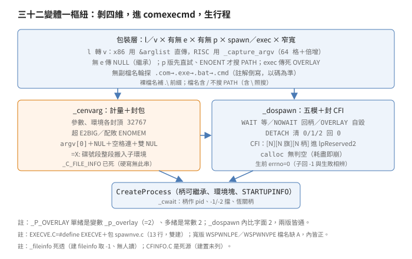
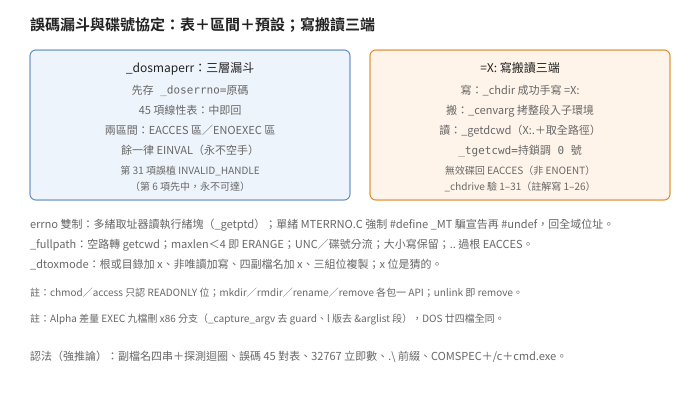

# 行程與 DOS：單樞 spawn、誤碼表、碟號協定

## 結論

（名詞細節見推導各節，
此處先給全貌。）

`EXEC`（45 項：43 個 `C` 檔（24 窄加 19 寬）加建置）
把三十二種 `spawn／exec` 變體
（單寬度十六：
`l／v` 取參形 × 有無 `e` × 有無 `p` ×
`spawn／exec` 等不等，
寬窄各一套）
收斂到同一個樞紐：
`SPAWNVE.C` 編兩遍
（`EXECVE` 旗切 `spawn／exec`），
內含靜態 `comexecmd`，
先調 `_cenvarg` 封參數與環境、
再調 `_dospawn` 生行程。
`_dospawn` 認五模：
`WAIT／NOWAIT／NOWAITO
（異步不記柄）／DETACH／OVERLAY`，
末者是生完自毀
（`_exit(0)`，假 overlay 真 spawn）。

柄（handle）繼承的封包端在此
（下稱 `CFI` 塊）：
`_dospawn` 按最高開位截斷
`_osfile／_osfhnd`，
`calloc` 一塊
`[N][N 旗][N 柄]` 塞進
`StartupInfo.lpReserved2`
（啟動訊息的保留欄位）。
`calloc` 回空不判、
直接 `memcpy`：
記憶體耗盡即崩潰，
屬已證實（原文）的無防護。
`DETACH` 把拷貝塊的 `0／1／2`
先清零再送
（子行程無 console）。
開包端是 stdio 篇的 `_ioinit`，
兩篇合看才完整。

`_P_OVERLAY` 單緒是變數
（`_p_overlay`，初值 2）、
多緒是常數 2。
`_dospawn` 內比字面 `2`
而不比巨集，
正是為了容下變數版。
舊名 `_OLD_P_OVERLAY` 留著值 2。

`l` 版（不定參數）在 x86 取捷徑：
`&arglist` 直當 `argv` 傳
（依賴呼叫慣例的棧連排，
x86 `cdecl` 成立）；
RISC 版（此指 Alpha 版）走
`_capture_argv`：
棧上預配 `argbuf[64]` 先裝、
滿了倍增 `malloc／realloc`。

無副檔名先探測後產生行程：
`.com→.exe→.bat→.cmd`
（碼的順序；
註解倒寫 `cmd／bat` 先，
屬已證實（原文）的文碼不一）。
裸檔名強制補 `.\` 前綴。
`p` 版（`spawnvpe`）先直試、
`ENOENT` 才搜 `PATH`：
檔名含 `/` 不搜
（含 `\` 照搜，此 `spawnvpe` 規；
`execvpe` 另拒 `\` 與碟號，
見推導）、
首二字皆斜線者遇非 `ENOENT` 續搜、
組裝超 `_MAX_PATH` 整串放棄。

`_cwait` 的所謂 pid
實為行程柄
（`_dospawn` 非同步回柄值）：
`-1／-2`（當今行程／執行緒偽柄）
擋成 `ECHILD`、
等完恆 `CloseHandle`、
`stat_loc` 存原始結束碼
（檔頭的 lo／hi 位元組編碼
已與實碼脫鉤）。

`_loaddll` 三件是薄包：
`LoadLibrary／FreeLibrary／
GetProcAddress` 各包一層。
取址分名／序雙徑：
名非 `NULL` 走名徑
（序須為 `-1`）、
名 `NULL` 走序徑
（序須 `≤65535`），
餘組合回 `NULL`。

`DOS`（26 項：24 個 `C` 檔加建置）
是誤碼與路徑雜務。
`_dosmaperr` 用 45 項線性表
映 Win32 誤碼到 `errno`，
表外兩區間兜底
（`EACCES` 區、`ENOEXEC` 區），
再外一律 `EINVAL`。
表第 31 項巨集誤植
（`ERROR_INVALID_HANDLE` 重複，
註解寫 124）：
線搜命中前項即回，
此項永不可達。

`errno` 雙制：
多緒版取址器讀當今執行緒塊
（`_getptd`），
單緒版（`MTERRNO.C`）強制
`#define _MT` 騙進函式宣告
再 `#undef`，
回全域變數位址。
目的寫在檔頭：
同一份呼叫端源碼
兩種庫都能連。

碟號工作目錄是 CRT 自養協定：
Win32 只記預設碟當今目錄，
`_chdir` 成功後手寫
`=X:` 環境變數、
`_cenvarg` 生子行程時整段搬運、
`_getdcwd` 非預設碟讀回。
`_fullpath` 歸一：
`UNC` 與碟號分流、
碟號大小寫保留、
`..` 退過根回 `EACCES`、
殘缺 `DBCS`（雙位元組字集）回 `EINVAL`。

## 根本問題

第一約束是形狀爆炸。
Win32 沒有 `fork／exec`，
只有 `CreateProcess`：
吃命令列字串、環境塊、
`STARTUPINFO`，
一次生一個行程。
Unix 側卻有三十二種形狀：
參數逐個或成串（`l／v`）、
環境自備與否（`e` 有無）、
檔名直給或搜路徑（`p` 有無）、
生完取代或並存（`exec／spawn`）、
寬窄各一套。
收斂是答案：
先按維度剝包裝
（`l` 轉 `v`、`p` 定路徑、`e` 定環境），
最後全進同一個
「封包加生行程」樞紐。
三十二變體一樞紐，
修生行程語意只動兩檔。

第二約束是柄繼承：
父行程開了一堆檔，
子行程的 CRT 要接手同一套編號。
Win32 的柄可繼承是 OS 層的事，
CRT 層的 `_osfile` 旗
（文字或二進位、管線或裝置）
OS 不管。
於是有私協定：
父端（`_dospawn`）封塊、
子端（`_ioinit`）開塊，
`lpReserved2` 當信封。
舊制（`_C_FILE_INFO`
舊制柄訊環境字串）
已死，
殘留的變數與註解是化石：
讀時以實碼為準，
註解會騙人。

第三約束是誤碼映射：
Win32 誤碼數百種、
還在增加，
`errno` 二十餘種、
刻在標準裡。
對策是表加區間加預設：
常見四十五種逐條映、
連續兩段按區間判、
未知一律 `EINVAL`。
寧可錯標，
不斷言無錯：
`_doserrno`
（保留原始 Win32 誤碼者）
永遠保留原碼可查。

第四約束是碟號目錄，
DOS 語意的殘留：
每碟各記一當今目錄
（`C:foo` 指 C 碟當今目錄下），
Win32 只養預設碟。
CRT 用環境變數自養
`=X:` 系列：
寫、搬、讀三端分三檔，
缺一端就斷鏈。
這是環境塊
不只裝環境的證據：
它兼載行程的碟號狀態。

## 推導

### 單樞：comexecmd 與 EXECVE 雙建

`SPAWNVE.C` 312 行，
是三十二變體的匯流處。
靜態 `comexecmd`
（寬版 `wcomexecmd`）三步：
`_cenvarg` 封包、
`_dospawn` 生行程、
`free` 雙塊。
`EXECVE` 旗切兩版：
`EXECVE.C` 全檔 13 行，
`#define EXECVE` 再包
`spawnve.c`
（同一源檔編兩遍，
stdio 篇「三建」
——同一源編三遍——的同類手法）。
`exec` 版差別只有兩處：
入口少 `mode` 參數、
`_dospawn` 傳死 `_P_OVERLAY`。

包裝層按維度剝：

- `l` 轉 `v`：`SPAWNL／EXECL`
  把不定參數拼成 `argv`
  再調 `*e` 版。
- 無 `e` 傳 `NULL` 環境
  （子行程繼承父環境）。
- 無 `p` 直給路徑；
  `p` 版（`spawnvpe／execvpe`）
  先搜路徑。
- `exec` 即 `spawn` 傳死 overlay。

`EXECV.C` 48 行本體一行：
調 `_texecve`。
層層轉調不做事，
只為湊齊三十二個入口名。

### _cenvarg：計量、封包、搬 cwd

`_cenvarg` 管兩塊的計量與封裝。
計量先行：
參數串累長（含間隔與雙 `NUL`），
`≥ENV_MAX`
（環境參數總量上限，32767，
寬版因除字元寬度實為 16383）
即 `E2BIG`（參數環境過大，
`_doserrno` 配內部碼 `E_badenv`）；
環境串同式計量，
加參數長加程式名，
超 `(ENV_MAX-1)` 同判。
`malloc` 敗則 `ENOMEM`
（配內部碼 `E_nomem`）。
先計量後配置，
配一半失敗會 `free` 已配塊：
`E2BIG` 路釋參數塊、
`ENOMEM` 路釋參數塊，
不漏。

封包格式兩種：

- 參數塊：`argv[0]` 後接 `NUL`，
  餘參空格連接、尾雙 `NUL`。
  空參數列只寫雙 `NUL`。
  `NUL` 分隔只留 `argv[0]` 一處：
  `_dospawn` 的「`NUL` 轉空格」迴圈
  實只轉此一分隔
  （迴圈寫成通吃多分隔，
  今只剩一處可轉，
  歷史殘留屬強推論）。
- 環境塊：自備 `envp` 逐串拷貝、
  尾雙 `NUL`；
  `NULL` 則 `*envblk=NULL`
  （繼承父環境，
  連塊都不建）。

`cwd`（當今目錄）搬運是精華：
掃父環境塊找首個 `=X:` 形
（`=`
加非空字加 `:=`
四字前綴），
連續段整段拷入子環境頭。
子行程落地即有全套碟號目錄，
不靠 `_chdir` 補。
判準只看形狀：
`=` 開頭即搬，
不管碟號存不存在。

化石在此：
檔頭註解尚寫
「`_fileinfo` 非零經環境傳柄訊」，
實碼 `cfi_len=0` 硬寫
（「無 `_C_FILE_INFO`」），
柄訊改走 `dospawn.c` 二進制塊。
註解記的是舊制，
以實碼為準。

### _dospawn：五模、封 CFI、自毀

`_dospawn` 先把 `mode` 譯三旗
（同步、異步記柄、背景）：
`WAIT` 同步、`NOWAIT` 異步記柄、
`NOWAITO`（3）異步不記、
`DETACH` 背景、
`OVERLAY`（字面 `2`）異步。
餘值 `EINVAL`。
三旗只用其一：
`background` 清柄；
`syncexec／asyncresult`
置而不用
（文末四路直判 `mode`）。

命令列還原迴圈：
`NUL` 分隔轉空格，
至雙 `NUL` 止。
接上節格式，
實轉 `argv[0]` 後唯一分隔。

封 `CFI`（柄訊塊）四步：
自 `_nhandle` 下掃最高開位
（`_osfile` 非零即停，
全閉則 `cfi_len=0`）、
`calloc` 整塊、
依序拷 `N`、旗串、柄串。
`calloc` 回空不判：
`memcpy` 直寫空指標。
記憶體耗盡即崩潰，
無 `ENOMEM` 路。
此為已證實（原文）的無防護。

`DETACH` 加兩步：
拷貝塊的 `0／1／2`
旗清零、柄填無效，
`fdwCreate` 加 `DETACHED_PROCESS`。
清的是拷貝不是本尊：
父行程三柄安然。
寬版另加
`CREATE_UNICODE_ENVIRONMENT`
告示環境塊為寬字。

生前清 `errno=0`：
區分子行程回 `-1`
與生行程失敗
（後者必置非零）。
`CreateProcess` 敗則
`_dosmaperr` 即回。
成則四路：

- `OVERLAY`：`_exit(0)` 自毀。
  假 overlay 真 spawn：
  舊我已死、新我接位，
  pid 實已換人。
- `WAIT`：無限等、
  取結束碼、
  關行程柄。
- `DETACH`：關行程柄、
  回 0。
  該路註解夾了句俚語
  （點名此路徹底分離、
  語氣詞 `dude` 入碼）。
- 餘（`NOWAIT／NOWAITO`）：
  回行程柄值作 pid。

末關執行緒柄、
回值。
`_P_OVERLAY` 為何有時變數：
單緒版是全域 `_p_overlay`
（`DOSPAWN.C` 定義初值 2，
`PROCESS.H` 按 `_MT` 切換定義），
多緒版是常數 2。
`_dospawn` 內比字面 `2`
（附 `OVERLAY` 註解），
兩版皆通。
`_OLD_P_OVERLAY` 留值 2 備查。

### l 捷徑：&arglist 與 _capture_argv

`SPAWNL.C` x86 分支五行：
斷言四條、
`&arglist` 直傳 `*e` 版。
C 呼叫慣例下
`...` 首參位址後即連排參數，
`NULL` 結尾恰成 `argv`。
依賴的是棧連續性
（x86 `cdecl` 下成立；
RISC——此指 Alpha，
`_M_IX86` 未定義者——不成立，
故另走捕獲路；
「成立」判準屬強推論，
原文只分岔、未解釋）。

非 x86 走 `_capture_argv`
（`CENVARG.C` 尾，
`#ifndef _M_IX86` 包住）：
棧上預配 `argbuf[64]` 先裝、
滿了倍增
（首爆 `malloc` 雙倍、
再爆 `realloc` 雙倍），
`NULL` 結束並入表。
呼叫端判址：
回址非預配塊即 `free`。
八個 `l` 版
（`spawn／exec × l／le／lp／lpe`，
另八個為 `v` 版）
同式。

### 副檔名與 PATH：探測序、搜尋規

`_spawnve` 先定檔名部：
取最後一個斜線（正反皆認）
或冒號之後為檔名；
裸檔名（無路徑無碟）
`malloc` 補 `.\` 前綴。
註解稱多配一字防 `NULL`：
實先 `_tcslen` 後 `malloc`，
`NULL` 早崩在計長。
註解的防心是好的，
放錯了位置；
呼叫端另有非空斷言兜底。

有副檔名單探：
`_taccess` 中即生、
不中回 `-1`
（`errno` 留探路殘值）。
無副檔名輪探：
表 `{.cmd,.bat,.exe,.com}`、
自右向左
（`EXTLAST→EXTFIRST`），
即 `.com→.exe→.bat→.cmd`。
行內註解寫
「先 `cmd／bat` 再 `com／exe`」，
與迴圈方向相反：
文碼不一，
以碼為準。
中即生、不中續探、
全不中回 `-1`。
臨串與前綴各 `free`。

`p` 版（`spawnvpe`）搜尋規五條：

1. 先直試原名：
   成即回。
2. `errno≠ENOENT` 即停：
   找得到但生不出
   （如格式壞），
   不再搜。
3. 檔名含 `/` 不搜：
   有路徑意即不搜。
   但只認正斜線：
   含 `\` 照搜 `PATH`。
4. 無 `PATH` 即停；
   配 `_MAX_PATH` 緩衝敗亦停。
5. 逐段組裝試生：
   段尾補 `\`
   （`MBCS`（多位元組字集，
   含 `DBCS` 的廣義版）下
   驗尾字非後 byte 才補）、
   組裝超 `_MAX_PATH` 整串放棄
   （`break`，
   `errno` 留初試殘值）、
   成或（非 `ENOENT` 且
   首二字不皆斜線）即停。
   首二字皆斜線
   （含 `\\`、`//` 及混搭）者
   遇錯續搜
   （原文未釋理由；
   「網路抖動不算數」屬假說）。

段迭代靠 `_getpath／_wgetpath`
（`MISC` 目錄，
雜項篇（待寫）再述）。

`execvpe` 不同規，
自帶搜尋三異：

- 拒搜三條件：
  檔名含 `/`、含 `\`、
  或次字為碟號冒號，
  任一即不搜
  （`spawnvpe` 只拒 `/`）。
- 內聯切段：
  `do／while` 就地按分號切段，
  不調 `_getpath`；
  附 `UNDONE`（分號或為
  `DBCS` 後 byte 未處理）、
  寬版界限多乘字元寬度
  （疑超寫，見下）。
- 成功不返回：
  全函式唯一出口回 `-1`，
  生中即 overlay 自毀。

寬版界限式以 `TCHAR` 指標
加 `(MAX-2)×sizeof` 格：
窄版無事、
寬版放行雙倍欄位、
超配額 `260` 格。
是否真超寫視段長而定，
原文無測試，
記「疑超寫」屬強推論。

### system、cwait：殼與等

`_tsystem` 三段：
`NULL` 命令探殼存否
（`!_taccess(COMSPEC,0)`，
`COMSPEC` 為命令直譯器路徑，
有殼回非零）；
否則組 `[COMSPEC,/c,命令]`
`WAIT` 生；
`COMSPEC` 缺席、
或生敗且 `errno` 為
`ENOENT／EACCES`，
退 `cmd.exe` 加 `PATH` 搜
（`spawnvpe`）。
餘誤（如 `E2BIG`）
直接回 `-1` 不退：
錯在參數不在殼。
判式寫成或鏈：
成、或誤非此二者，
皆回。

`_cwait` 等指定子行程。
所謂 `process_id` 實為柄值：
`_dospawn` 非同步回的就是柄。
`-1／-2` 先擋
（當今行程／執行緒偽柄，
等即永等，
故 `ECHILD`)，
註解把話說白。
等到取結束碼、
取不到映誤
（無效柄直映 `ECHILD`），
末恆 `CloseHandle`、
`stat_loc` 存原始碼、
回柄值或 `-1`。
`action_code` 棄置
（以消未用參數警告的巨集壓住，
`WAIT_CHILD／GRANDCHILD`
兩碼同效）。
檔頭稱 `stat_loc`
低字節零、高字節結束碼：
實碼存原始值不編碼，
文碼脫鉤既久。

### loaddll 三件與怪檔名

`_loaddll` 一行：
`LoadLibrary` 轉 `int` 回，
敗回 0（`NULL` 轉來）。
`_unloaddll`：
`FreeLibrary` 成回 0、
敗回 `GetLastError` 原值
（不經 `errno`，
回的是 DOS 誤碼）。
`_getdllprocaddr` 雙徑：
名 `NULL` 走序徑
（`≤65535` 才調，
`LPSTR` 強轉序號），
名非 `NULL` 走名徑
（序須為 `-1`，
空字串亦走此徑），
餘組合回 `NULL`。
序上限 65535 疑 16 位元遺產
（原文只有數字，
屬假說）。

寬版兩檔名拼奇：
`WSPWNLPE.C／WSPWNVPE.C`
（`WSPWN` 缺 `A`）。
內皆正：
`WPRFLAG`（寬版轉生巨集）
加雙 `UNICODE`
再包窄版源，
產 `_wspawnlpe／_wspawnvpe`。
名奇實正，
且 x86、Alpha 兩套源碼樹皆然：
拼錯在分叉前，
或分叉帶著錯一起走。

### 化石：_fileinfo 與 _C_FILE_INFO

`_fileinfo` 死透三證：
定義兩處
（`CFINFO.C=0`、`FILEINFO.C=-1`）、
建置只取後者
（`LSOURCES` 列 `fileinfo.obj`、
無 `cfinfo` 行，
故 `CFINFO.C` 是死源）、
取後者亦無人讀
（全樹 `grep` 只剩宣告與
`CENVARG` 檔頭註解）。
宣告留 `STDLIB.H`
供舊源編譯，
值已無意義。

`_C_FILE_INFO` 機制同死：
`_cenvarg` 硬寫
「無此串」
（行內註解與計量註解
兩處留名，無實碼）、
柄訊改走二進制塊。
檔頭註解未隨改，
後人讀註解會走錯路。
化石的教訓：
條件編譯看實碼，
註解只當口供，
須與實碼對質。

### _dosmaperr：45 表與死項

`_dosmaperr` 先存 `_doserrno=原碼`，
再線搜 45 項表：
中即置 `errno` 回。
表外兩區間：
誤碼落 `EACCES` 區映 `EACCES`、
落執行失敗區映 `ENOEXEC`、
餘一律 `EINVAL`。
三層漏斗：
精確、區間、預設，
永不空手回。

第 31 項是死項：
巨集寫 `ERROR_INVALID_HANDLE`、
註解寫 124。
同巨集第 6 項已先列
（映 `EBADF`），
線搜先中先回，
第 31 項永不可達。
巨集與註解必有一錯：
若註解對，
巨集該是 124 號誤碼；
若巨集對，
此行純屬重複。
無第二來源不斷案，
只記「永不可達」
（已證實（原文））。

### errno 雙制：執行緒塊與騙招

多緒版取址器在 `DOSMAP.C` 尾
（`#ifdef _MT` 包住）：
`_errno` 回當今執行緒塊的
`_terrno` 欄位址、
`__doserrno` 回 `_tdoserrno` 欄位址。
`errno` 巨集轉取址加取值，
各執行緒各存各的、互不干擾。

單緒版在 `MTERRNO.C`，
手法是騙招：
`#ifndef _MT` 內強制
`#define _MT`、
`#include <stdlib.h>`
騙進函式版宣告、
再 `#undef _MT`，
`#undef` 兩巨集、
回全域變數位址。
檔頭自述目的：
同一份呼叫端源碼
`LIBC／LIBCMT`
（單緒／多緒靜態庫）
兩種庫都能連，
只解編譯相容、
不保證執行緒安全。
末句是免責聲明，
先講能、再講不能。

### 碟號協定：寫、搬、讀三端

寫端 `_chdir`：
`SetCurrentDirectory` 成後、
取全形當今目錄、
組 `=X:`（`=` 加大寫碟號加冒號）
調 `SetEnvironmentVariable`。
註解指名受益者：
`fullpath`、`spawn` 們。
任一步敗走 `_dosmaperr`。

搬端 `_cenvarg`
（見前）：
父環境的 `=X:` 段整段拷入
子環境頭。
讀端 `_getdcwd`：
0 號（預設碟）直調
`GetCurrentDirectory`；
非零先驗碟
（`GetLogicalDrives` 位圖，
無效回 `EACCES`——
不是 `ENOENT`），
再以 `X:.` 調
`GetFullPathName`
（此 API 讀 `=X:` 還原）。
`_tgetcwd` 是持
`_ENV_LOCK`（環境變數鎖）
調 0 號的薄包。

`_getdrive／_chdrive` 管碟號本身：
前者讀當今目錄首字轉數
（敗回 0）；
後者驗 1–31
（超界 `EACCES`，
`_doserrno` 配無效碟）、
持 `_ENV_LOCK` 切碟。
1–31 比 `FULLPATH.C` 行內註解的
1–26 寬：
兩檔各寫各的，
以實碼為準。

### 歸一與唯讀位

`_fullpath` 先定輸出：
空路徑直轉 `_tgetcwd`；
緩衝 `NULL` 自配 `_MAX_PATH`
（敗 `ENOMEM`）；
`maxlen<4`（連 `A:\` 都裝不下）
即 `ERANGE`。
`UNC`（雙斜線開頭）與
碟號路徑分流：
碟號取大小寫保留位、
驗有效、
非根補當今目錄。
`..` 逐段退格：
退過起點回 `EACCES`；
`.` 跳過；
空段回 `EINVAL`；
殘缺 `DBCS` 回 `EINVAL`；
超長 `ERANGE`。
`ReturnError1` 置 `ERANGE`
後落入 `ReturnError2`
（自配則釋、回 `NULL`）：
兩標號一碼兩用。

`_stat` 經 `FindFirstFile` 取訊：
三時轉 `time_t`
（缺席拷修改時，
與 `_fstat` 同式），
模式交 `_dtoxmode`
（DOS 屬性轉 Unix `mode`）：
根或目錄（含 DOS 認不得的根、
特判）加 `x`、
非唯讀加寫、
名尾四副檔名
（`.exe／.cmd／.bat／.com`，
大小寫不拘）加 `x`、
使用者位右移複製到組與他者
（`0700` 掩碼取使用者三位，
右移 3、6 格填組與他者，
三組永遠相同）。
`x` 位是猜的：
Unix 語意、DOS 訊號，
只能猜。

`_chmod／_access` 只認唯讀位：
前者按 `_S_IWRITE` 翻轉
`READONLY`、
後者有寫要無唯讀。
`_mkdir／_rmdir／_rename／_remove`
各包一 API
（建、刪、搬、刪），
敗皆 `_dosmaperr`；
`_tunlink` 與 `_tremove` 同檔，
前者調後者
（`unlink` 即 `remove`）。
寬版十檔皆 `WPRFLAG`
（寬版轉生巨集）轉生。

## 在執行檔裡怎麼認

沒有 Win32 工具鏈，
以下全是強推論：
從原始碼形狀推導，
未與出貨 `OBJ` 對拍。

- 副檔名表：
  `.cmd、.bat、.exe、.com`
  四串連排、
  另有探測迴圈自尾向前。
  `spawn／exec` 家族的副署。
- 誤碼表：
  45 對（Win32 碼、`errno` 碼）
  線性表、
  尾隨兩區間常數。
  `_dosmaperr` 的指紋；
  第 31 項重複 `6／EBADF`
  再現即同源。
- `32767` 立即數：
  參數與環境雙計量的封頂。
  `spawn` 系的數字水印。
- `.\` 前綴：
  裸檔名補相對路徑。
  見組裝即 `spawnve` 路。
- `COMSPEC`、`/c`、`cmd.exe`：
  三串齊聚、
  `ENOENT／EACCES` 判退，
  即 `_system`。
- `=X:` 形環境寫入：
  `=` 加碟號冒號的四字鍵。
  `_chdir` 的副署。

## 給 remake 的行為規格

數字（原始碼直接寫明，
無實跑支持）：

| 常數 | 值 |
|---|---|
| `ENV_MAX` | 32767（窄版；寬版除字元寬度，實 16383） |
| `_P_WAIT／NOWAIT／OVERLAY／NOWAITO／DETACH` | 0／1／2／3／4 |
| `_p_overlay` 初值 | 2 |
| `argbuf` 棧上格 | 64，滿倍增 |
| 誤碼表項數 | 45 |
| 副檔名探測序 | `.com→.exe→.bat→.cmd` |
| 序號上限 | 65535 |
| `_MAX_PATH` | 260（含尾 `NUL` 語意見規） |

語意（原始碼直接寫明，
無實跑支持）：

- 三十二變體匯流：
  `l` 轉 `v`、`p` 定路徑、
  `e` 定環境、`exec` 傳死 overlay，
  終進 `comexecmd`。
- `_cenvarg` 計量：
  參數、環境各封頂，
  超即 `E2BIG`（配 `E_badenv`）；
  配敗 `ENOMEM`（配 `E_nomem`）；
  配一半敗釋已配。
- 參數塊形：
  `argv[0]＋NUL＋餘參空格連＋雙 NUL`；
  空列只雙 `NUL`。
- 環境 `NULL` 不建塊：
  子行程繼承父環境。
- `=X:` 整段搬運：
  形對即搬，
  不驗碟號。
- `_dospawn` 五模：
  `WAIT` 等取碼、
  `NOWAIT／NOWAITO` 回柄、
  `DETACH` 清三柄回 0、
  `OVERLAY` 生完 `_exit(0)`；
  非法模 `EINVAL`。
- `CFI` 封包：
  按最高開位截斷、
  `calloc` 無判空、
  `[N][N 旗][N 柄]`。
- 生前 `errno=0`：
  兩種 `-1`（子回值與生敗）相辨。
- `NUL` 轉空格迴圈實轉一處
  （`argv[0]` 後分隔）。
- x86 `l` 版 `&arglist` 直傳；
  RISC `_capture_argv` 倍增。
- 有副檔名單探、
  無副檔名輪探、
  裸名補 `.\`。
- `p` 版五規（`spawnvpe`）：
  直試先、非 `ENOENT` 停、
  含 `/` 不搜、
  超長整串棄、
  首二字皆斜線者續搜；
  `execvpe` 另規
  （拒搜三條件、內聯切段、
  成功不返回）。
- `_system`：
  `NULL` 探殼；
  僅缺 `COMSPEC` 或
  `ENOENT／EACCES` 退 `cmd.exe`。
- `_cwait`：
  柄作 pid、`-1／-2` 擋、
  恆關柄、`stat_loc` 存原碼、
  `action_code` 棄置。
- `_loaddll` 三件：
  名／序雙徑、
  序 `≤65535`、
  敗碼語意各異
  （0、`GetLastError`、`NULL`）。
- `_dosmaperr`：
  45 表線搜、
  兩區間、
  預設 `EINVAL`、
  `_doserrno` 永留原碼；
  第 31 項不可達。
- `errno` 雙制：
  多緒讀執行緒塊、
  單緒讀全域、
  取址器兩版皆備。
- `_chdir` 寫 `=X:`；
  `_getdcwd` 非預設碟
  `X:.` 加 `GetFullPathName`、
  無效碟 `EACCES`；
  緩衝 `NULL` 自配、
  不足 `ERANGE`。
- `_fullpath`：
  空路徑轉 `getcwd`、
  `maxlen<4` 即 `ERANGE`、
  `UNC`／碟號分流、
  大小寫保留、
  `..` 過根 `EACCES`、
  空段與殘缺 `DBCS` 皆 `EINVAL`、
  寫越界 `ERANGE`。
- `_dtoxmode`：
  根或目錄加 `x`、
  非唯讀加寫、
  四副檔名加 `x`、
  三組位複製。
- `chmod／access` 只認唯讀位；
  建刪改名四薄包
  敗皆 `_dosmaperr`；
  `unlink` 即 `remove`。
- Alpha 差量：
  `EXEC` 九檔刪 x86 分支、
  `DOS` 廿四檔全同、
  怪檔名兩版皆然。

## 證據與未知

- 單樞雙建、包裝四維、
  `comexecmd` 三步：
  原始碼直接寫明，
  **已證實（原文）**。
- 計量封頂、雙內部碼、
  半敗釋塊、參數塊形、
  `cwd` 搬運判形：
  原始碼直接寫明，
  **已證實（原文）**。
- 五模譯旗、分隔還原、
  `CFI` 四步、`calloc` 無判、
  `DETACH` 清拷貝、
  生前清零、四路分流、
  `dude` 註解：
  原始碼直接寫明，
  **已證實（原文）**。
- `_P_OVERLAY` 變數／常數雙制、
  比字面 `2`、`_OLD` 留值：
  原始碼直接寫明，
  **已證實（原文）**。
- `&arglist` 捷徑、
  `_capture_argv` 倍增、
  八 `l` 版同式：
  原始碼直接寫明，
  **已證實（原文）**。
- 裸名補前綴、單探輪探、
  探測序與註解倒寫、
  `NULL` 防心錯位：
  原始碼直接寫明，
  **已證實（原文）**。
- `p` 版五規、段迭代外包、
  首二字續搜、超長整棄、
  `execvpe` 三異：
  原始碼直接寫明，
  **已證實（原文）**；
  續搜理由屬假說、
  寬版疑超寫屬強推論。
- `_system` 三段、退路雙條件、
  `_cwait` 柄作 pid、
  偽柄擋、`stat_loc` 脫鉤、
  `action_code` 棄置：
  原始碼直接寫明，
  **已證實（原文）**。
- 三件薄包、雙徑門限、
  敗碼各異、怪檔名兩樹皆然：
  原始碼與檔名直接寫明，
  **已證實（原文）**。
- `_fileinfo` 三證死透、
  `_C_FILE_INFO` 硬零、
  檔頭註解過期：
  原始碼與建置檔直接寫明，
  **已證實（原文）**。
- 45 表項、兩區間、
  預設 `EINVAL`、死項 31：
  原始碼直接寫明，
  **已證實（原文）**。
- `errno` 雙制、`MTERRNO` 騙招：
  原始碼與檔頭自述寫明，
  **已證實（原文）**。
- `=X:` 寫搬讀三端、
  `_getdcwd` 分流、
  無效碟 `EACCES`：
  原始碼直接寫明，
  **已證實（原文）**。
- 歸一分流、大小寫保留、
  `..` 過根、`DBCS` 殘缺、
  `_dtoxmode` 四則、
  唯讀單位：
  原始碼直接寫明，
  **已證實（原文）**。
- Alpha 差量
  （`EXEC` 九檔刪分支、
  `DOS` 全同）：
  逐檔比對，
  **已證實（原文）**。
- 在執行檔裡怎麼認的六條：
  從原始碼推導，
  出貨 `OBJ` 還沒對，
  **強推論**。
- 未知：`_P_OVERLAY` 變數化的
  歷史動機（無註解）、
  `calloc` 敗在實機是否真崩、
  出貨 `OBJ` 對拍。

出處：Visual C++ 2.0 CRT，
`EXEC` 目錄的
`DOSPAWN.C／CENVARG.C／SPAWNVE.C／
EXECVE.C／SPAWNVPE.C／SPAWNL.C／
SPAWNV.C／EXECV.C／EXECL.C／
SYSTEM.C／WAIT.C／LOADDLL.C／
GETPROC.C／CFINFO.C／FILEINFO.C／
LSOURCES`、
`DOS` 目錄的
`DOSMAP.C／MTERRNO.C／CHDIR.C／
GETCWD.C／FULLPATH.C／STAT.C／
ACCESS.C／CHMOD.C／MKDIR.C／RMDIR.C／
RENAME.C／UNLINK.C／DRIVE.C`、
`H` 目錄的
`PROCESS.H／STDLIB.H`、
`MISC` 目錄的
`GETPATH.C`（僅名，不屬本篇）、
Alpha 對照
`VC20CRTA／CRT／SRC／EXEC／DOS`。
行號以去 `\r` 後為準
（原檔為 DOS 的 `CRLF` 換行）。
