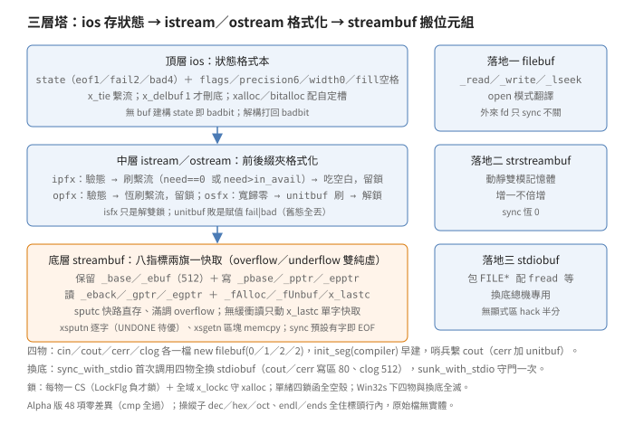
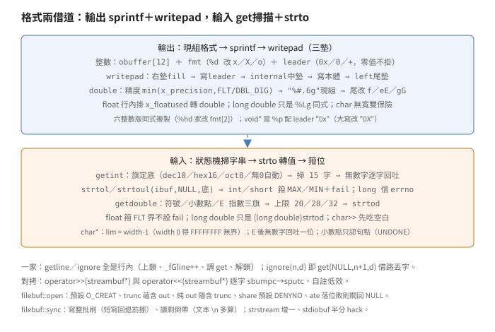

# 串流：三層塔、格式借道、換底同步

## 結論

（名詞細節見推導各節，
此處先給全貌。
自造詞先定義：
三層塔＝三類分層、
三落地＝三種底層出口、
借道＝調現成 C 函式做事、
換底＝抽換流底下的緩衝。）

`IOSTREAM`（48 項：
45 個 `CXX` 檔加
`MTLOCK.C`、`LSOURCES`、
`DEPEND.DEF`；
`LSOURCES` 列 46 個 `OBJ`）
是一座三層塔：
頂層 `ios` 只存狀態與格式
（狀態字、旗標、精度、
寬度、填充、繫流
（`tie`：
動作前先刷另一條流）），
中層 `istream／ostream`
做格式化與前後綴檢查，
底層 `streambuf` 只搬位元組，
靠八個指標劃出讀寫兩區。
塔底有三種落地：
`filebuf` 接 `lowio`
（`_read／_write／_lseek`），
`strstreambuf` 接記憶體
（動靜雙模），
`stdiobuf` 接 `FILE*`
（`fread／fwrite／fseek`）。

格式化的實作是借道制：
輸出全家先用 `sprintf`
把數字轉成字串
（格式字串現組、
前綴另放 `leader`），
再調 `writepad` 墊寬；
輸入先用 `getint／getdouble`
狀態機掃出數字字串
（失敗逐字回吐），
再調 `strtol／strtoul／strtod`
轉值。
浮點萃取的長短上限各不同
（`float` 20、`double` 28、
`long double` 32），
`long double` 也只是
`strtod` 轉完硬轉型。

四物各住一檔：
`cin／cout／cerr／clog`
分別是
`new filebuf(0／1／2／2)`
（0、1、2 是標準輸入、
輸出、錯誤的 fd），
配 `#pragma init_seg(compiler)`
（MS 擴充：
靜態建構排進編譯器段，
早於使用者靜態物；
段名 `XIFM` 見檔頭註）
擠進編譯器靜態初始化段，
再各配一個 `Iostream_init`
哨兵設旗：
`cin／clog` 繫 `cout`，
`cerr` 再加 `unitbuf`
（逐次刷），
`cout` 不繫誰。
`sync_with_stdio` 第一次被調時
把四物的底全換成
包著 `stdin／stdout／stderr`
的 `stdiobuf`
（旗標由變數 `sunk_with_stdio`
守門，只換一次；
換底經賦值運算子，
旗標先歸零再重設，
`unitbuf` 是設第二次），
`cout／cerr` 配 80 位元組寫區，
`clog` 配 512 位元組，
`cin` 無配額
（維持無緩衝直讀）。

鎖是雙層：
每物一把 `RTL_CRITICAL_SECTION`
（Win32 臨界區，
即互斥鎖；
`LockFlg` 是計數，
負值才上鎖，
`setlock` 減一、
`clrlock` 非正加一，
流側調用連動底層緩衝），
外加一把全域 `x_lockc`
守 `xalloc／bitalloc`
（配自定槽與旗位，
見 `ios` 節）。
單緒版四個鎖函式全是空殼，
多緒版（`_MT` 建置）
由 `MTLOCK.C` 四函
直包
`Initialize／Delete／Enter／
LeaveCriticalSection`。

## 盤點

`VC20CRTL/IOSTREAM` 共 48 項：
`IOS`、`STREAMB(B1)`、
`ISTREAM(1)`、`OSTREAM(1)`、
`IOSTREAM`（`iostream` 雙基類）、
`IOSTRINI／CININIT／CERRINIT／
CLOGINIT`（四物）、
`FILEBUF(1)`、`FSTREAM`、
`IFSTREAM`、`OFSTREAM`、
`STRSTREA`、`STDIOSTR`、
`STRMBDBP`（除錯傾印）、
萃取 `ISTRCHAR／ISTRSHRT／
ISTRUINT／ISTRINT／ISTRLONG／
ISTRULNG／ISTRUSHT／ISTRFLT／
ISTRDBL／ISTRLDBL`、
插入 `OSTRCHAR／OSTRSHRT／
OSTRUINT／OSTRINT／OSTRLONG／
OSTRULNG／OSTRUSHT／OSTRDBL／
OSTRLDBL／OSTRPTR`、
取放 `ISTRGET(L)／OSTRPUT`、
掃描 `ISTRGINT／ISTRGDBL`，
加 `MTLOCK.C`、
`LSOURCES`、`DEPEND.DEF`。
`LSOURCES` 的 `OBJS` 表列
46 個目標
（45 `CXX` 加 `mtlock`）。
48 與 46 的差 2
是 `LSOURCES` 與
`DEPEND.DEF` 兩個
建置檔本身。
檔名尾碼 `B1／1`
是 non-core 拆分檔
（檔頭自註
non-core functions，
如 `STREAMB1.CXX`），
核心成員放本檔、
次要放 `1` 檔。
全文引用形如
`ISTREAM.CXX:82`，
完整路徑是
`VC20CRTL/IOSTREAM/
ISTREAM.CXX`，
標頭是 `VC20CRTL/H/`。
Alpha 版
（`VC20CRTA/CRT/SRC/IOSTREAM`）
同名 48 項逐位元組比對
（`cmp` 全過），
零差異：
串流層沒有平台相關碼。

標頭在 `H/`：
`IOS.H`、`STREAMB.H`、
`ISTREAM.H`、`OSTREAM.H`、
`FSTREAM.H`、`STRSTREA.H`、
`STDIOSTR.H`、`IOSTREAM.H`。
很多小函式住標頭
（`isfx`、`getline`、
`float` 插入、`dec／hex／oct`、
`endl／ends` 全是行內），
讀實作必須兩邊對看。

## ios：狀態格式本

`ios` 是所有流的祖父，
只存兩類東西：
流的健康狀態、
格式化的參數。
建構子初值
（`IOS.CXX:48-71` 兩處相同）：
`bp` 空、
`state` 為 `badbit`
（無緩衝即病），
`x_flags` 0、
`x_precision` 6
（`IOS.CXX:57`）、
`x_fill` 空格、
`x_width` 0、
`x_delbuf` 0、
`x_tie` 空；
`ispecial／ospecial`
恆 0，
標頭自註未用。
帶 `streambuf` 的建構子
有 buf 則 `state` 歸 0，
無 buf 仍是 `badbit`。

三個列舉住 `IOS.H:74-88`：
`io_state`
（`goodbit` 0、`eofbit` 1、
`failbit` 2、`badbit` 4）、
`open_mode`
（`in` 1、`out` 2、`ate` 4、
`app` 8、`trunc` 10、
`nocreate` 20、
`noreplace` 40、
`binary` 80，十六進）、
`seek_dir`
（`beg` 0、`cur` 1、`end` 2）。
以下數值全十六進
（`beg／cur／end` 的
0、1、2 十六十進同值）。
格式旗標是另一組位元
（`IOS.H:90-104`）：
`skipws` 1、`left` 2、
`right` 4、`internal` 8、
`dec` 10、`oct` 20、
`hex` 40、`showbase` 80、
`showpoint` 100、
`uppercase` 200、
`showpos` 400、
`scientific` 800、
`fixed` 1000、
`unitbuf` 2000、
`stdio` 4000。
`basefield／adjustfield／
floatfield` 三個遮罩
在 `IOS.CXX` 首定義。
操縱子 `dec／hex／oct`
只是標頭行內
調 `setf` 設旗
（見化石節），
先記著，
後面輸入節會用到。

`xalloc` 配使用者自定槽
（槽陣列名 `x_statebuf`）：
多緒版是靜態八格陣列
（`MAXINDEX` 7，
`IOS.CXX:26`，
旁註 `UNDONE: enough? 15?`），
滿了回 `EOF`；
單緒版每次 `new long[]`
重配整塊並拷貝舊值。
`bitalloc` 配旗標位元：
`x_maxbit` 初 `0x8000`
（`stdio` 是 `0x4000`，
`0x8000` 是首個空位），
每次左移一位
（`IOS.CXX:314`）。
行尾註 `ios::openprot`
（`IOS.CXX:21`）
無對應符號
（全域只找得到
值 `0644` 的
`filebuf::openprot`），
疑為沿自 AT&T 版的
陳舊註解。
兩者都拿全域 `x_lockc`
互斥（多緒）。

解構子
（`IOS.CXX` 尾，
`state = badbit` 在 `:181`）：
`x_delbuf` 為真才 `delete bp`，
狀態打回 `badbit`。
`delbuf` 旗決定解構時
順不順手刪底層緩衝：
四物與各 `fstream` 建構時
都設 1
（`FSTREAM.CXX:41` 等），
`sync_with_stdio` 換底後
也設 1，
舊 `filebuf` 由換底時的
賦值運算子刪掉。

## streambuf：八指標兩旗一快取

`streambuf` 是抽象搬運工：
`overflow／underflow` 雙純虛
（`STREAMB.H:94-95`），
子類不實作就不能落地。
成員是八個字元指標
（`STREAMB.H` 尾）：
保留區 `_base／_ebuf`、
寫區 `_pbase／_pptr／_epptr`、
讀區 `_eback／_gptr／_egptr`，
加 `_fAlloc`（保留區自配）、
`_fUnbuf`（無緩衝）、
`x_lastc`（無緩衝單字快取，
初 `EOF`）。
行內快路全在標頭：
`sputc` 寫區有空直接存
（`_pptr < _epptr`），
滿了才調 `overflow`；
`sputbackc` 讀區有退路
直接退寫，
否則調 `pbackfail`；
`in_avail／out_waiting／
blen` 全是指標減法；
`setg` 順手清 `x_lastc`。

保留區預設 512 位元組：
`STREAMB.CXX:20` 以
`#ifndef BUFSIZ` 自定 512
（本檔沒引 `stdio.h`，
靠自定兜底；
`STDIO.H` 的同名值也是 512）。
`doallocate`
（`:317`）
`new char[512]` 後
`setb` 並記 `_fAlloc`。
`allocate` 是守門：
無緩衝或已有保留區
直接回 0，
否則調 `doallocate`。

`xsputn／xsgetn` 不對稱：
寫是逐字迴圈
（緩衝有空直存，
否則逐字 `overflow`，
旁註 `UNDONE:
can be optimized
like sgetn`，
`STREAMB.CXX:181`）；
讀是區塊拷貝
（`__min(egptr-gptr, cbBuf)`
配 `memcpy`，
`:238`）。
無緩衝讀走 `x_lastc`：
先 `underflow` 取一字快取，
逐字吐完再取。
`sgetc／snextc／sbumpc／
stossc`（`STREAMB1.CXX`）
全按有無緩衝分兩路，
無緩衝路只動 `x_lastc`。

`sync` 預設很嚴：
讀寫兩區但有一字就回 `EOF`
（`:260` 附近），
全空才回 0。
`seekoff` 預設恆 `EOF`，
`seekpos` 轉調
`seekoff(pos, beg)`。
`pbackfail` 預設三步：
讀區能退就直退
（旁註 `should never happen`，
因行內已先試過），
否則 `seekoff(-1)`、
成功再 `memmove` 騰一格塞字；
基底的 `seekoff` 恆敗，
所以基底 `pbackfail` 恆 `EOF`。

`dbp`（`STRMBDBP.CXX`）
是除錯傾印：
`sprintf` 八指標與 `_fAlloc`
進 256 字棧緩衝
（`_WINSTATIC` 是空巨集，
`#pragma check_stack(on)`
在 `STRMBDBP.CXX:18`
明示大緩衝走棧），
`_write(1)` 直送標準輸出，
不經任何流；
`DLL_FOR_WIN32S` 下整函是空殼。

## 前綴後綴：pfx 對

每次格式化輸入輸出
都被一對前後綴夾著，
前綴拿鎖、驗狀態、
刷繫流、吃空白，
後綴清寬度、按旗刷盤、
放鎖。

`istream::ipfx(need)`
（`ISTREAM.CXX:75` 附近）：
先 `lock`；
`need` 非零（無格式輸入）
清 `x_gcount`；
`state` 非零就再加 `failbit`
（註 `solves cin>>buf problem`，
`:82`）並解鎖回 0；
繫流條件是
`need == 0` 或
`need > in_avail`
（`:86`：
格式化輸入恆刷繫流，
無格式輸入只在預讀不夠時刷）；
再 `lockbuf`；
`need == 0` 且 `skipws`
就 `eatwhite`，
吃出錯（`eof` 或錯）
加 `failbit` 回 0；
成功留著雙鎖回 1，
等 `isfx` 放。
`isfx` 是標頭行內
（`ISTREAM.H:61`）：
`unlockbuf` 加 `unlock`，
別無其他。

`ostream::opfx`
（`OSTREAM.CXX:22` 附近）：
`lock`、驗 `state`
（敗加 `failbit` 回 0）、
有繫流恆 `flush`、
`lockbuf` 留鎖回 1；
沒有 `need` 參數，
也沒有吃空白段。
`osfx`（`:37` 附近）：
先 `x_width = 0`
（寬度一次性）；
`unitbuf` 就 `sync`，
敗則 `state` 直接賦值
`failbit | badbit`
（`:43`，
賦值不是或等，
`eofbit` 等舊旗
一併抹掉，
是原文寫法，
非筆誤）；
`stdio` 就 `fflush(stdout)`
加 `fflush(stderr)`
（`:47`，
錯誤流也刷）；
最後解雙鎖。

`eatwhite`
（`ISTREAM.CXX` 尾段）
用 `sgetc／snextc`
逐字跳 `isspace`，
撞 `EOF` 加 `eofbit`。
操縱子 `ws` 只是
行內調 `eatwhite`
（`ISTREAM.H:159`）。

## 輸入：掃字串、借 strto、箝位

`operator>>(char*)`
（`ISTREAM.CXX:108` 附近）：
`ipfx(0)`，取
`lim = (unsigned)(width - 1)`
（`:114`，
`unsigned` 下 0 減 1
繞回 `0xFFFFFFFF`，
等於無界），
寬度清零；
空指標加 `failbit`；
`sgetc／stossc` 逐字拷，
空白或 `EOF` 停，
首字即 `EOF` 加
`eofbit | failbit | badbit`，
一字未取只加 `failbit`
不寫字，
取到至少一字才補 `'\0'`
（`ISTREAM.CXX:142-145`，
補字在 `else` 內）。
`width` 的上限只差一字
（留結尾），
不設就是裸奔。

整數萃取分兩段：
`getint` 掃字串、
`strtol` 家族轉值。
`getint`
（`ISTRGINT.CXX:22` 附近）
先由旗標定底：
`dec` 10、`hex` 16、
`oct` 8，
皆無則 0（自動）。
`ipfx(0)` 後
`sgetc／snextc` 掃進
`MAXLONGSIZ - 1`
（`:56`，
`MAXLONGSIZ` 16 在
`ISTREAM.H:49`，
即至多 15 字，
減 1 留給結尾 `'\0'`）：
首字可帶正負號；
`0x／0X` 在自動或十六進下
切 16 進並重算數字旗；
自動下 `0` 開頭切 8 進；
十六進認 `isxdigit`，
餘者認 `isdigit`
（八進拒 8、9）。
一字數字沒有就整批
`sputbackc` 回吐
（並清 `eofbit`），
加 `failbit`；
回傳底數。
數值萃取是雙重 `ipfx`：
`operator>>` 先 `ipfx(0)`
（如 `ISTRINT.CXX:40`），
`getint／getdouble` 內再
`ipfx(0)` 一次
（`ISTRGINT.CXX:53`），
`isfx` 也兩次才平衡。
另 `getint` 尾的
`if (i == MAXLONGSIZ)`
（`ISTRGINT.CXX:119`）
永假：
迴圈上界是
`MAXLONGSIZ - 1`，
掃滿不設 `failbit`，
與 `getdouble` 的
`i == buflen` 判滿
（`ISTRGDBL.CXX:93`）
不對稱，
是死碼。
各型別萃取調
`strtol／strtoul(ibuffer,
NULL, getint(ibuffer))`
（`ISTRINT.CXX:42` 等；
`getint` 掃字串回底數，
`strto` 轉值，
`NULL` 表不取尾指，
超界 `strtol` 回
`LONG_MAX／MIN` 並置
`errno = ERANGE`），
再箝位
（箝位＝超界取邊界值，
不取模）：
`int／short` 超界箝到
`MAX／MIN` 並加 `failbit`；
`long` 版不自判，
信 `errno == ERANGE`
（`strtol` 的回報）；
無號版仿 `strtoul` 語意
（`ULONG_MAX` 配 `ERANGE`，
`ISTRUINT.CXX:46` 註明
仿 `strtoul` 語意）。
注意 `float` 版
（`ISTRFLT.CXX:33-41`）：
超上界箝 `±FLT_MAX`，
`(0, FLT_MIN)` 區間
箝 `±FLT_MIN`，
只箝位不設 `failbit`，
與整數版不同。

`getdouble`
（`ISTRGDBL.CXX:22` 附近）
是另一台小狀態機：
符號、小數點、
`E／e` 指數各有旗，
小數點旁註
`UNDONE: use locale-dependent
decimal point`
（`:62`，
只認句點）；
`E` 後無數字回吐一位
（`ISTRGDBL.CXX:82-83`，
回吐 `buffer[i]`，
但 `i` 已越過 `E`，
該格未寫入，
疑為差一，
應是 `buffer[i - 1]`，
屬強推論，
待對拍
（對拍＝拿原廠工具鏈
重編比對，
見 startup 篇））；
無數字或掃滿 `buflen`
加 `failbit`。
上限三檔各不同：
`MAXFLTSIZ` 20、
`MAXDBLSIZ` 28、
`MAXLDBLSIZ` 32
（各在自家檔首，
`ISTRFLT.CXX:22` 等，
原文硬編碼，
無解釋）。
`double` 版調 `strtod`
（`ISTRDBL.CXX`），
`long double` 版也是
`(long double)strtod`
（`ISTRLDBL.CXX`），
沒有真正的擴展精度轉換。

`operator>>(char&)`
（`ISTRCHAR.CXX`）
調 `ipfx(0)`，
會先吃空白，
再 `sbumpc` 取一字，
`EOF` 加 `eofbit | badbit`。
無格式三件
（`ISTRGET.CXX`）：
`get()` 取一字計 `gcount`，
`read` 調 `sgetn` 並以
`gcount` 記實讀數，
短讀加 `failbit | eofbit`。
`get(buf, lim, delim)`
（`ISTRGETL.CXX`）：
`lim--` 留結尾位，
分隔字不停取
（除非 `_fGline` 置位，
即來自 `getline`，
才吃掉分隔字並計數），
`b` 非空且 `lim` 非零
才補 `'\0'`
（`ISTRGETL.CXX:62-63`，
`ignore` 傳 `NULL`
即不寫），
末清 `_fGline`。
`getline` 與 `ignore`
全是標頭行內
（`ISTREAM.H:139-143`）：
上鎖、`_fGline++`、
調 `get`、解鎖；
`ignore(n, delim)` 即
`get(NULL, n + 1, delim)`，
借同一條路丟字。

`operator>>(streambuf*)`
（`ISTREAM1.CXX`）
是流對拷：
`sbumpc` 逐字搬進對方
`sputc`，
敗只加 `failbit` 不停
（`ISTREAM1.CXX:24-30`），
與輸出側
`operator<<(streambuf*)`
敗即 `break`
（`OSTREAM1.CXX:56-60`）
不對稱。
`seekg／tellg`
（同檔）
直轉 `seekpos／seekoff`，
敗加 `failbit`。

## 輸出：sprintf 借道與 writepad

插入運算子不自己轉數字：
先現組 `printf` 格式字串
`sprintf` 進棧上小緩衝，
再調 `writepad` 墊寬輸出。
以 `operator<<(int)`
（`OSTRINT.CXX:19` 附近）為例：
`obuffer[12]`、`fmt[4]` 初 `"%d"`、
`leader[4]` 初空；
`n` 非零才動格式：
`hex` 改 `fmt[1]` 為
`x／X`（按 `uppercase`）
並 `leader[1]` 同字、
`oct` 改 `fmt[1]` 為 `o`、
`showbase` 才 `leader[0] = '0'`、
十進正數配 `showpos` 才掛 `'+'`；
末 `sprintf(obuffer, fmt, n)`
（`obuffer` 收字串，
回寫入數，
敗回 `EOF`）
再 `writepad(leader, obuffer)`
（`:47`）。
例：
`hex + showbase` 的 255，
`fmt` 從 `"%d"` 改 `"%x"`，
`leader` 掛 `"0x"`，
`sprintf` 得 `"ff"`，
`writepad` 合出
`"0xff"` 再墊寬。
短、長、有無號六版
（`OSTRSHRT／OSTRUINT／
OSTRLONG／OSTRULNG／
OSTRUSHT`）
同式複製，
只差格式字母與改位
（`%hd` 家改 `fmt[2]`）。
`n == 0` 時格式不動：
十六進的 0 印 `0`
不印 `0x0`，
前綴只給非零值。
`operator<<(const void*)`
（`OSTRPTR.CXX`）
格式 `%p`，
`leader` 預設 `"0x"`
（`:21`，
`uppercase` 改 `"0X"`）。

`writepad`
（`OSTREAM.CXX:147`）
是唯一的墊寬器：
`padlen = width -
(strlen(leader) + strlen(value))`，
負值歸零；
非 `left／internal`
（預設右對齊）先墊 `x_fill`，
再寫 `leader`，
`internal` 在中間墊，
再寫本體，
`left` 在尾墊。
`sputc／sputn` 敗加
`failbit | badbit`。
`operator<<(const char*)`
即 `writepad("", s)`。

浮點插入現組更複雜的格式：
`operator<<(double)`
（`OSTRDBL.CXX:19` 附近）
精度取
`min(x_precision,
FLT_DIG 或 DBL_DIG)`，
按 `x_floatused` 選
（`OSTRDBL.CXX:30`，
`:24` 是 `fmt` 宣告；
用完清零在 `:31`）；
`showpos／showpoint`
分別拼 `'+'／'#'` 進前導；
`sprintf(fmt, "%%%s.%.0ug",
leader, curprecision)`
（`:41`，
把精度數值嵌進格式字串）
組出如 `%#.6g`
（`showpoint` 拼 `#`、
精度 6 的展開），
再改尾字
（`OSTRDBL.CXX:42-50`）：
`fixed` 定 `f`
（`uppercase` 分支在
`else` 內，
`fixed + uppercase`
仍是小寫 `f`）、
`scientific` 定 `e` 再按
`uppercase` 轉 `E`、
預設 `g` 同理得 `G`；
轉完剝正負號到 `leader`，
`writepad` 輸出。
`float` 插入是標頭行內
（`OSTREAM.H:108`）：
`x_floatused = 1`
後轉調 `double` 版。
`long double` 版
（`OSTRLDBL.CXX`）
同式，
格式 `%Lg`，
精度 `LDBL_DIG`，
緩衝 28 字。

`operator<<(unsigned char)`
（`OSTRCHAR.CXX`）
有寬走 `writepad`，
無寬 `sputc` 敗了
再試 `overflow(c)`
（`:30`），
雙敗才加 `badbit | failbit`。
`put／write`
（`OSTRPUT.CXX`）
`opfx` 旁都註
`CONSIDER: needed??`，
照樣先拿鎖。
`operator<<(streambuf*)`
（`OSTREAM1.CXX`）
`sbumpc → sputc` 逐字搬，
自註沒效率
（`not very efficient`）。

## filebuf：open 翻譯與倒帶同步

`filebuf` 多兩個成員
（`FSTREAM.H:81-82`）：
`x_fd`（初 -1，
`FILEBUF.CXX:46`，
-1 即未接）、
`x_fOpened`（自開才真）。
常數
（`FILEBUF.CXX:24-30`）：
`openprot` 0644（八進）、
`sh_none／read／write`
04000／05000／06000、
`binary／text` 即
`O_BINARY／O_TEXT`。

`open`
（`FILEBUF1.CXX:86`）
是模式翻譯機：
`binary` 有無切
`O_BINARY／O_TEXT`；
無 `nocreate` 就 `O_CREAT`
（`:95`，
預設創建）；
`noreplace` 加 `O_EXCL`；
`app` 蘊含 `out` 加 `O_APPEND`；
`trunc` 蘊含 `out`
（`:105` 註 `IMPLIED`）
加 `O_TRUNC`；
`out + in` 得 `O_RDWR`，
純 `out` 得 `O_WRONLY`，
且純 `out` 無
`in／app／ate／noreplace`
就隱含 `trunc`
（`:118` 附近，
第二個蘊含，
原文如此，
無註解：
純寫開檔預設清空）；
純 `in` 得 `O_RDONLY`；
兩無回 `NULL`。
分享模式預設 `_SH_DENYNO`
（`:130`），
參數先 `& 07000`
（八進遮罩，
取分享位）
再查表映
`DENYRW／DENYWR／DENYRD／
DENYNO`
（拒讀寫／拒寫／拒讀／
全許）；
預設參數 `openprot` 0644
八進 `110 100 100`，
與 `07000`
（`111 000 000 000`）
交集為零，
走預設 `DENYNO`。
末調
`_sopen(name, dos_mode,
smode, S_IREAD | S_IWRITE)`
（`:159`，
`lowio` 建檔開檔，
回 fd，
敗回 -1），
成功記 `x_fOpened`、
`new char[BUFSIZ]`
配保留區
（配敗轉無緩衝），
`ate` 再 `seekoff(end)`，
敗則 `close` 回 `NULL`。
`attach`
（同檔首）
拒已接（`x_fd != -1`
回 `NULL`），
配 512 字保留區。
`close`
（`FILEBUF.CXX:117` 附近）：
`x_fd == -1` 回 `NULL`，
`sync` 後 `_close`，
`x_fd` 歸 -1。
解構子
（`:95` 附近）：
上鎖不解
（註 `no need to unlock`，
`:101`），
自開調 `close`，
外來（四物的 0、1、2）
只 `sync` 不關。

`overflow`
（`:143` 附近）：
`allocate`、`sync` 開路，
`setp(base, ebuf)` 重開寫區，
有空 `sputc`，
否則 `_write(x_fd, &c, 1)`
直寫（`:172`）。
`underflow`
（`:179` 附近）：
`in_avail` 有貨直回，
`allocate`、`sync` 開路，
無緩衝 `_read` 一字，
有緩衝 `_read` 滿保留區
後 `setg`。
`seekoff`
（`:232` 附近）：
`beg／cur／end` 映
`SEEK_SET／CUR／END`，
先 `sync` 再 `_lseek`。
`sync`
（`:293` 附近）：
寫區有貨 `_write` 整批，
短寫 `pbump` 回退加
`memmove` 前挪並回 `EOF`；
寫區清空；
讀區有剩倒帶
`_lseek(-count)`
（`lowio` 改讀寫位，
回新位，
敗回 -1）：
文本模式 `\n` 多算一字
（`FEOFLAG` 是 `_osfile`
的 Ctrl-Z 已讀旗，
見 stdio 篇，
再多一），
因 `\r\n` 落盤兩字讀回一字；
例：
讀剩 3 字含 1 個 `\n`，
`count` 4，
`_lseek(-4)` 退回
3 字起點。
讀寫兩區全清空。
`setmode`
（`FILEBUF1.CXX` 尾）：
只認 `binary／text`，
`sync` 後 `_setmode`。
`pbackfail` 整函註掉，
首行 `NOT IN SPEC`
（`FILEBUF.CXX:267-280`，
`*/` 在 280，
原文未指名哪份規格），
`filebuf` 用基底版。
實效：
行內 `sputbackc`
在讀區有退路
（`eback < gptr`）
時直退；
退到底進基底
`pbackfail`，
走 `seekoff(-1)` 倒帶：
`filebuf::seekoff` 先
`sync`（讀剩先倒帶，
讀區清空，
`egptr` 歸空，
`memmove` 段不跑）
再 `_lseek(-1)`，
下次 `underflow`
從退後位重讀。
可倒帶檔成立，
管線等不可倒帶者
`_lseek` 敗而恆 `EOF`。

## fstream 三姊妹

`fstream／ifstream／ofstream`
都是薄包裝：
建構 `new filebuf`
（或帶名、帶 `fd`），
`delbuf(1)`，
開敗設 `failbit`。
`fstream` 因雙繼承
設兩次
（`istream::delbuf(1)` 加
`ostream::delbuf(1)`，
`FSTREAM.CXX:41` 起四處），
開敗兩邊的 `state`
都設 `failbit`，
`close` 成功兩邊
`clear()` 歸零
（`FSTREAM.CXX:245` 起），
敗兩邊加 `failbit`。
`ifstream／ofstream`
只多一個或：
`open` 與帶名建構把
`mode | ios::in`
（`IFSTREAM.CXX`）
或 `mode | ios::out`
（`OFSTREAM.CXX`）
往下傳，
預設參數即 `ios::in／out`
（`FSTREAM.H:88-120`），
`fstream` 的 `open`
無預設模式
（`:140`）。
`setbuf` 已開或底層拒絕
就加 `failbit` 回 `NULL`。
`setmode` 預設 `text`
（`FSTREAM.H` 行內）。

## strstreambuf：動靜雙模

`strstreambuf` 的緩衝在記憶體，
分動靜兩模。
動態三建構
（`STRSTREA.CXX:22` 附近）：
預設、`int n`（經 `setbuf`
記 `x_bufmin`）、
自定配置對
（`x_alloc／x_free`）。
`doallocate`
（`:180` 附近）
每次配
`max(x_bufmin, blen() + 1)`
（`:182`，
只比現有大一字，
不倍增：
常見策略配兩倍攤平均，
此處寫 n 字至多配 n 次），
自定或 `new char[]`，
`memcpy` 舊內容，
調雙區指標，
舊塊自定或 `delete`。
`overflow`
（`:233`）：
寫滿且靜態回 `EOF`，
動態 `doallocate`，
首趟
`setp(base + (egptr - eback),
ebuf)`
（寫起於保留區首
加已讀長度，
寫止於保留區尾，
讀寫共用一塊）。
靜態建構
（`:100` 附近）：
`setb(ptr, pend, 0)` 不接管，
`size` 0 取 `strlen`，
負值 `pend = (char*)-1L`
（`:127`，
-1 轉指標得全 1 位址
（32 位即 `0xFFFFFFFF`），
當無窮大哨兵，
只比大小不解參；
旁註 `UNDONE:
bogus segment math`，
16 位段算遺毒），
`pstart` 有無分
讀寫雙區或純讀。
`freeze(n)`
（`:164` 附近）：
非靜態才
`x_dynamic = !n`
（`:166`）；
`str()` 凍結並回 `base`，
不另補 `'\0'`。

`underflow`
（`:269`）：
讀盡且寫超前
（`egptr < pptr`）
就 `setg(base, ..., pptr)`，
把寫區納入讀區，
再讀得新字。
`sync` 恆回 0
（`:289`，
註 `always in sync`）。
`seekoff`
（`:293` 附近）：
`in／out` 分算，
寫超界動態配
（`x_bufmin` 放大再
`doallocate`），
靜態回 `EOF`，
兩兼回寫偏移
（`:359`）。
`istrstream／ostrstream`
（`:360` 起）
包 `new strstreambuf`、
`delbuf(1)`；
`ostrstream` 帶串建構
`app／ate` 就
`seekp(strlen(str), beg)`。
雙向 `strstream`
（`STRSTREA.CXX:407` 起）
同式，
帶串建構自註
`UNDONE: not quite correct!`
（`:418`），
輸入側 `setg` 整行註掉
（`:424`，
`how is input handled???`）。

## stdiobuf：包 FILE 與換底

`stdiobuf` 包 `FILE* _str`，
初生無緩衝
（`STDIOSTR.CXX:25`）。
`setrwbuf(r, w)`
（`:32` 附近）：
兩零轉無緩衝，
否則配 `r + w` 一塊，
前 `r` 讀區、
後 `w` 寫區
（`setp(base + readsize,
ebuf)`）。
`overflow`
（`:64` 附近）：
寫區 `fwrite` 刷盤，
短寫回退前挪回 `EOF`；
無寫區 `setp` 後半
（註 `hack: default`，
全幅一半起，
`:88`）；
末字 `fputc` 直寫。
`underflow`
（`:96` 附近）：
無讀區 `setg` 前半
（同式 `hack`），
無緩衝 `fgetc` 直讀，
否則 `fread` 整批、
`setg` 對尾
（讀指擱在
`egptr - count`）、
`memmove` 後移
（前端搬往後段，
前室留給回吐）、
`sbumpc` 吐首字
（`STDIOSTR.CXX:121`，
註 `possible recursion`）。
`seekoff`
（`:130` 附近）：
先 `overflow(EOF)` 刷寫，
再 `fseek`，
`ftell` 取位回傳。
`sync`
（`:170` 附近）：
`overflow(EOF)` 開路，
讀剩倒帶
（文本 `\n` 多算，
`_IOCTRLZ`（`FILE`
結構的 Ctrl-Z 旗，
與 `FEOFLAG` 同義）
多算，
旁註 `UNDONE`），
讀區清空。
此處的 `pbackfail` 是活的
（`:150` 附近，
與基底同式），
不像 `filebuf` 被註掉。

`sync_with_stdio`
（`:209` 附近）
是換底總機：
靜態旗 `sunk_with_stdio`
（`:215`，
拼字即如此，
`sunk` 不是 `sync`）
守門只跑一次；
`cin／cout／cerr／clog`
各換上包
`stdin／stdout／stderr／
stderr` 的 `stdiobuf`，
`delbuf(1)`，
`setf(stdio)`，
`cout／cerr` 再加 `unitbuf`，
`cout／cerr` 寫區
`setrwbuf(0, 80)`
（`:231`，
旁註 `UNDONE: size??`），
`clog` 寫區
`setrwbuf(0, BUFSIZ)`
（`:241`）；
`cin` 沒有 `setrwbuf`
（`:224-226`），
維持無緩衝，
走 `fgetc` 直讀。
`DLL_FOR_WIN32S` 下整函空殼。
換底後 `osfx` 的 `stdio`
分支（`OSTREAM.CXX:46`）
每次輸出刷
`stdout` 加 `stderr`，
兩邊對上。

## 四物：各一檔與哨兵

四物定義各住一檔第 21 行：
`cout`（`IOSTRINI.CXX:21`）、
`cin`（`CININIT.CXX:21`）、
`cerr`（`CERRINIT.CXX:21`）、
`clog`（`CLOGINIT.CXX:21`），
分別是
`ostream／istream_withassign`
包 `new filebuf(1／0／2／2)`。
每檔配
`#pragma init_seg(compiler)`
（`IOSTRINI.CXX:18`，
`:17` 是關警告的
`pragma warning`）
與 `XIFM` 段註
（`:16`），
建構子擠進編譯器段，
早於使用者靜態物。
`DLL_FOR_WIN32S` 下
（Win32s 建置：
跑在 Windows 3.x 上的
32 位子集環境）
四行全滅。

各物配一個靜態
`Iostream_init` 哨兵
（建構在 `IOSTRINI.CXX:54`
附近）：
先 `delbuf(1)`，
`sflg >= 0` 繫 `cout`
（`IOSTRINI.CXX:60`），
`sflg > 0` 加 `unitbuf`
（`:62`）。
`cout` 的 `sflg` 是 -1
（不繫誰），
`cin／clog` 是 0
（繫 `cout`），
`cerr` 是 1
（繫 `cout` 加 `unitbuf`）。
預設建構與解構全是空函
（註 `For compatibility
only. Not used`）。

`iostream` 雙繼承
`istream` 加 `ostream`
（`IOSTREAM.CXX`，
兼 `iostream.pch` 預編頭表）：
解構時同 `buf` 不同 `ios`
就 `istream::bp = NULL`
（`:66`），
讓 `ostream` 側刪，
防雙刪。
`withassign` 兩類
（`ISTREAM.H:148`、
`OSTREAM.H` 尾）
只開兩個賦值口：
`operator=(istream&)` 與
`operator=(streambuf*)`，
後者是 `sync_with_stdio`
換底用的門。

## 鎖：負值才上鎖

多緒（`_MT／MTHREAD`）下
`ios` 與 `streambuf`
各帶一把
`RTL_CRITICAL_SECTION x_lock`
與計數 `LockFlg`
（初 -1，
`IOS.CXX:63`、
`STREAMB.CXX` 建構段）。
語意是負值才上鎖：
`lock` 遇 `LockFlg < 0`
調 `_mtlock`，
`setlock` 減一、
`clrlock` 非正加一
（`STREAMB.H` 行內，
流側版在 `IOS.H:264-265`
另連動 `bp` 同調）。
加減例（初 -1，
上鎖）：
`setlock` → -2
（仍鎖，
可巢套）、
`clrlock` → -1
（仍鎖）、
再 `clrlock` → 0
（解鎖，
正數不動）。
全域另有一把 `x_lockc`
守 `xalloc／bitalloc`
與靜態槽，
配 `fLockcInit` 計數
（首建初始化、
末解銷毀，
兩處都註
`UNDONE: find a cheaper
way to do this`）。
`MTLOCK.C` 四函
（`:30` 起）
直包
`Initialize／Delete／Enter／
LeaveCriticalSection`
（`Enter` 在 `:49`），
`#ifdef MTHREAD` 外全滅。
單緒版 `lock／unlock／
lockbuf／unlockbuf`
全是空行內
（`IOS.H` 尾段），
`ipfx／opfx` 的拿放鎖
編完即無。

## 化石與註記

`_WINSTATIC` 是空巨集
（`IOSTREAM.H:20`，
上註 `temp hack`），
散在各檔靜態緩衝前，
編完無痕。
`filebuf::pbackfail`
整函註掉
（`FILEBUF.CXX:267-279`
`NOT IN SPEC`）。
靜態串流負長度得
`(char*)-1L`
（`STRSTREA.CXX:127`
`bogus segment math`）。
`split` 式半分緩衝
兩處自註 `hack`
（`STDIOSTR.CXX:88` 等）。
守門旗拼成
`sunk_with_stdio`
（`:215`）。
全目錄 `CONSIDER／UNDONE`
數十處，
是趕工的痕跡：
`size??`
（`STDIOSTR.CXX:231,236`
寫區配額）、
`needed??`
（`OSTRPUT.CXX:19,31`
`opfx` 必要性）、
`correct?`
（`ISTRGINT.CXX:106`、
`ISTRGDBL.CXX:90`
回吐設錯旗）、
`not quite correct!`
（`STRSTREA.CXX:418`
`strstream` 建構）、
`how is input handled???`
（同檔 `:424`
註掉的 `setg`）。

操縱子多半住標頭：
`dec／hex／oct`
行內設旗
（`IOS.H:225-227`），
`endl／ends`
行內寫字
（`OSTREAM.H:131-132`），
`flush` 只是
`ostream::flush` 的函式名，
`ws` 行內調 `eatwhite`，
`binary／text`
行內調 `setmode`
（`FSTREAM.H:146-149`，
只對 `filebuf` 有效，
硬轉型不檢查）。
原始檔裡沒有任何
操縱子的實體，
找符號要去連結它的
程式端。

## 認法

（以下全是強推論，
無工具鏈對拍。）

靜態連結的程式
認三件：
保留區 512
（`BUFSIZ` 兩處同值）、
除錯字串
`"STREAMBUF DEBUG INFO:
this=%p"`、
換底旗 `sunk_with_stdio`
（拼字獨特，
撞名機率極低）。
`filebuf` 認 `_sopen`
配 `S_IREAD | S_IWRITE`
與 `openprot` 0644；
`strstreambuf` 認
`max(bufmin, len + 1)`
增長；
`stdiobuf` 認
`setrwbuf(0, 80)`。
動態版（`CRTDLL`）
認 `__declspec(dllexport)`
的 `_CRTIMP` 類別群。

## 證據與未知

- 已證實（原文）：
  三層分工、
  八指標、
  純虛雙函、
  512 保留區、
  讀寫不對稱、
  pfx 四件、
  繫流條件差、
  `unitbuf` 賦值、
  `stdio` 雙刷、
  字串無界、
  `getint／getdouble`
  狀態機與回吐、
  `strto` 借道與箝位差、
  浮點上限三檔、
  `sprintf` 借道與
  `writepad` 三墊、
  零值不掛前綴、
  `x_floatused`、
  `open` 翻譯與雙蘊含、
  預設 `DENYNO`、
  倒帶同步、
  外來 fd 不關、
  雙 `delbuf`、
  增一不倍增、
  `(char*)-1L`、
  半分 `hack`、
  換底三配額、
  `sunk` 拼字、
  四物哨兵、
  負值鎖。
  行號見各節，
  皆親讀去 `\r` 原文。
- 已證實（比對）：
  Alpha 版 48 項零差異。
- 強推論：
  認法節全部、
  趕工痕跡的時序解讀。
- 未知：
  `x_statebuf` 八格在
  大型程式是否真夠用
  （`UNDONE: enough?` 無下文）、
  `stdiobuf` 讀寫半分在
  雙向混用會不會互踩、
  `float` 萃取不設 `failbit`
  是故意還是漏寫、
  `iostream.pch` 的實際編譯配置、
  出貨 `LIB` 的對拍
  （無 Win32 工具鏈，
  留待後續）。
