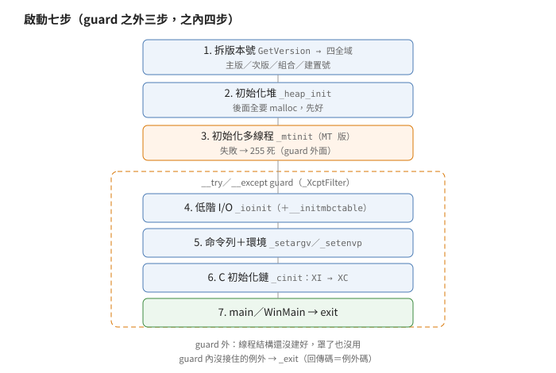
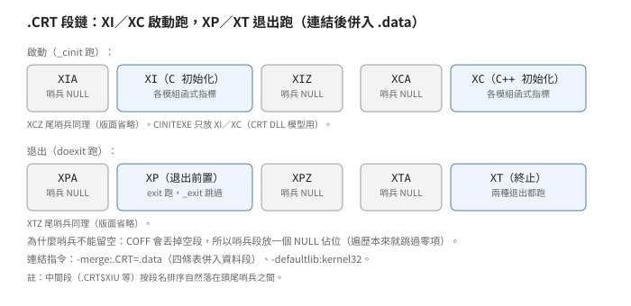

# 啟動碼：四種進入點、一份源

## 結論

Visual C++ 2.0 的 CRT 用一份 `CRT0` 源、兩個開關
（寬字元 `WPRFLAG`、視窗程式 `_WINMAIN_`），編出四種啟動碼：
`mainCRTStartup`、`wmainCRTStartup`、`WinMainCRTStartup`、
`wWinMainCRTStartup`。作業系統只認進入點名
（PE 檔頭寫的起始位址），
`main` 只是七步的最後一步。

四種啟動碼共用同一條七步序列：拆作業系統版本號 →
初始化堆 → 初始化多線程（失敗直接死）→
初始化低階 I/O → 命令列與環境切成 `argc／argv` →
跑 C 初始化鏈 → 調使用者函式。
後四步罩在 `__try` guard 裡（沒接住的例外死在這裡）；
前三步在 guard 外面。
GUI 版在調使用者函式前多做三件事：
把命令列開頭的程式名剝掉、讀啟動資訊決定顯示方式、
傳 `NULL` 當上一個執行個體。

初始化與終止是同一條函式表鏈的兩端：
前兩條表啟動時跑，後兩條退出時跑，
表頭尾各放一個 `NULL` 定位
（段名與哨兵機制見推導節）。

命令列解析跑兩遍（先量多大、再配記憶體），
引號與反斜線的規則是偶數個反斜線加引號才切換引號狀態、
奇數個則引號本身變成字面字元。
萬用字元展開是連結期選配：多連一個只做
`#define WILDCARD` 的小模組就長出來，
不連就沒有；展開只認 `*` 與 `?`。

## 根本問題

Win32 程式不是從 `main` 開始的。
作業系統載入器只知道 PE 檔頭裡寫的一個進入點位址，
跳過去就不管了。`main` 要的四樣東西
（堆、命令列切好的 `argv`、環境變數表、
全域物件的建構）一個都還不存在，
得有人在 `main` 之前把它們排好——這就是啟動碼。

有三個約束把形狀逼出來。
第一，進入點只有一個，但程式有四種形狀
（console／GUI × 窄／寬字元），啟動碼得用條件編譯
一源四編，而不是寫四份。
第二，C++ 全域物件的建構函式散在各個模組裡，
啟動碼事先不知道有幾個、在哪裡，
只能約定「都丟進同一批段、啟動時從頭跑到尾」。
第三，命令列在 Win32 是一整串字串
（不像 DOS 有現成的 `argv`），切詞規則得由 CRT 自己定，
而且這條規則從此變成所有 Windows 命令列程式的共同行為。

## 推導

### 一源四編：兩個開關、四個進入點

<p align="center"></p>

`CRT0` 本體只認兩個開關。
`WPRFLAG` 切寬窄：命令列用 `GetCommandLineW` 還是
`GetCommandLineA`、調 `wmain` 還是 `main`。
`_WINMAIN_` 切 console／GUI：調 `main` 還是 `WinMain`、
錯誤訊息寫主控台還是彈訊息框。
四種組合各有一個進入點名（見行為規格表），
連結器靠進入點名決定拉哪個模組；
三個變體檔（寬 console、GUI、寬 GUI）本體都只有
幾行 `#define` 加 `#include` 同一份源。

GUI 版多帶一條連結指令：預設拉 `user32` 庫，
因為它的錯誤出口要彈訊息框（`MessageBoxA` 在 `user32` 裡）。
整份啟動源包在 `#ifndef CRTDLL` 裡——
CRT 編成 DLL 版時不用它，DLL 有自己的進入點。

### 啟動七步：順序是寫死的

<p align="center"></p>

1. **拆版本號**：調一次 `GetVersion`，
   拆成主版、次版、組合版、建置號四個全域變數。
   後面的程式碼（例如判斷是不是 Win32s）都讀這四個，
   不再調 API。
2. **初始化堆**：`_heap_init`。後面的命令列、環境複本
   都要 `malloc`，堆必須先好。
3. **初始化多線程**（只有 MT 版）：`_mtinit` 建鎖、
   配 TLS 索引（每線程一份私用儲存的槽號）、
   給主線程配一份線程私用結構。
   建鎖失敗死在 `_RT_LOCK`（鎖模組內部直接死），
   TLS 或結構配不出來才回失敗、
   由啟動碼 `_amsg_exit(_RT_THREAD)` 死——
   都是寫一句訊息、回傳碼 255、死。
4. **初始化低階 I/O**：`_ioinit`；多位元組版再跑
   `__initmbctable`（命令列切詞要認前導位元組）。
5. **命令列與環境**：`GetCommandLine` 拿整串、
   `_setargv` 切成 `argc／argv`、
   `GetEnvironmentStrings` 拿環境塊、`_setenvp` 複一份。
   （註解特別標：NT 1.0 不支援 `GetEnvironmentStringsA`，
   所以這裡調的是不帶 `A` 的版。）
6. **C 初始化鏈**：`_cinit` 先跑浮點初始化
   （`_FPinit` 掛鉤，有人用浮點才非空），
   再依序跑 `XI` 表與 `XC` 表。
7. **調使用者函式**：`main`（或 `WinMain`），
   拿回傳值調 `exit`。

第 4 到 7 步罩在 `__try／__except` guard 裡
（過濾器是 `_XcptFilter`）：啟動期或 `main` 裡
沒接住的例外，最後都死在這裡。
前三步在 guard **外面**：
線程系統沒建好之前，連例外過濾器要的線程私用結構都沒有，
guard 罩了也沒用。

### 初始化鏈：哨兵是為了餵 COFF

<p align="center">></p>

四條表（`XI`、`XC`、`XP`、`XT`）各由一批段拼成：
編譯器把每個初始化函式的指標丟進
`.CRT$XIU` 這類中間段（段名按字母排，中間段自然落在頭尾之間），
連結完就是一張連續的函式指標表。
`XI` 跑 C 的初始化、`XC` 跑 C++ 的、
`XP` 與 `XT` 留到退出時跑（見下）。

每條表頭尾各有一個哨兵段（`XIA／XIZ` 等），裡面只放一個 `NULL`。
註解寫明了原因：16 位元時代哨兵段是空的、只靠標號定位，
但 COFF 會把空段整個丟掉，所以哨兵段必須放一個零值佔位；
遍歷函式本來就會跳過零項，放零不影響結果。

哨兵分兩份源：`CRT0INIT` 放四條表的哨兵，
`CINITEXE` 只放 `XI／XC` 的——檔頭寫明它是給
「CRT DLL 模型下的使用者 EXE」用的：
C++ 初始化段必須落在使用者 EXE 自己的資料段裡，
哨兵就得跟著放過去。
兩份都帶一條連結指令：把 `.CRT` 合併進 `.data`、
預設拉 `kernel32` 庫。

`_cinit` 只跑 `XI` 與 `XC`。
`XP`（退出前置）與 `XT`（終止）是 `doexit` 跑的：
`exit` 先倒序跑 `atexit` 表、再跑 `XP`、最後跑 `XT`；
`_exit` 跳過前兩者、只跑 `XT`。
`XP` 的已知住戶是 CRT 自家模組
（沖緩衝區、刪暫存檔、還原主控台三處掛載點）；
`XT` 在源碼內沒有掛載點——誰住在裡面是未知。
編譯器產生的 C++ 初始化／解構掛哪裡，
CRT 源碼沒寫，一併列未知（見證據節）。

### 命令列：兩遍掃與 2N 規則

切詞函式跑兩遍：第一遍只數（算出要幾個指標、幾個字元），
配一塊剛好的記憶體，第二遍才真正填。
`argv` 指標區與字串區在同一塊裡，指標在前、字串在後，
最後補一個 `NULL` 指標；`argc` 是指標數減一。
配不出來就 `_RT_SPACEARG` 死。

程式名（`argv[0]`）的引號處理是簡化版：
開頭是引號就收到下一個引號或字串尾，
中間什麼都不解釋（註解的理由：程式名一定是合法檔名，
不需要花俏規則）。
參數部分才是完整規則，以反斜線配引號為核心：

- 偶數個反斜線加引號：反斜線折半，引號切換引號狀態。
- 奇數個反斜線加引號：反斜線折半，引號變成字面字元。
- 反斜線後面不是引號：原樣保留。

引號狀態裡的空格不分詞；兩個連在一起的引號在引號狀態裡
只產生一個字面引號。
空命令列（`cmd.exe` 不會給，但別的程式可能）就回退用
`_pgmptr`（`GetModuleFileName` 拿到的程式路徑）當命令列，
保證 `argv[0]` 永遠有東西。

### 萬用字元：連結期開關

展開功能平常不存在。要它的人多連一個模組，
那個模組全文只有兩行意思：`#define WILDCARD`、
再 `#include` 同一份切詞源。
於是同一份源編出兩個 `_setargv`：
一般版叫 `_setargv`，萬用字元版叫 `__setargv`
（雙底線），後者在切完詞之後多調一道 `_cwild`。

`_cwild` 怎麼知道哪個參數該展開？
切詞時（`WILDCARD` 開啟下）每個參數前面先偷塞一個字元：
引號處理**之前**的第一個字元。
如果它是引號，表示這個參數當初被引號包著，
照字面收進、不展開；否則看裡面有沒有 `*` 或 `?`，
有才做檔名比對。
比對到的檔名串成鏈、排序、重建 `argv`；
`malloc` 失敗就回 -1，外面 `_RT_SPACEARG` 死，
舊的 `argc／argv` 不動。

注意一個註解與實作的落差：
`_cwild` 的檔頭註解說支援 `[string]` 字元集，
但實際的萬用字元字串只有 `*?` 兩個，
比對函式也沒有字元集分支——`[ ]` 沒實作。

### 多線程 bootstrap：鎖、TLS、私用結構

`_mtinit` 只做三件事：`_mtinitlocks` 建鎖表、
`TlsAlloc` 配一個 TLS 索引、
`calloc` 一份主線程的 `_tiddata` 掛上 TLS。
私用結構只填四個欄：線程 id、線程 handle（-1 表自己）、
例外動作表、隨機數種子（1）。
Win32s 版把 `TlsAlloc` 換成 CRT 自己的實現，
因為 Win32s 的 TLS 語意不一樣。

鎖表是稀疏的：只有三把靜態 `CRITICAL_SECTION`
（Win32 互斥鎖）
（一把管鎖表自己、一把管退出、一把管堆），
其餘幾十把都是 `NULL`、第一次用才配。
配不出來或時機不對就 `_RT_LOCK` 死——
死在啟動期，連 `main` 都沒進。

退出統一走 `doexit`，開頭四個入口都先取退出鎖
（`_EXIT_LOCK1`，保證同時只有一線程在退出路徑上）；
`exit／_exit` 永不解鎖（進程直接死了），
`_cexit／_c_exit` 做完才解鎖、回到呼叫端。
退出鎖同線程可重取——註解寫明了原因：
`onexit` 回呼裡調 `_exit` 時同一線程會再取一次，
不可重入就死結了。

注意一處註解與實作的落差：`exit` 檔頭註解說
「`exit` 持鎖時不准調、`_exit` 永不取鎖」，
但實碼四個入口都取了退出鎖。
註解是設計期望，行為以實碼為準；
靠的是鎖可重入，不是「不取鎖」。

### GUI 版的三件額外工作

1. **剝程式名**：`WinMain` 拿到的命令列不含 `argv[0]`，
   啟動碼得自己跳過第一個 token。
   開頭是引號就收到配對引號（收不到就收到字串尾），
   不是引號就收到第一個空白；再跳過後面的空白。
   注意這裡的「空白」跟切詞函式定義不同：
   剝名認的是全部 `≤0x20` 的控制字元，
   切詞只認空格與定位字元——兩套邏輯各寫一遍。
2. **讀啟動資訊**：`GetStartupInfo` 拿 `STARTUPINFO`
   （系統傳入的啟動參數，含顯示方式），
   `nCmdShow` 的值看旗標：有 `STARTF_USESHOWWINDOW`
   就用指定的，沒有就用 `SW_SHOWDEFAULT`。
3. **調 `WinMain`**：第一個參數是 `GetModuleHandle(NULL)`，
   第二個（上一個執行個體）在 Win32 永遠是 `NULL`——
   16 位元的實例概念沒了，參數為了相容留著。

## 在執行檔裡怎麼認

以下全是從原始碼推導的靜態特徵，
封存裡沒有啟動碼的出貨 `.OBJ` 可以逐位元組對，
證據等級見證據節。

- **進入點名**：`mainCRTStartup` 是窄字元 console、
  `wmainCRTStartup` 是寬字元 console、
  `WinMainCRTStartup` 是 GUI、大小寫加 `w` 的是寬 GUI。
  四選一，錯不了。
- **版本拆分**：進入點開頭調 `GetVersion`，
  後面跟著四組移位與遮罩（取低位元組、高位元組、組合、高字），
  就是 `_winmajor／_winminor／_winver／_osver` 四連拆。
- **MT 版**：`TlsAlloc` 之後緊跟一塊固定大小的 `calloc`
  （`_tiddata`），再跟四次欄位寫入
  （線程 id、-1、例外表、種子 1）。
- **GUI 版**：引用 `MessageBoxA` 且連結帶 `user32`、
  調 `GetStartupInfo`、傳 `NULL` 當第二個參數調 `WinMain`。
- **萬用字元版**：`_setargv` 之後多一道 `_cwild`，
  且切詞函式裡有「每參數偷塞首字元」的額外寫入；
  一般版沒有。
- **`.CRT` 段**：PE 裡看到 `.CRT$XIU` 這類段名，
  就是初始化鏈的中間段；合併後都落在 `.data` 裡。

## 給 remake 的行為規格

以下全部來自原始碼直接寫明的介面與順序，
沒有實跑支持（無 Win32 工具鏈）。
命名與順序都與原檔無關：

```text
function spec_startup(entry, cmdline, env):
    # entry 四選一，對應的開關與使用者函式見表一
    osver = GetVersion()                      # 只調一次
    winmajor, winminor = osver低位元組, osver次位元組
    heap_init()
    if MT版 and not mtinit(): die(_RT_THREAD) # 建鎖、TLS、主線程結構
    try:
        ioinit()
        argv = parse_cmdline(cmdline)         # 兩遍掃，規則見表二
        envcopy = copy_env(env)
        cinit()                               # FPinit、XI表、XC表
        if GUI版: cmdline = strip_argv0(cmdline)  # 規則見表三
        ret = user_function(...)              # main 或 WinMain
        exit(ret)                             # atexit倒序、XP表、XT表
    except:
        _exit(exception_code)                 # _XcptFilter 沒接住就死
```

表一：進入點。

| 進入點 | 字元 | 介面 | 調誰 | 錯誤出口 |
|---|---|---|---|---|
| `mainCRTStartup` | 窄 | console | `main` | 主控台寫字 |
| `wmainCRTStartup` | 寬 | console | `wmain` | 主控台寫字 |
| `WinMainCRTStartup` | 窄 | GUI | `WinMain` | 訊息框 |
| `wWinMainCRTStartup` | 寬 | GUI | `wWinMain` | 訊息框 |

表二：切詞規則（參數部分；程式名只認引號配對）。

| 輸入 | 輸出 |
|---|---|
| 2N 個 `\` 加 `"` | N 個 `\`，切換引號狀態 |
| 2N+1 個 `\` 加 `"` | N 個 `\` 加一個字面 `"` |
| N 個 `\`（後面不是 `"`） | N 個 `\` |
| 引號狀態內的空格 | 字面空格，不分詞 |
| 引號狀態內的 `""` | 一個字面 `"` |
| 空命令列 | 用程式路徑當命令列重切 |

表三：GUI 的 `argv[0]` 剝除。

| 命令列開頭 | 剝到哪 |
|---|---|
| `"` | 配對的 `"` 之後（沒有就到字串尾） |
| 其他 | 第一個 `≤0x20` 的字元（全部控制字元，不只空格） |
| 之後 | 跳過所有 `≤0x20`，剩下的給 `WinMain` |

表四：退出路徑。

四個入口的差別只有三件事：跑不跑 `atexit` 與 `XP` 表、
解不解退出鎖、回不回呼叫端（`_cexit` 就是「會回來的 `exit`」，
`_c_exit` 就是「會回來的 `_exit`」）。
退出鎖四個入口都取（見上節）：

| 入口 | atexit 倒序 | XP 表 | XT 表 | 解退出鎖 | 回到呼叫端 |
|---|---|---|---|---|---|
| `exit` | 跑 | 跑 | 跑 | 否（進程死了） | 否（`ExitProcess`） |
| `_cexit` | 跑 | 跑 | 跑 | 是 | 是 |
| `_exit` | 不跑 | 不跑 | 跑 | 否（進程死了） | 否（`ExitProcess`） |
| `_c_exit` | 不跑 | 不跑 | 跑 | 是 | 是 |

## 證據與未知

- 一源四編（開關、進入點名、變體檔結構）：
  原始碼直接寫明，**已證實（原文）**。
- 啟動七步的順序（版→堆→線程→IO→參數→鏈→調函式，
  後四步在 guard 內）：
  原始碼直接寫明，**已證實（原文）**。
  `_mtinit` 在 guard 外面的理由是推導（guard 要的結構還沒建好），
  原始碼沒寫，屬**強推論**。
- 哨兵 `NULL` 與 COFF 空段註解、
  `CINITEXE` 是 CRT DLL 模型的使用者 EXE 哨兵、
  `.drectve` 合併與 `kernel32`：
  原始碼直接寫明，**已證實（原文）**。
- `XP／XT` 由 `doexit` 跑、`_exit` 跳過 `XP`、
  `XP` 三處 CRT 自家掛載點：
  原始碼直接寫明，**已證實（原文）**。
  `XT` 住戶與編譯器產物的掛載位置列未知。
- 切詞兩遍掃、2N 規則、程式名簡化、空回退：
  原始碼直接寫明，**已證實（原文）**。
- 萬用字元連結期開關、首字首協議、只認 `*?`、
  註解的 `[ ]` 沒實作：原始碼直接寫明
  （`WILDSTRING` 只有兩個字元），**已證實（原文）**。
- `_mtinit` 三步（建鎖死 `_RT_LOCK`、TLS／結構死 `_RT_THREAD`）、
  私用結構四欄、鎖表三靜態其餘懶建、
  四入口都取退出鎖且可重入：
  原始碼直接寫明，**已證實（原文）**。
  `exit` 檔頭「`_exit` 永不取鎖」註解與實碼矛盾，
  以實碼為準（第二處註解落差）。
- GUI 三件工作（剝名雙徑、`STARTF_USESHOWWINDOW` 三元、
  `hPrevInstance` 永 `NULL`）與剝名／切詞兩套空白定義：
  原始碼直接寫明，**已證實（原文）**。
- 在執行檔裡怎麼認的六條：從原始碼推導，
  封存裡沒有啟動碼的出貨 `.OBJ` 對位元組，
  **強推論**（進入點名那條除外：它是連結器行為，
  **已證實（原文）**）。
- 未知：`_XcptFilter` 接住之後做什麼
  （在例外目錄，不在啟動碼內）、Win32s 的 TLS 替代實現、
  Alpha 包的啟動差量（只知 `chkstk` 預建等四處，
  啟動序本身是否相同沒對過）、`_FPinit` 掛鉤的掛法、
  `XT` 表的住戶、編譯器產生的 C++ 初始化／解構掛哪裡。

出處：Visual C++ 2.0 CRT，`STARTUP` 目錄的
`CRT0.C／WCRT0.C／WINCRT0.C／WWINCRT0.C／CRT0DAT.C／CRT0INIT.C／STDARGV.C／
WILD.C／TIDTABLE.C／MLOCK.C` 與 `DLLSTUFF` 目錄的 `CINITEXE.C`；
`I386` 目錄只有輔助函式的出貨 `.OBJ`，
沒有啟動碼的可對位元組。
