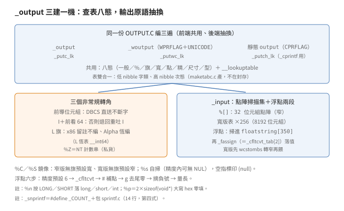
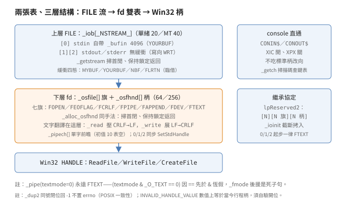

# 輸入輸出：兩張表、三建引擎、文字翻譯層

## 結論

`STDIO`（90 項：88 個 `C` 檔加建置）
管 C 的流：
`FILE`、緩衝、`printf／scanf`；
`LOWIO`（35 項：30 個 `C` 檔、
2 個 `ASM` 檔加建置）管 fd：
無緩衝讀寫、文字翻譯、
console 直通。
兩層之間各一張表：
上層 `_iob[_NSTREAM_]`（流表），
下層 `_osfile[]／_osfhnd[]`（fd 表），
最底才是 Win32 `HANDLE`。

兩張表的配置慣例相同：
掃到空位後「保持鎖定返回」，
呼叫端負責解鎖。
`_getstream` 與 `_alloc_osfhnd`
是同一個手法的兩次出現。

`printf` 的格式字串不是逐段解析，
是逐字查表：
八個狀態、九種字類、
一張雙表合一的 `__lookuptable`
（低半位元組（nibble，4 位元）查字類、
高半位元組查次態（下一個狀態）），
由已不在封存
（出貨的 CRT 原始碼包）內的
`maketabc.c` 產生。
同一份 `OUTPUT.C` 編三遍，
窄字、寬字、console 各一：
輸出原語抽換成巨集
（`_putc_lk／_putwc_lk／_putch_lk`），
狀態機本體不動。
`scanf` 的 `_input` 也是三建，
`%[]` 掃描集用 32 位元組點陣
（256 個位元，一字一位）比對。

文字模式的翻譯放在低階層：
`_read` 把 `CRLF` 壓成 `LF`，
`_write` 把 `LF` 展成 `CRLF`。
`CR` 恰落在讀緩衝尾時要偷看
下一個位元組：
磁碟檔看完退回（`seek` 回一位），
管線與裝置退不回，
用 `_pipech[]` 單字前瞻暫存。
這是管線讀寫正確性的關鍵，
也是 `_pipech` 存在的唯一理由。

`_popen` 不走 `CreateProcess` 直連：
它先把管線端蓋上標準柄的槽位、
把另一端藏起來（暫填無效值），
再生出 `COMSPEC`
（命令直譯器的環境變數）的子行程，
最後還原槽位。
父子之間用 `IDpair` 表記帳
（`stream` 對 `prochnd`），
`_pclose` 先關流
再等子行程收屍
（等待子行程結束，即 `wait`）。

console 另開一對柄
（`CONIN$／CONOUT$`，
`.CRT$XIC`（啟動回呼段）開、
`.CRT$XPX`（終止回呼段）關），
直開裝置名、
不經標準柄槽位，
故不受改向影響
（屬強推論：原文只寫直開，
沒明寫改向語意）。
`_getch` 把 console 切到原始模式、
讀輸入事件、拿掃描碼查鍵表，
讀完把模式還原。

## 根本問題

C 標準要的東西，
Win32 一個都不直接給：
緩衝流、格式化、`ungetc`、
文字模式、fd 編號。
`HANDLE` 只有無緩衝的位元組讀寫。
兩層之間差了五件事：
緩衝管理、鎖、
文字翻譯、編號抽象、
行程繼承。
這一層的設計就是這五件事
各放哪裡。

文字翻譯為什麼放低階
（`_read／_write`）而不是 `FILE` 層？
因為 `read／write` 的直接呼叫端
也要吃到翻譯，
且翻譯跟位元組位置綁死：
`CR` 跨讀緩衝邊界要偷看退回，
`ftell` 在文字模式要回推行數。
放最貼近 OS 的一層，
兩種呼叫端一次解決，
代價是 `_read` 要認五種偷看情形。

兩張表為什麼都手列初值
（64／256 個無效柄、
`_pipech` 全填 10）？
靜態初值零執行成本，
啟動不用跑迴圈清表。
代價寫在註解裡：
`_NHANDLE_` 只准是 64 或 256，
換數字就要重寫初值列。
這是 1994 年的務實：
表不大，正確性用註解守。

格式化為什麼一份源編三遍？
窄、寬、console 的差異
只在「輸出一個字」與
「字串怎麼算長」，
狀態機與旗標語意完全相同。
用巨集抽換輸出原語，
三份後端共用一份前端：
修格式語意只改一個檔。
`_snprintf` 更進一步：
`#define _COUNT_` 再包 `sprintf.c`，
連後端都不必重寫。

至於為何兩層各一張表
而不是一張共用、
為何配置採保持鎖定返回、
`_popen` 為何換柄藏管
而不直連子行程、
console 為何另開柄：
四條的約束各寫在所屬節內
（雙表節、流表節、
`_popen` 節、console 節），
不另立總論。

## 推導

### 流表：_iob 與鎖定返回

`_FILE.C` 52 行，管三件事：
`_bufin`（`stdin` 的自帶緩衝）、
`_iob[_NSTREAM_]`（流表）、
`_lastiob`（錨尾）。
`_NSTREAM_` 多線程或 DLL 版 40，
否則 20。
預設三流只填一半：
`_iob[0]` 是 `stdin`
（讀向、自帶 4096 緩衝、
`YOURBUF`——緩衝算借的，
關流時不釋放）；
`[1][2]` 是 `stdout／stderr`
（寫向、無緩衝，
等第一次輸出再決定怎麼緩）。
整檔包在 `#ifndef DLL_FOR_WIN32S` 內
（Win32s：在 16 位元 Windows 上跑
32 位元碼的相容層，另有他檔伺候）。

註解有個筆誤：
`stderr` 上方寫 `(_iob[3])`，
實為 `[2]`。
數一數初值列就知道，
屬已證實（原文）的筆誤。

`_getstream`（`STREAM.C`）是取號機：
拿 `_IOB_SCAN_LOCK`、
掃第一個閒流（`!inuse`）。
多線程下加了流鎖還要再驗一次
（拿鎖之前可能被別執行緒搶走），
驗過才清零
（旗標、計數、指標、檔號 `-1`），
然後**保持鎖定返回**：
呼叫端（`fopen` 類）填完流欄位
才解鎖。
註解把這條寫成呼叫契約。

### 緩衝四態與臨時緩衝

流的緩衝有四種出身：
`MYBUF`（`_getbuf` 配的）、
`YOURBUF`（使用者給的）、
`NBF`（無緩衝）、
`FLRTN`（臨時借的，用完歸還）。

`_getbuf` 只做一件事：
`malloc` 4096，
成則 `MYBUF`（自配），
敗則 `_IONBF` 加
`_base` 指 `_charbuf`、
`_bufsiz` 填 2。
單字緩衝是底線：
`_filbuf` 檔頭註解寫明，
`scanf` 的 `ungetc` 再怎麼省
也要一個字的位置放回去。

`_stbuf／_ftbuf` 管臨時緩衝，
只伺候 tty 上的 `stdout／stderr`。
`_stbuf`：非 tty、非標準二流、
或流已有緩衝，
一律直接回 0；
否則借 `_stdbuf[index]`
（兩格靜態指標，首次 `malloc` 4096），
掛 `_IOWRT|YOURBUF|FLRTN`
三位。
`_ftbuf`：沖掉輸出後拆台
（`_base／_ptr` 清空、
`_bufsiz` 歸零），
緩衝本體留給下次借。
目的寫在檔頭：
整串一次送核心，
不逐字系統呼叫。

`_flsbuf` 配合演出：
`stdout／stderr` 若是 tty
且尚無緩衝，
故意不取緩衝。
註解說穿了：
取了就是 `_IONBF`，
反而擋了後面的 `_stbuf`。
兩檔隔空協作，
靠旗標語意銜接。

`setvbuf` 是掛載器：
非 `NBF` 的情況下，
`size<2`、`size>INT_MAX`、
`type` 非三值之一，
中一即拒絕。
過關先把 `size` 掩成偶數，
再 `_flush` 加 `_freebuf`
清掉舊緩衝，
按三式掛載。
行緩衝（`_IOLBF`）註解自承
等同全緩衝：
旗標永不置位，
`_IOFBF` 又定義成 0，
所以「非 `NBF` 即全緩衝」。

### _filbuf／_flsbuf：方向錯置即錯

填充與沖洗各一檔，
各包 `_UNICODE` 兩版同檔轉生
（同一源檔編出兩版：
`_filbuf／_filwbuf`、
`_flsbuf／_flswbuf`）。
規則對稱：
讀到寫流、寫到讀流，
置 `_IOERR` 回 `EOF`。
`_flsbuf` 多一條 ANSI 規則：
讀轉寫只准在 `EOF` 處
（清掉讀向、等同一次 `fflush`），
讀到一半轉寫向是錯。

寬版 `_filwbuf` 多一個判錯：
`_cnt==1`（半個寬字）
視同讀壞。
窄版只判 0 與 `-1`。

`fseek` 藏了一個讀流優化：
讀向、自配（`MYBUF`）緩衝、
非 `setvbuf` 指定，
`_bufsiz` 暫縮 512。
註解的理由是下次 `_filbuf`
少讀一點；
`_filbuf` 讀完後認出
「512 加自配加非指定」
就恢復 4096（尾段，供下次用）。
一次 seek 只省一次填緩衝，
下下次恢復正常。

`_filbuf` 尾段把低階狀態往上帶：
`_osfile` 同時有 `FTEXT|FEOFLAG`
（文字模式撞 `Ctrl-Z`），
就給流置 `_IOCTRLZ`。
`FEOFLAG` 的用途變更前要
對照 `_IOCTRLZ`
（`_read` 檔頭註解指名道姓），
兩旗是同一事實的兩層投影。

### _openfile：模式字串解碼器

`fopen` 本體三行邏輯：
`_getstream` 取號、
`_openfile` 解模開檔、
`_unlock_str` 放行。
`fopen` 傳 `_SH_DENYNO`
（經 `_fsopen`），
寬版 `_wopenfile` 同檔轉生
（`WPRFLAG` 切換函式名）。

`_openfile` 解模式字串：
首字必須是 `r／w／a`
（讀／寫清／寫 append，
各配一組 `oflag` 加流旗），
否則回 `NULL`。
餘下各字至多出現一次：
`+`（轉讀寫）、
`t／b`（文字／二進位，互斥）、
`c／n`（commit 開關，互斥）、
`S／R`（循序／隨機暗示，互斥）、
`T`（短命）、`D`（暫存）
（兩旗獨立，可並存，
`wTD` 合法）。
重複或非法不報錯：
`whileflag`（解析迴圈的繼續旗標）歸零、
靜默停止解析、
用已解出的旗標開檔。
模式字串寫錯不會告訴你，
這是已證實（原文）的行為。

`t／b` 缺席不置旗：
把決定權留給 `_tsopen`，
由全域 `_fmode` 補預設。
`c／n` 寫流旗 `_IOCOMMIT`
（commit 模式，
`fflush` 落盤——見收尾鏈）。
開成後 `_cflush++`，
把終止例程拉進映像。

### _output：查表八態機

`OUTPUT.C` 1336 行，
是 `printf` 家族真正的本體。
三建靠兩個小檔：
`CPRINTF.C`（12 行）
定義 `CPRFLAG` 再包源、
`WOUTPUT.C`（31 行）
定義 `WPRFLAG` 加
`_UNICODE／UNICODE` 再包源，
分別產 console 版靜態 `output`
（`_cprintf` 調用）、
`_woutput`；
本體產 `_output`。
三版互斥，
註解寫明目前不並存。

狀態機八態：
一般、`%`、旗標、寬度、
小數點、精度、尺寸、型別
（`TYPE` 算一態）。
字類也九種。
`__lookuptable` 雙表合一：
低 nibble 查字類、
高 nibble 查次態，
註解指名 `maketabc.c` 產生——
產生器不在封存內，
表只能當唯讀指紋用。
多一型 `%Z`（NT 計數串），
是 Win32 版相對 ANSI 的私貨。

三個非常規轉角值得記：

- 一般態遇到前導位元組
  （`isleadbyte`），
  把 `DBCS`（雙位元組字集）
  兩個位元組直送，
  不拆字。
  格式字串尾恰缺後半，
  除錯版有 `assert` 擋；
  註解 `UNDONE`，
  正式版掉字尾原文沒寫
  （屬推論邊界，不斷言）。
- `I` 尺寸要向前看：
  後接 `64` 才是 `__int64`，
  否則退回一般態重吐 `I`。
  註解自承偏離確定性自動機。
- `L` 尺寸恆表 `__int64`
  （`case` 內直設 `FL_I64`），
  條件名借用
  「長雙精度不等於雙精度」
  （x86 版此巨集為 1，
  故編不進；
  Alpha 版把條件加
  `|| defined(_M_ALPHA)` 恆編入）。
  `FL_LONGDOUBLE` 在全檔
  只有定義與判斷、零賦值，
  `L` 與長雙精度實已脫鉤。

型別處理幾條硬規則：

- `%C／%S` 無尺寸旗時鏡像：
  窄版預設寬（吃寬字）、
  寬版預設窄（吃窄字）。
  有 `h／l／w` 旗聽旗的。
- `%s` 不調 `strlen`：
  精度範圍內可能根本無 `NUL`，
  自掃至精度或 `NUL` 止。
  空指標印 `(null)`
  （`__nullstring／__wnullstring`）。
- `%Z` 讀 `Length／Buffer`，
  長度除不除 `wchar_t` 看寬窄旗。
- `%n` 按 `LONG／SHORT` 落
  `long／short／int`，
  不產生輸出。
- `%p` 精度定死
  `2×sizeof(void*)`、
  大寫 hex、前導零。
  指標即整數，只是包裝固定。
- 浮點六步：
  （1）精度預設 6
  （`g` 且精度 0 轉 1，
  ANSI 規定）；
  （2）調 `_cfltcvt` 表
  （即轉換篇的 `_cfltcvt_tab`，
  浮點引擎的換裝插座，
  可抽換的函式指標表）；
  （3）`#` 加精度 0 補小數點
  （`_forcdecpt`）；
  （4）`g` 去尾零
  （`_cropzeros`）；
  （5）負號摘下延後
  （配前導零填）；
  （6）量長（`textlen`）。
  長雙精度版（`_cldcvt`）區塊
  兩版皆編不進
  （條件同假，
  Alpha 差量未動該行），
  且因 `FL_LONGDOUBLE` 零賦值
  而不可達。

輸出原語三版各一函式：
`_putc_lk／_putwc_lk／_putch_lk`，
錯了把已寫計數記成 `-1`。
整數共用尾
（`COMMON_INT／COMMON_HEX`），
`0x／0X` 前綴用 `hexadd` 心算
大小寫。

### _input：點陣掃描集

`INPUT.C` 1098 行，三建同式
（`_input／_winput／conio input`）。
`%[]` 掃描集不用字串比：
32 位元組點陣，
`table[ch>>3]` 取位元組、
`1<<(ch&7)` 取位元，
`^` 反轉用互斥或翻轉判讀。
`%s` 共用同一張表。
寬版表放大 256 倍
（8192 位元組），
寬字直接當索引。
這是字串篇 `wcstok` 位圖的
再次出現：
同一年、同一批人、
同一個手法。

浮點輸入分兩段：
先掃字面進
`floatstring[CVTBUFSIZE+1]`
（`CVTBUFSIZE＝309＋40`：
雙精度最大位數加裕度），
符號、整數部、小數點
（吃 `locale` 的小數點字元）、
指數部分段掃，
寬度不設或超限箝位（clamp）到表長；
再調 `_fassign`
（即 `_cfltcvt_tab[2]`，
浮點引擎插座（可抽換的函式指標表）
的第二格）
按 `float／double／long double`
落值。
寬版多一道：
`wcstombs` 轉窄
（`malloc／free` 包一層臨時緩衝）
再餵同一入口。
引擎只吃窄字串，
寬窄分流在呼叫端解決。

`_snprintf` 是三建之外的第四式：
`#define _COUNT_` 再包 `sprintf.c`，
14 行解決計數版。
寬版與 `v` 版同式
（`SNWPRINT／VSNPRINT／VSNWPRNT`）。

### 收尾鏈：_cflush 與 XPX

`_cflush` 是假變數：
任一 `STDIO` 例程被連入，
`_cflush++` 的參照就把
`__endstdio` 拉進映像。
`__endstdio` 掛 `.CRT$XPX`
（啟動篇的終止鏈），
程式結束沖全流。
`CRTDLL` 版不用這招
（`#ifndef CRTDLL` 包住定義）。

`fflush(NULL)` 等於 `flsall`
（全流沖洗核心，
另有 `_flushall` 共用，
參數區分行為）。
`commit` 模式開的流
（`_IOCOMMIT`）
沖洗時落盤。
`_rmtmp` 掃整張 `_iob`：
`_tmpfname` 非空就關加刪，
回關掉的流數。
`_fcloseall` 自 `_iob[3]` 起關
（標準三流不動）。
`freopen` 先關（持鎖版）
再清零重用同一格。

### _popen：換柄藏管

`POPEN.C` 519 行，
核心是一張動態表
`IDpair{stream, prochnd}`
與取號函式 `idtab`。
流程七步：

1. 讀模式：首字 `r／w` 定方向，
   次字 `t／b` 定文字或二進位、
   缺席 `tm＝0`（進 `_pipe` 恆文字，
   等同 `t`），
   恆或上 `_O_NOINHERIT`
   （管線柄不繼承）。
2. 開管線（`PSIZE＝1024` 建議長度）。
3. 備份標準柄
   （`DuplicateHandle` 另存）。
4. 管線端蓋上標準槽
   （`_set_osfhnd` 加拷 `_osfile`），
   另一端暫填無效值藏起——
   子行程只該看到該看到的一端。
5. 生子行程：`COMSPEC` 加 `/c` 開
   （`_P_NOWAIT` 不等），
   只在兩種情形退回 `cmd.exe`
   （改 `spawnlp` 搜 `PATH`）：
   `COMSPEC` 缺席，
   或開失敗且 `errno` 是
   `ENOENT／EACCES`。
6. 還原雙槽（備份蓋回、
   藏起的還原）。
7. `fdopen` 包流、`idtab` 登記，
   回流指標。

`_pclose` 查表拿子行程柄、
先 `fclose` 關流、
再 `_cwait` 等收屍、
最後標空。
等行程與關流綁在同一呼叫，
漏調 `_pclose` 就是漏等子行程。

### 低階雙表與繼承協定

`_osfile[]`（`char` 旗標）加
`_osfhnd[]`（`long` 柄值）
是 fd 的本體：
`_osfile` 管狀態、
`_osfhnd` 管對下的 Win32 柄。
`_nhandle` 多線程 256、
單緒 64，
初值手列三處
（柄表填 `INVALID`、
旗表填零、
前瞻表 `_pipech` 全填 10），
註解在兩處以上自承
換數值要重寫初值列。

`_osfile` 七旗各一位：
`FOPEN 0x01／FEOFLAG 0x02／
FCRLF 0x04／FPIPE 0x08／
FAPPEND 0x20／FDEV 0x40／FTEXT 0x80`
（`0x10` 空缺，無人用）。
`FCRLF` 是讀緩衝首字為 `LF` 的
跨讀記號，
`_read` 置、`ftell` 取用校位。

`_alloc_osfhnd` 與 `_getstream`
同一手法：
`_OSFHND_LOCK` 掃首閉
（`!FOPEN`），
多線程加 `fh` 鎖再驗，
槽填無效柄，
保持鎖定返回。
`_set／_free_osfhnd` 管賦值：
只許設進無效槽、
只許釋放開位槽，
`0／1／2` 另同步
`SetStdHandle`（設柄／清 `NULL`）。
`_open_osfhandle` 反向包：
`GetFileType` 定裝置或管線旗，
`_O_APPEND／_O_TEXT` 拷旗，
配號回 fd。

`_ioinit` 管繼承：
父行程經 `StartupInfo.lpReserved2`
傳柄表，
格式是 `[N][N 位元組 osfile]
[N 個 HANDLE]`，
註解把位元組版式寫死。
子端按 `_NHANDLE_` 截斷拷入。
`0／1／2` 缺位就地補：
`GetStdHandle` 取柄、
`GetFileType` 定旗，
且一律補 `FTEXT`
（標準三柄永遠文字模式起步）。
封包端在 `EXEC`（`dospawn.c`），
註解指路，
留待行程篇（待寫）。

### _read：CR 在緩衝尾

`_read` 多線程版是薄鎖皮
（只加鎖的薄包裝：
驗號、加鎖、調 `_read_lk`），
單緒版直寫本體。
前瞻先行：
管線或裝置且 `_pipech[fh]` 非 `LF`
（初值 10 即「空」），
先吐前瞻字再讀。
`FEOFLAG` 已置或 `cnt` 為 0
直接回 0。

`ReadFile` 錯了認兩種特例：
`BROKEN_PIPE` 回 0
（寫端全關且讀空，等同 `EOF`）；
`ACCESS_DENIED` 映 `EBADF`
（註解：讀寫向錯不該是 `EACCES`）。
餘錯走 `_dosmaperr`。

文字翻譯逐字就地改寫
（`p` 讀、`q` 寫）：
`Ctrl-Z`（非裝置）置 `FEOFLAG` 停；
`CR` 看次字，
`LF` 則合併、`CR` 單留。
難點是 `CR` 在緩衝尾：
多讀一字偷看，
五種後續——
磁碟檔：`seek` 回一位
（非 `LF` 留 `CR`，
是 `LF` 吞 `CR`；
但一位元組讀無進展可退，
直接吃 `LF` 保證前進）；
管線裝置：`LF` 吃掉、
非 `LF` 存 `_pipech`。
首字 `LF` 置 `FCRLF`。
回值是翻譯後的真實字數。

### _write：LF 展開與回值折扣

`FAPPEND` 每次寫前先 `seek` 尾
（失敗忽略：
或許本就不可 `seek`，如管線）。
文字模式用 1025 位元組
`lfbuf` 分段：
`LF` 前補 `CR`，
段滿即 `WriteFile`。
回值 `charcount－lfcount`：
展開的 `CR` 不算呼叫端的帳。

零寫入三分流：
有 OS 錯映 `errno`
（`ACCESS_DENIED` 同樣轉 `EBADF`）；
裝置且首字 `Ctrl-Z` 回 0
（console 的 `EOF` 約定）；
否則 `ENOSPC`。
磁碟滿了沒寫半字，
回 `-1` 加 `ENOSPC`，
這是已證實（原文）的語意。

### _open 全映射與 _pipe 死子句

`_topen` 即 `_tsopen` 傳
`_SH_DENYNO`。
`_tsopen` 把 `oflag` 拆成
Win32 四元組：
讀寫向轉 `GENERIC_*`、
共享轉 `FILE_SHARE_*`
（四種 `DENY` 全映）、
建檔轉五種
（`OPEN_EXISTING／OPEN_ALWAYS／
TRUNCATE_EXISTING／CREATE_ALWAYS／
CREATE_NEW`，
`CREAT＋EXCL` 進 `CREATE_NEW`，
無 `CREAT` 的 `EXCL` 忽略）、
屬性轉暫存與存取暗示。
`_O_NOINHERIT` 進
`SecurityAttributes` 不可繼承；
`_O_TEMPORARY` 加
`DELETE_ON_CLOSE` 與 `DELETE` 存取；
`_O_SHORT_LIVED` 加
`FILE_ATTRIBUTE_TEMPORARY`
（註解：延後落盤）；
`_O_SEQUENTIAL／_O_RANDOM`
加對應掃描暗示
（`else if`，循序勝，
雙下只取循序）。

`_pipe` 先 `CreatePipe`
（`_O_NOINHERIT` 進繼承旗），
再配雙槽：
讀寫柄各一，
初值 `FOPEN|FPIPE|FTEXT`。
去 `TEXT` 的條件是
「`_O_BINARY`，
或（某式為 0 且 `_fmode` 二進位）」，
但某式 `(textmode & _O_TEXT == 0)`
因 `==` 先於 `&`
恆等於 `(textmode & 0)` 即 0——
後半永假，
`_fmode` 後援是死子句。
後果：`textmode＝0` 的管線
永遠文字模式，
不吃全域 `_fmode`。
運算子優先序的現行犯，
屬已證實（原文）。

`_dup` 是薄包裝：
`DuplicateHandle` 同存取複柄、
拷 `_osfile`、
槽滿 `EMFILE`。
`_dup2` 三條：
`fh1<fh2` 順鎖
（小號先拿，防死結）；
`fh1＝fh2` 開位回 0、
閉位回 `-1` 且**不置 `errno`**
（註解：POSIX 一致性）；
目標開位先持鎖關
（`_close_lk`，
註解：柄值終身有效、
不可重用舊槽的殘柄）。
另有註解解釋為何先驗開位：
`INVALID_HANDLE_VALUE`
數值上等於當今行程柄
（當前行程的虛擬柄），
`DuplicateHandle` 驗不出閉位，
只能自驗。

`_locking` 兩步：
`_lseek(CUR)` 取錨、
`LockFile／UnlockFile` 辦事。
`LOCK／RLCK` 初值 9、
迴圈先試後等（等 1 秒）：
共 10 試 9 等；
餘模式一次定生死。
檔頭寫 10 次、行內寫 9 次，
各算各的（試次 vs 等次），
以迴圈計為準。

### console：另開柄、掃描碼查表

`__initcon` 掛 `.CRT$XIC`：
`CreateFile` 開 `CONIN$`
（讀寫）與 `CONOUT$`
（寫），
存進 `_coninpfh／_confh`
（初值 `-1`）；
`__termcon` 掛 `.CRT$XPX` 關柄。
變數定義在此檔
就是連入開關：
註解自述，
參照 console 任一函式
才連入本檔。
直開裝置名、
不經 `0／1／2` 槽位，
故改向影響不到這對柄：
console 直通走自己的路
（此句屬強推論，
原文只寫直開）。

`_getch` 四步：
存 console 模式、
模式清零（原始模式）、
`ReadConsoleInput` 讀事件、
掃描碼查鍵表。
鍵表兩張：
`NormalKeys`（掃描碼作索引、
鍵位空缺處補全零表項對齊、
註解明寫附填（padding））、
`EnhancedKeys`（增強鍵）。
`_kbhit` 用 `PeekConsoleInput`
看有無待讀事件。
全程 `_CONIO_LOCK` 護送。
`_getche`（回顯版）與 `_kbhit`
同檔另段，
持鎖版（`_lk` 尾）另立入口。
`_getwch` 在原始碼樹內
無任何宣告與實作
（`CONIO.H` 與全樹搜尋零命中；
既有的 `getwch` 字串
全是 `_getwchar` 的子字串誤中）。

### _fstat 與 _mktemp

`_fstat` 先 `GetFileType` 分流：
字元裝置填 `_S_IFCHR`、
管線填 `_S_IFIFO`，
`rdev＝dev＝fh`、
`nlink＝1`、餘零，
速回；
磁碟檔走 `BY_HANDLE_FILE_INFO`：
大小直拷、
唯讀或可寫定模式位、
三個 `FILETIME` 轉本地時
再經 `__loctotime_t` 轉 `time_t`、
存取時與建檔時缺席
皆拷修改時。
`uid／gid／ino` 恆 0：
Win32 無對應概念，
填零了事。

`_mktemp` 取號源看線程：
多線程用 thread id、
單緒用 pid。
註解兩段：
pid 多緒下兩執行緒同 tick
會取同名，
故改 thread id；
但 Win32 的 id 會重用且偏小，
不比 Unix pid 好多少
（先講解法再自首局限）。
模板尾端至多 5 個 `X`
換數字，
少於 5 或第 6 字非 `X`
回 `NULL`；
第 6 字自 `a` 起窮舉，
`_taccess` 探測空位
（存在或 `EACCES` 都算被佔）、
`z` 用盡回 `NULL`。
`errno` 進出還原。

### 零散件：ungetc、close、setmode

`ungetc` 保證一次退字
（讀向流）：
推 `EOF`、非讀向、
或已退到緩衝頭
（`_ptr` 在 `_base`
且 `_cnt` 非零，
註解「背抵牆」）
回 `EOF`。
無緩衝先 `_getbuf` 現配；
`sscanf` 流（`_IOSTRG`）
不改緩衝、只驗字相符。
成功 `_cnt` 加一、
清 `_IOEOF`、補 `_IOREAD`。

`_close` 多線程版同式薄鎖皮。
關 `1／2` 有唯一特例：
兩者映同一 OS 柄時跳過關閉
（不出錯）；
餘柄照關。
關完 `_free_osfhnd`、
`_osfile` 清零。

`_setmode` 只翻 `FTEXT` 一位：
`_O_BINARY` 清、`_O_TEXT` 置，
餘值 `EINVAL`，
回舊模式（`_O_TEXT／_O_BINARY`）。

### Alpha 差量

`STDIO` 86 個 `C` 檔全同，
僅兩檔差：

- `OUTPUT.C` 8 行（4 處）：
  `_M_MRX000`（MIPS 架構巨集）
  改 `_M_ALPHA`、
  `L` 尺寸條件加
  `|| defined(_M_ALPHA)`。
  `L` 在兩版都恆表 `__int64`，
  差別只在編不編得進：
  同一份源、編譯旗當開關。
- `INPUT.C` 加一行：
  `#include <sizeptr.h>`。
  此檔只存 Alpha 樹。

`LOWIO` 30 個 `C` 檔全同，
Alpha 樹只缺兩物：
`I386／`（`INP／OUTP.ASM`，
x86 埠指令無 Alpha 對應）、
`SPECIAL.MAK`。
其餘連 `GETCH.C` 644 行鍵表
都一字不差：
console 邏輯與 CPU 無關。

## 在執行檔裡怎麼認

沒有 Win32 工具鏈，
以下全是強推論：
從原始碼形狀推導，
未與出貨 `OBJ` 對拍。

- `(null)` 與寬版 `(null)`：
  兩字串同時出現、
  被 `printf` 系參照，
  是 `_output` 三建的副產。
- `__lookuptable`：
  `0x06,0x00,0x00,0x06…`
  開頭的唯讀位元組串，
  長度約一個 `ASCII` 子集。
  此表形狀穩定
  （產生器固定輸出），
  是 `printf` 最強的單一指紋。
- `_iob` 三流初值：
  `_bufin` 指標加
  `READ|YOURBUF`（讀向旗標）、
  兩組 `WRT`（寫向旗標）加空指標，
  連續三個 `FILE` 結構。
- `_pipech` 初值塊：
  64 或 256 個 `0x0A` 連排。
  全 10 的初值塊很少見，
  誤判率低。
- `NormalKeys` 鍵表：
  掃描碼索引的結構陣列，
  首項全零、次項 `{27,0}`（Esc）。
  `_getch` 的指紋。
- `CONIN$／CONOUT$` 字串：
  console 直通的呼叫證。
- `%Z` 分支：
  讀 `Length`（`short`）
  加 `Buffer` 指標的
  計數串處理，
  ANSI `printf` 沒有此物，
  見到即 Win32 CRT 家族。

## 給 remake 的行為規格

數字（原始碼直接寫明，
無實跑支持）：

| 常數 | 值 |
|---|---|
| `_NSTREAM_` | 單緒 20，多線程或 DLL 40 |
| `_NHANDLE_` | 單緒 64，多線程 256 |
| `_INTERNAL_BUFSIZ` | 4096 |
| `_SMALL_BUFSIZ` | 512 |
| `CVTBUFSIZE` | 349（309＋40） |
| `PSIZE`（popen 建議管長） | 1024 |
| `BUF_SIZE`（write 中轉） | 1025 |
| `_locking` 重試 | `LOCK／RLCK` 共 10 試 9 等（等 1 秒） |
| `_pipech` 初值 | 10（`LF`，表空） |
| `_coninpfh／_confh` 初值 | `-1` |
| 掃描集點陣 | 窄 32 位元組，寬 8192 位元組 |

語意（原始碼直接寫明，
無實跑支持）：

- `_getstream／_alloc_osfhnd`
  保持鎖定返回，
  呼叫端解鎖。
- `setvbuf` 拒絕（非 `NBF` 時）：
  `size<2`、`size>INT_MAX`、
  `type` 非三值之一；
  過關 `size` 掩成偶數。
  `_IOLBF` 等同全緩衝。
- 讀寫向錯置置 `_IOERR`；
  讀轉寫只准在 `EOF`。
- `fopen` 缺 `t／b` 吃 `_fmode`；
  模式字串重複或非法靜默截斷，
  不報錯；
  `T`、`D` 可並存，
  互斥的只有三對
  （`t／b`、`c／n`、`S／R`）。
- `fflush(NULL)` 沖全流；
  `_fcloseall` 留標準三流；
  `_rmtmp` 刪 `_tmpfname` 非空流。
- `_dup2` 同號：開位回 0、
  閉位回 `-1` 且不置 `errno`。
- `_pipe` 的 `textmode＝0`
  永遠文字模式，
  不吃 `_fmode`
  （死子句，見推導）。
- 管線讀到 `BROKEN_PIPE` 回 0；
  讀寫向錯的 `ACCESS_DENIED`
  映 `EBADF` 不映 `EACCES`。
- `_write` 回值扣掉展開的 `CR`；
  零寫入且無 OS 錯：
  裝置首字 `Ctrl-Z` 回 0，
  否則 `ENOSPC`。
- `_fstat` 管線與裝置速填
  （`rdev＝dev＝fh`），
  `uid／gid／ino` 恆 0；
  磁碟檔存取時與建檔時缺席
  皆拷修改時。
- `_mktemp` 模板至少 6 個 `X`
  （5 換數字、1 窮舉 `a-z`），
  存在或 `EACCES` 都算被佔，
  `errno` 還原。
- 繼承格式
  `[N][N 位元組 osfile][N 個柄]`
  經 `lpReserved2`；
  `0／1／2` 起步一律 `FTEXT`。
- 浮點經 `_cfltcvt_tab`
  （轉換篇插座，
  可抽換的函式指標表）：
  輸出 `_cfltcvt`、
  輸入 `_fassign`（第二格）。
- `ungetc` 保證一次退字、
  `sscanf` 流只驗不改；
  `_close` 跳過同柄的 `1／2`；
  `_setmode` 只翻 `FTEXT`、
  回舊模式。
- Alpha 差量：
  `OUTPUT.C` 4 處、
  `INPUT.C` 1 行、
  `LOWIO` 缺 `I386／` 與
  `SPECIAL.MAK`，
  其餘全同。

## 證據與未知

- `_iob` 三流初值、`_lastiob`、
  `(_iob[3])` 註解筆誤（實 `[2]`）、
  `_NSTREAM_ 20／40`：
  原始碼直接寫明，
  **已證實（原文）**。
- `_getstream` 掃描加鎖再驗、
  清零欄位、保持鎖定返回：
  原始碼直接寫明，
  **已證實（原文）**。
- 緩衝四態、`_getbuf` 退路、
  `_stbuf／_ftbuf` 借還、
  `_flsbuf` 讓路、
  `setvbuf` 拒絕條件加
  `_IOLBF` 等同全緩衝：
  原始碼與註解直接寫明，
  **已證實（原文）**。
- `_filbuf／_flsbuf` 方向規則、
  寬版半字判錯、
  `fseek` 縮 512 加恢復、
  `_IOCTRLZ` 連動：
  原始碼直接寫明，
  **已證實（原文）**。
- `_openfile` 首字三分、
  各字至多一（`T`、`D` 可並存，
  互斥僅三對）、靜默截斷、
  缺 `t／b` 吃 `_fmode`、
  `_IOCOMMIT`：
  原始碼直接寫明，
  **已證實（原文）**。
- `_output` 三建、八態九類、
  雙表合一、`maketabc` 指名、
  前導直送、`I64` 前看、
  `L` 恆表 `__int64`（條件名借用）、
  `%C／%S` 鏡像、
  `%s` 自掃、`%Z` 計數、
  `%n` 落值、`%p` 定形、
  浮點六步、`_cldcvt` 兩版皆無：
  原始碼直接寫明，
  **已證實（原文）**；
  正式版格式尾掉字後果原文沒寫，
  屬推論邊界。
- `_input` 點陣比對、
  寬表 256 倍、
  浮點兩段加寬轉窄、
  `_snprintf` 包源：
  原始碼直接寫明，
  **已證實（原文）**。
- `_cflush` 拉入、`XPX` 掛載、
  `fflush(NULL)`、`_rmtmp`、
  `_fcloseall` 自 `[3]`：
  原始碼直接寫明，
  **已證實（原文）**。
- `_popen` 七步、
  `t／b` 缺席三路、不繼承、
  藏管、`COMSPEC` 退路
  （缺席或 `ENOENT／EACCES` 才退）、
  `IDpair` 記帳、
  `_pclose` 先關後等：
  原始碼直接寫明，
  **已證實（原文）**。
- 雙表七旗、`_nhandle 64／256`、
  手列初值註解、
  `_alloc` 掃描加鎖、
  `_set／_free` 同步標準柄、
  `_ioinit` 繼承版式加
  `0／1／2` 補 `FTEXT`：
  原始碼直接寫明，
  **已證實（原文）**。
- `_read` 前瞻五案、
  特例映射、逐字翻譯、
  `FCRLF` 置位：
  原始碼直接寫明，
  **已證實（原文）**。
- `_write` 展 `LF`、
  回值折扣、零寫入三分：
  原始碼直接寫明，
  **已證實（原文）**。
- `_tsopen` 四元映射
  （建檔五種、循序 `else if` 勝）、
  `_pipe` 死子句、
  `_dup／_dup2` 三條、
  `_locking` 10 試 9 等：
  原始碼直接寫明，
  **已證實（原文）**。
- console 另開柄、
  `_getch` 四步加鍵表、
  `_kbhit` 偷看、
  `_getwch` 原始碼樹內零命中：
  原始碼與全樹搜尋直接寫明，
  **已證實（原文）**；
  改向影響不到屬**強推論**。
- `_fstat` 分流速填加雙回退、
  `_mktemp` 取號加窮舉、
  `ungetc` 一退、`_close` 跳同柄、
  `_setmode` 翻一位：
  原始碼直接寫明，
  **已證實（原文）**。
- Alpha 差量
  （`OUTPUT` 4 處、`INPUT` 1 行、
  `LOWIO` 缺二物、
  其餘逐檔全同）：
  逐檔比對，
  **已證實（原文）**。
- 在執行檔裡怎麼認的七條：
  從原始碼推導，
  出貨 `OBJ` 還沒對，
  **強推論**。
- 未知：`maketabc.c` 產生器內容
  （不在封存內）、
  `_fassign` 長雙精度路在 x86
  是否可達、
  `ftell` 取 `FCRLF` 的完整算式、
  出貨 `OBJ` 對拍。

出處：Visual C++ 2.0 CRT，
`STDIO` 目錄的
`_FILE.C／STREAM.C／_GETBUF.C／_SFTBUF.C／
_FILBUF.C／_FLSBUF.C／_OPEN.C／FOPEN.C／
OUTPUT.C／INPUT.C／CPRINTF.C／WOUTPUT.C／
SNPRINTF.C／FFLUSH.C／FCLOSE.C／RMTMP.C／
CLOSEALL.C／FREOPEN.C／SETVBUF.C／FSEEK.C／
FTELL.C／UNGETC.C／POPEN.C`、
`LOWIO` 目錄的
`IOINIT.C／OSFINFO.C／OPEN.C／READ.C／
WRITE.C／DUP.C／DUP2.C／PIPE.C／LOCKING.C／
FSTAT.C／INITCON.C／GETCH.C／MKTEMP.C／
CLOSE.C／SETMODE.C`、
`H` 目錄的
`STDIO.H／INTERNAL.H／MTDLL.H／MSDOS.H／
FCNTL.H／CVT.H／FLTINTRN.H`，
Alpha 對照
`VC20CRTA／CRT／SRC／STDIO／LOWIO`。
行號以去 `\r` 後為準
（原檔為 DOS 的 `CRLF` 換行）。

