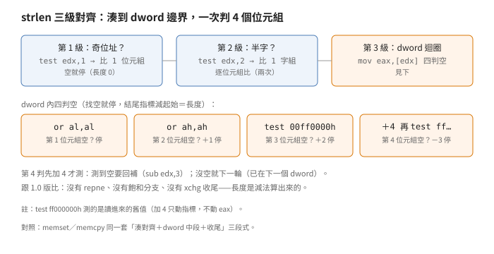
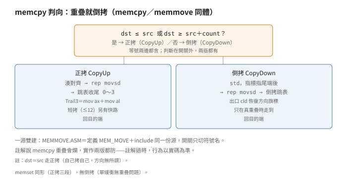

# 字串：對齊、位圖、locale 三條線

## 結論

VC++ 2.0 的字串庫是三套東西拼起來的：
25 支 x86 組語加 8 檔 C 管窄字元
（組語走熱路徑、C 走 locale）、
26 檔素 C 管寬字元、
73 檔程式碼（71 C 加 2 ASM）管多位元組。
熱路徑只有三招：對齊（`strlen` 先湊到
dword 邊界——位址是 4 的倍數——
再一次讀 4 個位元組判空）、
跳表尾（`memcpy` 按餘數查表跳四路收尾，
不用一串比較）、
位圖（`strspn` 家族用 32 位元組、
一位記一個字元有無，共記 256 個）。

`memcpy` 與 `memmove` 是同一份源編兩次，
差別只有公開符號名——重疊判斷與倒拷路徑
兩版都有。註解說 `memcpy` 重疊會爛，
實作是兩版都防：註解過時，行為以實碼為準。

`strcoll` 等五個 locale 函式三種骨架：
`strcoll／_stricoll` 拿兩把鎖，
C locale（預設的英文位元組序，未設語系時的值）
直接轉調窄函式，
否則調作業系統語系服務 NLS
（`CompareStringA／LCMapStringA`），
回傳值減 2 轉成三值；
`strncoll／_strnicoll` 只拿一把鎖
且 `count＝0` 直接回 0；
`strxfrm` 的 C 快徑還要碼頁也是 C 才走。
`_strlwr／_strupr` 非 C locale 時配一塊、
轉完拷回去、恆釋放。

寬字元版全是素 C 迴圈，沒有 ASM。
`wcstok` 跟 `strtok` 不同算法：
前者雙層直掃，後者 32 位元組位圖——
`wcstok` 註解還寫著「用位圖記分隔符」，
實作根本沒有（第二處註解落差）。

多位元組版全檔包在 `_MBCS` 門裡
（沒開多位元組建置就不編），
碼頁為 0（SBCS＝單位元組模式）
就轉調單字節版。
核心是 lead-byte 對偶律
（lead 是雙位元組字的前導位元組）：
前進看當下是不是 lead（是就跳 2），
倒退從字串頭數 lead 連段的奇偶
（奇數退 2，偶數退 1）。
碼頁表列五個 CJK 碼頁
（932／936／949／950／1361），
`_mbscat／_mbscpy` 直接借窄版
（SBCS 下同構，改個符號名就好）。

## 根本問題

字串函式是呼叫最密的庫函式，
正確與速度兩頭燒。正確面有三套語意：
窄字元（位元組即字元）、寬字元
（`wchar_t` 定寬）、多位元組
（一兩個位元組一個字，看碼頁）。
速度面在 486 等級的 CPU 上只有三件事：
對齊讀（非對齊的 dword 又慢又可能錯）、
少分支（跳表收尾）、查表代迴圈
（位圖把分隔符判斷變成兩次位運算）。

1.0 的 `strlen` 還在用 `repne scasb`
（見 `msvc-crt／strlen-anatomy`），
2.0 x86 版換成對齊加 dword 判空——
同一個函式，隔一版，熱路徑整個換掉。
這是 16 位元轉 32 位元最直接的指紋：
`repne` 家族退場，對齊家族進場。

## 推導

### strlen：三級對齊加 dword 四判空

<p align="center"></p>

位址除以 4 的餘數決定先比幾個位元組：
餘 1 或 3（奇位址）先比一個位元組，
餘 2 再逐位元組比兩次——湊到 4 的倍數為止。
剩下保證 dword 對齊，一次讀 4 個位元組，
用四道測試找空：`or al` 看第 1 個、
`or ah` 看第 2 個、`test 00ff0000h` 看第 3 個、
指標先加 4 再 `test ff000000h` 看第 4 個。

第 4 個的順序是刻意的：加了 4 才測，
測到空要回補（`sub edx,3`——加了 4、
空位在第 4 個，退 3 回到空位）。
第 2、3 個測到則各加 1、2 步進。
結尾指標減起始指標就是長度，
空字串的第一個位元組測試直接命中。

跟 1.0 版比：沒有 `repne`，
沒有飽和分支（1.0 的 far 版掃滿 64K 回最大值；
32 位元 `ECX` 倒數到 0 要 4G，註解連提都不提），
也沒有 `xchg` 收尾（1.0 拿它把剩餘數搬進 `AX`）——
長度是減法算出來的，不用換算。

### memcpy：一源雙建，兩版都防重疊

<p align="center"></p>

`MEMMOVE.ASM` 全文只有兩行意思：
定義 `MEM_MOVE`，再 include 同一份 `MEMCPY.ASM`。
開關只切公開符號名，重疊判斷在開關外面，
兩版都有。判斷式是正向表述：
`dst ≤ src` 或 `dst ≥ src＋count` 就正拷，
否則倒拷。注意等號兩邊都含——
`dst＝src` 走正拷（自己拷自己，方向無所謂）。

正拷分三段：先把目的端湊到 dword 對齊
（`neg` 加 `and 3`：位址除以 4 的餘數
決定前面先搬幾個位元組），
中段 `rep movsd`，
餘 0 到 3 個位元組跳表收尾
（`Trail3` 是 `mov ax` 加 `mov al`）。
短拷（`≤12`）不走這三段，
另有一條 `rep movsb` 逐位元組快路。

倒拷設 `std`（方向旗標朝下：
讓 `rep movsd` 從高位址往低位址搬，
已拷的不會蓋掉還沒拷的）、
指標都指到尾端後，對齊路徑下
源與目的各退一個 dword，
中段一樣 `rep movsd`，尾段另有一套倒拷跳表，
出口 `cld` 恢復方向旗標。
（非對齊另有一條前導路，退的是 3 不是 4；
短拷同樣走逐位元組快路。）

所以：這版 `memcpy` 重疊不會爛。
（C 標準說重疊調 `memcpy` 是未定義行為，
這版實作仁慈，不代表別版也仁慈。）

### memset、strstr、strrev：同樣的形狀

`memset` 先把值展成 dword：
設值是 `0x5A`，`mov ah,al` 後 `eax`
低 16 位是 `5A5A`，`ror eax,16`
把它轉到高 16 位，`mov ax,dx`
補回低 16 位——`eax` 成 `5A5A5A5A`。
`ror` 一次搬 16 位，比兩次 `shl／or` 省。然後同 memcpy 三段：
前導 `rep stosb`、中段 `rep stosd`、尾段 `rep stosb`。
`count＝0` 開頭就跳出，回目的端。

`strstr` 是三段式：兩個 `repnz scasb` 先量
兩串長度，再 `repne scasb` 在母串裡找首字，
找到才 `repe cmpsb` 驗後續。
（這裡 `repne` 還活著：找首字是變長搜尋，
對齊招用不上。）

`strrev` 用 `repne scasb` 量到尾，
再雙頭 `mov` 互換往中間走（`ah` 取頭、`al` 取尾，
交叉即停；空字串另有 `ecx＝-2` 快出，
註解說否則下面比不出來會 hang）。

### strspn 家族：32 位元組位圖

`STRSPN.ASM` 一源三建：
`SSTRSPN／SSTRCSPN／SSTRPBRK` 切
`strspn／strcspn／strpbrk`。
三者共用同一張 32 位元組位圖
（256 位，一位一字元）：
先清零，把分隔符字串裡每個字元的對應位設上，
再掃目標字串查位。

差別在查法：`strspn` 位上就繼續（`jc`），
`strcspn／strpbrk` 位沒上就繼續（`jnc`）；
NUL 靠「讀出來先比零、是就跳出」終止，
三者共用同一個先測零再查位的迴圈。
`strpbrk` 找到回位址，掃到尾沒有回空。

注意檔頭偽碼與組語本體的寫法差異：
偽碼的 `strcspn` 建表後做 `map[0] ｜＝ 1`
（把 NUL 位強制設上、靠查表停），
組語本體沒有這道指令、靠先測零跳出。
兩種寫法行為等價，實作以後者為準。

`strtok`（C 版）同一張位圖、
同一個建表式，另加持續狀態：
MT 版放線程私用結構（`_token`），
ST 版放靜態變數（`nextoken`）。
分隔符可每次調換（表每次重建），
切下來的 token 就地寫 NUL。

### wcstok：註解說位圖，實作直掃

`wcstok` 的檔頭註解寫「用位圖記分隔符，
一位一寬字元」。實作是雙層迴圈：
外層走目標串，內層線性掃分隔符串。
沒有位圖——寬字元 65536 個，
一位一字元要 8K 棧，作者沒捨得
（推導：註解是從窄版複製來忘了改，
行為以實碼為準）。

所以 `strtok` 查分隔符是 O(1)（建表 O(m) 一次），
`wcstok` 是 O(n·m)。分隔符串短時無感，
長時差一個數量級。兩者持續狀態同形
（`_wtoken／nextoken`），就地寫 NUL 也同形。

其餘 25 個 WCS 全是素 C 直寫
（`wcslen` 尾減頭、`wcsstr` 雙指標、
`_wcsrev` 雙頭），七個 locale 件
（`COLL／ICOLL／LWR／NCOLL／NICOL／UPR／XFRM`）
走寬版 NLS（`CompareStringW／LCMapStringW`）。

### locale 五件：三種骨架

`strcoll／_stricoll` 拿兩把鎖
（`CTYPE` 加 `COLLATE`），
C locale 直接轉調 `strcmp／_stricmp`
並解鎖回；否則查預設碼頁、
調 NLS（源碼調的是 `__crt` 包裝函式，
底下是 `CompareStringA`），解鎖，
回傳值減 2。減 2 是因為 NLS 回的是 1／2／3
（小於／等於／大於），C 規矩要負／零／正；
NLS 失敗回 `_NLSCMPERROR`、`errno` 設 `EINVAL`。

`strncoll／_strnicoll` 是變體：
`count＝0` 開頭直接回 0（不拿鎖），
且只拿 `COLLATE` 一把鎖。
`strxfrm` 也是變體：雙鎖還在，
但 C 快徑要兩個條件同時成立
（`LC_COLLATE` 是 C **且**碼頁是 C）才走，
走的是 `strncpy` 加回長度；
NLS 失敗回 `INT_MAX`（註明非標準），
不設 `errno`——跟四位兄弟都不一樣。

`_strlwr／_strupr` 同形不同尾：
C locale 手迴圈轉大小寫；
否則先問轉完要多長、配一塊、
轉換、拷回去、釋放——
目的端初值 `NULL`，釋放無條件做
（配失敗那路 `free(NULL)` 安全）。

### MBSTRING：lead-byte 對偶律

全目錄包在 `_MBCS` 門裡；
沒開多位元組建置，這 76 檔等於不存在。
執行期還有第二道門：`__mbcodepage＝0`
（單字節模式）就轉調 SBCS 版，
連鎖都不拿。

前進（`_mbsinc`）：當下是 lead 就跳 2，
否則跳 1。就一行。
倒退（`_mbsdec`）難得多：從 `current-1`
往前數 lead 連段，連段長度奇偶決定退法——
先看 `current-1` 自身是不是 lead
（是就退 2，那是上個字的 trail），
否則往前數到非 lead 為止，
`(current-temp)` 奇數退 2、偶數退 1。
算式一行：`current - 1 - ((current-temp) & 1)`。
走位例（`L` 表 lead、`T` 表 trail、
`S` 表單字節，`^` 表 current）：
`S S ^`：`current-1` 是 S 非 lead，
往前一格還是 S 即停，差 2、偶數、退 1；
`L T ^`：`current-1` 是 T 非 lead，
往前一格是 L、再往前越界停，差 3、奇數、退 2。

`_mbsrev` 先把每對 lead-trail 原地互換、
再整串倒（否則倒完 trail 跑到 lead 前面）。
`_mbstok` 是 SBCS 快徑加 `_mtoken`，
lead 分隔符用雙 NUL 斷詞。
`_tcs*`（`TCSMAP` 系列）是 `_mbs*` 的轉發別名：
`TCHAR` 是按建置切換的字元型別
（MBCS 建置下是多位元組版、Unicode 建置下是寬版），
`_tcs*` 跟著切，這批檔案是切到 MBCS 那面。

碼頁表列五個：932 日、936 簡中、
949 韓、950 繁中、1361 韓（Johab）。
每項記 lead 範圍（最多 8 段）與全形大小寫資訊，
`setmbcp` 時展成 `_mbctype[257]`（-1 到 255）
與 `__mbulinfo[6]`。
（`CPtoLCID` 只映射前四個，1361 沒有 LCID 對應。）

`_mbscat／_mbscpy` 不自己寫：
`EQU` 改個符號名、直接 include 窄版 `STRCAT.ASM`——
串接只找尾 NUL 再拷，lead 語意無關，
SBCS 下同構，直借。

日文硬碼四件：`_mbctohira／tokata`
（`≤0x8393` 才轉，`0x837F` 為界分兩段位移）、
`_mbcjistojms／jmstojis`（JIS 與 SJIS 互轉公式，
非 932 碼頁直通）、`_mbctombb／mbctombc`
（查表轉半全形，上限 `MBLIMIT 0x8396`）。
這些是碼頁 932 專用邏輯，
不走通用表。

### Alpha：23 C 加 3 DEC 組語

x86 的 25 支 ASM 到 Alpha 包變成：
23 支 C 直寫（`MEM*.C` 七支加 `STR*.C` 十六支，
`MEMCPY.C` 內按 `_M_ALPHA` 轉調 `RtlMoveMemory`）、
3 支 DEC 版權 `.S`
（`STRCMPS／STRCPYS／STRLENS`，
檔頭 Digital Equipment Corporation 1994）、
`STRCAT.C` 去 `strcpy`（因為 `STRCPYS.S` 另供）。
`LSOURCES` 差 3 行對應這替換
（`strcmp` 那行換成兩行，`strlen` 那行換名）；
`MBSTRING` 目錄另有兩支 C 版
且沒有 `SPECIAL.MAK`（x86 的 `MBSTRING` 有；
Alpha 的 `STRING` 目錄自己有另一份，
別跟這條搞混）。

## 在執行檔裡怎麼認

以下全是從原始碼推導的靜態特徵，
封存裡的字串出貨 `.OBJ`（`ST_LIB` 等目錄有
`STR*.OBJ／MEM*.OBJ`）還沒逐位元組對過，
證據等級見證據節。

- **`strlen` 三級對齊**：`test reg,1` 比位元組、
  `test reg,2` 比字組、然後 dword 迴圈配
  `or al／or ah／test 00ff0000／test ff000000` 四判空、
  `sub edx,3` 回補——全套出現就是這版。
- **`memcpy` 跳表尾**：`TrailingVecs[edx*4]` 四路
  （`mov ax／mov al` 收尾）加 `CopyDown` 的 `std` 路；
  `memcpy` 與 `memmove` 位元組相同（只差符號名）。
- **`memset` 的 `ror eax,16`**：值展四份的招牌，
  後面跟三段 `stos`。
- **位圖家族**：函式開頭配 32 位元組棧、
  `map[c>>3] ｜＝ 1<<(c&7)` 建表式；
  `strcspn` 多一個 `map[0] ｜＝ 1`。
- **locale 件**：`_LC_COLLATE_LOCK` 開頭
  （`strcoll／_stricoll／strxfrm` 另加 `CTYPE` 鎖）、
  C locale 分流、`__crt` 包裝引用、
  回傳值減 2（`strxfrm` 除外：回長度或 `INT_MAX`）。
- **`_mbs*` 轉發**：`_mbscat` 等直接是窄版位元組、
  符號名不同而已；`__mbcodepage` 全域比較（0 快徑）。

## 給 remake 的行為規格

以下全部來自原始碼直接寫明的介面與順序，
沒有實跑支持（無 Win32 工具鏈）。
命名與順序都與原檔無關：

```text
function spec_memcpy(dst, src, count):   # memmove 同體
    if dst <= src or dst >= src + count:
        copy_forward(dst, src, count)    # 湊對齊＋dword＋跳表尾
    else:
        copy_backward(dst, src, count)   # std 倒拷，出口 cld
    return dst

function spec_strspn_family(s, accept, mode):
    map = zero(32)                       # 256 位元：第 c 字元記在
    for c in accept: map[c>>3] |= 1<<(c&7)  # 第 c/8 位元組的第 c%8 位
    # （註：檔頭偽碼另有 map[0] |= 1，組語本體無此指令、
    #  NUL 靠「讀出先比零」跳出；行為等價，實作以後者為準）
    # 迴圈：讀一字元，是 NUL 就停；否則查位——
    if mode == STRSPN:  return len(leading bits set)
    if mode == STRCSPN: return len(leading bits clear)
    if mode == STRPBRK: return ptr(first bit set) or NULL

function spec_strcoll(a, b):             # strcoll／_stricoll 骨架
    lock(CTYPE); lock(COLLATE)
    if C locale: r = strcmp(a, b); unlock; return r
    r = CompareStringA(...)              # 實為 __crt 包裝，1／2／3
    unlock; unlock
    if failed: errno = EINVAL; return NLSCMPERROR
    return r - 2
# strncoll／_strnicoll：count＝0 先回 0，只拿 COLLATE 一把鎖
# strxfrm：雙鎖＋雙條件（locale 是 C 且碼頁是 C）才走快徑
#   （strncpy 加回長度）；失敗回 INT_MAX，不設 errno

function spec_mbsdec(string, current):   # current 合法邊界
    if string >= current: return NULL
    if codepage == 0: return current - 1
    if islead(current - 1): return current - 2
    temp = current - 2                   # 源碼先 --temp 再測
    while temp >= string and islead(temp): temp -= 1
    return current - 1 - ((current - temp) & 1)
```

表一：窄／寬／多位元組三套。

| 套 | 檔案 | 熱路徑 | 分隔符／比較 |
|---|---|---|---|
| 窄 | 25 ASM＋8 C | 對齊、跳表、位圖 | 32B 位圖 |
| 寬 | 26 C | 素 C 迴圈 | `wcstok` 直掃 O(n·m) |
| 多位元組 | 71 C＋2 ASM | 快徑轉 SBCS | lead 奇偶律 |

表二：locale 件對照。

| 函式 | 鎖 | C 快徑 | NLS 失敗 |
|---|---|---|---|
| `strcoll` | 雙鎖 | `strcmp` | `_NLSCMPERROR`＋`EINVAL` |
| `_stricoll` | 雙鎖 | `_stricmp` | 同上 |
| `_strncoll` | 單鎖（`count＝0` 先回 0） | `strncmp` | 同上 |
| `_strnicoll` | 單鎖（`count＝0` 先回 0） | `_strnicmp` | 同上 |
| `strxfrm` | 雙鎖（快徑另要碼頁是 C） | `strncpy` 加回長度 | `INT_MAX`，不設 errno |
| `_strlwr／_strupr` | `CTYPE` 單鎖 | 手迴圈 | 問長配轉拷釋（`dst` 初值空） |

表三：碼頁 0 快徑（`__mbcodepage＝0` 時）。

| 函式 | 快徑行為 |
|---|---|
| `_mbsdec` | 退 1（不看 lead、不拿鎖） |
| `_mbslen` 等 | 轉調窄版（不拿鎖） |
| 非快徑 | 照樣拿 `_MB_CP_LOCK` 查表 |

## 證據與未知

- `strlen` 三級對齊、四判空、回補算式：
  原始碼直接寫明，**已證實（原文）**。
- `memcpy` 一源雙建、判向式、兩版都防重疊、
  三段正拷、倒拷 `std／cld`、跳表尾、
  短拷 `rep movsb` 快路：
  原始碼直接寫明，**已證實（原文）**。
  註解說 `memcpy` 重疊會爛而實作防了，
  是註解落差（本輪第一處）。
- `memset` 展值、`strstr` 三段、`strrev` 雙頭：
  原始碼直接寫明，**已證實（原文）**。
- `strspn` 一源三建、位圖建表式、
  `jc／jnc` 查法、NUL 先測零跳出：
  原始碼直接寫明，**已證實（原文）**。
  檔頭偽碼的 `map[0]` 組語本體沒有
  （行為等價，實作以後者為準），
  是本輪第三處註解／偽碼落差。
- `strtok` 位圖加雙制 token：
  原始碼直接寫明，**已證實（原文）**。
- `wcstok` 直掃、註解寫位圖：
  原始碼直接寫明（迴圈無位圖），
  **已證實（原文）**（本輪第二處註解落差）；
  「8K 棧沒捨得」是推導，屬**強推論**。
- locale 三種骨架（雙鎖／單鎖加 count 衛兵／
  雙條件快徑）、減 2、`_NLSCMPERROR` 加 `EINVAL`、
  `strxfrm` 回 `INT_MAX` 不設 errno、
  `strlwr／upr` 問長配轉拷釋：
  原始碼直接寫明，**已證實（原文）**。
- `_MBCS` 門、碼頁 0 快徑、`_mbsinc／dec` 對偶、
  奇偶算式、`_mbsrev` 兩段、`_tcs` 別名、
  五碼頁表、`_mbscat` 直借：
  原始碼直接寫明，**已證實（原文）**。
- 日文硬碼四件（`0x8393` 上限加 `0x837F` 分段、
  JIS 公式、查表、`MBLIMIT`）：
  常數見原始碼，轉換細節沒逐行讀，
  屬**強推論**。
- Alpha 差量（23 C、3 DEC `.S`、STRCAT 去 strcpy、
  `LSOURCES` 差 3 行、`MBSTRING` 無 `SPECIAL.MAK`）：
  檔名、檔頭、diff 見原始碼，
  `.S` 內文沒讀，屬**強推論**。
- 在執行檔裡怎麼認的六條：從原始碼推導，
  出貨 `.OBJ` 還沒逐位元組對，
  **強推論**。
- 未知：`_mbsnbcnt` 尾 lead 的回退量、
  `_mbccpy` 越界寫不寫、`STRTOQ` 樁檔之外
  還有沒有樁（CONVERT 輪再掃）。

出處：Visual C++ 2.0 CRT，`STRING` 目錄
（`I386` 的 25 支 ASM 與 8 支 C、26 支 WCS）
與 `MBSTRING` 目錄（71 支 C、2 支 ASM）；
Alpha 包 `STRING／ALPHA` 的 3 支 `.S` 只讀了檔頭。
`I386／ST_LIB` 等目錄的字串出貨 `.OBJ` 還沒對位元組。
