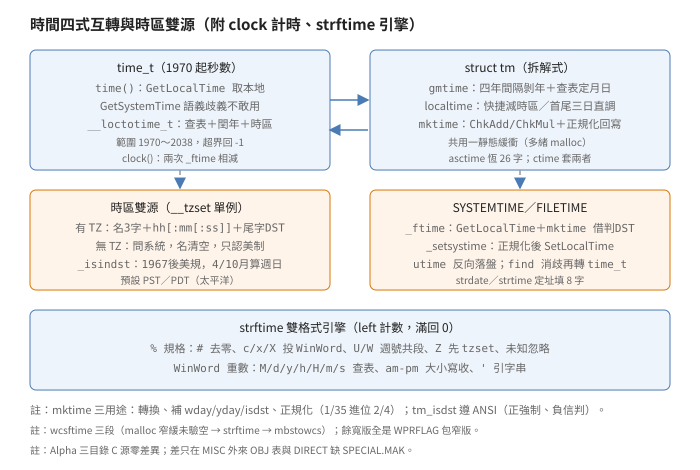
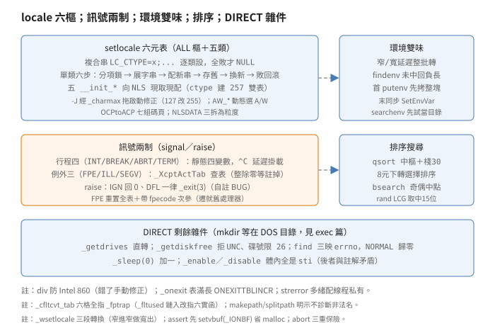

# 時間雜項目錄：時區雙源、locale 六樞、訊號兩制

## 結論

（名詞細節見推導各節，
此處先給全貌。
自造詞先定義：
雙源＝時區取自 TZ 或系統、
六樞＝六個 locale 類別、
兩制＝兩套訊號體制、
四式＝四種時間表示法。）

`TIME`（26 項 24 源）、
`MISC`（68 項 65 源）、
`DIRECT`（10 項 6 源加
`ENABLE.ASM`）
（項＝目錄條目數、
源＝C／ASM 源數、
OBJ＝建置產物數，
見盤點節）
是 CRT 的什錦櫃：
時間、排序、環境、
路徑、錯誤、locale、
訊號、磁碟目錄各一小撮。
時間以四式互轉為骨：
`time_t`（CRT 內部、
1970 起秒數）、
`struct tm`（C 標準、
拆解式）、
`SYSTEMTIME`（Win32 API、
拆解式）、
`FILETIME`（Win32 API、
1601 起 100 奈秒數）。
`time()` 調 `GetLocalTime`
不調 `GetSystemTime`
（`TIME.C:28` 明示：
NT 回 UTC、
Win32s 回本地，
語義歧義不敢用；
NT 是 Windows NT 本尊、
Win32s 是跑在
Windows 3.x 上的
32 位子集、
Win32c 僅原文並列
未解釋），
再經私有 `__loctotime_t`
加 `_timezone`、
減 DST（日光節約、
+1 小時＝3600 秒）
落袋。
時區雙源：
`__tzset` 只跑一次
（`first_time` 守門），
有 `TZ` 解析它
（名取 3 字、
差取 `hh[:mm[:ss]]`、
尾字非空即有 DST），
無 `TZ` 問系統
（`GetTimeZoneInformation`，
名全清空，
DST 只認美國制）。

`strftime` 是雙格式引擎：
`%` 規格走 `_expandtime`
（`#` 旗去前導零、
`%c／x／X` 轉投 WinWord 格式、
`%U／W` 算週號、
未知規格靜默忽略），
`M／d／y／h／H／m／s`
重數走 `_store_winword`
（重數定規格，
`dddd` 全星期名、
`'` 引字串）。
輸出全程 `left`
（剩餘可寫位元組
計數器）計數，
滿了回 0 不寫結尾。

`MISC` 的數值件全是
薄皮：
`div` 防 Intel 860 除法
（860 是 Intel 另款
處理器，
原文註明不知其
除法語義，
錯了手動修正）、
`rand` 是 BASIC 系
LCG（線性同餘、
前值線性遞推取亂數；
`214013／2531011`、
取中 15 位元、
種初 1）、
`_rotl` 逐位元搬
（`shift & 0x1f`，
負位移自通）。
`qsort` 取中樞、
手寫棧 30 格、
8 元以下轉 `shortsort`，
而 `shortsort` 實為
選擇排序
（註稱插入，
碼是逐趟取大）、
`swap` 逐字元搬
（防對齊問題）。
環境是雙味制
（味＝窄／寬字元
兩套環境塊）：
`_environ／_wenviron`
只在取用異味時
整批轉換
（`CP_OEMCP` 頁），
`findenv` 未命中回
負表長
（兼報表尾位），
`_putenv` 首次調用
先拷整塊
（防啟動塊重配懸空），
末調 `SetEnvironmentVariable`
同步 OS。

`setlocale` 管六類
（`COLLATE／CTYPE／
MONETARY／NUMERIC／TIME`
加 `ALL` 樞）：
複合字串
（`LC_CTYPE=xxx;...`）
逐類設、
全敗才回 `NULL`、
單類設敗回滾舊態；
每類一個 `__init_*`
向 NLS API
（National Language
Support，
Win32 地區支援）
現取現配；
`-J`（編譯旗，
`char` 無號）
經 `_charmax`
未定義符拖進
啟動修正
（引用了才鏈、
鏈了才跑，
見 locale 節）。
訊號兩制：
`INT／BREAK／ABRT／TERM`
四行程訊號走靜態四變數
（`^C` 處理器延遲掛載）、
`FPE／ILL／SEGV`
三例外訊號走
`_XcptActTab` 查表
（`STATUS_*` 映訊號；
整除零與棧溢位
註掉不接）；
`raise` 遇 `SIG_DFL`
一律 `_exit(3)`
（自註 `BUG, BUG!!!!
THIS IS ALMOST CERTAINLY
THE WRONG EXIT CODE`）。

`DIRECT` 本目錄 6 源
皆雜件
（`mkdir／rmdir／chdir`
住 `DOS` 目錄，
見 exec 篇）：
`_getdrives` 直轉、
`_getdiskfree` 拒 UNC、
`_findfirst／next`
errno 三映、
檔時經 `FileTimeToLocal`
消歧再轉、
`_sleep(0)` 加一
（動機屬推論）、
`_enable／_disable`
體內全是 `sti`
（後者與自家註解矛盾，
待對拍）。

## 盤點

`VC20CRTL/TIME` 26 項：
`TIME／CLOCK／DIFFTIME／
DAYS／DTOXTIME／LOCALTIM／
GMTIME／MKTIME／TZSET／
ASCTIME／CTIME／TIMESET／
FTIME／SYSTIME／STRDATE／
STRTIME／UTIME／STRFTIME`
18 窄源，
`WASCTIME／WCSFTIME／WCTIME／
WSTRDATE／WSTRTIME／WUTIME`
6 寬源，
加 `LSOURCES／DEPEND.DEF`。
`LSOURCES` 列 24 個 `OBJ`，
與源數一致。
`VC20CRTL/MISC` 68 項
65 源，
`LSOURCES` 列 73 個 `OBJ`：
多出的是外來八件
`exsup／exsup2／exsup3／
longjmp／sehsupp／setjmp／
setjmp3／setjmpex`
（`MISC/LSOURCES:69-76`，
`SPECIAL.MAK` 從
`$(TARGET_CPU)` 目錄拷入，
C 源不在本包；
73＝65 源＋8 外來）。
`VC20CRTL/DIRECT` 10 項：
6 源（`DRIVEMAP／DRIVFREE／
FINDFILE／SETERRM／SLBEEP／
WFINDFIL`）、
`I386/ENABLE.ASM`、
`LSOURCES／DEPEND.DEF／
SPECIAL.MAK`；
`LSOURCES` 列 7 個 `OBJ`，
`enable` 限 `i386`
（`TARGET_CPU` 是
目標 CPU 變數，
`!if "$(TARGET_CPU)"
=="i386"`），
`SPECIAL.MAK` 在無組譯器時
（`BLD_ASM==0`，
BLD_ASM 表有無組譯器）
從對應目錄拷入成品。

Alpha 版
（`VC20CRTA/CRT/SRC`）
三目錄 C 源逐位元組比對
（`cmp` 全過），
C 源零差異；
建置差兩處：
`MISC/SPECIAL.MAK` 與
`MISC/LSOURCES` 換整套
Alpha 外來 `OBJ` 名
（`chandler／divdat／divide2／
otsjmp／otsdiv…` 等），
且 Alpha 版
`MISC/ALPHA/` 多 22 個
`.S` 加 2 個 `.HS`
（x86 版無此目錄，
與 `BLD_ASM` 條件段對應）；
`DIRECT` 缺 `SPECIAL.MAK`
（無 Alpha 版 `enable`）。
三目錄無寬窄分寫
（寬＝`wchar_t`／Unicode 版，
窄＝`char` 版；
`WPRFLAG` 是寬版旗，
定義後 `_TSCHAR` 等
巨集切寬字）：
寬版全是
`#define WPRFLAG` 加
`#include "窄版.c"`
（`WASCTIME.C` 等），
唯三獨立實作：
`WCSFTIME.C`、
`WSETLOCA.C`、
`WPERROR.C`
（77 行自寫，
`wcstombs` 轉窄後
直寫 `_write_lk`，
無 `WPRFLAG`）。
`WTOMBENV.C` 是內部
轉換器非寬版包裝，
`WINSIG／WINXFLTR` 的
`WIN` 是 Win32 訊號
非寬字。

## time：不敢用的 GetSystemTime

`time()`
（`TIME.C:42` 起）
三步：
`GetLocalTime(&dt)`
（`:52`）、
`__loctotime_t` 轉換、
`timeptr` 非空才存。
檔頭註
（`:28`）
明示不敢用
`GetSystemTime`：
NT 回 UTC、
Win32s（及可能的 Win32c）
回本地時間，
語義歧義，
寧取本地再自行扣時區。
同檔歧義論在
`_timet_from_ft`
（`FINDFILE.C:189`）
重演：
檔時亦先
`FileTimeToLocal`
消歧。

`__loctotime_t`
（`DTOXTIME.C:38` 起）
是本地拆解轉 `time_t`
的唯一樞
（`time／stat／fstat／
findfile` 共用；
`TIME.C:55`、
`FINDFILE.C:224`、
`DOS/STAT.C`、
`LOWIO/FSTAT.C`
直調，
`UTIME.C` 無此調用，
它是反向走）：
年先減 1900，
`_BASE_YEAR`（70）
到 `_MAX_YEAR`（138，
即 2038，
`CTIME.H:24-30`）
外回 -1；
日數查 `_days[mo-1]`
（`DAYS.C`，
平年表，
首元 -1 是 1-based
換算偏移：
1 月得 `dy - 1`
即當年已過日數）；
`!(yr & 3)` 且 3 月後
加一
（註明 2100 判閏會錯，
但超出範圍）；
年日折秒用
`(yr-1)>>2 - 17`
數閏年
（`_LEAP_YEAR_ADJUST` 17：
`(yr-1)>>2` 是自元年起
4 的倍數個數，
減 17 扣掉 1970 前
（1970 年時
`(70-1)>>2 = 17`
恰歸零）；
例：1974 年
`(73>>2)-17 = 1`
即 1972 一閏）；
末調 `__tzset`
（`:91`）
加 `_timezone`，
`_daylight` 且
`_isindst` 再減 3600。

`clock()`
（`CLOCK.C:63` 起）
不是 CPU 時鐘：
啟動時 `__inittime`
（掛 `.CRT$XIC`
（啟動期回呼段，
見 startup 篇），
`:26`，
只在用戶調 `clock`
才鏈入）
`_ftime` 存初值，
`clock` 再 `_ftime`
取現值，
秒差乘 `CLOCKS_PER_SEC`
加毫秒差
（`:73`）。
`difftime`
（`DIFFTIME.C`）
只是一行
`(double)(b - a)`。

## localtime：三日守衛

`localtime`
（`LOCALTIM.C:54` 起）
先拒負值，
再調 `__tzset`，
然後分兩路：
中段（3 日後到
`LONG_MAX` 前 3 日，
`:69`）
走快捷：
減 `_timezone` 調
`gmtime`，
`_daylight` 且
`_isindst` 就加 3600
重調 `gmtime`
（`:86`），
置 `tm_isdst`。
首尾三日走慢路：
直接在 `tm` 結構上
加減時區
（秒→分→時→日
逐級進位，
註明首尾三日
`tm_mday／yday`
不溢上界
（末日不過 1 月 19 日）、
只防下溢；
慢路完全不做 DST
（無 `_isindst`，
時區外不調），
與快捷不對稱。
三日的量級理由
寫在檔頭註 (4)：
POSIX TZ 容許
時區加 DST 合併
近 50 小時，
取 3 日包住。
走慢路是因加減時區
可能溢出 `time_t`
（註明末秒是
2038-01-19 03:14:07 UTC）。
檔頭三假設加一註記
（`:26` 起）：
`gmtime` 與 `localtime`
共用一靜態緩衝
（互毀）、
只支援非負、
時區調整小於三日，
加一註記
（`LOCALTIM.C:27`）：
`gmtime` 須先於
`_isindst` 調用
（後者讀前者填的表）。

`gmtime`
（`GMTIME.C:43` 起）
四年間隔剝年：
`caltim / _FOUR_YEAR_SEC`
（1461 日秒數，
`CTIME.H:20`）
定段，
段內逐年扣除
（閏年扣 366 日，
註明 2000 是閏、
2100 超範圍）；
月日查 `_days／_lpdays`
線性掃
（`mdays[tmptim] <
tm_yday` 前進）；
星期是
`(*timp / _DAY_SEC +
_BASE_DOW) % 7`
（`:149`，
`_BASE_DOW` 4，
1970-01-01 是星期四）。
多緒版緩衝
`malloc(sizeof(struct tm))`
配線程私有
（`:70`，
CRT 有單緒／多緒
兩種建置，
多緒的靜態緩衝
改配線程私有，
配敗退回靜態）。

`mktime` 與 `_mkgmtime`
（`MKTIME.C:66` 起）
同調靜態
`_make_time_t(tb, 1／0)`：
月先歸 0 到 11
（商進年，
負值回補）、
日→時→分→秒
每步 `ChkAdd／ChkMul`
（`:22` 起，
加法驗同號溢出、
乘法驗除回不等），
溢出 `goto err_mktime`
回 -1；
本地旗置位才加
`_timezone` 調 `localtime`，
再按 ANSI 規則
（`:263`）
用 `tm_isdst`：
正值強制 DST、
負值信 `localtime`
的判斷，
成立減 3600 重調；
末 `*tb = *tbtemp`
回寫正規化、
回秒數。
三用途寫在檔頭：
轉換、補 `wday／yday／
isdst`、正規化
（1 月 35 日進位成
2 月 4 日）。

## tzset：雙源與美國 DST

`__tzset`
（`TZSET.C:58` 起）
是延遲單例：
靜態 `first_time`
雙重檢查加
`_TIME_LOCK`
（`:72`），
只跑一次真身。
`_tzset`（公開版）
每次加鎖重跑。
真身先取 `TZ`：
無 `TZ` 問系統
（`GetTimeZoneInformation`，
`:120`）：
`_timezone =
Bias * 60` 加
`StandardBias * 60`
（有標準月才加）、
有日光月且偏量非零
`_daylight = 1`
（註明只認美國制）、
`_tzname` 雙清空
（NT 無命名規範，
不猜）。
有 `TZ` 先比 `lastTZ`
（`:157` 同值免做；
`:172` `free` 舊值
`_strdup` 新值）；
解析只認本版固定格式
（非 POSIX TZ 全規格）：
名取 3 字
（`:180`）、
`[+|-]hh[:mm[:ss]]`
（`TZSET.C:185`，
`+` 由 `:199` 跳過；
`atol` 逐段，
`negdiff` 記號）、
尾字非空即
`_daylight = *TZ`
（字元值本身，
非 0／1）、
`_tzname[1]` 取 3 字。

`_isindst`
（`TZSET.C:260` 起）
只認現代美國 DST
（1967 後）：
67 年前、
4 月前、10 月後
恆 0；
5 到 9 月恆 1；
4 月與 10 月算
關鍵星期日：
87 年前 4 月取末週日、
87 年後取首週日、
10 月恆末週日
（`_days` 表推年日、
`_BASE_DOW` 推星期），
4 月當日 2 時後入、
10 月當日 1 時前出。
`TIMESET.C`
給預設太平洋時區
（`_timezone = 8*3600`、
`_daylight = 1`、
`PST／PDT`，
`:22-25`），
`DLL_FOR_WIN32S` 下
三行全滅；
同檔附
`__dnames／__mnames`
（三字縮寫串，
`asctime` 索引用）。

## asctime：26 字定式

`_tasctime`
（`ASCTIME.C:59` 起）
輸出恆 26 字
（`:46`）：
`Tue May 01 02:34:55
1984\n\0`。
星期月名各取 3 字
（`wday * 3` 索引
`__dnames`，
月名寫 `p+4`
留空格位，
`:101` 起）；
數字全經靜態
`store_dt`
（十位個位直填，
`:30` 起）；
年拆兩段
（`19 + year/100`
與 `year%100`）。
單緒回靜態 `buf`，
多緒 `malloc(_ASCBUFSIZE)`
配線程私有
（`:85`），
配敗退靜態。
`_tctime`
（`CTIME.C:35` 起）
只是
`localtime` 套
`_tasctime`，
`NULL` 穿透。

`_ftime`
（`FTIME.C:39` 起）
借用 `mktime`：
`GetLocalTime` 填
`struct tm`
（`tm_isdst = -1`），
`mktime` 回秒數兼判 DST，
`timezone` 取
`_timezone / 60`，
毫秒直拷。
`_getsystime`
（`SYSTIME.C:31` 起）
只取不設：
`GetLocalTime`、
`mktime` 正規化、
回毫秒。
`_setsystime`
（`:70` 起）
正規化後
`SetLocalTime`
（`:85`），
敗回 `GetLastError`
（`:86`）。
`_tstrdate／_tstrtime`
（`STRDATE.C／STRTIME.C`）
定址填字：
`MM/DD/YY` 與
`HH:MM:SS`
各 8 字加結尾，
分隔符先占位再填數。

`_tutime／_futime`
（`UTIME.C`）
三段：
`_topen` 以
`_O_RDWR | _O_BINARY`
開檔
（`:64`，
註明防 `^Z` 截斷）、
`times` 空則
`time()` 現取、
`modtime／actime`
各經 `localtime` 轉
`SYSTEMTIME`、
`SystemTimeToFileTime`
加 `LocalFileTimeToFileTime`
轉 UTC、
`SetFileTime` 落盤
（`:158`，
建時傳 `NULL` 不動）。
寬版限 `_tutime`，
`_futime` 在
`#ifndef WPRFLAG`
內
（fd 無寬窄之分）。

## strftime：雙格式引擎

`strftime`
（`STRFTIME.C:91` 起）
主迴圈三事：
`%` 進 `_expandtime`、
`#` 置 `_alternate_form`
（`:133`，
去前導零旗）、
餘字直拷
（`isleadbyte` 雙字元
併拷）。
全程 `left` 計剩餘：
`%c` 兩段間手動
`(*left)--`
（留空格位，
`:252`），
滿了回 0
（不寫結尾，
`:173`）。

`_expandtime`
（`:202` 起）
廿餘規格：
`a／A／b／B` 查
`__lc_time_curr`
四表、
`c` 投 WinWord
短（或 `#` 長）
日期加時間、
`x／X` 各投其一、
`d／H／I／j／m／M／S／
w／y／Y` 走 `_store_num`
（`I` 的 12 時制
`hour%12` 零轉 12、
`Y` 的世紀
`((year/100)+19)*100`）、
`p` 以 11 時為界、
`U／W` 共用週號段
（`goto weeknum`，
`:312`，
`W` 的週日轉 6）、
`Z／z` 先 `__tzset`
再取 `_tzname[isdst]`、
`%%` 直寫、
未知靜默忽略
（`:378`，
註明 ANSI 未定義）。

`_store_num`
（`:444` 起）
定寬倒填：
夠位才寫、
不夠 `*count = 0`
（計數歸零，
上層迴圈見零停寫，
末回 0）；
`_no_lead_zeros`
轉投 `_store_number`
（不定寬、
逆序填再原地反轉，
`:503` 起，
註明源自 `xtoi.c`）。
`_store_winword`
（`:564` 起）
按重數查表：
`M` 1 到 4 得
`m／m／b／B`、
`d` 1 到 4 得
`d／d／a／A`、
`y` 2 或 4 得
`y／Y`、
`h／H／m` 1 或 2、
`s` 亦收
（`:628`，
註明非正統 WinWord，
為相容）、
`am/pm／a/p`
大小寫皆收
（且無論是否命中
皆 `specifier = 'p'`，
`STRFTIME.C:634-641`，
WinWord quirk）、
`'` 奇數引字串
偶數跳過，
末回投 `_expandtime`
（`:674`）。
locale 字串在
`STRFTIME.C:29` 起
給 C 版整套
（星期月名、
`AM／PM`、
`M/d/yy` 等三格式）。

`wcsftime`
（`WCSFTIME.C:46` 起）
三段：
`malloc(maxsize)`
窄緩衝
（`:54`，
未驗空）、
`strftime` 填之、
`mbstowcs` 轉寬，
任一段敗回 0；
`free(string)` 只在
成功分支
（`:61`，
失敗漏釋），
`format` 是窄字串
（`const char*`，
`:49`）。

## 數值薄皮：div、rand、rotl

`abs／labs`
（`ABS.C／LABS.C`）
以 `#pragma function`
（`:15`）
強制出實體
（壓過標頭行內）；
本體一行三元式。
`div／ldiv`
（`DIV.C／LDIV.C`）
防 Intel 860：
註明不知其除法語義
（`:20`），
先 `quot = /`、
`rem = %`，
負被除數配正餘數
就 `quot++`、
`rem -= denom`
（`:47`，
手動修正）。

`srand／rand`
（`RAND.C:17` 起）
是 BASIC 系 LCG：
`holdrand * 214013 +
2531011`
（`:81`），
右移 16 取低 15 位
（`& 0x7fff`），
種初 1
（`:17`）；
多緒版種子放線程私有
（`_holdrand`），
各線程各玩各的。
`_rotl／_rotr`
（`ROTL.C／ROTR.C`）
先斷言 32 位
（`UINT_MAX` 與
`ULONG_MAX` 雙驗，
`:20／:24`，
不合 `#error`），
`shift &= 0x1f`
（`:64`，
負位移自通），
逐位元搬
（取高位、左移、
回填低位）。
`_lrotl／_lrotr`
（`ROTL.C:48` 起）
只是轉型包裝
（倚 `int／long`
等寬假設），
`#pragma function`
一併列名
（`:17`）。

## qsort：中樞與名實不符

`qsort`
（`QSORT.C:53` 起）
手寫棧 30 格
（`:64`，
註明 `1 + log2` 夠用）、
`num < 2` 或
`width == 0` 直返、
8 元以下轉 `shortsort`
（`CUTOFF` 8，
`:24`，
註明測試稱好）。
中樞取中元換到首
（`:99`，
註明首元遇已排序最慘、
中元要極怪的排列才慘、
三元中位數經測無益），
`loguy／higuy`
雙向夾
（`<= 0` 左進、
`>= 0` 右退，
等值堆中間），
分區後小邊先做
（省棧深）。

`shortsort`
（`:230` 起）
名實不符：
檔頭稱插入排序
（`:207`），
碼是選擇排序
（逐趟掃大換到尾；
註解與實作不符，
以實作為準）。
`swap`
（`:285` 起）
逐字元搬
（`:294`，
註明防對齊問題），
同址跳過。
`bsearch`
（`BSEARCH.C:41` 起）
中點分奇偶：
奇取 `half`、
偶取 `half - 1`
（`:58`），
`num` 歸零前
末元直比。
`_lfind／_lsearch`
（`LFIND.C／LSEARCH.C`）
線性掃，
後者未命中
`memcpy` 追加並
`(*num)++`
（`:64`，
不驗容量）。

## 環境：雙味延遲轉換

`getenv`
（`GETENV.C:43` 起）
多緒（`:43`）先拿
`_ENV_LOCK`
再進 `_lk` 版；
單緒（`:78`）直跑本體。
本體是雙味延遲制
（`:85` 起）：
啟動只載原生味
（`main` 載窄、
`wmain` 載寬），
取用異味整批轉換
（`__mbtow_environ／
__wtomb_environ`，
`:101／:111`），
轉敗回 `NULL`。
比對三條件：
夠長、等號對位、
`_tcsnicoll` 等值
（locale 感知、
大小寫無關）。

`__crtsetenv`
（`SETENV.C:61` 起）
五步：
驗 `=` 存在且非首字、
判刪（`=` 後空）、
首次 `putenv` 拷整塊
（`_environ ==
__initenv` 才拷，
防啟動塊重配懸空）、
異味缺席且 `primary`
才整批轉換
（防轉換回調無窮迴圈）、
`findenv` 定位。
命中改寫或前挪刪
（刪後 `realloc` 縮，
註明縮容理論不敗）；
未命中 `realloc`
長 2 格追加；
刪不存在回 0。
末 `primary` 才調
`SetEnvironmentVariable`
（`:229`，
名值就地切分，
敗不報，
註明只影響直接調 API 者）。
`findenv`
（`:260` 起）
未命中回負表長
（程式碼 `:285`，
文件註 `:247`；
召回者取反得尾位；
空表與首元命中
皆回 0，
註明歧義）。
`wfindenv` 同式。
`__mbtow_environ`
（`MBTOWENV.C:39` 起）
逐字串
`MultiByteToWideChar`
（`CP_OEMCP`，
`:55`，
先問長再配再轉）、
`__crtwsetenv(wenvp, 0)`
（非主調，不碰 OS）。

`_tsearchenv`
（`SEARCHEN.C:42` 起）
先 `_taccess` 當目錄
（命中拼 `cwd` 加名，
根目錄 `path[3]`
為空不加 `\`，
`:56`），
再逐段 `_getpath`
拼名試存，
皆無回空字串。
`_getpath`
（`GETPATH.C:71` 起）
分號切段：
連續分號跳過
（不回空段）、
`maxlen` 0 視同無限
（`:53`，
`UINT_MAX + 1`）、
引號段啟用中
（`_HPFS_ 1` 在
`GETPATH.C:18`；
引號內容許分號，
如 `"D:\A;B"` 視一段）。

## 路徑拼拆：不診斷

`_tmakepath`
（`MAKEPATH.C:42` 起）
明示不診斷非法名
（`:53`）：
碟取首字加 `:`、
目錄原拷
（尾無斜線補 `\`，
`_MBCS` 下 `_mbsdec`
回退一字元）、
檔名原拷、
副檔名無點補點
（含結尾直拷）。
`_tsplitpath`
（`SPLITPAT.C:46` 起）
三段：
`path[_MAX_DRIVE-2]`
是 `:` 即取碟
（`:89`，
固定 2 字）、
掃末斜線定目錄
（`_MBCS` 下導字
跳過次字元，
長度截 `_MAX_DIR-1`）、
末點在檔名起點後
才切副檔名
（`dot >= path`，
目錄裡的點不算）。

## 錯誤字串：靜態與線程

`_assert`
（`ASSERT.C:37` 起）
三步：
`stderr` 未用先
`setvbuf(_IONBF)`
（`:49`，
省 `malloc` 緩衝）、
`fprintf` 定式串、
`abort()`。
`abort`
（`ABORT.C:40` 起）
三步：
`_NMSG_WRITE(_RT_ABORT)`
寫訊、
`raise(SIGABRT)`、
`_exit(3)`
（防訊號被忽略）。
`_onexit／atexit`
（`ONEXIT.C:86` 起）
表滿 `realloc`
長 `ONEXITTBLINCR`
（`:51`），
`atexit` 只是
`_onexit` 包裝
（空回 -1）。
`perror`
（`PERROR.C:40` 起）
鎖 2 號柄、
`_write_lk` 三段
（訊加冒號、
`_sys_err_msg(errno)`、
換行）。
`strerror`
（`STRERROR.C:59` 起）
單緒靜態緩衝、
多緒 `malloc` 線程私有
（配敗退靜態備援
`:72`），
一律 `strcpy` 回傳
（可寫，
下次調用覆蓋）。
`_sys_errlist`
（`SYSERR.C`）
是 Errno 全表
（0 號 `No error`
起）。

`_ctype`
（`CTYPE.C`）
257 元
（-1 的 `EOF` 佔首），
`_pctype／_pwctype`
皆指 `+1`
（`:17`，
`DLL_FOR_WIN32S` 下
兩指標全滅）。
`_cfltcvt_tab`
（`CMISCDAT.C:57`）
六格全指 `_fptrap`
（浮點未鏈入陷阱，
`_fltused` 鏈入後
改指六實函，
與 convert 篇銜接）。
`__wrt2err`
（`WRT2ERR.C:39` 起）
寫 LSTRING
（首字節是長，
`:46`）到
`_osfhnd[2]`
（直調 `WriteFile`；
用途引自檔頭註，
包內無調用者，
屬未知）。

## locale：六類表與現取現配

`setlocale`
（`SETLOCAL.C:125` 起）
核心是
`__lc_category` 六元表
（`:56` 起）：
`ALL` 樞（不設初值，
永不直調初化）、
五類各配
（名、現行字串、
`__init_*`）。
單類查詢直回字串、
設值進 `_setlocale_set_cat`；
`ALL` 設值分兩式：
`LC_` 開頭是複合串
（`strpbrk` 切 `=／;`、
逐類設、
`fLocaleSet` 計成功、
全敗才 `NULL`、
回傳現況重組串），
餘者先 `_expandlocale`
驗可設再逐類重設。
`_setlocale_set_cat`
（`:258` 起）
六步：
分項鎖
（`_SETLOCALE_LOCK +
category`）、
`_expandlocale` 展字串、
`malloc` 新字串、
存舊態
（字串、柄、`id`、
`codepage`）、
換新調初化、
敗回滾舊態
（`:305`）。
分支尾註
（`:203`，
在複合串分支內）
`LC_CTYPE` 應先做
（`monetary` 轉碼倚之，
現序 collate 先、
ctype 次，
暫無礙）。

五初化件各司一事：
`__init_ctype`
（`INITCTYP.C:55` 起）
配四塊
（257 短整兩表
（`_CTABSIZE`，
-1 到 256）加
寬窄工作緩衝）、
`GetCPInfo` 取
`MaxCharSize`
入 `__mb_cur_max`
（超 `MB_LEN_MAX` 敗）、
導字區清零；
`__init_numeric`
（`INITNUM.C:43` 起）
`MAKELCID(wCountry)`
取數值三串
（`:58`，
註明數值依國家
不依語言、
NT 權宜）、
`__lconv` 三針換新、
`__decimal_point` 同步；
`__init_time`
（`INITTIME.C:67` 起）
`calloc` 整套
`__lc_time_data`、
`_get_lc_time` 現取
（語言取星期月名、
國家取格式）、
`__lc_time_curr／intl`
換針舊釋；
`collate／monetary`
同式。
`__getlocaleinfo`
（`INITHELP.C:60` 起）
兩段配緩：
`__crtGetLocaleInfoA`
先試棧緩、
`ERROR_INSUFFICIENT_BUFFER`
（`:79`）
再問長配堆。

`-J`（`char` 無號）
經未定義符拖修正：
`locale.h` 的 `-J` 版
引用 `_charmax`，
`CHARMAX.C` 定之為 255
（`:32`）
並掛 `__lconv_init`
進 `.CRT$XIC`，
`LCNVINIT.C` 把
`__lconv_c` 八個
`CHAR_MAX` 改寫
`UCHAR_MAX`
（`:32` 起，
`locale.h` 非 `-J`
版則無此引用，
維持 127）。
兩啟動探針
（皆 `.CRT$XIC`）：
`__set_invalid_mb_chars`
（`SETMBVAL.C:30` 起）
空轉
`MultiByteToWideChar`
驗 `MB_ERR_INVALID_CHARS`
（`:39`，
舊 NT 不支援則旗歸零）、
`__set_fcntrlcomp`
（`SETFCNTR.C:30` 起）
以空串對 `\a`
驗 `CompareString`
控字排序
（`:43`，
等值或失敗皆視有 bug）。

`__get_qualified_locale`
（`GETQLOC.C:628` 起）
是地名資格器：
`trans_lang_lang／
trans_ctry_ctry／
testSpecialCtry／
trans_ctry_lang／
match_ctry_lang`
五靜態互查
（`:35` 起）、
`OCPtoACP`
OEM 轉 ANSI 碼頁表
（`:565` 起，
437／850 轉 1252、
852 轉 1250、
855／866 轉 1251
等七組）。
`NLSDATA1／2／3`
三拆全為粒度
（`:9` 起各註明）：
常載小全域、
柄與碼頁、
僅初化件可見的 `id`。
`AW_*` 六件
（`AW_CMP／COM／ENV／
LOC／MAP／STR`）
是 A／W 動態樁：
`GetModuleHandle` 加
`GetProcAddress`
（`AW_ENV.C:59`），
必實調驗非樁
（`:49`，
`not just a stub`），
`USE_A／USE_W`
記選用。

`_wsetlocale`
（`WSETLOCA.C:17` 起）
三段轉換：
`wcstombs` 入參轉窄、
`setlocale` 實做、
`mbstowcs` 回傳轉寬
（靜態 `outwlocale`
留存，
次調先釋）。
餘寬版
（`WGETENV／WGETPATH／
WMAKEPAT／WPUTENV／
WSEARCHE／WSETENV／
WSPLITPA`）
全是 `WPRFLAG` 包窄版。

## 訊號：行程四與例外三

`signal`
（`WINSIG.C:201` 起）
先拒
`SIG_ACK／SIG_SGE`
（`:216`，
他平台有、
此處無），
再分兩制：
`INT／BREAK／ABRT／TERM`
四行程訊號走靜態四變數
（`:41` 起），
`INT／BREAK` 首次設
才掛 `SetConsoleCtrlHandler`
（`:240`，
敗置 `_doserrno`）；
`FPE／ILL／SEGV`
三例外訊號走
`_XcptActTab` 查表
（`WINXFLTR.C:27` 起：
存取違規映 `SEGV`、
非法與特權指令映 `ILL`、
七浮點錯映 `FPE`，
`:36` 起；
不可續行、非法處置
（`:42／:44`）、
整除零、棧溢位
（`:60／:62`）
四項註掉，
`NOSIG／SIG_DIE`，
分兩處）。
多緒版查表按線程複製
（`ptd->_pxcptacttab`）。

`raise`
（`WINSIG.C:398` 起）
五步：
查現行動作
（四行程訊號加
`_SIGNAL_LOCK`）、
`SIG_IGN` 回 0、
`SIG_DFL` 一律 `_exit(3)`
（`:497`，
自註 `BUG, BUG!!!!
THIS IS ALMOST CERTAINLY
THE WRONG EXIT CODE`）、
例外三訊號清
`pxcptinfoptrs`
（`FPE` 另置
`_FPE_EXPLICITGEN`，
`:524`）、
重置 `SIG_DFL`
（`FPE` 重置全部
浮點表項，
餘者重置本項）
再調用戶處理器
（`FPE` 帶 `_fpecode`
作次參，
`:571` 起，
註明遷就舊處理器），
處理器返回後恢復
`_pxcptinfoptrs` 與
`_fpecode`
（`:583-600`）。
`abort` 的 `SIGABRT`
即經此路
（`ABORT.C` 先寫訊
再 `raise` 再 `_exit(3)`，
三重保險）。

## DIRECT：剩餘雜件

`_getdrives`
（`DRIVEMAP.C:30` 起）
直轉
`GetLogicalDrives`
（`:32`；
A 在位 0 是
Win32 API 語義，
原文無定義）。
`_getdiskfree`
（`DRIVFREE.C:33` 起）
三限：
0 號碟取當目錄碟、
UNC 路徑拒
（`\\` 開頭回
`ERROR_INVALID_PARAMETER`）、
`uDrive > 26` 拒
（`:45`），
末 `GetDiskFreeSpace`
填四元
（敗回 `GetLastError`）。
`_tfindfirst／_tfindnext`
（`FINDFILE.C:48／111` 起）
errno 三映：
無檔三碼映 `ENOENT`、
無記憶體映 `ENOMEM`、
餘映 `EINVAL`；
`NORMAL` 屬性歸零
（`:77`）、
大小隻取低 32 位
（`nFileSizeLow`）、
三檔時各經
`_timet_from_ft`
（`:204` 起）：
零 `FILETIME` 回 -1、
`FileTimeToLocal`
消歧
（`:189` 註，
Win32s 回本地）、
`__loctotime_t` 落袋。
`_findclose`
（`:170` 起）
限窄版
（柄無寬窄）。
`_seterrormode`
（`SETERRM.C:36` 起）
直轉
`SetErrorMode`
（`:38`）。
`_sleep`
（`SLBEEP.C:34` 起）
0 轉 1
（`:38`，
`Sleep(0)` 只讓出時間片，
加一確保真睡，
屬強推論）、
`_beep` 直轉。
`_enable／_disable`
（`I386/ENABLE.ASM:41／47`）
體內全是 `sti`
（`:42／48`），
後者與自家註解
（`:24` 稱 `cli`）
矛盾：
Win32 用戶態下
兩指令皆特權，
疑為 DOS 遺留樁，
屬強推論，
待對拍。

## 認法

（以下全是強推論，
無工具鏈對拍。）

時間認三件：
`PST／PDT` 預設串、
`__dnames` 連串
（`SunMonTue…`）、
`M/d/yy` 等三 C 格式；
`strftime` 認
`#` 旗分支與
WinWord 重數表。
雜項認：
`214013／2531011`
LCG 對、
860 除法修正、
`ONEXITTBLINCR` 增長、
`_sys_errlist` 全表、
`_cfltcvt_tab` 六陷阱。
locale 認：
`__lc_category` 六元表、
`OCPtoACP` 七組碼頁、
`_charmax` 未定義符
（`-J` 版）。
DIRECT 認：
雙 `sti`、
`NORMAL` 歸零、
`sleep(0)` 加一。

## 證據與未知

- 已證實（原文）：
  歧義雙註、
  `__loctotime_t` 算式、
  三日守衛、
  四年間隔、
  `ChkAdd／ChkMul`、
  ANSI DST 規則、
  單例雙檢、
  TZ 解析、
  美制 DST、
  26 字定式、
  `mktime` 借用、
  定址填字、
  三段 utime、
  `#` 旗、
  週號共段、
  重數查表、
  `malloc` 未驗與失敗漏釋、
  860 修正、
  LCG 常數、
  中樞取中、
  名實不符、
  奇偶中點、
  雙味延遲、
  負表長、
  首拷、
  根目錄判、
  不診斷、
  靜態備援、
  六元表、
  全敗才空、
  回滾、
  現取現配、
  `-J` 拖修正、
  雙探針、
  動態 A／W、
  兩制訊號、
  BUG 註、
  雙 `sti`。
  行號見各節，
  皆親讀去 `\r` 原文。
- 已證實（比對）：
  Alpha 三目錄 C 源零差異；
  差只在 `MISC` 外來 `OBJ`
  表與 `DIRECT` 缺
  `SPECIAL.MAK`。
- 強推論：
  認法節全部、
  `_disable` 的 `sti` 解讀。
- 未知：
  `_init_collate／monetary`
  的 NLS 欄位全表
  （只讀架構未逐欄）、
  `_XcptFilter` 後半的
  `fpecode` 細分
  （`WINXFLTR.C:308` 起未讀）、
  `GETQLOC` 主流程的
  國家語言互查全貌、
  出貨 `LIB` 的對拍
  （無 Win32 工具鏈，
  留待後續）。

