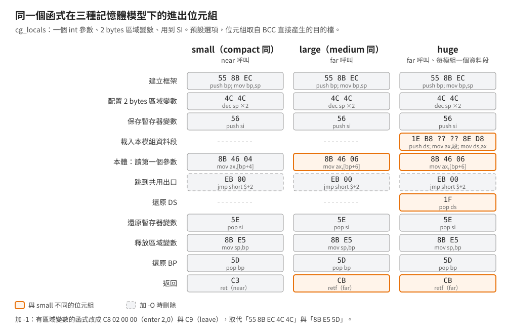
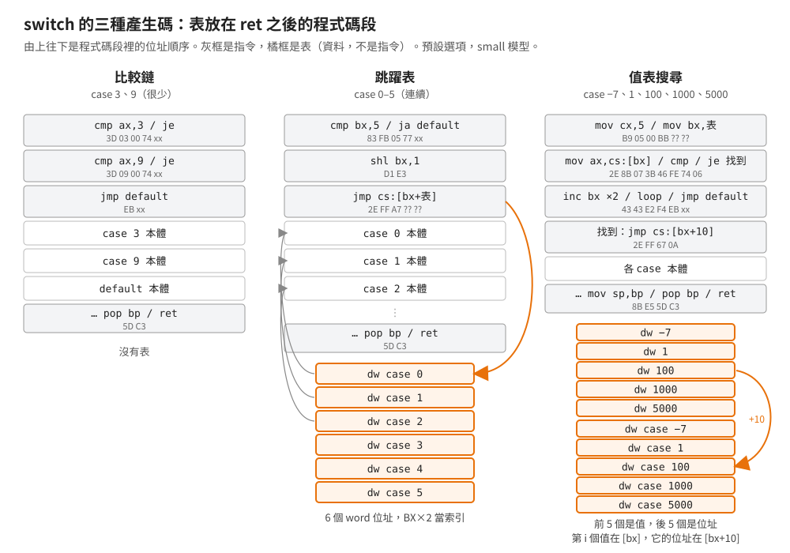
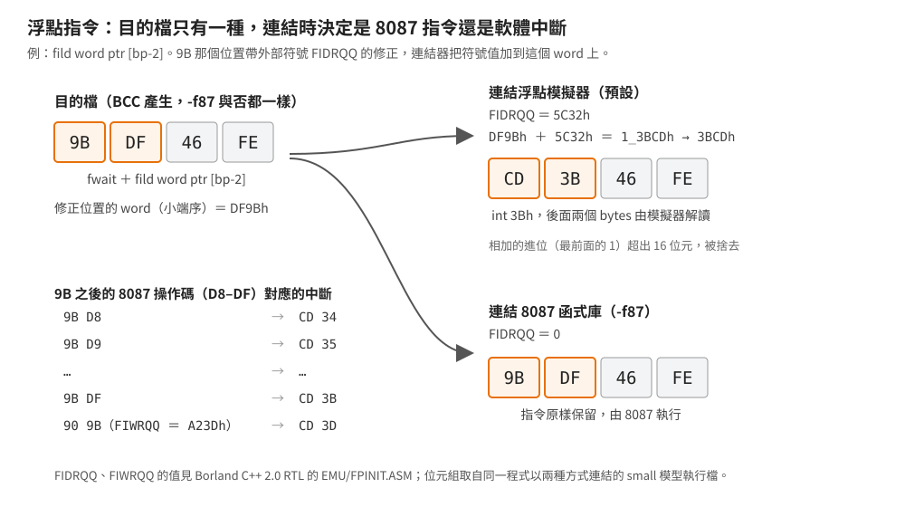

# BCC 2.0 產生的程式碼在反組譯裡長什麼樣

## 結論

Borland C++ 2.0 的編譯器（BCC）產生的指令有幾個很穩定的習慣，看到兩三個同時出現，就可以相當有把握地說這段是它編的：

- 每個函式都是 `55 8B EC` 開頭；`return` 一律跳到共用的出口，沒加 `-O` 時最後一個 `return` 變成 `EB 00`（跳到下一行）。
- 呼叫 C 函式後清 2 bytes 參數用 `59`（`pop cx`）、4 bytes 用 `59 59`，更多才用 `83 C4 nn`。
- 同一個模組裡的 far 函式用 `0E E8`（`push cs` 加 near call）呼叫。
- `switch` 的跳躍表、值表放在程式碼段、函式的 `ret` 之後；不連續的 case 用「值表加 `loop`」搜尋。
- `and`、`or`、`xor` 加小常數一律用 16 位元立即值（`81 E3 03 00`），`add`、`sub`、`cmp` 才用 8 位元短格式（`83 C6 07`）。
- 浮點指令在目的檔裡是 `9B` 加 8087 指令，連結模擬器函式庫後變成 `CD 34`–`CD 3D` 的軟體中斷。

這些特徵來自一支自寫測試程式（[`examples/codegen/`](../../examples/codegen/)）在五個記憶體模型、11 組選項下的編譯結果，
共 55 份組態，全部在 dosgolem 實際執行、輸出與預期相同。本文的位元組全部取自 BCC 直接產生的目的檔，
並用 IDA Pro 9.4 反組譯核對。

## 根本問題

### 1991 年的編譯器要在 640 KB 裡跑

BCC.EXE 本身有八成是 overlay（執行時才從檔案載入的程式碼區塊），整個編譯器要在 DOS 的 640 KB 常規記憶體裡運作。
這種環境下，編譯器的程式碼產生器通常是「看一個敘述、吐一段固定樣板」，不做需要整個函式資訊的全域最佳化。
樣板化的好處是快、省記憶體；代價是產生的指令很有規律——對逆向的人來說，規律就是特徵。

### 8086 的指令編碼有多種寫法

同一個運算在 8086 上常有好幾種合法編碼：`add sp,2` 可以寫成 3 bytes 的 `83 C4 02`、2 bytes 的 `44 44`，
或 1 byte 的 `59`（借 `pop cx` 把兩個 bytes 彈掉）。far 呼叫可以寫 5 bytes 的 `9A` 加段:位移，
也可以寫 4 bytes 的 `0E E8`。編譯器每遇到一次都要挑一種，挑法就是它的指紋。

### 選項會改變樣板

`-O`（跳躍最佳化）、`-G`（速度優先）、`-1`（80186 指令）、`-r-`（不用暫存器變數）都會換掉部分樣板；`-Z`（BCC 說明文字寫「Optimize register usage」，暫存器使用最佳化）在本文的測試裡沒有造成差異。
要從產生碼判斷編譯器，得先知道每個樣板在哪些選項下會變、變成什麼。

## 推導

測試程式有 33 個 `cg_` 函式，每個只示範一種構造（函式進出、暫存器變數、`switch`、呼叫、全域與 far 資料、
long 運算、立即值運算、浮點⋯⋯）。以下說「small」「huge」時指記憶體模型；說「預設」指不加任何最佳化選項。

位元組序列一律是十六進位。`nn` 是寫在指令裡的常數，`xx` 是短跳躍的相對距離，`rel16` 是 16 位元的相對距離（從下一條指令算起，不是絕對位址），
`??` 是目的檔裡帶修正、要等連結才填的位元組，每支程式都不同。

### 函式進出：固定的框架

BCC 替每個函式建立標準堆疊框：`55 8B EC`（`push bp; mov bp,sp`）。此後 BP 固定當這個框架的基準：呼叫端先推入的參數在 BP 的正位移（`[bp+4]` 起），
函式自己配置的區域變數在負位移（`[bp-2]` 起）。接著依序是：

1. **配置區域變數**：2 bytes 用 `4C 4C`（`dec sp` 兩次，2 bytes，比 `83 EC 02` 少一個 byte）；
   3–127 bytes 用 `83 EC nn`；更大用 `81 EC nn nn`。
2. **保存暫存器變數**：用到 SI 就 `56`，用到 DI 就 `57`。
3. **huge 模型再載入 DS**：`1E B8 ?? ?? 8E D8`（`push ds; mov ax,段; mov ds,ax`），`B8` 的運算元在目的檔裡是段值修正。
   huge 模型每個模組的全域資料各自一段，函式進來時要自己把 DS 指到本模組的資料段（見
   [記憶體模型](../10-borland-crtl/memory-model-macros.md)）。

離開時反序：`1F`（huge）、`5F`、`5E`、`8B E5`（`mov sp,bp`，有區域變數才有）、`5D`，最後 `C3`（near）或 `CB`（far）。
參數位移也跟著呼叫形式走：near 函式的第一個參數在 `[bp+4]`，far 函式在 `[bp+6]`。

**所有 `return` 跳到同一個出口。** 程式碼產生器把每個 `return` 都譯成「算出回傳值、跳到出口標籤」，
不管這個 `return` 是不是剛好就在出口前面。結果是函式最後一個 `return` 後面跟著 `EB 00`——跳到緊接的下一行。
這兩個 bytes 沒有作用，是樣板化產生碼的直接痕跡。沒有 `return` 的函式（例如回傳 `void` 而且沒寫 `return`）沒有這個跳躍。
`-O` 會把 `EB 00` 刪掉。

兩個選項會改框架：

| 選項 | 改變 |
|---|---|
| `-1` | 有區域變數的函式改用 `C8 nn nn 00`（`enter n,0`）與 `C9`（`leave`）；沒有區域變數的函式仍是 `55 8B EC`／`5D` |
| `-k-` | 沒有參數也沒有區域變數的函式，連 `55 8B EC` 與 `5D` 都省掉；huge 模型的 DS 載入照樣保留 |

`-k`（標準堆疊框）在 BCC 2.0 其實是預設開啟：加 `-k` 與不加，目的檔逐筆比對 OMF 語意記錄（略過註解記錄）完全相同。

### 暫存器變數：沒寫 register 也會用

預設下（`-r`），BCC 會自己挑區域變數或參數放進 SI、DI，原始碼不需要寫 `register`。
參數被選中時先複製一份進暫存器（`8B 76 04`，`mov si,[bp+4]`），之後都讀暫存器。清零用 `33 F6`／`33 FF`。

- 哪個變數進 SI、哪個進 DI，在測試程式裡看不出固定規則。
- **4 bytes 的指標不進暫存器。** compact、large、huge 的資料指標是段:位移，SI 裝不下，
  所以逐字元掃字串的迴圈每一圈都 `C4 5E 04`（`les bx,[bp+4]`）重新載入、再 `FF 46 04`（`inc word ptr [bp+4]`）。
  medium 的資料指標只有 2 bytes，同一段程式照樣放進 DI。
- `-r-` 關掉暫存器變數：函式開頭沒有 `56`、`57`，變數全在堆疊上。

### 呼叫：挑最短的寫法

| 情況 | 位元組 | 選項的影響 |
|---|---|---|
| 推一個常數參數 | `B8 nn nn 50`（`mov ax,n; push ax`）；0 用 `33 C0 50` | `-1` 改 `6A nn`（`push` 立即值是 80186 才有的指令） |
| 清 2 bytes 參數 | `59`（`pop cx`） | `-G` 改 `44 44`（`inc sp` 兩次） |
| 清 4 bytes 參數 | `59 59` | `-G` 改 `83 C4 04` |
| 清 6 bytes 以上 | `83 C4 nn` | |
| 呼叫同模組的 far 函式 | `0E E8 rel16` | |
| 呼叫其他模組的 far 函式 | `9A` 加 4 bytes（有修正） | |
| pascal 函式 | 符號名轉大寫；參數由左到右推入，所以第一個參數在較高位移；被呼叫端 `C2 nn 00`（`ret nn`，返回的同時把 nn bytes 參數彈掉；一般的 `C3` 不清參數）清堆疊 | |

`pop cx` 清堆疊的理由是大小：1 byte 對 3 bytes。CX 在 Borland 的呼叫慣例裡是呼叫端不必保存的暫存器，彈一個沒用的值進去不會壞事。
`-G` 換成 `inc sp`、`add sp` 是為了速度（強推論：`pop` 要讀記憶體，`inc sp` 不用）。

**`push cs; call near` 取代 far call。** 被呼叫的函式與呼叫端在同一個程式碼段時，段值就是 CS，不必寫進指令。
先 `push cs` 再 near call，堆疊上的返回位址和 far call 一模一樣（段在上、位移在下），被呼叫端的 `retf` 照常返回。
好處有兩個：少 1 byte，而且少一個段值修正——MZ 執行檔的每個段值修正都要在檔頭登記一筆重定位，載入時由 DOS 逐筆修補。
在 medium、large、huge 模型裡，模組內部的每一個呼叫都是 `0E E8`；small 模型呼叫明寫 `far` 的函式也一樣。

### switch：三種形狀

| case 分布 | 產生碼 | 測試裡的例子 |
|---|---|---|
| 很少（2 個） | 比較鏈：`3D nn nn 74 xx 3D nn nn 74 xx EB xx`（`cmp ax,n; je`，最後跳到 default） | case 3、9 |
| 連續 | 跳躍表：`83 FB 05 77 xx D1 E3 2E FF A7 ?? ??`（超出範圍跳 default，索引乘 2，`jmp cs:[bx+表]`） | case 0–5 |
| 不連續 | 值表搜尋：`B9 05 00 BB ?? ?? 2E 8B 07 3B 46 FE 74 06 43 43 E2 F4 EB xx 2E FF 67 0A` | case −7、1、100、1000、5000 |

值表搜尋是一個小迴圈。`B9 05 00 BB ?? ??`（`mov cx,5; mov bx,表`）先設好比對次數與表頭；`switch` 的運算式已經存在 `[bp-2]`。
迴圈本體 `2E 8B 07 3B 46 FE 74 06`（`mov ax,cs:[bx]; cmp ax,[bp-2]; je 找到`）讀出一個表項來比，相等就跳走；
不相等就 `43 43`（`inc bx` 兩次，指到下一個 word）、`E2 F4`（`loop`，CX 減 1 不為零就回到迴圈開頭），全部比完仍沒找到就 `EB xx` 跳到 default。
找到時 BX 停在第 i 個值上，而第 i 個跳躍位址剛好在 `[bx+2n]`（n 是 case 數），所以 `2E FF 67 0A` 就是 `jmp cs:[bx+10]`。
`switch` 的對象是 `long` 時，表變成「n 個低位 word、n 個高位 word、n 個位址」，迴圈多比一次 `cs:[bx+2n]`，跳 `cs:[bx+4n]`。

**表為什麼放在程式碼段：** 取表用 `2E`（`cs:`）前綴，不依賴 DS。huge 模型裡 DS 指的是本模組的資料段，
far 資料模型裡 DS 也未必指到放表的地方；放在程式碼段、用 CS 取，任何模型都成立（強推論）。
代價是反組譯工具若把 `ret` 後面的表當成指令解碼，會出現一段亂碼。

`-G` 會把 int 的值表搜尋改成比較樹（`cmp ax,100; je; jg …` 分兩半比）：多幾個 bytes，但不用跑迴圈。
long 的值表搜尋在 `-G` 下不變。

### 資料存取與記憶體模型

| 情況 | small、medium | compact、large | huge |
|---|---|---|---|
| 全域變數 | `A1 ?? ??`、`8B 1E ?? ??`，DS 是 DGROUP | 同左 | 同樣的指令，但 DS 是函式開頭載入的模組資料段 |
| 明寫 `far` 的全域變數 | `B8 ?? ??`（段值修正）`8E C0`，再加 `26`（`es:`）前綴 | 同左 | 同左 |
| 經 BX 存取堆疊上的陣列 | 沒有前綴 | 加 `36`（`ss:`）前綴 | 同左 |
| 回傳字串常數的指標 | `B8 ?? ??` | `8C DA B8 ?? ??`（先 `mov dx,ds` 帶出段值） | 同左，DS 是模組資料段 |
| far 指標參數 | `C4 5E nn`（`les bx,…`）再加 `26` 前綴 | 同左 | 同左 |

`36` 前綴的理由：small、medium 的堆疊在 DGROUP 裡，DS 等於 SS，BX 定址預設走 DS 也碰得到堆疊；
compact 以上 DS 與 SS 可能不同，經 BX 取堆疊上的陣列就得明寫 `ss:`。

段名也帶模型資訊：small、compact 的程式碼段叫 `_TEXT`，medium、large、huge 叫「模組名＋`_TEXT`」；
huge 的模組資料段叫「模組名＋`_DATA`」、類別 `FAR_DATA`；明寫 `far` 的全域變數另放一段，類別也是 `FAR_DATA`。
這些名稱留在目的檔與 map 檔裡，連結後的執行檔只剩段落配置。

五個模型逐函式比較 BCC 的組語輸出，34 個函式（33 個 `cg_` 加 `main`）裡 29 個只分成三種：small＝compact、medium＝large、huge，
差別只在 near／far 與 huge 的 DS 載入。用到資料指標的 4 個函式（`cg_regptr`、`cg_member`、`cg_string`、`main`）五個模型各不相同。
`cg_farfunc` 明寫 `far`，small 到 large 都相同、只有 huge 不同，與資料指標無關。

### 運算與立即值

| 構造 | 產生碼 |
|---|---|
| 乘常數 | `BA 0A 00 F7 EA`（`mov dx,10; imul dx`），不換成移位 |
| 有號數除以 2 的冪 | `BB 04 00 99 F7 FB`（`mov bx,4; cwd; idiv bx`），不換成移位 |
| 無號數除以 16 | `B1 04 D3 E8`（`mov cl,4; shr ax,cl`）；`-1` 改 `C1 E8 04` |
| 無號數右移 3 | `D1 EA` 重複三次；`-1` 改 `C1 EA 03` |
| `char` 轉 `int` | `98`（`cbw`） |
| `unsigned char` 轉 `int` | `8A 56 06 B6 00`（`mov dl,…; mov dh,0`） |
| long 加減 | 行內 `add`／`adc`、`sub`／`sbb` |
| long 比較 | 先比高位 word（`jg`／`jl`），相等才比低位（`jae`／`jb`，無號） |
| long 乘除、非常數位移 | 呼叫 helper，見[編譯器 helper](../10-borland-crtl/compiler-helpers.md) |

**邏輯運算不用 8 位元短格式。** 8086 的 `83` 這組指令把 8 位元立即值符號延伸成 16 位元，比 `81` 少一個 byte。
BCC 對 `add`、`sub`、`cmp` 會用它（`83 C6 07`、`83 FE 09`），對 `and`、`or`、`xor` 卻一律用 `81`：

| 原始碼 | 位元組 | 指令 | 立即值寬度 |
|---|---|---|---|
| `a & 12`（結果在 AX） | `25 0C 00` | `and ax,12` | 16 位元（AX 專用短格式） |
| `g_arr[g_int & 3]`（索引先載入 BX） | `81 E3 03 00` | `and bx,3` | 16 位元 |
| `r \|= 3`（r 在 SI） | `81 CE 03 00` | `or si,3` | 16 位元 |
| `r ^= 5` | `81 F6 05 00` | `xor si,5` | 16 位元 |
| `g_int &= 12`（全域變數） | `81 26 ?? ?? 0C 00` | `and word ptr [g_int],12` | 16 位元 |
| `r += 7` | `83 C6 07` | `add si,7` | 8 位元 |
| `g_int += 7` | `83 06 ?? ?? 07` | `add word ptr [g_int],7` | 8 位元 |
| `r > 9` | `83 FE 09` | `cmp si,9` | 8 位元 |
| `r -= 2` | `4E 4E` | `dec si` 兩次 | 不用立即值 |

強推論：Intel 8086 資料手冊的逐指令列表裡，`83` 只列在算術運算下，邏輯運算只列 `80`、`81`
（整理見 Ken Shirriff，[Undocumented 8086 instructions, explained by the microcode](http://www.righto.com/2023/07/undocumented-8086-instructions.html)）。
BCC 照文件只對算術運算用 `83`。同一份組語交給 TASM 2.5 組譯，TASM 會把 `and bx,3` 組成 `83 E3 03`——所以**這個特徵只存在於 BCC 直接產生的目的碼**。

### 浮點：連結時才決定是指令還是中斷

1991 年很多 PC 沒有 8087 數學輔助處理器。BCC 的做法是：目的檔裡一律寫真正的 8087 指令，每條前面加 `9B`（`fwait`），
並在 `9B` 的位置掛一個外部符號的修正（`FIDRQQ` 等；目的檔裡列出外部符號的 `EXTDEF` 記錄看得到 `FIWRQQ`、`FIDRQQ`）。
修正的單位是 word：`9B` 和下一個 byte 依小端序（低位 byte 在前）合成一個 16 位元數，例如 `9B DF` 是 `DF9Bh`，連結器把符號的值加上去再寫回。

- **連結模擬器函式庫（預設）**：`FIDRQQ` 的值是 `5C32h`。`DF9Bh ＋ 5C32h ＝ 13BCDh`，超出 16 位元的進位捨去後是 `3BCDh`，寫回成 `CD 3B`；同理 `9B D8`–`9B DF` 依序得到 `CD 34`–`CD 3B`，
  也就是 `int 34h`–`int 3Bh`，由模擬器接手。例：`9B DF 46 FE`（`fild word ptr [bp-2]`）變成 `CD 3B 46 FE`。
- **連結 8087 函式庫（`-f87`）**：修正值是 0，指令保留 `9B DF 46 FE`。

同一份原始碼、同一個目的檔，兩種連結結果只差在這些位置與附帶的模擬器（small 模型的測試程式差 10,176 bytes）。
`-f87` 不改變目的檔的語意記錄，五個模型比對都相同。浮點轉 `long` 前還有一組 `90 9B`（`nop; fwait`），掛 `FIWRQQ`（`A23Dh`），
模擬器版變成 `CD 3D`，隨後呼叫 `N_FTOL@`／`F_FTOL@`。

### 選項對照

| 選項 | 在測試程式裡造成的變化 |
|---|---|
| `-O` | 刪掉 `EB 00`；刪掉緊接的重載，例如 `mov si,ax` 之後的 `mov ax,si`、同一個段值第二次 `mov ax,seg`、寫入區域變數後立刻讀回 |
| `-G` | 清堆疊改 `44 44`／`83 C4 04`；迴圈上限先載入暫存器（`cmp si,dx`）；int 的不連續 `switch` 改比較樹 |
| `-Z` | 沒有任何變化（單獨加或與 `-O -G` 合用） |
| `-r-` | 不用 SI、DI |
| `-k` | 與預設相同 |
| `-k-` | 無參數無區域變數的函式省略框架 |
| `-1` | `enter`／`leave`、`push` 立即值、移位立即值 |
| `-f87` | 目的檔不變，只改連結的函式庫 |

`-O -G -Z` 的結果與 `-O -G` 相同。

## 在執行檔裡怎麼認

| 特徵 | 辨識度 | 說明 |
|---|---|---|
| `ret` 前一行是 `EB 00` | 高 | 沒加 `-O` 的 BCC；加了就沒有 |
| `2E 8B 07 3B ?? ?? 74 ?? 43 43 E2` 加 `2E FF 67` | 高 | 不連續 `switch` 的值表搜尋；表在函式 `ret` 之後 |
| `83 FB ?? 77 ?? D1 E3 2E FF A7` | 中 | 連續 `switch` 的跳躍表；其他編譯器也常用跳躍表，但表的位置與取法可以對照 |
| `and`／`or`／`xor` 小常數用 `81`，`add`／`cmp` 用 `83` | 中 | 同一支程式裡兩種都出現時才有意義 |
| near call 之後 `59` 或 `59 59` | 中 | 沒加 `-G`；`-G` 版是 `44 44`、`83 C4 04` |
| 模組內呼叫 `0E E8` | 中 | far 程式碼模型；是 medium／large／huge 的強訊號 |
| `CD 34`–`CD 3D` 散布在程式碼裡 | 中 | 連結了浮點模擬器；Microsoft C 的模擬器據信也用這組中斷（待查證），不能單獨當 Borland 的證據 |
| `55 8B EC`、`4C 4C`、`56 57` | 低 | 標準框架，很多編譯器都這樣寫；只能當輔助 |

### 判斷用了哪些選項

| 看到 | 推論 |
|---|---|
| 有 `EB 00` | 沒加 `-O` |
| 清堆疊是 `59`、`59 59` | 沒加 `-G` |
| 清堆疊是 `44 44`、`83 C4 04`，不連續 `switch` 是比較樹 | 加了 `-G` |
| `C8 nn nn 00`、`6A nn`、`C1 E8 nn` | 加了 `-1`（程式需要 80186 以上） |
| 函式都不碰 SI、DI，變數全在 `[bp-n]` | 加了 `-r-` |
| 沒有區域變數的函式缺 `55 8B EC` | 加了 `-k-` |

### 用 Borland 自己的工具驗證

對 BC++ 2.0（1991-04 磁片版）附的四支工具，直接在檔案位元組裡數上面幾個樣式（沒有對齊指令邊界，會有少量偶然命中；兩套 BC++ 2.0 的 BCC、TASM、TLIB 逐位元組相同，TLINK 不同）：

| 樣式 | BCC.EXE | TASM.EXE | TLINK.EXE | TLIB.EXE |
|---|---:|---:|---:|---:|
| 跳躍表 `83 FB ?? 77 ?? D1 E3 2E FF A7` | 59 | 0 | 3 | 0 |
| 值表搜尋 `2E 8B 07 3B ?? ?? 74 ?? 43 43 E2` | 30 | 0 | 0 | 2 |
| `0E E8` | 1,253 | 137 | 12 | 3 |
| `EB 00` | 63 | 3 | 11 | 0 |
| `55 8B EC` | 1,812 | 1 | 166 | 169 |
| `E8 ?? ?? 59`（near call 後 `pop cx`） | 3 | 76 | 14 | 221 |
| `5F 5E 5D CB`（far 函式結尾） | 15 | 0 | 0 | 0 |
| `5F 5E 5D C3`（near 函式結尾） | 0 | 0 | 0 | 15 |

BCC.EXE 大量出現兩種 `switch` 樣式與 `0E E8`、以 `CB` 結尾，符合「以 far 程式碼模型、用 BCC 系列編譯器編成」；
TLIB.EXE 是 near call 後 `pop cx` 與 `C3` 結尾，符合 near 程式碼模型；TASM.EXE 的 `55 8B EC` 只出現 1 次，大部分不是 C 產生的程式碼。
這是強推論：數的是位元組樣式，不是逐一反組譯確認的指令。

### 容易誤判的地方

- **`-S` 輸出的組語不等於目的碼。** BCC 的 `-S` 產生組語清單，交給 TASM 組譯後有兩處不同：`and` 類的小常數被組成 `83` 短格式、
  浮點轉整數前的 `90 9B` 變成 `9B`。拿 `-S` 清單做位元組樣式會漏掉 BCC 的特徵。
- **`int 34h`–`3Dh` 不能單獨證明是 Borland。** `F?RQQ` 這組修正符號的命名與 Microsoft 的浮點模擬器慣例相同，Microsoft C 據信也用同一組中斷；要等 M3 取得 Visual C++ 1.0 後查證。
- **`EB 00` 可能被當成對齊或延遲。** 在老程式的硬體存取碼裡，`jmp $+2` 常被故意寫來等 I/O；出現在 `ret` 前、每個函式各一次的才是 BCC 的出口跳躍。
- **表在 `ret` 之後。** 線性反組譯把跳躍表或值表當指令解時，會在函式尾巴看到不合理的指令，下一個函式的開頭也可能被錯位吃掉。

## 證據與未知

| 結論 | 出處 | 等級 |
|---|---|---|
| 各構造的位元組與模型差異 | `examples/codegen/CODEGEN.C` × 五模型 × 11 組選項，BCC 直接產生的目的檔，IDA Pro 9.4 反組譯 | 已證實（實測） |
| 55 份組態執行結果正確 | 同上，在 dosgolem 執行，輸出與 `expected.txt` 相同（`-f87` 的浮點行除外，dosgolem 沒有完整 x87） | 已證實（實測） |
| `-k`、`-Z`、`-f87` 不改變目的檔的程式碼、資料與修正 | 同上，逐筆比對 OMF 語意記錄；逐位元組比對只差在註解記錄裡的 6 bytes | 已證實（實測） |
| `-S` 清單經 TASM 組譯後與直接產生的目的碼有兩處不同 | small、huge 模型，把程式碼段組回完整影像逐位元組比對 | 已證實（實測） |
| 模擬器與 8087 兩種連結結果的位元組 | small 模型，同一程式分別以預設與 `-f87` 連結 | 已證實（實測） |
| `FIDRQQ` ＝ `5C32h`、`FIWRQQ` ＝ `A23Dh` | Borland C++ 2.0 RTL，`EMU/FPINIT.ASM` | 已證實（原文） |
| `pop cx` 為大小、`inc sp` 為速度 | 位元組數；速度理由未量測 | 強推論 |
| `push cs; call near` 為省 1 byte 與重定位 | 位元組數與 MZ 重定位機制 | 強推論 |
| 邏輯運算不用 `83` 是照 Intel 文件 | 二手整理（Ken Shirriff）；未查到 Borland 的說明 | 強推論 |
| BCC.EXE、TLIB.EXE 的編譯模型 | 位元組樣式計數，未逐一反組譯 | 強推論 |

兩套 BC++ 2.0（1991-04、1991-08）的 BCC.EXE 逐位元組相同，本文結論適用兩者。

未知：

- 沒測過的構造：起點不是 0 的跳躍表（有沒有先減最小值）、跳躍表與值表搜尋的切換門檻、`register` 關鍵字對 SI／DI 分配的影響、
  結構以值傳遞、`interrupt` 函式、`_loadds`、`-a`（字組對齊）、`-2`、`-p`（全域 pascal）、C++ 的產生碼。
- 暫存器變數分配到 SI 或 DI 的規則。
- `-Z` 在什麼情況下才會產生差異。
- 明寫 `far` 的全域變數所在段名中間的數字（測試程式裡是 `CODEGEN5_FAR`）代表什麼。
- **這些特徵哪些是 Borland 獨有。** 還沒有 Microsoft C 的對照組（待 M3 取得 Visual C++ 1.0）；目前只能說「BCC 2.0 會產生」，
  不能說「看到就一定是 Borland」。Turbo C 2.0、Borland C++ 3.x 的產生碼也未比較。
