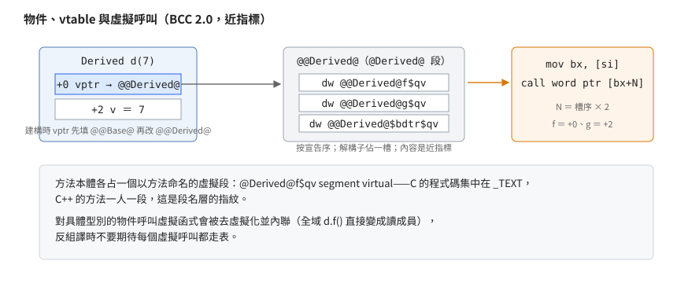

# BCC 2.0 的 C++ 產生碼指紋：mangling、vtable、靜態建構

## 結論

BCC 2.0 的 C++ 產生碼有四個一眼可認的指紋：符號用 `@類別@名稱$q參數` 的 mangling、
vtable 放在**以類別命名的虛擬段**（「段」是 DOS 執行檔裡程式碼與資料的
分區單位，「虛擬段」是連結時可合併的同名段）且內容是近指標表
（近指標＝只存段內位移的 2 位元組位址）、虛擬呼叫是
「取 vptr 進 BX、`call word ptr [bx+N]`」的兩道指令、
使用者全域物件的建構式包成 `@_STCON_$qv` 掛在 `_INIT_` 表的優先序 32。
這些指紋與 C 的產生碼（見 [BCC 2.0 產生碼](bcc20-codegen.md)）疊起來，
足以在反組譯裡直接判定「這是 BCC 2.0 編的 C++」。

## 根本問題

C++ 需要編譯器替三件事發明表示法：同名異式的函式名、虛擬函式的分派表、
全域物件的建構時機。BCC 2.0（1991）選的方案帶著強烈的時代印記——vtable 用近指標（小記憶體的省法）、
靜態建構塞進 C0 既有的初始化表、mangling 用自家的型別碼串。認得這些選擇，
就認得這個編譯器。

## 推導

### Mangling：`@類別@名稱$q參數`

規則與實物樣本（符號取自對拍建出的目的檔）：

| 符號 | 還原 |
|---|---|
| `@ostream@$blsh$ql` | `ostream::operator<<(long)` |
| `@ostream@$blsh$qg` | `ostream::operator<<(double)` |
| `@ostream@$blsh$qpqr3ios$r3ios` | `ostream::operator<<(ostream& (&)(ostream&))`——操作子 |
| `@istream@$brsh$qrl*` | `istream::operator>>(long&)`（遠資料模型） |
| `@istream_withassign@$basg$qp9streambuf` | `istream_withassign::operator=(streambuf*)` |
| `@ios@clear$qi`、`@ios@setf$ql`、`@ios@tie$qp7ostream` | 一般成員函式 |
| `@ios@basefield`、`@ios@stdioflush`、`@filebuf@openprot` | 靜態資料成員 |
| `@_STCON_$qv` | 編譯器產生的靜態建構函式（見下） |

- 型別碼：`v`=void、`c`=char、`i`=int、`l`=long、`g`=double、`p`=指標、`r`=引用、
  `q`=參數表開始；
  類名用「字母數＋名字」（`3ios`、`9streambuf`、`7ostream`）。
- 運算子碼以 `$b` 開頭：`$bctr`（建構）、`$bdtr`（解構）、`$blsh`（`<<`）、
  `$brsh`（`>>`）、`$basg`（`=`）。
- `$q` 之後是參數型別碼串；**遠資料模型**（compact/large/huge）下
  指標與引用帶 `*` 尾碼——同一份原始碼在不同模型下 mangled 名不同，
  這本身就是判記憶體模型的線索。
- `main` 沒有 mangling（仍是 `_main`），C 與 C++ 的目的檔可以混連。

### vtable：以類別命名的虛擬段＋近指標表

<p align="center"></p>

- 每個有虛擬函式的類別有一個**同名虛擬段**（`@Derived@`），vtable 標籤
  `@@Derived@`，內容是按宣告序排列的近指標，指向各方法；
  **解構子佔一槽**（`@@Derived@$bdtr$qv`）——後來的 C++ ABI 會放「解構」與
  「刪除並解構」兩槽，這一版只有一槽。
- 物件版面：vptr（指向 vtable 的指標）在 +0 且是**近指標**（只存段內位移）。
  衍生類別建構時先填基底 vtable、再改填衍生 vtable——
  反組譯裡看到「同一個位址先後寫入兩個 vtable 值」就是建構鏈。
- 虛擬呼叫的形狀固定：

  ```text
  mov  bx, [si]        ; vptr ＝ 物件開頭的近指標
  call word ptr [bx+N] ; N ＝ 槽序 × 2
  ```

- 每個方法本體放在**以方法命名的虛擬段**（`@Derived@f$qv`）——
  C 的程式碼集中在 `_TEXT`，C++ 的方法一人一段，這是段名層的指紋。
- 對**具體型別**的物件呼叫虛擬函式會被去虛擬化並內聯
  （全域物件的 `d.f()` 直接變成讀成員），反組譯時不要期待每個虛擬呼叫都走表。

### 靜態建構：`_INIT_` 表的優先序 32

編譯器把每個編譯單元裡的全域物件建構式包成一個 `@_STCON_$qv`
（static constructor），並在 `_INIT_` 段登記一筆紀錄
（型別、優先序 32、函式位址——紀錄格式同 C 的 `#pragma startup`，見
[啟動與結束鏈](../10-borland-crtl/startup-and-exit.md)）。
iostream 的 `Iostream_init` 登記在 **16**——所以執行順序是：

```text
C0（優先序更小的初始化）→ Iostream_init(16) → 使用者全域建構(32) → main
```

「全域物件的建構式裡 `cout` 已經能用」就是靠這個優先序差
（實測見 `examples/iostream/CTOR.CPP`）。解構對稱地掛在 `_EXIT_` 表，
反向執行。

## 在執行檔裡怎麼認（彙總）

| 線索 | 判定 |
|---|---|
| 符號 `@Xxx@yyy$q…` | BCC 2.0 的 C++；按型別碼還原簽名 |
| 段名 `@Xxx@`、`@Xxx@method$q…` | 該類別的 vtable 與方法本體位置 |
| `_INIT_` 裡優先序 32 的 `@_STCON_$qv` | 使用者全域物件建構 |
| 優先序 16 的 `Iostream_init` | iostream 的 cin/cout 已就緒 |
| `mov bx,[si]`＋`call word ptr [bx+N]` | 虛擬呼叫；vtable 在物件 +0（近指標） |
| 同位址先後寫兩個 vtable 值 | 基底→衍生的建構鏈 |

## 證據與未知

**已證實（實測）**：全部指紋取自「用出貨的 BCC 2.0 在 dosgolem 編譯自寫的
C++ 程式」的 `-S` 輸出與目的檔 PUBDEF（五個記憶體模型都編過）；
iostream 模組的 mangled 符號另從對拍建出的 191 個模組目的檔取得
（該批與出貨庫逐模組相同，所以符號名等於出貨庫裡的）。

**未知**：

- 其他記憶體／呼叫模型組合與 Windows 版（`_export`）的 mangling 變體
  沒有逐一採樣；`$q` 後的完整型別碼文法（含陣列、成員指標）只整理了
  本系列用到的子集。
- 多重繼承與虛擬基礎的 vtable 版面（`iostream` 同時繼承 istream/ostream
  且虛擬繼承 ios——多條繼承路徑共用同一份 ios 子物件）沒有從產生碼逐槽歸納——
  已知的物件版面證據限單繼承鏈。
- 異常處理（BC++ 2.0 尚無）與 RTTI（無）不在範圍。
