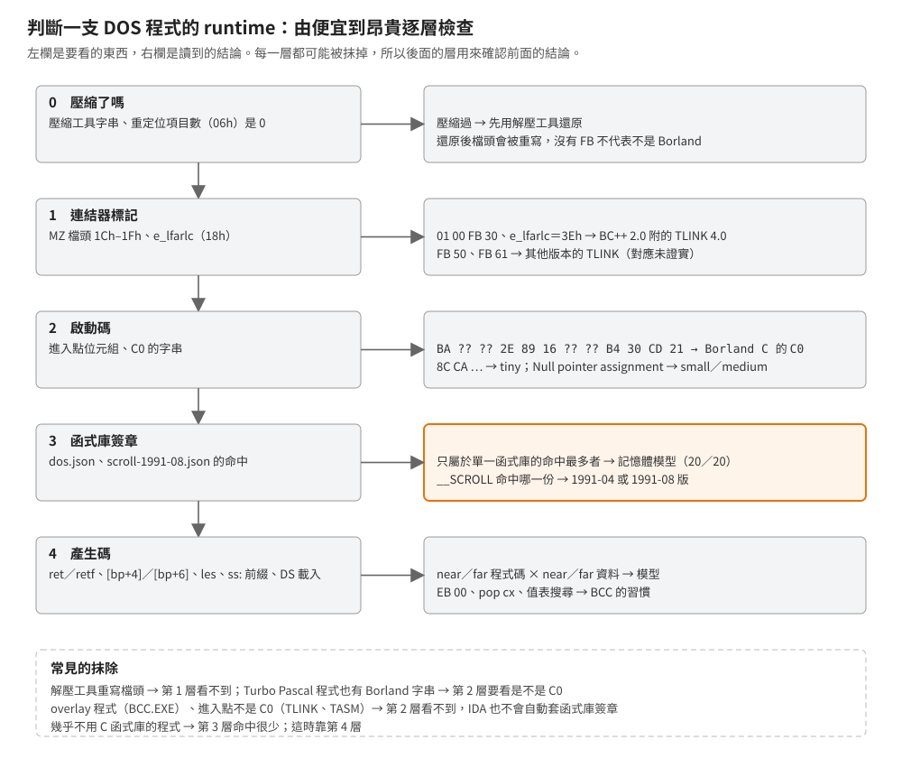

# 從執行檔判斷 runtime 廠牌、版本與記憶體模型

## 結論

判斷一支 16 位元 DOS 程式用的是不是 Borland C++ 2.0、用哪個記憶體模型，照三層證據由便宜到昂貴檢查：

1. **檔頭與字串**：TLINK 在 MZ 檔頭 `1Ch` 寫 `01 00 FB xx`；啟動碼（C0）帶 `Borland C++ - Copyright 1991 Borland Intl.`。
   BC++ 2.0 附的 TLINK 寫的是 `FB 30`。
2. **啟動碼的形狀**：進入點是 `BA ?? ?? 2E 89 16 ?? ?? B4 30 CD 21 …`（tiny 模型是 `8C CA` 開頭）；
   `Null pointer assignment` 字串只出現在 small、medium。
3. **函式庫簽章**：拿本 repo 的 [`dos.json`](../../signatures/borland-crtl-2.0/dos.md) 掃描。命中樣式所屬的函式庫（`CS`、`CC`、`CM`、`CL`、`CH`）
   直接指出記憶體模型：在 20 支已知模型的測試程式上 **20 支全對**。

版本上，`FB 30`、C0 字串年份與 1991-08 版 `SCROLL` 的簽章可以把範圍縮到「BC++ 2.0 的哪一版」；`Borland C++ - Copyright 1991` 這行字串單獨看分不出 2.0 與 3.0。
Microsoft C 與 Watcom C 的判準要等取得 Visual C++ 1.0 之後才寫；目前只能說它們的程式沒有 `FB` 標記、不命中 Borland 的簽章。

## 根本問題

反組譯一支沒有符號的 DOS 程式，最先需要的不是讀懂某個函式，而是把整支程式分類：

- **廠牌決定哪些函式可以直接跳過。** 函式庫函式常佔相當比例（BC++ 2.0 的 TLIB.EXE 在 IDA 裡 199 個函式，82 個是 C 函式庫），認出廠牌才能套對簽章、把它們從「待讀」扣掉。
- **記憶體模型決定怎麼讀指標。** 同一行 C 在 small 模型是 2 bytes 的位移，在 large 模型是 4 bytes 的段:位移
  （見[記憶體模型](../10-borland-crtl/memory-model-macros.md)）；讀錯模型，結構欄位的位移會全部錯開。
- **版本決定行為細節。** BC++ 2.0 兩個出貨版的 conio 捲動行為不同，remake 要照遊戲實際連結的那一版做。

困難在於每一層證據都可能被抹掉：壓縮工具會重寫檔頭，自寫啟動碼的程式沒有 C0，用函式庫很少的程式簽章命中很少。
所以要用互相獨立的幾層證據交叉確認，而不是只看一個特徵。

## 推導

<p align="center"></p>

### 第零步：先確認不是壓縮過的執行檔

1990 年代很多 DOS 程式出貨前用 EXEPACK、PKLITE、LZEXE 壓縮。壓縮後，原本的程式碼變成資料，檔頭換成解壓程式自己的，
下面每一層證據都看不到。本機蒐集的樣本裡，帶 Microsoft 字串的程式有 8 支含 EXEPACK 的錯誤訊息 `Packed file is corrupt`，
它們的重定位項目數是 0。遇到這類檔，先用解壓工具還原，再往下判斷。

**解壓工具也會重寫檔頭。** 本機有 8 支帶 `Turbo C++ - Copyright 1990` 字串、`1Ch` 為 `01 00 00 00` 的程式（其中 7 支的檔名註明是解壓還原的檔），
沒有 `FB` 標記，但簽章照樣命中 4–49 個函式。所以「沒有 `FB`」不能當作「不是 Borland」的證據。

### 第一步：檔頭的連結器標記

MZ 檔頭的前 28 bytes（`00h`–`1Bh`）是 DOS 載入程式要讀的欄位，`1Ch` 起到重定位表之前的空間，連結器可以自由使用。
TLINK 在這裡寫 `01 00 FB xx`，並把重定位表放在 `3Eh`（檔頭 `18h` 的 `e_lfarlc` 欄位）。

| 樣本（本機蒐集的 DOS 執行檔，同內容只算一次） | 支數 | `1Ch`–`1Fh` | `e_lfarlc` |
|---|---:|---|---|
| 本 repo 範例以 BC++ 2.0 編譯（TLINK 4.0） | 20 | 全部 `01 00 FB 30` | 全部 `3Eh` |
| BC++ 2.0 的 BCC.EXE、TLINK.EXE | 2 | `01 00 FB 30` | `3Eh` |
| BC++ 2.0 的 TLIB.EXE、TASM.EXE | 2 | `01 00 FB 20` | `22h` |
| 帶 `Borland C++ - Copyright 1991` 字串的其他程式 | 23 | `FB 50` 19 支、`FB 30` 3 支、`00 00 00 00` 1 支 | 多為 `3Eh` |
| 帶 `Borland C++ - Copyright 1993` 字串 | 2 | `FB 50`、`FB 61` | |
| 帶 Microsoft C runtime 字串 | 44 | 全部沒有 `FB`；`e_lfarlc` 34 支是 `1Eh` | |
| 帶 Watcom C runtime 字串 | 13 | 全部沒有 `FB`；`e_lfarlc` 11 支是 `40h` | |

已證實（實測）：BC++ 2.0 附的 TLINK 4.0 寫 `FB 30`；Microsoft、Watcom 的樣本沒有 `FB`。
`FB` 後面那個 byte 與 TLINK 版本號的對應（`30`、`50`、`61` 各是哪一版）只有「4.0 寫 `30`」這一點有實測，其餘未知。
TLIB、TASM 本身帶 `FB 20`，表示 Borland 出貨的工具也不是全部用同一版 TLINK 連結。

### 第二步：啟動碼的字串與進入點

Borland C 程式的進入點是 C0 啟動碼（見[啟動與結束鏈](../10-borland-crtl/startup-and-exit.md)），它有幾個固定特徵：

| 特徵 | small、compact、medium、large、huge | tiny |
|---|---|---|
| 進入點開頭 | `BA ?? ??`（`mov dx,DGROUP`）`2E 89 16 ?? ??` `B4 30 CD 21`（DOS 版本查詢） | `8C CA`（`mov dx,cs`）`2E 89 16 ?? ??` `B4 30 CD 21` |
| 版權字串 | `Borland C++ - Copyright 1991 Borland Intl.` | 同左 |
| `Divide error`、`Abnormal program termination` | 有 | 有 |
| `Null pointer assignment` | 只有 small、medium | 沒有 |

已證實（出貨的 `C0T`、`C0S`、`C0C`、`C0M`、`C0L`、`C0H.OBJ` 逐一比對）。tiny 的程式碼與資料在同一段，`mov dx,cs` 就等於 DGROUP；
其他模型要等載入時由 DOS 修正段值，所以是帶修正的 `mov dx,立即值`。

IDA 也是靠這段進入點決定要不要自動套用 Borland 的函式庫簽章。**進入點不是 C0 的程式，IDA 不會自動套**，library 函式數會是 0：
BC++ 2.0 自己的 BCC、TLINK、TASM 就是這樣（三支的進入點都不是 C0 的樣式；BCC 是 overlay 程式）。這時要手動套簽章，或改用下一步。

**字串的年份不等於版本。** `Turbo C++ - Copyright 1990` 出現在 BC++ 2.0 出貨的 TLIB.EXE 裡；
`Borland C++ - Copyright 1991` 在本機樣本裡同時出現在 `FB 30` 與 `FB 50` 的程式上。

### 第三步：函式庫簽章推出記憶體模型

[`dos.json`](../../signatures/borland-crtl-2.0/dos.md) 的每個樣式記著它出自哪幾個函式庫。同一個 C 函式在五個模型各編一份，
參數位移、near／far 呼叫、指標載入方式都不同（見[產生碼特徵](bcc20-codegen.md)），所以大部分函式的樣式只屬於一個模型。

做法：

```sh
python tools/gen_signatures.py scan signatures/borland-crtl-2.0/dos.json GAME.EXE -o matches.json
```

從 `matches.json` 裡挑出 `libs` 只有一個 C 函式庫的命中，數每個模型各幾個，最多的就是答案；再確認其他模型的數量是 0。

| 驗證 | 結果 |
|---|---|
| `examples/codegen`、`helpers`、`startup`、`tetris` × 五個模型，共 20 支 | 20 支全對；每支只屬於單一模型的命中 19–48 個，其他模型 0 個 |
| BC++ 2.0 的 TLIB.EXE | 只屬於 `CC.LIB` 的命中 59 個，其他模型 0 個 → compact |

tiny 與 small 用同一個函式庫（`CS.LIB`），簽章分不出來，要回到第二步看進入點是不是 `8C CA`，或檔案是不是 `.COM`。

**版本**：同時掃 `dos.json` 與 [`scroll-1991-08.json`](../../signatures/borland-crtl-2.0/scroll-1991-08.md)。
`__SCROLL` 命中前者是 1991-04 版、命中後者是 1991-08 版；兩者都不中表示程式沒用到 conio 的視窗捲動，分不出來。

**命中數本身也有資訊。** 本機樣本裡，`FB 30` 的 8 支程式每支命中 29–124 個，`FB 50` 的 20 支 3–41 個（兩組的檔案大小都在數 KB 到數百 KB）。
強推論：`FB 50` 是較新的 TLINK（隨 Borland C++ 3.x 出貨）連結的，函式庫與 2.0 有較多不同。沒有這些程式的 map 檔，命中的對錯未核對。

### 沒有簽章可用時：從程式碼判斷模型

簽章命中太少（程式幾乎不用 C 函式庫，或不是 BC++ 2.0 的函式庫）時，改看產生碼。兩個問題各自獨立：

| 問題 | near | far |
|---|---|---|
| 程式碼指標是 near 還是 far | 函式以 `C3`（`ret`）結尾，第一個參數在 `[bp+4]`，呼叫是 `E8` | 函式以 `CB`（`retf`）結尾，第一個參數在 `[bp+6]`，模組內呼叫是 `0E E8`（`push cs; call near`） |
| 資料指標是 near 還是 far | 字串與陣列參數用 2 bytes；經 BX 存取堆疊上的陣列沒有前綴；有 `Null pointer assignment` | 字串參數用 `C4 5E nn`（`les bx,[bp+nn]`）載入；經 BX 存取堆疊陣列加 `36`（`ss:`）前綴 |

| 程式碼 | 資料 | 模型 |
|---|---|---|
| near | near | small（進入點 `8C CA` 或 `.COM` 則為 tiny） |
| near | far | compact |
| far | near | medium |
| far | far | large；若使用者函式開頭有 `1E B8 ?? ?? 8E D8`（`push ds; mov ax,段; mov ds,ax`）則為 huge |

判斷時看**使用者自己的函式或一般的函式庫函式**，不要看 `_fstrlen` 這類 far 版函式——它們在任何模型的程式裡都長得像 large
（見[記憶體模型](../10-borland-crtl/memory-model-macros.md)）。

## 在執行檔裡怎麼認

依序做，前面的步驟有結論就用後面的步驟確認：

| 步驟 | 看什麼 | 得到什麼 |
|---|---|---|
| 0 | 字串 `Packed file is corrupt`、`PKLITE`、`LZ91`；重定位項目數 0 | 是否壓縮，要先還原 |
| 1 | 檔頭 `1Ch` 的 `01 00 FB xx`、`e_lfarlc` ＝ `3Eh` | 用 TLINK 連結；`FB 30` ＝ BC++ 2.0 附的 TLINK |
| 2 | C0 版權字串、進入點 `BA ?? ?? 2E 89 16 … B4 30 CD 21` 或 `8C CA …` | Borland C 的啟動碼；tiny 或其他模型 |
| 2 | `Null pointer assignment` 字串 | 有：small 或 medium |
| 3 | `dos.json` 命中的單一模型函式庫 | 記憶體模型 |
| 3 | `scroll-1991-08.json` 是否命中 | 1991-04 或 1991-08 版 |
| 4 | `ret`／`retf`、`[bp+4]`／`[bp+6]`、`les`、`ss:` 前綴、huge 的 DS 載入 | 沒有簽章時判斷模型 |
| 4 | `EB 00`、`pop cx` 清堆疊、值表搜尋的 `switch` | BCC 產生碼的習慣（見[產生碼特徵](bcc20-codegen.md)） |

### 容易誤判的地方

- **Turbo Pascal 程式也有 Borland 字串。** `Portions Copyright (c) 1983,90 Borland` 是 Turbo Pascal runtime 的字串，不是 C；
  本機 3 支這類程式都不命中 C 函式庫簽章。
- **overlay 程式的進入點可能不是 C0。** BC++ 2.0 的 BCC.EXE 是 VROOMM overlay 程式（檔案尾端有 `FBOV`），進入點不是 C0 的樣式，第二步認不出來；其他 overlay 程式是否都如此未驗證。
- **函式庫用得少的程式簽章命中少。** BCC、TLINK、TASM 各只命中 9、8、0 個，因為它們幾乎不用標準 C 函式庫，不是因為它們不是 Borland 編的。
- **far 版函式讓 small 程式看起來像 large。** 見上一節。
- **命中少不代表不是 Borland。** 簽章只認得與 BC++ 2.0 逐位元組相同的函式；Turbo C 2.0、Borland C++ 3.x 的函式庫有一部分不同。

## 證據與未知

| 結論 | 出處 | 等級 |
|---|---|---|
| BC++ 2.0 附的 TLINK 4.0 在 `1Ch` 寫 `01 00 FB 30`、`e_lfarlc` ＝ `3Eh` | 本 repo 範例 20 支；TLINK.EXE、BCC.EXE 本身 | 已證實（實測） |
| Microsoft C、Watcom C 的樣本沒有 `FB` 標記、不命中 Borland 簽章 | 本機 44 ＋ 13 支 | 已證實（實測），只限這些樣本 |
| C0 進入點與字串的模型差異 | 出貨的 `C0T`、`C0S`、`C0C`、`C0M`、`C0L`、`C0H.OBJ` | 已證實（原檔比對） |
| IDA 只在進入點符合啟動碼樣式時自動套用函式庫簽章 | IDA 9.4 的 `exe.sig` 內容；四支工具的實測 | 已證實（實測） |
| 簽章推記憶體模型 | 20 支已知模型的程式全對 | 已證實（實測），只限 BC++ 2.0 編譯的程式 |
| `SCROLL` 簽章分辨兩個出貨版 | 同一程式連結兩版 `CS.LIB` | 已證實（實測） |
| TLIB.EXE 是 compact 模型 | 簽章命中；與產生碼特徵一致 | 強推論 |
| `FB 50` 是 Borland C++ 3.x 的 TLINK | 命中數較少；字串年份 | 強推論 |
| 無簽章時從產生碼判斷模型 | [記憶體模型](../10-borland-crtl/memory-model-macros.md)、[產生碼特徵](bcc20-codegen.md) 的實測 | 已證實（實測），只限測試過的構造 |

未知：

- **Microsoft C 與 Watcom C 的判準。** 啟動碼的形狀、檔頭、函式庫簽章都要等 M3 取得 Visual C++ 1.0 後才寫；目前只有「沒有 `FB`」「不命中 Borland 簽章」這類反面證據。
- `FB` 後面的 byte 與 TLINK 版本的完整對應。
- Turbo C 2.0、Borland C++ 3.x 的 C0 進入點是否與 2.0 相同（IDA 的 `exe.sig` 把它們歸在同一組樣式，但本 repo 沒有實測）。
- 解壓工具還原的檔、Windows（NE）程式、`.COM` 程式的判斷沒有實測。
