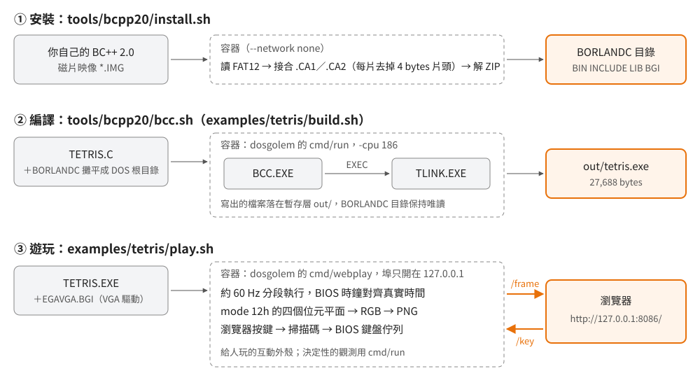

# 在 dosgolem 裡用 Borland C++ 2.0 編譯，並在瀏覽器裡玩編出來的 BGI 程式

## 結論

Borland C++ 2.0 的命令列工具（BCC、TASM、TLINK）可以在 [dosgolem](https://github.com/wicanr2/dosgolem)
裡直接執行：把安裝目錄攤平成一個 DOS 根目錄，以 `-cpu 186` 啟動 `BCC.EXE`，
它會自己叫 TLINK，產出的 `.EXE` 寫到指定的輸出目錄。整個過程在容器裡跑，不需要 DOSBox，
同樣的輸入每次得到同樣的輸出，編一支 hello world 約 330 萬條模擬指令、數秒完成。

本 repo 附了三支腳本與一個範例：`tools/bcpp20/install.sh` 從你自己的安裝磁片映像裝出 BORLANDC 目錄，
`tools/bcpp20/bcc.sh` 在 dosgolem 裡執行任一支 BC++ 工具，`examples/tetris/` 是用 BGI 繪圖庫寫的俄羅斯方塊，
編好之後由 dosgolem 的 `webplay` 在瀏覽器裡即時執行、可以用鍵盤玩。

BCC 能在 dosgolem 裡跑，是因為 dosgolem 為它補了七條規格（194–200，在 dosgolem 的 `bcc20-toolchain` 分支）。
下文逐條列出每一條擋住的是什麼症狀。

<p align="center"></p>

## 根本問題：1991 年的編譯器要什麼環境

對拍（用原廠工具鏈重新編譯，拿產物驗證說法）需要一個「原廠編譯器每次都產出同一份目的碼」的環境。
BCC 是 16 位元真實模式的 DOS 程式，它對環境的要求可以拆成四件事：

| BCC 需要 | 為什麼 | 在 dosgolem 裡怎麼滿足 |
|---|---|---|
| 一顆 8086 相容 CPU | 它的程式碼是 16 位元 x86 | dosgolem 的直譯器；CPU 機型可選 8086、186、386 |
| DOS 的 `int 21h` 服務 | 開檔、讀寫、配置記憶體、執行子程式（EXEC）都走這裡 | dosgolem 自己實作的 DOS 層，不需要真的 DOS 核心 |
| 找得到標頭檔、函式庫、子程式 | `#include <stdio.h>` 要讀 `STDIO.H`，連結要讀 `CS.LIB`、`C0S.OBJ`，連結時要 EXEC `TLINK.EXE` | 把需要的檔案全部放進一個目錄當 DOS 根目錄 |
| 寫得出目的檔與執行檔 | 產出 `.OBJ`、`.EXE`，還有暫存檔 | dosgolem 的暫存層：寫入落到另一個目錄，來源保持唯讀 |

DOSBox 也能滿足這四件事，但它以真實時間驅動、需要設定檔與掛載指令，結果會受主機速度影響。
dosgolem 以「執行了幾條指令」當時鐘，沒有視窗、沒有即時性，適合放進腳本反覆執行；
代價是它只實作到已知程式用得到的程度，BCC 用到而它還沒有的部分要先補（見後文「dosgolem 為 BCC 補的七條規格」）。

## 需要準備的東西

- **你自己合法取得的 Borland C++ 2.0 安裝磁片映像**（`*.IMG`，FAT12 格式的 720 KB 或 1.44 MB 磁片）。
  本 repo 與 dosgolem 都不含任何 Borland 檔案。
- **Docker**。所有解壓、編譯、執行都在容器裡；主機只需要 `sh`。
- **dosgolem 的 `bcc20-toolchain` 分支**：

  ```sh
  git clone -b bcc20-toolchain https://github.com/wicanr2/dosgolem.git ~/dosgolem
  ```

  dosgolem 的 Go 工具鏈也在容器裡（`tools/go.sh`），不用在主機裝 Go。
  兩支腳本第一次執行時會自動編出 `workplace/dosrun`（命令列執行器）與 `workplace/webplay`（瀏覽器外殼）；
  dosgolem 更新之後加 `REBUILD=1` 重編。

以下範例假設磁片映像在 `~/bcpp20-disks`，安裝到 `~/bcpp20`，dosgolem 在 `~/dosgolem`。

## 步驟一：從磁片映像裝出 BORLANDC 目錄

```sh
tools/bcpp20/install.sh ~/bcpp20-disks ~/bcpp20
```

腳本不跑原廠的 `INSTALL.EXE`——那是互動式全螢幕程式，不適合放進腳本。命令列建置需要的只是兩件事，腳本自己做：

1. **把跨磁片的分割封存接起來。** 放不進一張磁片的封存被切成 `NAME.CA1`、`NAME.CA2`⋯⋯分散在不同磁片。
   每一片開頭有 4 bytes 的片頭，去掉之後依序接起來就是一個完整的 ZIP。
   接完用 `unzip -t` 驗每個成員的 CRC32，片的順序或片頭長度弄錯會在這一步失敗。
2. **依用途解到固定目錄。** 編譯器與工具解到 `BIN`，標頭檔到 `INCLUDE`，各記憶體模型的函式庫到 `LIB`，
   BGI 的驅動與字型到 `BGI`，啟動碼原始檔到 `STARTUP`。

磁片檔案系統用本 repo 的 `fat12.py` 直接讀，不需要 `mount` 或 mtools。
完成後會檢查 `BCC.EXE`、`TASM.EXE`、`TLINK.EXE`、`CS.LIB`、`GRAPHICS.LIB`、`EGAVGA.BGI` 都在，
解壓紀錄寫在 `~/bcpp20/install.log`。

## 步驟二：編一支 hello world

找一個空目錄放 `HELLO.C`：

```c
#include <stdio.h>

int main(void)
{
    printf("hello from BCC 2.0\n");
    return 0;
}
```

然後：

```sh
export BCPP=~/bcpp20 DOSGOLEM=~/dosgolem
tools/bcpp20/bcc.sh ~/hello BCC.EXE -ms HELLO.C
```

`-ms` 是 small 記憶體模型（程式碼與資料各一個 64 KB 段，指標都是 near；見
[五份函式庫的全景](../00-overview/era-and-libraries.md)）。產物在 `~/hello/out/hello.exe`（6,072 bytes）。
dosgolem 最後印出一份報告，節錄如下：

```
程式呼叫了結束服務，回傳碼 0
開過的檔（13）：BCC.EXE、BCC.EXE、EMMXXXX0、HELLO.C、STDIO.H、tlink.exe、turboc.$ln、EMMXXXX0、C0S.OBJ、hello.obj、EMU.LIB、MATHS.LIB、CS.LIB
找不到的檔（14）：C:\PROG.EXE、TCDEF.SYM、turboc.cfg、C:\turboc.cfg、tlink.cfg、C:\tlink.cfg、⋯
主控台輸出（173 bytes）：
Borland C++  Version 2.0 Copyright (c) 1991 Borland International
hello.c:
Turbo Link  Version 4.0 Copyright (c) 1991 Borland International

	Available memory 417968
```

這份報告本身就是 BCC 工作流程的紀錄：

- **開過的檔**依時間排序。BCC 讀 `HELLO.C` 與 `STDIO.H`，編出 `hello.obj`，然後 EXEC `tlink.exe`；
  TLINK 依序讀啟動碼 `C0S.OBJ`、剛編好的 `hello.obj`、浮點函式庫 `EMU.LIB` 與 `MATHS.LIB`、C 函式庫 `CS.LIB`。
  檔名裡的 `S` 就是 small 模型；換成 `-ml` 會讀 `C0L.OBJ`、`MATHL.LIB`、`CL.LIB`。
  `turboc.$ln` 是 BCC 寫給 TLINK 的暫存回應檔。
- **找不到的檔**都是選用的設定檔：`turboc.cfg`（BCC 的預設選項）、`tlink.cfg`（TLINK 的預設選項）、
  `TCDEF.SYM`（預編譯標頭）。找不到就用內建預設值，不影響結果。
- `EMMXXXX0` 是 BCC 在探測有沒有 EMS 記憶體驅動程式；dosgolem 沒有，BCC 就不用 EMS。

編好的程式也可以直接在 dosgolem 裡跑，會看到它印出 `hello from BCC 2.0` 並以回傳碼 0 結束（約 1,900 條指令）。

`bcc.sh` 的第二個參數可以換成任何一支 BC++ 工具，例如 `TASM.EXE /mx FOO.ASM`、`TLIB.EXE`、`TLINK.EXE`。

### 三個設定的理由

**`-cpu 186`。** BCC 啟動時會偵測 CPU。它先用 `PUSH SP` 分辨「8086／80186 這一類」與「80286 以後」
（前者推入的是減 2 之後的 SP，後者推入減之前的值），判定為 286 以後再進一步試 32 位元指令。
dosgolem 預設的 386 模式只實作了 32 位元指令的子集，BCC 走那條路會遇到還沒實作的部分；
選 8086 或 186，BCC 就留在 16 位元路徑。選 186 而不選 8086，是因為 186 模式另外解得出
`PUSH imm`、`ENTER`／`LEAVE`、立即數位移這些 80186 指令——用 BCC 的 `-1` 選項編出的程式會用到。

**攤平成一個根目錄。** `bcc.sh` 把 `BIN`、`INCLUDE`、`LIB`、`BGI` 與工作目錄最上層的檔案全部複製進
`<工作目錄>/.dosroot`（跑完刪除）。dosgolem 找檔時只看路徑最後一段的檔名（`C:\BORLANDC\INCLUDE\STDIO.H` 與 `STDIO.H` 找到同一個檔），
所以不需要重建目錄結構，也不需要替 BCC 設 `-I`、`-L` 路徑或寫 `turboc.cfg`。
代價是不同目錄裡的同名檔會互相覆蓋；BC++ 2.0 這四個目錄之間沒有同名檔。

**暫存層。** 根目錄以唯讀掛進容器，程式寫出的檔案（`.OBJ`、`.EXE`、暫存檔）落在 `<工作目錄>/out/`。
每次執行都從同樣的根目錄開始，不會因為上一次留下的 `.OBJ` 而改變行為；要清掉就刪 `out/`。

## 步驟三：BGI 俄羅斯方塊

`examples/tetris/TETRIS.C` 是本 repo 自己寫的程式（約 370 行），只用 BC++ 2.0 附帶的東西：
`graphics.h` 畫圖、`bios.h` 的 `bioskey()` 讀鍵、`biostime()` 讀 BIOS 計時器。

### 編譯

```sh
examples/tetris/build.sh        # 等於 bcc.sh examples/tetris BCC.EXE -ms -O TETRIS.C GRAPHICS.LIB
```

命令列多了一個 `GRAPHICS.LIB`：BGI 繪圖庫不在 `CS.LIB` 裡，要明確列出來，BCC 會把它轉交給 TLINK。
產物是 `examples/tetris/out/tetris.exe`（27,688 bytes）。

### 執行

```sh
examples/tetris/play.sh         # 然後開 http://127.0.0.1:8086/
```

點一下畫面再按鍵：← → 移動、↑ 或 X 右轉、Z 左轉、↓ 加速、空白鍵直接落下、P 暫停、Esc 離開。
Ctrl-C 結束容器。埠只開在 `127.0.0.1`，要換埠號設 `PORT`。

<p align="center"></p>

`play.sh` 把 `tetris.exe` 與 BC++ 的 `EGAVGA.BGI` 放進同一個目錄交給 webplay。
少了 `EGAVGA.BGI`，程式會在啟動時印出 BGI 的錯誤訊息並結束，原因見下一節。

### 程式的寫法與當年的約束

**繪圖驅動是執行時才載入的檔案。** `initgraph(&gd, &gm, "")` 以 `DETECT` 讓 BGI 自己判斷顯示卡，
判定是 VGA 後，到第三個參數指定的目錄（空字串是目前目錄）找 `EGAVGA.BGI` 載進記憶體，
再切到 mode 12h（640×480、16 色）。`GRAPHICS.LIB` 本身只有與硬體無關的部分；
CGA、EGA／VGA、Hercules、AT&T、IBM 8514、3270 各有一個 `.BGI` 驅動。
同一支執行檔在哪種顯示卡上都能跑，也不必把用不到的驅動全部連結進來——在記憶體以 KB 計的年代，這是合理的取捨。
不想另外附檔的程式可以用 `BGIOBJ.EXE` 把驅動轉成 `.OBJ` 連結進去，再以 `registerbgidriver()` 登記；
範例為了保持簡單沒有這樣做。

**用 BIOS 計時器決定下落速度。** `biostime(0, 0L)` 讀 BIOS 每秒約 18.2 次遞增的計數器，
方塊每隔 `10 − 等級` 個 tick 下落一格。這樣速度跟 CPU 快慢無關；
如果改用「迴圈跑幾次」計時，同一支程式在 4.77 MHz 的 XT 與 386 上的速度會差上一個數量級。

**只重畫變了的格子。** BGI 直接寫顯示記憶體，沒有雙緩衝；每一格整片重畫會看到閃爍。
程式保留一份「目前畫在螢幕上的盤面」，每一輪算出新盤面後逐格比較，只重畫不同的格子。

**亂數種子取自玩家的按鍵時機。** 開頭等玩家按鍵時數迴圈跑了幾次，與 BIOS 時間一起做成 `srand` 的種子，
每一局的方塊序列就不同。

### webplay 怎麼把畫面送到瀏覽器

`webplay` 是 dosgolem 上的互動外殼（規格 200）。它做三件事：

1. **分段執行、對齊真實時間。** 每 1/60 秒執行一段指令，執行得比真實時間快就休息。
   dosgolem 以指令數當時鐘：一個 BIOS tick 在預設分頻下約 63 萬條指令，
   要每秒 18.2 次得每秒執行約 1,160 萬條。主機跟不上時，webplay 按實測速度調降每個 tick 的指令數（`IRQ0Base`），
   等於「模擬出來的 CPU 變慢，但 BIOS 時間照常走」，方塊的下落速度就維持正確。
2. **把顯示記憶體轉成圖片。** mode 12h 的每個像素分散在四個位元平面裡，各取一個位元組合成 0–15 的色號，
   經過屬性調色盤與 DAC 轉成 RGB，編成 PNG。瀏覽器每 30 ms 問一次，畫面沒變就回 204，不重送。
3. **把按鍵送回去。** 瀏覽器的 `KeyboardEvent.code` 轉成 PC 鍵盤的掃描碼，放進 BIOS 鍵盤佇列，
   程式的 `bioskey()`（`int 16h`）就讀得到。

webplay 不是對拍工具：按鍵時機來自人、速度隨主機負載變動，重跑不會得到同樣的結果。
要可重現的觀測用 dosgolem 的 `cmd/run`（例如 `-keys` 排入按鍵、`-png` 存下收工時的畫面）。

## dosgolem 為 BCC 補的七條規格

dosgolem 的原則是：遇到跑不起來的程式，就依 DOSBox-X 的原始碼或 Intel 文件把缺的行為補上，
每一條先寫成規格再實作。BC++ 2.0 這條路徑補了七條，全部在 `bcc20-toolchain` 分支的 `docs/spec/`：

| 規格 | 補了什麼 | 沒有它時的症狀 |
|---|---|---|
| 194 | EXEC 時子行程的 DTA（FindFirst 寫結果的緩衝區）指到它自己的 PSP:0080h | TLINK 正常產出 `.EXE`，但 BCC 回來後當掉：TLINK 找 `tlink.cfg` 的結果寫進了 BCC 堆疊上的返回位址 |
| 195 | `NUL` 字元裝置 | TASM 開 `NUL` 失敗，第 623 條指令以回傳碼 7 結束，沒有任何訊息；BCC 用 `-B` 編內嵌組語時一併失敗 |
| 196 | `int 21h AH=38h`（國別資訊）寫進呼叫端給的緩衝區，不動 DS:DX | TASM 呼叫後 DS 被改掉，之後的資料存取全部落在錯的段，以回傳碼 7 結束 |
| 197 | 80186 的 `PUSH SP` 推入減 2 之後的值（分界在 80286） | 以 186 模式執行時 BCC 把 CPU 誤判成 286 以後，接著執行 `mov eax,ebx` 探測 386，dosgolem 在 `0x66` 前綴停下 |
| 198 | 切到 mode 10h／12h 時載入預設的 64 色 DAC | BGI 畫面全黑；平面裡的色號其實都對，只是 DAC 全是 0 |
| 199 | BIOS ROM 在 `F000:FA6E` 放 8×8 字型 | BGI 預設字型的標點與數字 1–9 畫成空白（`Borland C++ 2.0` 只剩 `Borland C     O`） |
| 200 | `cmd/webplay` 互動外殼 | —（新功能） |

194、195、196 不是 BC++ 特有的問題：任何會 EXEC 子程式再 FindFirst 的程式、任何開 `NUL` 的程式、
任何查國別資訊的程式都會踩到。197 的依據是 Intel 的 80186 使用手冊與 SDM，並以 8086、V20 的逐指令實機紀錄核對。
198 照 DOSBox-X 的 `INT10_SetVideoMode`。199 的字形取自 Public Domain 的 font8x8，**與 IBM 原廠 ROM 的點陣不同**，
逐像素比對原機截圖時會有差異。

## 疑難排解

| 現象 | 原因與處理 |
|---|---|
| `bcc.sh` 說「不是 bcc20-toolchain 分支」 | `DOSGOLEM` 指到的 checkout 沒有上述修正；`git checkout bcc20-toolchain` 後以 `REBUILD=1` 重跑 |
| 報告寫「跑滿指令上限」而不是「呼叫了結束服務」 | 程式沒結束：可能在等按鍵（互動程式要用 webplay，或以 `-keys` 排入按鍵）、可能 dosgolem 缺某個服務。`dosrun` 的 `-trace-tail N` 印出最後 N 條指令，看它停在哪 |
| 報告的「找不到的檔」出現 `.H` 或 `.LIB` | 檔名拼錯，或那個檔不在 `BIN`、`INCLUDE`、`LIB`、`BGI` 與工作目錄最上層；子目錄裡的檔案不會被攤平 |
| 程式印出 `BGI error: Device driver file not found (EGAVGA.BGI)` 並以回傳碼 1 結束 | 執行目錄沒有 `EGAVGA.BGI` |
| 瀏覽器畫面不動 | 先點一下畫面讓它取得焦點；狀態列若顯示「程式已結束」，看下方的主控台輸出 |
| 狀態列每秒指令數很低、方塊掉得慢 | 主機忙；webplay 已調降 `IRQ0Base` 讓時間照常走，但畫面更新會變頓。用 `-realtime=false` 可以關掉這個調整 |
| 在 386 模式（dosgolem 預設）執行自己的程式 | 一般的 BCC 產物用不到 386 指令，三種模式都能跑；但執行時偵測 CPU 的程式（BCC 自己就是）會走不同路徑 |

## 證據與未知

| 結論 | 依據 | 等級 |
|---|---|---|
| BCC、TLINK 在 dosgolem 裡編出可執行的 `hello.exe`、`tetris.exe` | 以本文腳本實際執行，產物在 dosgolem 裡執行結果正確 | 已證實 |
| 同樣輸入得到同樣產物 | dosgolem 以指令數計時、不讀主機時間；同一安裝重跑兩次，以及兩份安裝來源（1991-04 與 1991-08 的磁片；`BCC.EXE` 相同、`TLINK.EXE` 不同）編出的 `hello.exe` 都逐位元組相同 | 已證實 |
| 報告中各檔案的角色（`turboc.$ln` 是回應檔、`EMMXXXX0` 是 EMS 探測） | 開檔順序與檔名慣例；`EMMXXXX0` 是 EMS 驅動程式的標準裝置名 | 強推論 |
| BCC 以 `PUSH SP` 分辨 CPU 等級、286 以後再試 32 位元指令 | 反組譯 `BCC.EXE` 的啟動碼 | 已證實（反組譯） |
| 規格 194–199 的症狀與修正 | 各規格的觸發案例（記憶體監看、指令追蹤）與單元測試 | 已證實 |
| 模組化 `.BGI` 驅動是為了省記憶體與支援多種顯示卡 | 驅動檔的分法與 `BGIOBJ` 的存在；沒有找到 Borland 的設計文件 | 強推論 |
| mode 12h 的顏色 | dosgolem 的預設 DAC 照 DOSBox-X，真機 VGA BIOS 載入的值應相同，**未與真機截圖比對** | 強推論 |

**未知**

- 在真機或 DOSBox-X 上以同一份 `TETRIS.C` 編出的 `tetris.exe` 是否與 dosgolem 產出的逐位元組相同。
  BCC 的輸出理論上不依賴時間與環境，但沒有實測。
- BCC 在 `-cpu 386` 下具體卡在哪一條指令；本文只用到 186 模式，沒有追。
- `INSTALL.EXE` 除了接合與解壓以外是否還做了別的事（例如修改設定檔）；命令列建置沒有用到它的產物以外的東西。
