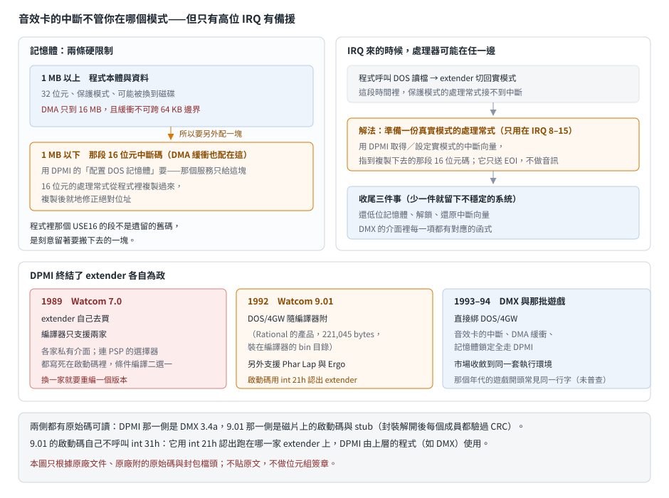

# DPMI 與 DOS/4GW：32 位元 DOS 程式不必再為每家 extender 編一次

## 結論

1989 年的 Watcom C/386 要你自己去買 DOS extender，而且**編譯器得知道你買的是哪一家**——
連「PSP 在哪」都是各家約定的常數，靠條件編譯二選一
（見 [第一代 32 位元 Watcom](watcom386-extenders.md)）。

到了 1992 年的 9.x，兩件事變了：

- **extender 變成隨編譯器附的東西。** 9.01 的安裝程式問你要裝哪幾家的支援，
  其中 Rational 的 DOS/4GW 連本體都在磁片裡（221 KB 的一支執行檔），裝完就放在編譯器的 `bin` 目錄。
- **程式改用一套標準介面對 extender 說話：DPMI。** 不再是各家私有的呼叫慣例，
  而是統一走 `int 31h`。同年代的音效函式庫 DMX 就是這樣寫的。

對遊戲來說，最實際的影響在中斷處理。音效卡的 IRQ 會在處理器還在**實模式**的時候發生，
而遊戲本體跑在保護模式——這中間的落差，DPMI 提供了現成的解法，
而 DMX 的原始碼正好完整展示了怎麼用。

**這篇的證據強度不平均**：DPMI 那一側有完整的原始碼可讀（DMX），
9.01 自己那一側只讀得到安裝腳本與封包清單——磁片上的檔案用 Watcom 自己的壓縮封裝，
我們的解碼器還沒寫完（見最後一節）。

## 根本問題：中斷不等人

保護模式程式跑在 DOS 上，處理器並不是一直待在保護模式。程式每呼叫一次 DOS
（讀檔、寫檔、取時間），extender 就得切回實模式、把參數搬到 1 MB 以下、呼叫、再切回來。

音效卡的中斷不管這些。卡上的緩衝區快播完時就拉 IRQ，處理器當下在哪個模式是隨機的。
於是有三個問題要解：

1. **處理常式得兩邊都能跑。** 中斷發生時若在實模式，保護模式的處理常式接不到。
2. **DMA 緩衝區必須在 1 MB 以下。** DMA 控制器是 8237，只有 24 條位址線，
   碰不到 1 MB 以上的記憶體——而 32 位元程式的資料預設就在那之上。
3. **中斷碰到的記憶體不能被換出。** extender 可能把記憶體換到磁碟；
   中斷處理常式若碰到被換出的頁面，會在最糟的時機觸發缺頁處理。

這三件事都不是編譯器能解決的，得由 extender 提供服務。**問題是每家 extender 的服務介面都不一樣**——
這就是 DPMI 要統一的東西。

## DMX 怎麼做：一份可讀的實例

DMX（1993–94 年那套 DOS 音效函式庫，見 [DMX 的五份封存](../30-dmx/version-history.md)）
用 Watcom 的 32 位元編譯器建、連結時指定 DOS/4GW。它對 extender 的呼叫集中在一個模組裡，
每個函式都是對 `int 31h` 發請求，正好對上前一節那三個問題：

| DMX 用的服務 | 解決哪個問題 |
|---|---|
| 配置與釋放 **1 MB 以下**的 DOS 記憶體 | DMA 緩衝區的位置限制 |
| **鎖住**一段記憶體不被換出、以及解鎖 | 中斷處理常式與它碰的資料不能缺頁 |
| 取得與設定**中斷向量** | 掛自己的 IRQ 處理常式 |
| 查詢最大可用區塊 | 決定要配多大的混音緩衝 |

### 那段 16 位元的碼

最有意思的是第一個問題的解法。DMX 的原始碼裡有一個模組宣告成 **16 位元的程式段**，
夾在整包 32 位元程式中間，公開三個符號：中斷處理常式的進入點、它的結尾、以及需要修正的位置。

「結尾」與「修正點」這兩個符號說明了用法：**這段碼會被複製到 1 MB 以下的記憶體再啟用**。
複製之後它所在的段變了，所以碼裡凡是用到絕對位址的地方都要就地修正——
結尾符號則是用來算「要複製多少 bytes」。

於是流程是：程式啟動時把這段 16 位元碼搬到低位記憶體，用 DPMI 把實模式的中斷向量指過去，
之後不管處理器在哪個模式，音效卡的 IRQ 都有人接。

**在反組譯裡怎麼認**：一支 32 位元 DOS 程式裡如果出現 `USE16` 的程式段，
而且段裡的碼會被複製、搭配一組「起點／結尾／修正點」的符號，
那多半就是這種真實模式中斷處理常式。它不是遺留的舊碼，是刻意保留的一塊。

## 9.01 這一側：安裝腳本說了什麼

9.01 的磁片上幾乎每個檔案都是 Watcom 自己的壓縮封裝（副檔名多半是 `.WPK`，
也有依目標平台命名的 `.DOS`、`.OS2`、`.WIN`）。我們目前只解得出封包的**成員清單**，
解不出內容。不過安裝腳本是純文字，它本身就回答了幾個問題。

**支援三家 extender，安裝時逐一詢問**：

| extender | 廠商 | 安裝大小 |
|---|---|---|
| Phar Lap | Phar Lap | 171 KB |
| Ergo | Ergo | 18 KB |
| **DOS/4GW** | Rational | 417 KB |

DOS/4GW 的本體是一支 221 KB 的執行檔，在磁片 4（標籤就叫「DOS/4GW & Windows Disk」），
安裝時解到編譯器的 `bin` 目錄。**這是與 7.0 最大的差別**：7.0 一個 extender 都不含。

其餘從封包清單看得出來的變化：

| | 7.0（1989） | 9.01（1992） |
|---|---|---|
| 啟動碼（暫存器版） | 8,834 bytes | 10,216 bytes |
| 啟動碼的 C 側 | 2,748 bytes | 5,385 bytes |
| C 函式庫 | 95,232 bytes | 157,184 bytes |
| 目標平台 | 只有 DOS | DOS、OS/2、Windows，另有多執行緒與 DLL 版 |
| stub 的原始碼 | 沒有 | 有（984 bytes，只在選 DOS/4GW 時安裝） |

stub 是「16 位元的引導程式 ＋ 32 位元本體」黏成一個執行檔時，前面那一小段。
原始碼只有 984 bytes，說明它做的事很單純：找到 extender、把自己交出去。
**內容我們還讀不到**，所以這裡只能講到這個程度。

## 這條線的三個階段

| 年代 | extender 從哪來 | 程式怎麼跟它說話 |
|---|---|---|
| 1989（Watcom 7.0） | 自己去買，編譯器只支援兩家 | 各家私有介面；連 PSP 的選擇器都寫死在啟動碼裡，用條件編譯二選一 |
| 1992（Watcom 9.01） | DOS/4GW 隨編譯器附，另外支援兩家 | 走 DPMI（`int 31h`）這套標準 |
| 1993–94（DMX 與那批遊戲） | 遊戲直接綁 DOS/4GW | 同上；音效卡的中斷、DMA 緩衝、記憶體鎖定全走 DPMI |

DPMI 解決的正是 7.0 那個時代的痛點：**程式不必再為每一家 extender 編一個版本**。
這也是為什麼 1993 年以後的 DOS 遊戲幾乎都能在螢幕上看到同一行 DOS/4GW 的字樣——
市場收斂到同一套執行環境上了。

## 給 remake 的行為規格

**這一節沒有實跑支持**，來源是 DMX 的原始碼與 9.01 的安裝腳本。

| 項目 | 規格 |
|---|---|
| 音訊緩衝區 | 必須配置在 1 MB 以下（DMA 的定址限制），而且要鎖住不被換出 |
| 中斷處理 | 實模式與保護模式都要能接；原版的做法是把一段 16 位元碼複製到低位記憶體，再把實模式向量指過去 |
| 結束時 | 配過的低位記憶體要還、鎖過的要解鎖、換過的中斷向量要還原——這三件事沒做完就結束，會留下不穩定的系統 |

現代的 remake 不會有這些限制（作業系統自己管記憶體與中斷），
但**如果要解釋「原版為什麼這樣寫」或重現它的時序**，這一層是必要的背景。

## 證據與未知

**已證實（原文）**：9.01 支援的三家 extender 與各自的安裝大小、DOS/4GW 隨編譯器附、
磁片 4 的標籤、封包與安裝目錄的對應、stub 原始碼的存在與大小、各封包成員的檔名與未壓縮大小
（來源是 9.01 的安裝腳本與封包檔頭）。DMX 對 `int 31h` 的呼叫與那四類服務、
16 位元中斷處理段的存在與它的三個公開符號（來源是 DMX 的原始碼）。

**強推論**（全篇最弱的一級）：

- 「那段 16 位元碼會被複製到低位記憶體再用」——依據是「結尾」與「修正點」兩個符號的存在與命名，
  沒有逐行確認複製的程式碼。
- 「9.01 自己也走 DPMI」——9.01 的啟動碼內容還讀不到，這個推論來自同年代的 DMX 與安裝腳本的結構。
- 兩版之間的大小比較只說明「變大了」，變大的原因（多了哪些功能）沒有讀到內容佐證。

**未知**：

- **9.01 磁片上的封包內容還解不開。** 那是 Shannon-Fano 碼加 4 KB 字典的 LZSS；
  照原始碼移植之後輸出長度正確但內容是亂碼。已定位的原因是碼表排序依賴某個特定的
  `qsort` 對等值元素的順序（原廠自己在註解裡寫明這件事），要一起移植才解得開。
  所以 `dos4gw.exe`、`wstub.c`、9.01 的啟動碼與函式庫都還沒讀到。
- DPMI 規格書還沒取得，DMX 用的功能編號沒有逐一對照規格。
- Ergo 這家 extender 沒查。
- 9.5 與 8.0 沒有下載。
- 沒有可執行檔、沒有實跑：9.x 的連結器在封包裡，同樣解不開。
