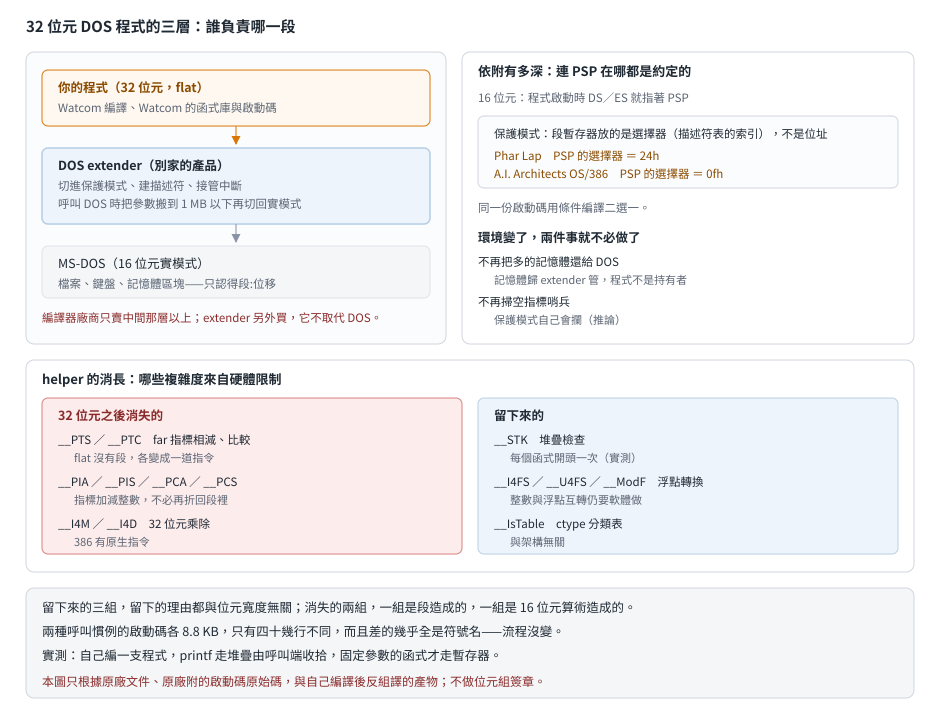

# Watcom C/386 7.0：編譯器賣你，作業系統得跟別人買

## 結論

1989 年的 Watcom C/386 7.0 是 Watcom 的第一個 32 位元版本，但它**不是一套完整的工具鏈**。
原廠說明檔第一句就講清楚：這個包沒有連結器，也沒有除錯器，你得另外買 Phar Lap 的
386|DOS-Extender 開發工具，或 A.I. Architects 的 OS/386。

這個安排不是偷工減料，而是當年 32 位元 DOS 程式的實際樣貌：**DOS 本身只認識 16 位元實模式**，
要跑 32 位元程式，得有另一層軟體先把處理器切進保護模式、接管記憶體與中斷，再把程式載進去。
那層軟體叫 DOS extender，由第三方廠商賣。編譯器廠商只負責產生碼與函式庫。

依附的程度有多深，看啟動碼就知道：**程式連自己的 PSP 在哪都不是問 DOS 拿的**，
而是直接用一個寫死的選擇器編號——Phar Lap 用 `24h`、Lahey 那套用 `0fh`，靠條件編譯二選一。

同一份原始碼裡還有另外兩件事值得看：兩種呼叫慣例在這一版正式分家（而分家的方式只是換符號名），
以及 16 位元時代那堆 far 指標 helper 到這裡**全部消失**了。

## 根本問題：DOS 不會切換到保護模式

386 提供了 32 位元的暫存器與平坦的位址空間，但 DOS 是為 8086 寫的，開機後處理器停在實模式，
能定址的只有 1 MB。要用到 386 的能力，必須有人做這幾件事：

- 把處理器切進保護模式，建好描述符表。
- 接管中斷——實模式與保護模式的中斷向量表是兩回事，而 DOS 與 BIOS 的服務還在實模式那邊。
- **在兩種模式之間搬資料**。程式要讀檔，最後還是得呼叫 DOS；DOS 只認得實模式的段位址，
  所以參數要複製到 1 MB 以下的緩衝區，再切回實模式呼叫，再切回來。
- 管理 1 MB 以上的記憶體，並提供配置介面。

這些事與「編譯 C 程式」毫無關係，卻是每一支 32 位元 DOS 程式都需要的。
於是市場分工：Phar Lap、A.I. Architects 這些公司賣 extender，Watcom 賣編譯器。

代價是**編譯器必須針對特定的 extender 產生碼**。程式要拿 PSP、要呼叫 DOS、要配置記憶體，
走的都是 extender 定的介面，而各家的介面不一樣。

## 依附有多深：從啟動碼看

7.0 的啟動碼附了原始碼，兩種 extender 的差異用條件編譯處理。最直接的例子是取 PSP：

| 環境 | PSP 的取得方式 |
|---|---|
| 16 位元 DOS（6.5） | 程式啟動時 DS 與 ES 就指著 PSP，直接存起來 |
| Phar Lap（7.0 預設） | 用寫死的選擇器 `24h`；環境區另有一個 `2ch` |
| Lahey／OS/386（7.0 條件編譯） | 用寫死的選擇器 `0fh` |

保護模式下，段暫存器裡放的不是實體位址除以 16，而是**描述符表的索引**。
PSP 這塊記憶體在 1 MB 以下、由 DOS 建立，extender 啟動程式時會先替它建好一個描述符，
編號是雙方約定的常數。所以「PSP 在哪」這個問題，在保護模式下的答案是一個編號，不是一個位址。

啟動碼還有兩處可以看出環境變了：

**不再把記憶體還給 DOS。** 16 位元版的啟動碼有一步是呼叫 DOS 的 SETBLOCK，
把載入時多拿的記憶體還回去，否則之後配置記憶體或執行子程式都會失敗
（見 [Watcom C 6.5 的 runtime](watcom65-runtime.md)）。7.0 的啟動碼**完全沒有這一步**——
記憶體由 extender 管，程式不是 DOS 記憶體區塊的持有者，還給誰都不對。

**不再檢查空指標。** 6.5 會在資料區開頭放一段哨兵，程式結束時掃一遍，被寫壞就印訊息。
7.0 保留了佔位用的空段，但結束時不掃了。合理的解釋是保護模式本身會攔截對位址 0 的寫入——
**這是推論，原廠沒說**，但它與「保護模式把一部分除錯工作接手過去」的整體方向一致。

## 兩種呼叫慣例，差別只是名字

7.0 的函式庫出兩份：`CLIB3R.LIB` 與 `CLIB3S.LIB`，對應編譯時選 `/3r`（預設，參數走暫存器）
或 `/3s`（與另一家編譯器相容）。啟動目的檔也是兩份。

有趣的是這兩條路在原始碼層級差多少。兩份啟動碼各 8.8 KB，逐行比對只有 41 行不同（對面 42 行），而**差的幾乎全部是符號名**：

| 暫存器版 | 堆疊版 |
|---|---|
| `__dynend`、`__STACKTOP`、`__psp` | `_dynend`、`_STACKTOP`、`_psp` |
| `__exit_`、`_chk8087_` | `__exit`、`_chk8087` |

流程、指令、順序一行都沒變。也就是說「支援兩種呼叫慣例」在函式庫這一側的成本，
主要是**維護兩套符號名**，不是維護兩套邏輯——邏輯的差異落在編譯器產生呼叫端的碼時。

這種「同一份原始碼、兩套符號」的做法，四年後在 DMX 身上看得到同樣的形狀：
它也是同一份原始碼編兩次，出 `dmx_r.lib` 與 `dmx_s.lib`
（見 [DMX 的五份封存](../30-dmx/version-history.md)）。

## helper 的消長：架構變了，需求就沒了

16 位元的 Watcom C 6.5 有一整組 helper 處理 far 指標運算，理由是段與位移讓同一個位址有多種寫法，
不先正規化就不能比較或相減。32 位元 flat 模型沒有段，指標就是一個 32 位元整數。

所以這些 helper 應該消失。實際比對兩版的符號，確實如此：

| helper | 6.5（16 位元） | 7.0（32 位元） | 為什麼 |
|---|---|---|---|
| `__PTS`、`__PTC` | 有 | **沒有** | 指標相減、比較各變成一道指令 |
| `__PIA`／`__PIS`、`__PCA`／`__PCS` | 有 | **沒有** | 指標加減整數不必再折回段裡 |
| `__I4M`／`__U4M`、`__I4D`／`__U4D` | 有 | **沒有** | 386 有 32 位元的乘法與除法指令 |
| `__STK` | 有 | **有** | 堆疊檢查與位元寬度無關 |
| `__I4FS`／`__U4FS`、`__ModF` | 有 | **有** | 整數與浮點的轉換仍然要軟體做 |
| `__IsTable` | 有 | **有** | `ctype` 的分類表，跟架構沒關係 |

**留下來的三組，留下的理由都與位元寬度無關**；消失的兩組，一組是段造成的，一組是 16 位元算術造成的。
這條對照本身就是一份「哪些複雜度來自硬體限制、哪些是本質需求」的清單。

## 自己編一支程式看到什麼

7.0 的編譯器在我們的無頭 DOS 執行器裡跑得動（`-cpu 386`），所以這一節是實測而不是推論。
編一支只呼叫 `printf` 的程式，再用 7.0 自己的反組譯器讀產物，`main` 的形狀是：

1. 把這個函式要用掉的堆疊量放進 EAX，呼叫 `__STK`。**每個函式都有這一段。**
2. 把字串位址推上堆疊，呼叫 `printf_`，回來後把堆疊指標加回去。
3. 回傳值清零，`ret`。

三件事值得記：

- 函式的符號是 `main_`，尾端一個底線——預設就是暫存器慣例，與說明檔寫的 `/3r` 相符。
- **`printf` 走堆疊，不走暫存器。** 可變參數的函式不知道有幾個參數，沒辦法用暫存器慣例；
  而且收拾堆疊的是呼叫端。這一點在 16 位元那篇是從文件推的，這裡是直接看到的。
- 堆疊檢查不是可選的優化，是**每個函式的固定開場**。remake 若要重現原版在堆疊耗盡時的行為，
  這一段是關鍵。

## 在執行檔裡怎麼認

| 特徵 | 說明 |
|---|---|
| 尾端底線的函式符號 | 與 16 位元版一樣，是暫存器呼叫慣例的痕跡 |
| `__STK` 被大量呼叫 | 每個函式開頭一次；它是 32 位元版僅存的少數 helper 之一 |
| **沒有** `__PTS`／`__PIA` 這類指標 helper | 有這些就是 16 位元版；32 位元版不會有 |
| `__psp`、`__osmajor`、`__STACKTOP`、`__curbrk`、`__dynend` | 啟動碼設的那組全域變數，與 16 位元版同名 |
| `__StartTime` | 7.0 新增的，給 `clock` 用；6.5 沒有 |
| `.LBJ` 檔 | 就是 OMF 目的檔換個副檔名，給 Lahey 那條路的連結器用 |

這一階段**不出位元組簽章**（本庫的簽章規則只涵蓋 Borland 與 Microsoft）。

## 給 remake 的行為規格

**這一節沒有實跑支持**——我們沒有連結器，所以沒有可執行檔。以下是原始碼與反組譯看得到的部分：

| 項目 | 規格 |
|---|---|
| 函式開場 | 每個函式先把所需堆疊量放 EAX、呼叫堆疊檢查；不足就印訊息結束程式 |
| 固定參數的函式 | 參數走暫存器（預設），符號尾端帶底線 |
| 可變參數的函式 | 參數走堆疊，呼叫端自己收拾 |
| 程式結束 | 直接走 DOS 的結束服務；**不做空指標哨兵檢查**（16 位元版會做） |
| 記憶體 | 啟動碼不向 DOS 歸還記憶體；配置由 extender 負責 |

## 證據與未知

**已證實（原文）**：不含連結器與除錯器、要搭 Phar Lap 或 A.I. Architects、
預設 flat 模型、`/3r` 與 `/3s` 對應的函式庫與啟動檔、`.LBJ` 給 Lahey 連結器用（那條路要改用 small 模型）。
來源是原廠說明檔。啟動碼的兩個選擇器常數、條件編譯、沒有記憶體歸還、沒有空指標檢查，
來源是原廠附的啟動碼原始碼。

**已證實（實測）**：自己編出來的程式裡 `main_` 的符號形態、每個函式開頭呼叫堆疊檢查、
`printf` 走堆疊且由呼叫端收拾。方法是在無頭 DOS 執行器裡用 7.0 的編譯器編譯，
再用 7.0 自己的反組譯器讀產物。

**強推論**：helper 消長那張表。6.5 那邊是逐模組反組譯確認的，7.0 這邊只比對到符號字典層級
（出貨庫是 Phar Lap 的 Easy OMF-386 變體，我們的解析器還讀不動），
所以「7.0 沒有指標 helper」的依據是「符號不存在」，不是「讀過整個庫」。

**未知**：

- **出貨函式庫解不開。** Easy OMF-386 變體的解析還沒支援，所以 7.0 的模組數、
  每個 helper 的大小與段名都還沒拿到——16 位元那篇有的那張表，這一篇給不出來。
- **沒有連結器就沒有可執行檔。** Phar Lap 與 OS/386 的工具我們沒有，兩者的權利狀態也還沒查。
  所以執行檔格式、extender 的載入流程、實際的系統呼叫介面，這篇都不寫。
- 「保護模式會攔截空指標寫入，所以不必檢查」是推論。
- 兩套 extender 的介面差異，只從啟動碼的條件編譯推得，沒有它們自己的文件。
- 8.0 相對 7.0 改了什麼，沒做。
