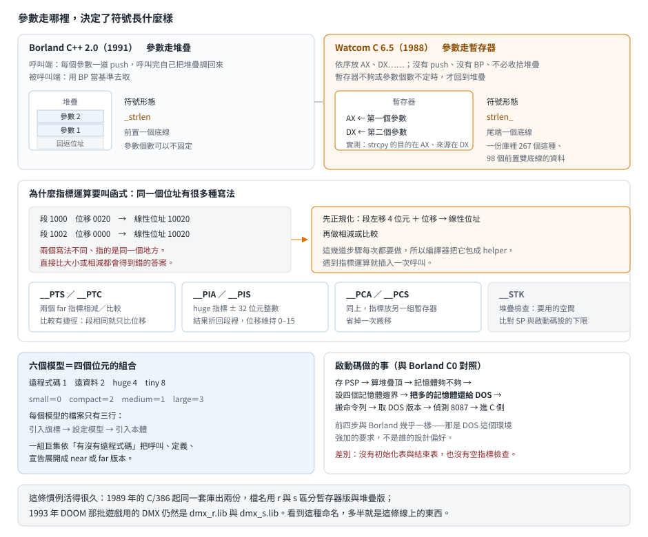

# Watcom C 6.5：1988 年就把參數放進暫存器

## 結論

同一個年代的三家編譯器，在「參數怎麼傳給函式」這件事上做了不同的選擇。
Borland C++ 2.0（1991）與 Microsoft 的 16 位元 CRT 都走堆疊；
**Watcom C 6.5（1988）預設把參數放進暫存器**，而且這個選擇在符號名上看得見：
函式的公開符號尾端多一個底線。

從出貨函式庫直接數：一份函式庫裡 371 個公開符號，267 個是這種尾端底線的函式符號，
98 個是前置底線的資料與 helper，剩下 6 個兩邊都沒有底線（浮點例外用的符號）。反組譯證實參數依序放 AX、DX——
`strlen` 從 AX 拿指標，`strcpy` 從 AX 拿目的、DX 拿來源。

除了呼叫慣例，本篇也整理另外兩件事：編譯器替程式插入的 helper（尤其四個處理 far 指標運算的），
以及六個記憶體模型與啟動碼的機制——後者可以和 Borland 逐項對照。

這條慣例活得很久。1989 年的 Watcom C/386 7.0 起，同一套函式庫出兩份，
檔名用 `r` 與 `s` 區分兩種呼叫慣例（`r` 是暫存器，原廠文件寫明；`s` 是另一種，原廠只說它
「與另一家編譯器相容」，沒有直接寫是堆疊）；到了 1993 年，DOOM 那批遊戲用的音效函式庫 DMX
仍然用 `-4r`／`-4s` 編譯、出 `dmx_r.lib` 與 `dmx_s.lib`
（見 [DMX 的五份封存](../30-dmx/version-history.md)）。看到 `_r`／`_s` 結尾的 DOS 函式庫，
多半就是這條線上的東西。

## 根本問題：8086 的呼叫成本

本篇假設讀者知道 8086 的位址是「段 × 16 ＋ 位移」、指標因此分成只帶位移的 near 與
段與位移都帶的 far，而「記憶體模型」就是決定程式碼與資料各用哪一種的組合。
不熟悉的話先讀 [五份函式庫的全景](../00-overview/era-and-libraries.md) 的「一個指標該有多寬」。

16 位元 x86 上，一次函式呼叫要做的事不只跳轉。參數走堆疊的話，呼叫端每個參數一道 `push`，
被呼叫端用 `BP` 當基準去取，回來之後還要把堆疊調回去。參數少、函式小的時候，
這些額外動作佔的比例相當高。

暫存器傳參把這些都省掉了，代價是三個：

- **暫存器不夠用。** 8086 只有四個通用暫存器，參數一多還是得回到堆疊。
- **可變參數的函式沒辦法這樣做。** `printf` 這種不知道有幾個參數的，只能走堆疊。
- **別人的目的碼接不上。** 這是最麻煩的一個——組語寫的模組、另一家編譯器編出來的函式庫，
  都假設參數在堆疊上。

Watcom 的處理方式是：預設用暫存器，但提供一個 pragma 讓程式指定某個函式的傳參方式，
包括用哪些暫存器、哪些暫存器會被改動、參數順序要不要反過來。
原廠說明檔裡有 `parm [ax dx]`、`modify exact [bx cx]` 這種寫法的例子。
換句話說，「呼叫慣例」在這個編譯器裡是**可以逐函式指定的屬性**，不是全域二選一。

到了 32 位元時代，Watcom 索性把整套函式庫編兩份，讓使用者在連結時決定。

## far 指標怎麼傳

參數放暫存器的做法，遇到 far 指標時要佔兩個。large 模型的函式庫給了答案：
**位移在前、段在後，兩兩成對**。`strlen` 的參數是 AX（位移）與 DX（段）；
`strcpy` 的目的在 DX:AX、來源在 CX:BX。

這和 helper 用的暫存器對完全一致——`__PTS` 相減的兩個指標也是 DX:AX 與 CX:BX。
所以在反組譯裡看到「一組 `mov ES,DX` 緊跟在 `mov DI,AX` 後面」這種開頭，
就是一個收 far 指標的 Watcom 函式在把參數搬進定址暫存器。

## 符號修飾：兩種底線，兩種東西

反組譯時看到的 Watcom 符號有兩種形態，不要混為一談：

| 形態 | 是什麼 | 例子 |
|---|---|---|
| 尾端一個底線 | **函式**，暫存器呼叫慣例 | `strlen_`、`exit_`、`atexit_`、`fcloseall_` |
| 前置兩個底線 | 啟動碼設定的全域變數，或編譯器自動插入的 helper | `__psp`、`__osmajor`、`__STACKTOP`、`__STK`、`__PTS` |

比例是 267 比 98（medium model 的 C 函式庫，另有 6 個前後都沒底線的浮點例外符號，不屬於這兩類）。
看到一支 DOS 程式裡成片的尾端底線符號，基本上可以確定是 Watcom 編的。

## 編譯器替你呼叫了什麼

有些運算 8086 做不到，編譯器會插入對 helper 的呼叫。Watcom 6.5 的 helper 各自是一個小模組，
名稱有規律：

| 符號 | 做什麼 |
|---|---|
| `__I4M`／`__U4M` | 32 位元乘法。**兩個名字指向同一段程式碼**——32×32 取低 32 位元時，有號與無號在位元層級完全一樣，差別只出現在除法與溢位判斷 |
| `__I4D`／`__U4D` | 32 位元除法 |
| `__I4FS`／`__U4FS`、`__ModF`、`__I4FD`／`__U4FD`、`__ZBuf2F` | 整數與浮點之間的轉換、取模；後三個只從名稱與所在模組推語意 |
| `__PTS` | 兩個 far 指標**相減** |
| `__PTC` | 兩個 far 指標**比較** |
| `__PIA`／`__PIS` | huge 指標**加／減**一個 32 位元整數 |
| `__PCA`／`__PCS` | 同上，差別在指標放在哪一組暫存器 |
| `__STK` | 堆疊空間檢查 |
| `__IsTable` | `ctype` 那組巨集用的分類表 |

命名拆開來看：`I4`／`U4` 是有號／無號 32 位元，`M`／`D` 是乘／除；
`P` 開頭那組是指標運算，第二個字母說明另一個運算元是什麼（`T` 是另一個指標、`I` 是整數），
最後一個字母是運算本身（`A` 加、`S` 減、`C` 比較）。

### 為什麼指標運算要叫 helper

far 指標由段與位移兩部分組成，同一個記憶體位置可以有多種寫法（段減 1、位移加 16，指的是同一個地方）。
所以兩個 far 指標**不能直接比大小，也不能直接相減**——要先各自算成線性位址：
段左移 4 位元，加上位移。

`__PTS` 與 `__PTC` 做的就是這件事：把兩邊都正規化，再相減或比較。
`__PTC` 另外有兩個捷徑：兩邊的段相同就只比位移，位移相同就只比段——兩種情況都不必正規化。

`__PIA` 這一組處理的是另一種情況：huge 指標加上一個整數之後，位移可能超過 16 bytes 的範圍，
於是要把超出的部分折回段裡，讓位移永遠落在 0 到 15。**這正是 huge 模型「陣列可以大於 64 KB」的代價**：
每一次指標算術都變成一次函式呼叫。

`__PIA` 與 `__PCA` 的差別只在指標放在哪一組暫存器（一個用一般暫存器對、一個用附加段暫存器）——
編譯器依當下哪個暫存器有空來挑，省掉一次搬移。

**減法是加法的入口。** `__PIS` 與 `__PIA` 住在同一個模組，前者只多做一件事：
把整數取負，然後直接落進後者。同樣的寫法也用在 `__PCS` 與 `__PCA` 上。
這種「同一個運算給好幾個入口」的做法，在 Borland 的 helper 裡也看得到
（見 [編譯器偷偷呼叫的函式](../10-borland-crtl/compiler-helpers.md)）。

`__STK` 則是堆疊檢查：函式進來時把要用掉的空間量交給它，它比對目前的堆疊指標與下限，
不夠就印訊息結束程式。下限是啟動碼設好的全域變數。

## 一份原始碼怎麼編出六個模型

六個模型存在的理由是一組取捨：程式碼或資料只用位移（near）就快，但範圍限在 64 KB；
帶上段（far）能定址整個記憶體，代價是每次呼叫或存取都多一個段值。
程式碼與資料各自二選一，就有四種組合；再加上「連段暫存器都不用換」的 tiny
與「單一資料物件可以超過 64 KB」的 huge，一共六種。

Watcom 附了啟動碼的原始碼，所以這件事不必用猜的。機制有三層：

1. **模型定義成位元旗標。** 「程式碼是遠的」「資料是遠的」「huge」「tiny」各佔一個位元
   （1、2、4、8），六個模型就是這些位元的組合：small 兩個位元都是 0、medium 只有遠程式碼（1）、
   compact 只有遠資料（2）、large 兩個都有（3）、huge 是遠程式碼加 huge 位元（5）、tiny 自己一個位元（8）。
2. **每個模型一個三行的 wrapper。** 內容只有：引入旗標定義、把模型設成某個組合、引入本體。
   六個檔案各約 60 bytes。
3. **一組巨集把 near／far 的差異吃掉。** 依「模型有沒有遠程式碼位元」，
   「呼叫」「定義函式」「宣告外部函式」「結束函式」四個巨集各展開成 near 或 far 版本。
   於是啟動碼本體從頭到尾不出現 near 或 far。

和 Borland 的做法（見 [一份原始碼怎麼編出五個記憶體模型](../10-borland-crtl/memory-model-macros.md)）
比較：兩邊都是「條件編譯 ＋ 巨集」，但 Borland 的巨集主要在資料段與函式屬性上做文章，
Watcom 則把**呼叫、定義、宣告**三件事都各包一層。抽象得更乾淨，代價是讀原始碼時
得先讀懂巨集才知道實際展開成什麼。

出貨的函式庫也照這個切法分份：五個模型各一個 C 函式庫，庫名的最後一個字母就是模型
（`CLIBS` small、`CLIBM` medium、`CLIBC` compact、`CLIBL` large、`CLIBH` huge）；
tiny 沒有自己的庫，只有一個獨立的啟動目的檔。這一點和 Borland 完全一樣。

浮點則不同：Watcom 分成軟體版（`MATH`）與 8087 版（`MATH87`，8087 是當年選購的數學輔助處理器，
沒裝的機器得靠軟體模擬）**兩套獨立的函式庫**，各五個模型；
Borland 是同一個庫、靠連結時填向量決定（見 [printf 家族](../10-borland-crtl/printf-engine.md)）。
Watcom 的做法反而接近 Visual C++ 1.0 的
[三個維度交叉](../20-msvc-crt/library-combination.md)。

## 啟動碼做了什麼

從程式被 DOS 載入到 `main` 執行之前，Watcom 的啟動碼依序做這些事：

1. 存下 PSP（Program Segment Prefix，DOS 載入程式時放在程式前面的 256 bytes 控制區）的段位址。
2. 依連結時決定的堆疊大小算出堆疊頂端。
3. 檢查記憶體夠不夠——不夠就走到印訊息並結束的那條路。
4. 設好堆疊頂與目前的記憶體上緣兩個全域變數。
5. **把多出來的記憶體還給 DOS**（`AH=4Ah`）。DOS 載入程式時會把能給的都給它，
   不還回去的話，之後想再配置記憶體或執行子程式都會失敗。
   小資料模型還的是堆疊尾端以後，大資料模型還的是 64 KB 資料段以後。
6. 把命令列從 PSP 複製到堆疊底部。
7. 取 DOS 版本號（`AH=30h`），存成兩個全域變數。
8. 設好另外兩個記憶體邊界：堆疊下限與堆積上限。**這兩個比前面那兩個晚設**——
   前兩個要趕在把記憶體還給 DOS 之前算出來，後兩個要等命令列搬完才知道堆疊實際用掉多少。
9. 跳進 C 那一側的進入點，由它初始化環境變數與時鐘、切割命令列、開好標準檔案，
   **並依 `NO87` 這個環境變數決定要不要偵測 8087**，最後呼叫 `main`。

結束時走 `AH=4Ch` 把回傳碼交給 DOS。啟動階段的錯誤訊息不走 stdout：
它先開啟 `CON` 這個裝置拿一個新的檔案代號，再用 `AH=40h` 寫進去。
**所以就算使用者把輸出重導向到檔案，這些訊息還是會出現在螢幕上**——
remake 要重現這個行為的話，這一點不能省。

和 Borland C0 對照（見 [啟動與結束鏈](../10-borland-crtl/startup-and-exit.md)），
順序與目的幾乎一樣——**都得還記憶體、都得搬命令列、都得記 DOS 版本**，
因為這些是 DOS 這個環境強加的要求，不是誰的設計偏好。

差別在一處：Watcom 的啟動碼**沒有 Borland 那種初始化表與結束表**——
`atexit` 是獨立的模組，啟動碼本身不走訪函式指標表。

**空指標檢查兩家都有，但做法不同。** Watcom 在資料群組的最前面（也就是 near 空指標指到的地方）
放一段 32 bytes 的哨兵資料，填上固定樣式；程式結束時把那段重新掃一遍，
與初始值不同就印一行「偵測到對 NULL 的寫入」再結束。
Borland 檢查的是資料段開頭那幾個 bytes 的總和，而且只在 small 與 medium 兩個模型做
（見 [啟動與結束鏈](../10-borland-crtl/startup-and-exit.md)）；
Watcom 除 tiny 之外的五個模型都做，掃的範圍也大得多。

## 在執行檔裡怎麼認

| 特徵 | 說明 |
|---|---|
| 成片的尾端底線符號 | `strlen_`、`exit_` 這種形態，是 Watcom 暫存器慣例的函式 |
| 程式碼段的名字 | 見下一節：medium 的庫函式全擠在 `CLIBM_TEXT`，large／huge 則每個函式一個 `<模組名>_TEXT`；helper 與啟動碼一律在 `_TEXT` |
| `__psp`、`__osmajor`、`__STACKTOP`、`__curbrk` | 啟動碼設定的全域變數，一組出現 |
| `__STK`、`__PTS`、`__PIA` 這些 helper | 前置兩個底線、模組極小（一百多 bytes）。指標與算術那幾個沒有任何外部參考；`__STK` 是例外，它要參考啟動碼設的堆疊下限 |
| 進入點附近有 `AH=4Ah` 後接 `AH=30h` | 還記憶體、取 DOS 版本，兩者相隔不遠 |

### 段名說出了兩件事

程式碼段的命名不是統一的，而且規律本身就是線索：

| 模型 | 一般的庫函式住在哪個段 |
|---|---|
| medium | 全部擠在同一個 `CLIBM_TEXT`（220 個模組共用） |
| large、huge | **每個模組自己一個段**，名字是「模組名＋`_TEXT`」（`STRLEN_TEXT`、`MALLOC_TEXT`⋯⋯，各 221 種；大小寫沿用模組自己的寫法） |

但三個模型都有同樣的 28 個模組用的是沒有前綴的 `_TEXT`，而且名單一模一樣：
啟動碼、`DGROUP`、以及全部的 helper（堆疊檢查、四組指標運算、32 位元乘除、浮點轉換那一整組）
加上 `exec` 那幾支。

**為什麼是這 28 個**：helper 是編譯器插入的呼叫，插在使用者的程式碼裡。
放進 `_TEXT` 就會和使用者自己的程式碼合併成同一個段，於是那些呼叫可以是 near call——
少一個段值、少幾個 cycle。一般的庫函式沒有這個需求，用 far call 就好。
**這條規律對反組譯很有用**：看到某個函式和使用者程式碼在同一段、而且被大量呼叫，
它多半是 helper 而不是產品邏輯。

**容易誤判的地方**：尾端底線在別的環境也有意義（例如某些 Fortran 與 Unix 工具鏈也這樣修飾），
所以單看一個符號不夠，要看「成片出現」加上段名。

這一階段**不出位元組簽章**——Watcom 的出貨檔權利狀態與其他來源一樣受限，
而且本庫的簽章規則只涵蓋 Borland 與 Microsoft。

## 給 remake 的行為規格

**這一節沒有實跑支持**，來源是原廠附的啟動碼原始碼與反組譯。三件事寫得夠清楚可以直接照做：

| 項目 | 規格 |
|---|---|
| 進入函式時的暫存器 | 第一個參數在 AX、第二個在 DX；far 指標佔兩個暫存器，位移在前、段在後（DX:AX、CX:BX）。回傳 `int` 放 AX |
| 堆疊不足時 | 函式進來時把要用的空間量交給 `__STK`；它比對堆疊指標與啟動碼設的下限，不足就印一行訊息並結束程式——**不是回傳錯誤，是直接結束** |
| 程式結束 | 回傳碼交給 DOS 的結束服務。啟動階段的錯誤訊息另外開 `CON` 裝置寫出，**不受 stdout 重導向影響**；程式正常結束時還會掃一次空指標哨兵 |

啟動碼那九個步驟本身也是一份行為契約：remake 若要重現「原版在記憶體不足時的行為」，
關鍵是第 3 步（檢查）與第 5 步（把多的記憶體還給 DOS）——不還記憶體的話，
後面任何配置或執行子程式都會失敗。

## 證據與未知

**已證實（實測）**：公開符號的統計（371 個，267 尾端底線／98 前置底線）、
`strlen` 從 AX 取參數、`strcpy` 從 AX 與 DX 取參數、large 模型下 far 指標用 DX:AX 與 CX:BX 傳遞、
九個 helper 模組的名稱、大小與語意（第十個 `AMODF` 只確認名稱與大小）、
三個模型的程式碼段命名規律與那 28 個共用 `_TEXT` 的模組名單。方法是自寫的 OMF（Object Module Format，DOS 時代目的檔與函式庫的格式）解析器，
加上**原廠自己的反組譯器**跑在無頭 DOS 執行器裡。

**已證實（原文）**：可逐函式指定傳參暫存器的 pragma、記憶體模型的位元旗標與三層巨集機制、
啟動碼的流程與它呼叫的 DOS 服務、函式庫的模型分份方式。來源是原廠說明檔與原廠附的啟動碼原始碼。

**強推論**：兩條。一是「尾端底線＝暫存器慣例」——6.5 的說明檔沒有明說預設慣例是哪一種，
是從符號形態、反組譯結果，以及 7.0 說明檔裡 `/3r` 對應 `r` 結尾函式庫的寫法推的。
二是「`s` 版走堆疊」——7.0 的說明檔只寫它與另一家編譯器的慣例相容，沒說參數放哪裡；
後來的 Watcom 與 DMX 的建置檔都把 `s` 當堆疊用，但這一版的文件沒有直接證據。

**未知**：

- **沒有編譯對拍。** 原廠編譯器的前端在我們的 DOS 執行器裡跑得動，但到碼產生階段就失敗，
  所以「這份函式庫是用哪些選項編出來的」無法驗證。本篇所有結論都來自靜態閱讀與反組譯。
- 回傳值放哪個暫存器只驗了回傳 `int` 的情形，`long` 與浮點沒查。
- 浮點轉換那幾個 helper 只從名稱、大小與呼叫端推語意，沒有逐一反組譯。
- 這份封存裡 **small 與 compact 兩個模型的 C 函式庫是損壞的**（原廠工具也拒絕讀），
  所以模型之間的比較只用了 medium、large、huge 三份。損壞是封存的問題，不是當年的產品缺陷。
- 8087 偵測的細節、`ctype` 表的編碼方式都沒展開。
- **參數多到暫存器放不下時，溢出的那些怎麼傳、由誰清堆疊**，沒有查。
- **為什麼 medium 把庫函式全放同一個段，large 與 huge 卻每個模組一個段**，只有觀察沒有解釋；
  原廠文件沒提，可能只是建置選項的差異。
- Watcom 的資料段配置與 Borland 的 `DGROUP` 是否等價沒有比對——這份庫裡有一個叫 `DGROUP` 的模組，
  但它的角色沒查。
