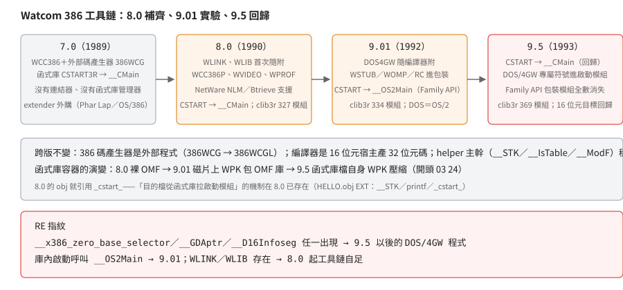

# 8.0 到 9.5：工具鏈補齊、Family API 實驗、與 DOS/4GW 的回歸

## 結論

8.0（1990）把 7.0 的「編譯器＋函式庫」補成**完整工具鏈**：連結器 `WLINK`、
函式庫管理器 `WLIB`、保護模式版編譯器 `WCC386P`、整合除錯環境 `WVIDEO`、
分析器 `WPROF` 都從這版開始隨附，並把支援延伸到 NetWare（Novell 的區網
伺服器作業系統，當年的伺服器主流）與 Btrieve（當年 NetWare 上主流的
資料庫引擎）的開發。9.01（1992）的變化圍繞「隨附 DOS/4GW」：extender
（DOS extender：讓 DOS 程式跑進 32 位元保護模式的執行期元件）本體、
stub（黏在 32 位元本體前面的 16 位元前導程式）工具進包裝，
庫內啟動改成 Family API（讓同一份程式在 DOS 與 OS/2 都能跑的介面約定）
路徑（`CSTART → __OS2Main`）——**這條路只用了一版**：
9.5（1993）改回庫內直接 `__CMain` 的 DOS 啟動，並把 DOS/4GW 專屬符號
（`__x386_zero_base_selector`、`__D16Infoseg`、`__GDAptr`）放進啟動模組。
`clib3r` 的模組數走 327 → 334 → 369。

## 根本問題

7.0（1989）的商業模式是「編譯器賣你，其餘自己拼」：extender 外購
（Phar Lap 或 OS/386）、連結器用外購的。8.0 之後 Watcom 自己補齊了周邊，
接著遇到兩個新市場的整合問題：

1. **NetWare 伺服器**：NLM（NetWare Loadable Module）格式的程式與
   Btrieve 資料庫——8.0 的第六包整包是 NetWare 介面與標頭，還附了
   `NLMLINK`。
2. **隨附 extender 之後**（9.01）：啟動碼、stub、extender 本體的發行
   都變成編譯器廠商的責任——9.01 的庫內啟動因此出現一次性實驗。

## 推導

### 工具面的演變（安裝樹逐一盤點）

| 版本 | 重點新增（非完備差集） | 意義 |
|---|---|---|
| 7.0 | `WCC386`、`386WCG`、`WDISASM`（另有 `WTOUCH`、`INSTALL`） | 可用的只有編譯器、碼產生器與反組譯器 |
| 8.0 | `WLINK`、`WLIB`、`MS2WLINK`（MS 連結腳本轉換）、`NLMLINK`（NetWare NLM 連結）、`WCC386P`（保護模式版編譯器）、`WVIDEO`（整合除錯環境）、`WPROF`（分析器）、`WCPP386`（C++ 386）、`CFIG386`（Phar Lap 配置器）、`WSTRIP`／`WCONFIG`／`RFX`／`BPATCH` 與 Btrieve／NetWare 介面包 | **自家連結器與函式庫管理器首次隨附**（以已取得的發行物為限）；保護模式版編譯器；伺服器與 NetWare 市場的開發支援 |
| 9.01 | `DOS4GW`、`WSTUB`／`WSTUBQ`（stub 製作）、`WOMP`（名稱暗示與 OMF 相關的前置處理，用途未盤點）、`WBIND`（用途未盤點）、`RC`／`RCPP`（Windows 資源編譯器與其前置處理器）、`TECHINFO` | 隨附 extender 的配套 |

386 碼產生器（編譯器後端：把中間表示變成 386 機器碼的程式）是**外部程式**
且跨版延續：7.0 叫 `386WCG`，8.0 起改名 `386WCGL`——編譯器本體載入它做碼產生。
實測：8.0 的 `WCC386` 在 dosgolem（本系列的無頭 DOS 執行器，`-cpu 386`）
編譯 7 行的 hello.c 成功（Code size: 26 bytes，obj 388 bytes），產物是
Easy OMF-386（Phar Lap 的 32 位元 OMF 變體，見[啟動多型](watcom90-startup.md)）——
8.0 的編譯器本體是 16 位元程式、輸出 32 位元碼，規律與 7.0 相同。

8.0 這套媒體的 banner 自稱 **「WATCOM C/SQL 386」**——是 NetWare SQL 的
SKU（第 5／6 包整包是 Btrieve 與 NetWare SQL 介面）；與「一般 8.0」的
差異範圍未盤點。

### 函式庫：模組數與家族的消長

`clib3r`（暫存器呼叫慣例版）的模組數：**8.0＝327、9.01＝334、9.5＝369**。

- 8.0 獨有的家族：`BDOS`／`BIOSFUNC`／`DOSDISK`／`DOSDRIVE`／`DOSERROR`…
  （DOS 直接呼叫的包裝模組）、`NHEAPWOK`／`NHEAPSHR`（near heap）、
  `GETDS`、`NFILES`。
- 9.01 獨有的家族：`DOSALLOC`／`DOSREAD`／`DOSWRITE`／`CWAIT`／`CREATNEW`
  （Family API 包裝）、`EXEC*` 系、`BPRINTF`。
- 9.5 的 369 個模組裡 320 個與 8.0 共通；差集的完整整理未做（列未知）。
  **庫檔層**另計：9.5 新增 16 位元目標的五模型函式庫（`W9516_02` 的
  CLIB S／C／M／L／H，各有 .DOS／.OS2）與 NT 目標（`W9532_08` 的
  `CLIB3R.NT`／`CLIB3S.NT`）；AutoCAD 的 `adsstart.wpk` 也在（`W9532_02`）。

helper 的主幹穩定：`__STK`／`__IsTable`／`__ModF`／`__no87`／`__8087`
三版都在（與 6.5 的 helper 家族一脈相承，見[編譯器 helper](watcom65-runtime.md)）。

### 啟動碼：兩次方向變更

| 版本 | 庫內啟動 | 呼叫 | 備註 |
|---|---|---|---|
| 7.0 | `CSTART3R` | `__CMain` | DOS 直接上；extender 外購 |
| 8.0 | `CSTART` | `__CMain` | `__no87` 的定義移進啟動模組 |
| 9.01 | `CSTART`＋`OS2MAIN` | `__OS2Main` | **Family API 實驗**（詳見[啟動多型](watcom90-startup.md)） |
| 9.5 | `CSTART` | `__CMain`（回歸） | DOS/4GW 專屬符號進啟動模組；`__Extender` 改為 CSTART 自己引用；Family API 模組全數消失 |

9.5 的 `CSTART` 多了三個 8.0／9.01 都沒有的公開符號：
`__x386_zero_base_selector`（零基底選擇器）、`__D16Infoseg`（16 位元資訊段）、
`__GDAptr`（GDA——DOS/4GW 的全域資料區——指標）：**啟動碼直接內建了
DOS/4GW 的專屬介面**，不再走「載入器補 Family API」的路。
AutoCAD 的 ADS／ADI 變體啟動檔（`ADSSTART.WPK`）從 8.5 就存在，
9.01 只是把 prebuilt `.obj` 的發行延伸到三顆。

### 函式庫容器：壓縮位置的三段變化

- **8.0**：函式庫是裸的 OMF（Object Module Format，DOS 時代目的檔與函式庫的
  封裝格式；`0xF0` 是其函式庫檔頭記錄的類型編號）。
- **9.01**：磁片上的函式庫檔是 **WPK 封裝**（Watcom 安裝媒體用的壓縮封裝，
  簽章 `0x2403`）包著 OMF 庫（安裝時解開）。
- **9.5**：**函式庫檔本身就是 WPK 壓縮**（開頭 `03 24` 即簽章 `0x2403` 的
  byte 排列，解開後才是 OMF；實測 `CLIB3R.DOS` 用 WPK 解碼器解出
  163,328 bytes 的 OMF 庫、CRC 通過）——發行媒體的壓縮直接做進了函式庫檔。
  WPK 封裝最早見於 8.5 的啟動檔（`ADSSTART.WPK`）；函式庫檔本身的 WPK
  則從 9.01 起。

## 在執行檔裡怎麼認

- `__x386_zero_base_selector`／`__GDAptr`／`__D16Infoseg` 任一出現 →
  **9.5**（本篇實測的版本）編譯連結的 DOS/4GW 程式。
- 庫內啟動呼叫 `__OS2Main` → 9.01（且僅 9.01）。
- 連結前的產物（obj）：8.0 編譯器的 obj 模組名保留原始檔含副檔名的寫法
  （`HELLO.C` 而非剝掉副檔名的 `HELLO`），並引用 `_cstart_`
  （啟動由庫供應的鐵證）。

## 證據與未知

**已證實（實測）**：8.0 安裝樹（232 檔）、8.5（131 檔）、9.5（2,453 檔）
的解包與工具／模組清單盤點；8.0 編譯器的 dosgolem 實跑（banner、
Code size: 26、obj 388 bytes、Easy OMF-386）；三版 `clib3r` 的模組差集
（327/334/369、獨有家族清單）；9.5 `CSTART` 的 PUB/EXT 與 DOS/4GW 專屬
符號；8.0 obj 引用 `_cstart_`。

**已證實（原文）**：8.0／8.5 的日期與媒體來歷記錄來自取得時隨收藏的
來源文件（8.0 二進位 1990-06-28、8.5 為 1991-09-18）；9.5 磁片檔內時間戳
1993-05-05 與「supports DOS/NT/OS2/NetWare & AutoCAD」的項目描述。
「首次隨附」類斷言以**已取得的五套發行物**（6.5／7.0／8.0／8.5／9.01／9.5）
為限，不含未取得的版本與 8.0 的其他 SKU。

**未知**：

- 8.0 編譯器與 7.0 的**逐位元組**產生碼比較沒有做成：7.0 的 WCC386
  在重編 hello.c 時 obj 寫入失敗（dosgolem 的 scratch 寫入路徑待查；
  2026-09-18 曾成功過一次）。
- 8.0 的 C/SQL SKU 與一般 8.0 的差異範圍；`CNW386` 的 CNW 命名。
- `WCPP386`（C++ 386）在 8.0 出現、9.01 的 DOS 磁片集缺席、9.5 又有
  NT 版——C++ 產品線的拆合沒有整理。
- 9.5 恢復 16 位元目標（`W9516`）的細節沒有展開。
