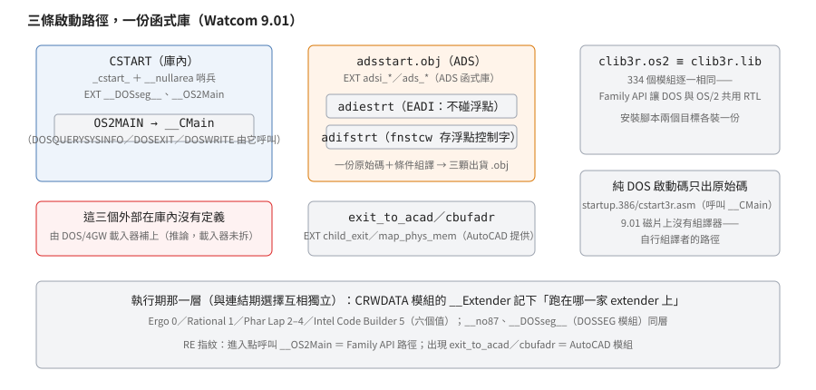

# 9.01 的啟動多型：一份函式庫、三條啟動路徑、兩層機制

## 結論

一句話：**一份 RTL、三條啟動路徑**。

- **DOS/4GW 一般程式**用函式庫裡的啟動：`CSTART`（`_cstart_`）呼叫 `OS2MAIN`
  模組的 `__OS2Main`，後者用 DOSQUERYSYSINFO／DOSEXIT／DOSWRITE 這三個
  **Family API** 名稱（讓同一份程式在 DOS 與 OS/2 都能跑的介面約定）——
  它們在庫內沒有定義，由 DOS/4GW 的載入器補上（這一步是推論，見證據段）。
- **AutoCAD 的 ADS 應用與 ADI 驅動**（ADS＝用 C 寫 AutoCAD 應用的介面、
  ADI＝裝置驅動介面）用磁片上三顆現成的啟動檔：AutoCAD 把這類程式當
  **副常式**載入自己的行程，啟動碼的回傳值直接交回 AutoCAD。
- **OS/2 程式**與 DOS/4GW 走同一條路：`clib3r.lib`（DOS）與 `clib3r.os2`
  的 334 個模組**逐位元組相同**（拆庫逐一比對過）——一份 RTL、兩個安裝目標。
  （`clib3s` 一族、DLL 版 `clibdl3*`、多執行緒版 `clibmt3*` 另有檔案，本篇只證了
  `clib3r` 這一族。）

## 根本問題

1992 年的 Watcom 面對的是「一份 32 位元 RTL 要服務多少個世界」：

1. **DOS/4GW 隨編譯器附**（Rational 的產品），OS/2 2.0 也在支援清單上，
   AutoCAD 的 ADS／ADI 開發同樣在安裝腳本的支援清單裡（`INSTALL.SCR`
   連 ADS 支援的 71 KB 都要單獨問要不要裝）。
2. 這些世界的**進出方式完全不同**：DOS/4GW 從 DOS 載入執行檔、
   OS/2 是多工作業系統、AutoCAD 是把你的程式載進自己行程裡的宿主。
3. 磁片空間有限，能共用就共用：RTL 一份、啟動碼多型；
   而同一支程式可能跑在不同家的 extender 上，偵測留給執行期。
   （支援清單裡的 AutoCAD ADS／ADI 是「啟動需求不同的宿主」的例子；
   宿主本身的契約不是本篇的主題。）

## 推導

### 庫內啟動：CSTART → OS2MAIN → __CMain

庫內三個模組構成啟動鏈：

- `CSTART`：定義 `_cstart_`（進入點）與 `__nullarea`（空指標哨兵資料，
  見 [DPMI 與 DOS/4GW](dos4gw-startup.md)）；外部參照 `__DOSseg__` 與 `__OS2Main`。
- `OS2MAIN`：定義 `__OS2Main`。從它的外部符號看：查系統資訊
  （DOSQUERYSYSINFO）、記下環境指標與命令列（`__Envptr`／`__LpCmdLine`／
  `__LpPgmName`）、準備堆疊下限（`__STACKLOW`）與例外處理（`___XcptHandler`），
  然後呼叫 `__CMain`。
- `CMAIN386`（來源 `cmain386.c` 有出貨）：定義 `__CMain`——把 `argc`/`argv`
  傳給使用者的 `main`，回來後呼叫 `exit`。

`DOSQUERYSYSINFO`／`DOSEXIT`／`DOSWRITE` 這三個外部**在函式庫內沒有定義**
（334 個模組掃過），修正記錄（FIXUPP，OMF 的重定位記錄）也是普通的外部參照——
連結期需要有人解。而真實的連結腳本（1994 年出貨的 DMX 音效庫的 makefile）
寫的是 `SYSTEM dos4g`＋`FILE test.obj`＋`LIBRARY dmx.lib`——**沒有列啟動檔**，
程式確實在 DOS/4GW 上執行過。合起來的解釋：DOS/4GW 的載入器提供這幾個
Family API 進入點，連結器留下空位、載入時補上。這一步是**強推論**，
對立假設的排除見證據段。

**DOS 與 OS/2 共用**在這個設計下是自然結果：Family API 的名字在 OS/2 上
由作業系統解析、在 DOS/4GW 上由 extender 解析，RTL 因此可以一份兩用
（推論，依據是上一段與「兩版庫逐位元組相同」的事實）。

### 隨附的變體啟動檔：一份原始碼、條件組譯、三顆出貨 .obj

`startup.ads/adsstart.asm`（來源有出貨）展示了 90 年代工具鏈的另一個手法：
**一份啟動碼原始碼，靠條件組譯旗標（`ifdef` 標籤）切出多個出貨目的檔**。
標籤有三個——`ACAD`（AutoCAD 宿主版）、`ADS`（AutoCAD Development System，
用 C 寫 AutoCAD 應用的介面）、`PADI`（保護模式 ADI，AutoCAD 的裝置驅動介面；
`EADI` 再切出「不碰浮點」的變體）。出貨的三顆 `.obj` 對應：

| 檔 | 標籤 | 介面（外部由誰提供） |
|---|---|---|
| `adsstart.obj` | `ACAD`＋`ADS` | ADS 函式庫：`adsi_getinitinfo`／`adsi_child_exit`／`ads_map_phys_mem` |
| `adiestrt.obj` | `ACAD`＋`EADI`＋`PADI` | AutoCAD 本體：`child_exit`／`map_phys_mem` |
| `adifstrt.obj` | `ACAD`＋`PADI` | 同上 |

應用端的使用情境（AutoCAD 把這類程式當**副常式**載入自己的行程，
帶相容檢查值與初始化資訊，回傳值交回宿主）屬 AutoCAD 的契約，
本篇只取它對工具鏈的意義：這些程式的啟動需求與獨立執行檔不同，
所以發行端連啟動檔都要出專屬變體。兩顆 ADI 變體的 `_TEXT` 段影像
逐位元組比對有兩處條件編譯分歧（`adifstrt` 多 `fnstcw __fsavcw`、
`adiestrt` 多 `mov bp,1`——把 `no87` 視為已設，即當作沒有 8087 硬體），
淨差 2 bytes；PUB/EXT 名稱完全相同，位移在分歧點之後整體挪 2。
「adiestrt＝EADI」由機器碼反推（來源 `ifdef EADI` 正好對應這兩處）；
「adif」的 F 字義沒有一手依據。

### 純 DOS 的啟動碼：只出原始碼

`startup.386/cstart3r.asm`（原始碼已逐行讀過，見 [DPMI 與 DOS/4GW](dos4gw-startup.md)
的證據段）呼叫的是 `__CMain`，與庫內 `CSTART`（呼叫 `__OS2Main`）**形狀不同**——
兩者是不同的原始碼。9.01 的磁片上沒有組譯器（沒有 WASM，Watcom 的組譯器），
所以「自行組譯 cstart3r」這條路是給已經有 386 組譯器的人的。
至於一般使用者：WCL386（編譯驅動器）的連結指令只有 `system dos4g`／`file`／
`library`／`name`（字串層掃描），沒有任何啟動檔名——**大多數 DOS/4GW 程式
走的正是庫內 CSTART 那條 Family API 路**（推論，見證據段）。

與 7.0 對照：7.0 的庫內啟動模組 `CSTART3R` 呼叫 `__CMain`（DOS 直接上，
因為 7.0 只有 DOS 一個目標、extender 要外購——Phar Lap 或 OS/386）。
9.x 把 DOS 啟動移出庫、改用 Family API，時間上與「隨附 DOS/4GW」重疊
（因果是推測，見[版本演進](watcom-lineage.md)）。

### 連結期怎麼選、執行期怎麼測

連結期的選擇靠 OMF 的常規：明確列在連結指令裡的 `.obj` 優先，庫成員只在
「有未解析符號需要補」時才拉進來。所以 ADS 程式列了 `adsstart.obj` 之後，
庫內的 `CSTART` 不會進場（`_cstart_` 已有定義）；一般程式不列任何啟動檔，
WLINK 以進入點 `_cstart_` 從庫裡拉 `CSTART`。

執行期的 extender 偵測（`__Extender` 六個值，`CRWDATA` 模組定義）是另一層——
同一條連結期路徑可以跑在不同的 extender 上，偵測讓 RTL 知道該對誰說話。
`__DOSseg__`（`DOSSEG` 模組）、`__no87` 同層。
⚠ 庫內啟動路徑上 `__Extender` 由誰寫入，本輪沒有查（見未知）——
[DPMI 與 DOS/4GW](dos4gw-startup.md) 說的「啟動碼偵測」出自 `cstart3r.asm`，
是非預設路徑的那一份。

## 在執行檔裡怎麼認

- 進入點呼叫 `__OS2Main`，或進入點附近出現 `cmp ecx,0x4D2`（chkval）→
  Family API 啟動／AutoCAD 系啟動（兩者的差異看下一條）。
- 有 map 檔或符號時：`DOSQUERYSYSINFO`／`DOSEXIT`／`DOSWRITE` 的呼叫 →
  Family API 路徑（剝離符號的執行檔看到的只是填零待補的呼叫）。
- `exit_to_acad`／`cbufadr`／`info_sel`／`info_off`（初始化結構的
  selector／offset 暫存欄）→ AutoCAD **ADI** 驅動；EXT 出現 `adsi_*`／`ads_*`
  前綴（`adsi_getinitinfo`、`ads_map_phys_mem` 等）→ AutoCAD **ADS** 應用。
- `__Extender`（CRWDATA 模組）在 map 檔看得到；它的值就是 extender 編號
  （見 [DPMI 與 DOS/4GW](dos4gw-startup.md)）。
- 三顆 AutoCAD 啟動檔 `_TEXT` 的開頭是跳過版權字串的短跳
  （版權字串 "WATCOM C 386 Run-Time system." 內嵌在碼段前端，三顆皆然），
  兩顆 ADI 變體的差異只在有無 `fnstcw` 那道指令。

## 證據與未知

**已證實（實測）**：三顆 `.obj` 與兩份庫的全部符號層結論
（模組名、PUB/EXT、段影像、FIXUPP 方法欄）來自 `omf386.py` 的解析
（該解析器的欄位規則已用校驗和與 7.0 反組譯器交叉驗證過，見
[版本演進](watcom-lineage.md)的證據段）；`clib3r.lib`（DOS）與 `clib3r.os2`
的 334 個同名模組**逐位元組相同**（拆庫逐一比對）；`adiestrt`／`adifstrt`
的段影像逐位元組比對；WCL386.EXE 與 WLINK.EXE 的字串掃描。

**已證實（原文）**：`adsstart.asm` 的檔頭與標籤結構（ACAD／ADS／PADI／EADI）、
`chkval` 值；`cmain386.c` 的 `__CMain`→`main`→`exit` 結構；INSTALL.SCR 的
`if %ads` 分派、ADS 支援 71 KB 的安裝問題、DOS／OS2 兩個目標各裝一份函式庫；
DMX 的連結腳本內容。

**強推論**（全篇最弱的一級，所以前置欄位標的是這個）：

- **DOS/4GW 載入器提供 DOSQUERYSYSINFO／DOSEXIT／DOSWRITE 的進入點**。
  對立的假設：連結器自動定義為 0（會讓查系統資訊與結束路徑壞掉，且
  WLINK.EXE 的字串裡沒有這些符號名）；`SYSTEM dos4g` 自帶一個定義這些符號的
  隱含庫（磁片上的庫都掃過，沒有）；連結器以選項容忍未解外部、在 LE 裡留
  載入期修正空位——這其實就是本結論的具體形態。便宜的決定性驗證：
  拿任一支實際以 dos4g 連出的 LE，看這幾個符號位置的修正記錄與
  DOS/4GW 載入後的補值（比拆 dos4gw.exe 便宜）。
- **一般 DOS/4GW 程式走庫內 CSTART 的 Family API 路**。依據：WCL386 的
  連結指令沒有啟動檔名、DMX 的實際腳本也沒有；對立假設（使用者一律
  自行組譯 cstart3r.asm）與「磁片上沒有組譯器」矛盾。
- RTL 一份兩用（DOS＋OS/2）**是** Family API 設計的結果——因果方向是推論，
  依據是「庫逐位元組相同」與「呼叫名稱是 Family API」這兩個事實。

**未知**：

- 庫內啟動路徑上 `__Extender` 由誰寫入：`CSTART`／`OS2MAIN` 的外部都沒有它
  （`adsstart` 倒是有 `_Extender`／`__no87` 的參照）；dos4gw-startup 篇說的
  偵測碼出自 `cstart3r.asm`（非預設路徑）。Family API 路徑上這個變數的內容
  是什麼，沒有查。
- DOS/4GW 載入器怎麼提供那三個進入點（語意是否完整、還是只回錯誤碼）：
  需要反組譯 dos4gw.exe（221,045 bytes，MZ，可能內部壓縮）或取得 Rational 文件。
- 庫內 `CSTART` 的原始碼沒有出貨（`cstart3r.asm` 是另一份）；兩者除了
  `__OS2Main` vs `__CMain` 之外的差異沒有逐行對照。
- `adifstrt` 的「F」與 `EADI` 的「E」的字義；AutoCAD ADI 的「extended／flat」
  對應關係是外部知識，本文不採。
- `clib3s` 兩版（DOS／OS2）沒有做與 `clib3r` 相同的逐模組比對；
  Windows 目標（`wstart3r.asm`、CLIB3R.WIN）與 `clibdl3*`（DLL）、
  `clibmt3*`（多執行緒，OS/2）的啟動差異沒有整理。
