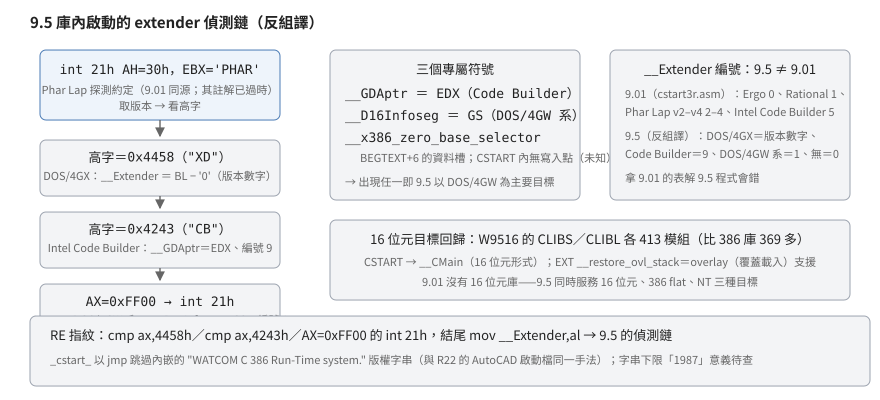

# 9.5 的 DOS/4GW 啟動：偵測鏈、三個專屬符號、16 位元回歸

## 結論

9.5 把 extender 偵測鏈**合回了函式庫裡的啟動模組**：`_cstart_` 自己用
`int 21h AH=30h`（帶 `EBX='PHAR'` 的 Phar Lap 探測約定）加上兩個後續探測，
分辨出 DOS/4GX、Intel Code Builder、DOS/4GW 系與無 extender 四種環境，
把結果寫進 `__Extender`——9.01 把這段偵測移出函式庫（只出原始碼），
9.5 又合了回來。R22 留下的三個 DOS/4GW 專屬符號也在此解碼：
`__GDAptr` 收 Code Builder 傳來的 GDA 位址、`__D16Infoseg` 收
DOS/4GW 系放在 `GS` 的 16 位元資訊段選擇器、`__x386_zero_base_selector`
在啟動碼裡沒有寫入點（誰填它未知）。另外，9.5 **恢復了 16 位元目標**：
`W9516` 磁片的 16 位元庫有 413 個模組（比 386 庫的 369 還多），
啟動帶 overlay 支援。

## 根本問題

9.01 把 extender 偵測移出函式庫（DOS 啟動碼只出原始碼）是 Family API
實驗的副作用；9.5 放棄實驗、把 DOS 啟動收回庫內之後，偵測就必須跟著回去——
而且這次直接編進**出貨的函式庫**，不再依賴使用者自己組譯。
偵測的對象也不再只有 9.01 支援的那幾家：9.5 官方清單是
「DOS/NT/OS2/NetWare & AutoCAD」，加上 DOS/4GX（Rational 的另一個授權形態），
偵測樹變得更寬。

## 推導

### 偵測鏈（9.5 出貨庫的反組譯，逐道對照）

1. **Phar Lap 探測**：`int 21h AH=30h`（取 DOS 版本）**帶 `EBX='PHAR'`**——
   Phar Lap 的 extender 攔截這道呼叫，回傳自己的版本資訊。
   9.01 的 `cstart3r.asm` 有同一道，但其註解寫「set ebx to 0」——
   **過時註解**，程式實際設的是 `'PHAR'`。
2. 版本的高字（`shr eax,10h` 後）：
   - `0x4458`（"XD"）＝**DOS/4GX**：`__Extender = BL − '0'`
     ——把回傳的子版本數字減 `'0'` 當編號，**編號隨 4GX 版本變動**；
   - `0x4243`（"CB"）＝**Intel Code Builder**：`__GDAptr = EDX`
     （Code Builder 以 EDX 傳 GDA 位址），並從 GDA 讀出堆疊上界後
     `AH=4Ah` 收縮記憶體塊，`__Extender = 9`。
3. 都不是 → `AX=0xFF00; int 21h` 探測：
   `AL==0` → 無 extender（`__Extender=0`，PSP 段寫死 `0x24`——**Ergo/OS/386**
   不在時的退路）；`AL≠0` → `__D16Infoseg = GS`（DOS/4GW 系把 16 位元
   資訊段選擇器放在 GS）、`__Extender = 1`（DOS/4GW 系）。

**`__Extender` 的編號方案與 9.01 不同**：9.01 的 `cstart3r.asm` 明寫
Ergo=0、Rational=1、Phar Lap v2–v4=2–4、Intel Code Builder=5；
9.5 的二進位裡 Code Builder 是 **9**、DOS/4GX 是「版本數字」。
**拿 9.01 的編號表去解 9.5 程式的 `__Extender` 會錯。**

### 三個專屬符號

| 符號 | 賦值 | 用途 |
|---|---|---|
| `__GDAptr` | `EDX`（Code Builder 偵測成功時） | GDA＝Code Builder 的全域資料區；後續堆疊調整要讀它 |
| `__D16Infoseg` | `GS`（`AX=0xFF00` 探測非零時） | DOS/4GW 系的 16 位元資訊段選擇器 |
| `__x386_zero_base_selector` | **CSTART 內沒有寫入點** | 資料槽在 `BEGTEXT+6`；誰填它、誰用它未知 |

### 16 位元回歸

`W9516_02` 的 `CLIBS.DOS`／`CLIBL.DOS`（WPK 解開後）是傳統 16 位元 OMF，
各 **413 個模組**——比 386 庫的 369 還多。啟動＝`CSTART`→`__CMain`
（16 位元形式），`CSTART` 的外部參照多了 `__restore_ovl_stack`
——**overlay（覆蓋載入）支援**：16 位元 DOS 程式碼比記憶體大的老問題，
9.5 的 16 位元庫內建了覆盖堆疊還原。386 flat 的庫沒有這個符號。

## 在執行檔裡怎麼認

- `cmp ax,4458h`／`cmp ax,4243h`／`AX=0xFF00` 的 `int 21h` → 9.5 的
  extender 偵測鏈（9.01 的 cstart3r 用同源寫法但編號與細節不同）。
- `__x386_zero_base_selector`／`__GDAptr`／`__D16Infoseg` 任一出現 → 9.5。
- 16 位元程式的啟動模組若引用 `__restore_ovl_stack` → 9.5 的 16 位元庫。
- `_TEXT` 前端跳過 "WATCOM C 386 Run-Time system." 版權字串的手法
  與 R22 的 AutoCAD 啟動檔相同。

## 證據與未知

**已證實（實測）**：本文全部反組譯結論出自對 9.5 出貨庫解包後
`CSTART` 模組的完整反組譯（7.0 的 WDISASM 讀 Easy OMF-386 模組，
全文存工作區記錄）；16 位元庫的模組數與 `__restore_ovl_stack` 來自
`W9516_02` 的 `CLIBS.DOS`／`CLIBL.DOS`（WPK 解開後拆庫）。

**已證實（原文）**：9.01 側的對照（`X_ERGO=0…X_INTEL=5`、`__D16Infoseg`
預設值 `0x20`、「IGC and Intel Code Builder GDA address」註解）出自
`cstart3r.asm` 原始碼。

**未知**：

- `__x386_zero_base_selector` 的賦值點與使用端。
- 9.5 的 `__Extender` 編號與 9.01 文件值（0–5）的完整對照
  （4458h 分支的「版本數字」尤其難對）。
- 版權字串裡 "1987" 的下限意義未查。
- `W9516` 的 16 位元庫（413 模組）與 386 庫（369 模組）的差集沒有整理。
