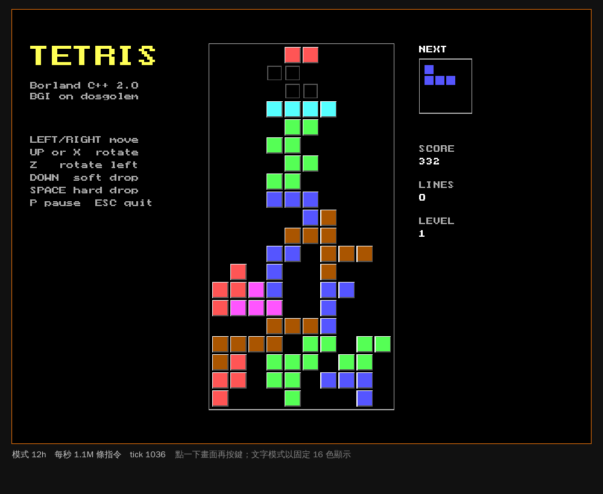

# BGI 俄羅斯方塊

用 Borland C++ 2.0 的 BGI 繪圖庫寫的俄羅斯方塊。在 dosgolem 裡用原廠 BCC 編譯，
再由 dosgolem 的 `webplay` 在瀏覽器裡即時執行。原理與每一步的說明見
[在 dosgolem 裡用 Borland C++ 2.0 編譯](../../docs/70-toolchain/bcc20-on-dosgolem.md)。

<p align="center"></p>

## 需要

- 你自己的 Borland C++ 2.0，先用 `tools/bcpp20/install.sh` 裝好（本 repo 不含任何 Borland 檔案）
- Docker
- dosgolem 的 `bcc20-toolchain` 分支

## 編譯與執行

```sh
export BCPP=~/bcpp20 DOSGOLEM=~/dosgolem
./build.sh      # → out/tetris.exe
./play.sh       # → 開 http://127.0.0.1:8086/，Ctrl-C 結束
```

| 鍵 | 動作 |
|---|---|
| ← → | 移動 |
| ↑ 或 X | 右轉 |
| Z | 左轉 |
| ↓ | 加速落下（每格 1 分） |
| 空白鍵 | 直接落到底（每格 2 分） |
| P | 暫停 |
| Esc | 離開 |

一次消一、二、三、四行各得 100、300、500、800 分再乘上等級；每消 10 行升一級，
下落間隔從 9 個 BIOS tick 起每級少一個，最快每 tick 一格。

## 檔案

| 檔案 | 內容 |
|---|---|
| `TETRIS.C` | 程式本體（small model，CRLF 行尾，照 DOS 慣例） |
| `build.sh` | 呼叫 `tools/bcpp20/bcc.sh` 執行 `BCC -ms -O TETRIS.C GRAPHICS.LIB` |
| `play.sh` | 把 `tetris.exe` 與 `EGAVGA.BGI` 放進 `out/play/`，在容器裡跑 `webplay` |

`out/` 不進版控；`.dosroot/` 是編譯時暫時攤平的 DOS 根目錄（含 Borland 檔案），跑完就刪，也列在 `.gitignore`。
